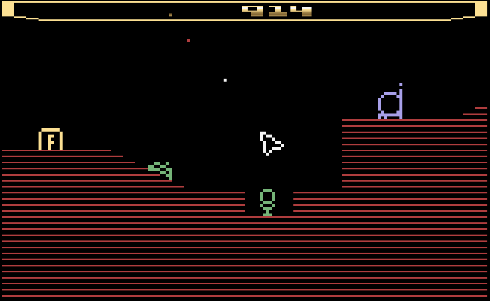

# Atari 2600

## Overview

The Atari 2600 application is an emulator for the [Atari 2600 game console](https://en.wikipedia.org/wiki/Atari_2600).


<figure>
  
  <figcaption>Slide Boy in Maze Land by Vladimir Zuniga</figcaption>
</figure>

## Settings

The Atari 2600 Application includes a custom settings dialog.

{: class="center zoomD"}

To access these settings, display the "Pause" screen and select the "Atari 2600 Settings" option (*See screenshot above*).

{: class="center zoomD"}

### Atari 2600 Settings Tab (Session Only)

The Atari 2600 Application's "settings" tab is detailed below. It is important to note that the settings on this tab are *Session only* meaning they will not persist between gaming sessions.

| __Field__ | __Description__ |
| --- | --- |
| Color Switch | Toggles between the `Color` and `Black and White` switch options (is a physical switch on the 2600 console). |
| Left Difficulty Switch | Toggles between the `A` and `B` left difficulty switch options (is a physical switch on the 2600 console). |
| Right Difficulty Switch | Toggles between the `A` and `B` right difficulty switch options (is a physical switch on the 2600 console). |

## Controls

The emulator supports up to four controllers. The keyboard and gamepad mappings are listed in the tables below.

### Keyboard

Keyboard support is only available for controller one.

| __Name__ | __Keys__ | __Comments__ |
|--------------------------|---------------------------------------------| |
| Move | {: class="control"} {: class="control"} {: class="control"} {: class="control"}  | |
| Fire | {: class="control"} | |
| Color/B&W Switch | {: class="control"} | |
| Left Difficulty Switch | {: class="control"} | |
| Right Difficulty Switch | {: class="control"} | |
| Reset | {: class="control"} | |
| Select | {: class="control"} | The __Right Shift Key__.|
| Show Pause Screen | {: class="control"} | |

### Gamepad

Gamepad support is available for both controllers.

| __Name__ | <div style="min-width:140px">__Gamepad__</div> | __Comments__ |
| --- | --- | --- |
| Move                         | {: class="control"} &nbsp;or&nbsp; {: class="control"} | |
| Fire                         | {: class="control"} | |
| Color/B&W Switch             | {: class="control"} | |
| Left Difficulty Switch       | {: class="control"} | |
| Right Difficulty Switch      | {: class="control"} | |
| Reset                        | {: class="control"} | Not available for Xbox and not recommended for iOS (see alternate)<br><br>Press the __Menu (Start) Button__. |
| Reset<br>(Alternate)            | {: class="control"} &nbsp;and&nbsp; {: class="control"} | Hold down the __Right Trigger__ and click (press down) on the __Right Thumbstick__. |
| Select                       | {: class="control"}  | Not available for Xbox and not recommended for iOS (see alternate)<br><br>Press the __View (Back) Button__. |
| Select<br>(Alternate)           | {: class="control"} &nbsp;and&nbsp; {: class="control"} | Hold down the __Right Trigger__ and click (press down) on the __Left Thumbstick__. |
| Show Pause Screen                    | {: class="control"} &nbsp;and&nbsp; {: class="control"} | Not available for Xbox and not recommended for iOS (see alternate 3 or 4)<br><br>Hold down the __Left Trigger__ and press the __Menu (Start) Button__. |
| Show Pause Screen<br>(Alternate)        | {: class="control"} &nbsp;and&nbsp; {: class="control"} | Not available for Xbox and not recommended for iOS (see alternate 3 or 4)<br><br>Hold down the __Left Trigger__ and press the __View (Back) Button__. |
| Show Pause Screen<br>(Alternate 2)        | {: class="control"} &nbsp;and&nbsp; {: class="control"} | Not available for Xbox and not recommended for iOS (see alternate 3 or 4)<br><br>Hold down the __X Button__ and press the __View (Back) Button__. |
| Show Pause Screen<br>(Alternate 3)        | {: class="control"} &nbsp;and&nbsp; {: class="control"} | Hold down the __Left Trigger__ and click (press down) on the __Left Thumbstick__. |
| Show Pause Screen<br>(Alternate 4)        | {: class="control"} &nbsp;and&nbsp; {: class="control"} | Hold down the __Left Trigger__ and click (press down) on the __Right Thumbstick__. |

### Paddle Support

The Atari 2600 emulator supports paddle input via the left analog stick on gamepads.

The [Feed Editor](../../../editor/index.md) attempts to automatically detect and configure paddle-based games when they are added. However, you can also specify these settings via the game's [Item Editor](../../../editor/dialogs/item-dialog.md) or via the [Atari 2600 Feed Properties](#feed).

## Feed

This section details how Atari 2600 application instances can be added to feeds.

### Type

The type name for the Atari 2600 application is `retro-stella-latest`.

!!! note
    The alias `2600` also currently maps to this application. In the future, the `2600` alias may be mapped
    to another Atari 2600 application (different emulator implementation) if it is determined to be a
    more appropriate default.

### Properties

The table below contains the properties that are specific to the Atari 2600 application. These properties are
specified in the `props` object of a feed item.

| __Property__ | __Type__ | __Required__ | __Details__ |
|----------|------|----------|---------|
| rom | URL | Yes | URL to an Atari 2600 ROM file or a zip file containing a ROM file. |
| swap | Boolean | No | Whether to swap the controller ports. This is typically enabled when games default to using port 2 (versus port 1). |
| zoomLevel | Numeric | No | A numeric value indicating how much the display image should be zoomed in (0-40).<br><br>This property is typically used to hide the black borders that are present on some games. |
| port0 | Numeric | No | The type of controller(s) to plug into port 0: <p><ul><li>`0` : Joystick</li><li>`1` : Single Paddle</li><li>`2` : Two Paddles</li></ul></p>Defaults to Joystick. |
| port1 | Numeric | No | The type of controller(s) to plug into port 1: <p><ul><li>`0` : Joystick</li><li>`1` : Single Paddle</li><li>`2` : Two Paddles</li></ul></p>Defaults to Joystick. |
| paddleSensitivity | Numeric | No | Adjusts the sensitivity of the paddle (range of `-99` to `99`). <p>Defaults to `0`.</p> |
| paddleCenter | Numeric | No | Adjusts the center position of the paddle (range of `-99` to `99`). <p>Defaults to `0`.</p> |
| paddleVertical | Boolean | No | <p>Whether the paddle should be horizontal (analog stick left to right) or vertical (analog stick top to bottom).</p><p>Defaults to `false` (horizontal).</p> |
| paddleInverted | Boolean | No | <p>Whether to invert the paddle input.</p><p>For example, if pressing left on the analog stick causes the on-screen object to move right.</p><p>Defaults to `false` (not inverted).</p>  |

### Example

The following is an example of a complete feed that consists of a single Atari 2600 application instance (`type` value of `2600`). The `rom` property value is a URL that points to a Dropbox location that contains the excellent homebrew game Blinky Goes Up by Jan Hermanns.

``` json hl_lines="11 13"
{
  "title": "2600 Feed",
  "longTitle": "Atari 2600 Example Feed",
  "categories": [
    {
      "title": "2600 Games",
      "longTitle": "Atari 2600 Games",
      "items": [
        {
          "title": "Blinky Goes Up",
          "type": "2600",
          "props": {
            "rom": "https://dl.dropboxusercontent.com/s/kkqrl8av5pwvgn1/blinky.bin"
          }
        }
      ]
    }
  ]
}
```

This example can be tested by adding a feed with the following URL within the [webЯcade player](../../../userguide/index.md):

`https://tinyurl.com/2600-feed`

## References

- [Atari 2600 Application GitHub Repository](https://github.com/webrcade/webrcade-app-retro-stella-2014)
