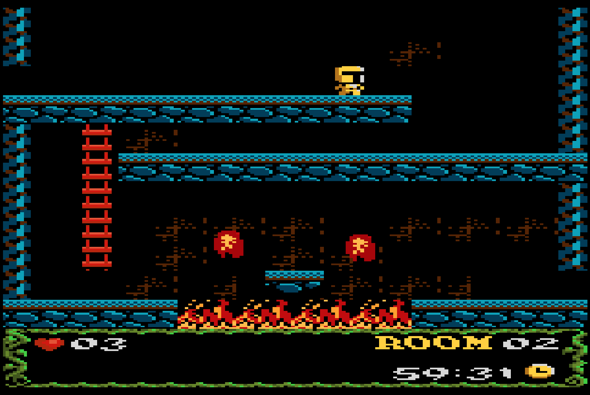

# Atari 7800

## Overview

The Atari 7800 application is an emulator for the [Atari 7800 ProSystem game console](https://en.wikipedia.org/wiki/Atari_7800). 

<figure>
  
  <figcaption>Knight Guy in Low Res World: Castle Days by Vladimir Zuniga</figcaption>
</figure>

## Controls

The emulator supports up to two controllers. The keyboard and gamepad mappings are listed in the tables below.

### Keyboard

Keyboard support is only available for controller one.

| __Name__ | __Keys__ | __Comments__ |
|--------------------------|---------------------------------------------| |
| Move | {: class="control"} {: class="control"} {: class="control"} {: class="control"}  | |                  
| Fire 1 | {: class="control"} | |                  
| Fire 2 | {: class="control"} | |                  
| Reset | {: class="control"} | |                  
| Select | {: class="control"} | The __Right Shift Key__.|                  
| Show Pause Screen | {: class="control"} | |                  

### Gamepad

Gamepad support is available for both controllers.

| __Name__ | <div style="min-width:140px">__Gamepad__</div> | __Comments__ |
| --- | --- | --- |
| Move                         | {: class="control"} &nbsp;or&nbsp; {: class="control"} | |
| Dual analog (if applicable)  | {: class="control"} | Player one's right analog stick can be used to produce input for player two's joystick (d-pad) for games that support a 2-stick mode (For example, the homebrew game TiME Salvo).  |
| Fire 1                       | {: class="control"} | |
| Fire 2                       | {: class="control"} | |
| Reset                        | {: class="control"} | Not available for Xbox and not recommended for iOS (see alternate)<br><br>Press the __Menu (Start) Button__. |
| Reset<br>(Alternate)            | {: class="control"} &nbsp;and&nbsp; {: class="control"} | Hold down the __Right Trigger__ and click (press down) on the __Right Thumbstick__. |
| Select                       | {: class="control"}  | Not available for Xbox and not recommended for iOS (see alternate)<br><br>Press the __View (Back) Button__. |
| Select<br>(Alternate)           | {: class="control"} &nbsp;and&nbsp; {: class="control"} | Hold down the __Right Trigger__ and click (press down) on the __Left Thumbstick__. |
| Show Pause Screen                    | {: class="control"} &nbsp;and&nbsp; {: class="control"} | Not available for Xbox and not recommended for iOS (see alternate 3 or 4)<br><br>Hold down the __Left Trigger__ and press the __Menu (Start) Button__. |
| Show Pause Screen<br>(Alternate)        | {: class="control"} &nbsp;and&nbsp; {: class="control"} | Not available for Xbox and not recommended for iOS (see alternate 3 or 4)<br><br>Hold down the __Left Trigger__ and press the __View (Back) Button__. |
| Show Pause Screen<br>(Alternate 2)        | {: class="control"} &nbsp;and&nbsp; {: class="control"} | Not available for Xbox and not recommended for iOS (see alternate 3 or 4)<br><br>Hold down the __X Button__ and press the __View (Back) Button__. |
| Show Pause Screen<br>(Alternate 3)        | {: class="control"} &nbsp;and&nbsp; {: class="control"} | Hold down the __Left Trigger__ and click (press down) on the __Left Thumbstick__. |
| Show Pause Screen<br>(Alternate 4)        | {: class="control"} &nbsp;and&nbsp; {: class="control"} | Hold down the __Left Trigger__ and click (press down) on the __Right Thumbstick__. |

## Feed 

This section details how Atari 7800 application instances can be added to feeds.

### Type

The type name for the Atari 7800 application is `js7800`. 

!!! note
    The alias `7800` also currently maps to this application. In the future, the `7800` alias may be mapped
    to another Atari 7800 application (different emulator implementation) if it is determined to be a 
    more appropriate default.

### Properties

The table below contains the properties that are specific to the Atari 7800 application. These properties are
specified in the `props` object of a feed item. 

| __Property__ | __Type__ | __Required__ | __Details__ |
|----------|------|----------|---------|
| rom | URL | Yes | URL to an Atari 7800 ROM file or a zip file containing a ROM file. |


### Example

The following is an example of a complete feed that consists of a single Atari 7800 application instance (`type` value of `7800`). The `rom` property value is a URL that points to a Dropbox location that contains the excellent homebrew game TiME Salvo by Mike Saarna.

``` json hl_lines="11 13"
{
  "title": "7800 Feed",
  "longTitle": "Atari 7800 Example Feed",
  "categories": [
    {
      "title": "7800 Games",
      "longTitle": "Atari 7800 Games",
      "items": [
        {
          "title": "TiME Salvo",
          "type": "7800",
          "props": {
            "rom": "https://dl.dropboxusercontent.com/s/q57y608mjqhoshr/salvo.a78"
          }
        }
      ]
    }
  ]
}
```

This example can be tested by adding a feed with the following URL within the [webЯcade player](../../../userguide/index.md):

`https://tinyurl.com/7800-feed`

## References

- [Atari 7800 Application GitHub Repository](https://github.com/webrcade/webrcade-app-js7800)
