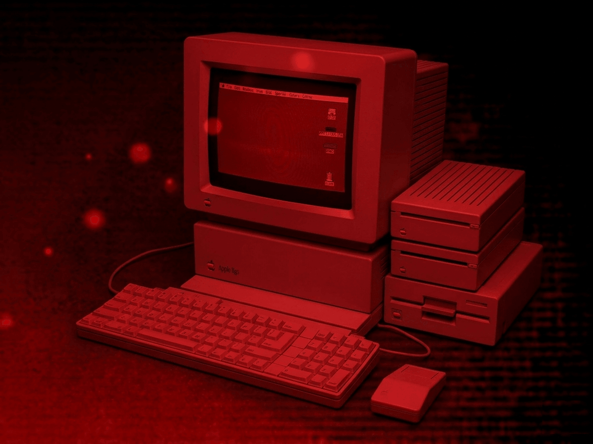
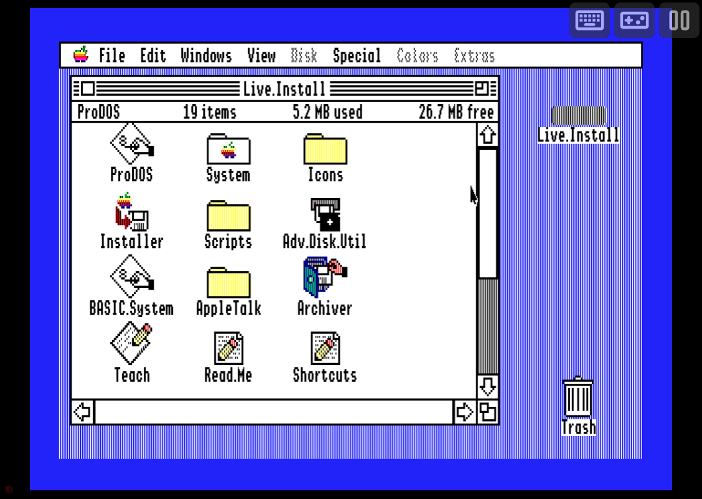
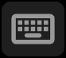
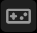
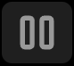
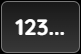
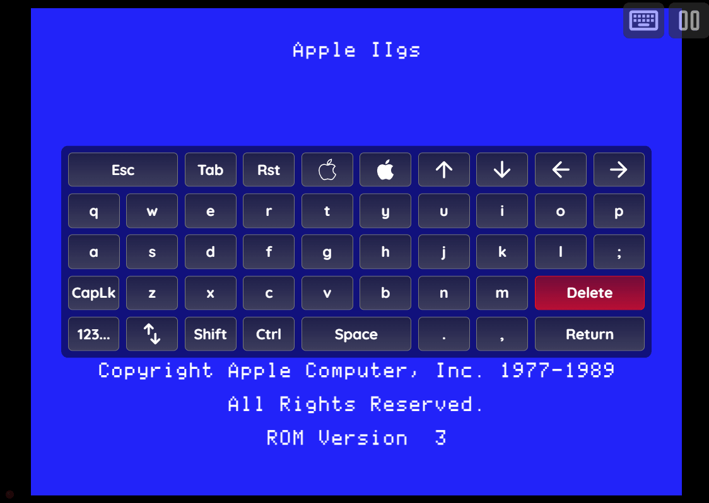
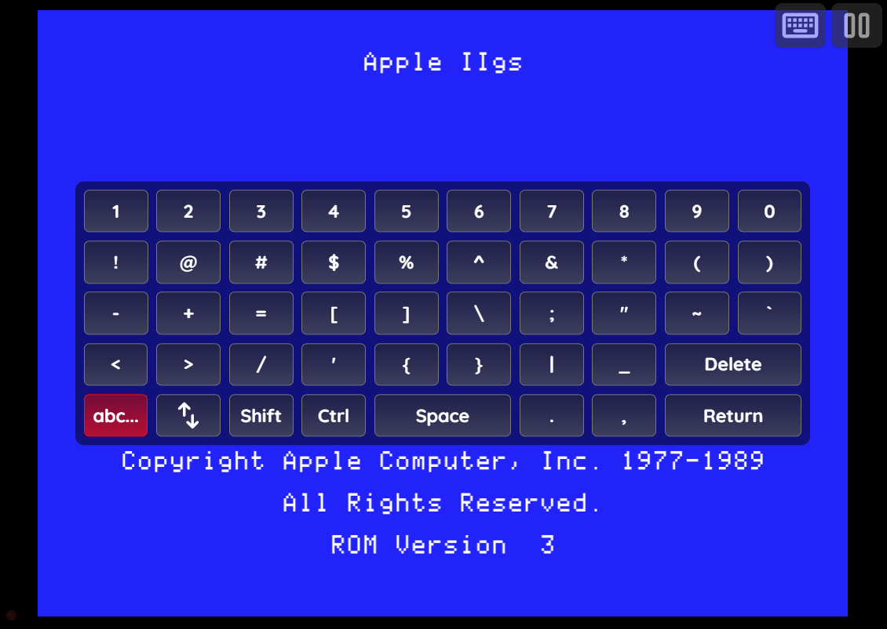
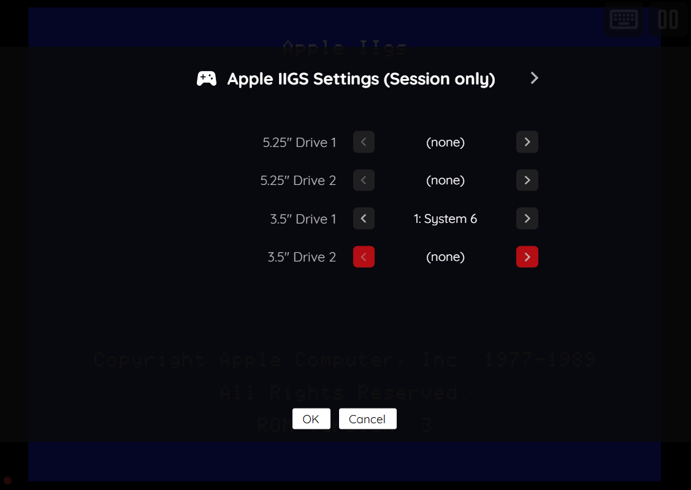
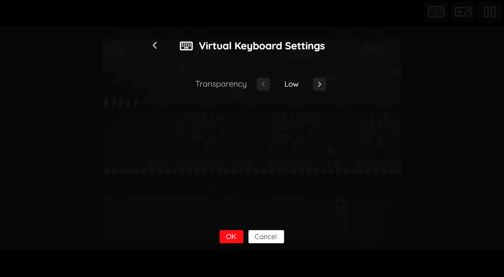

# Apple IIGS (Experimental)

## Overview

The Apple IIGS application is an emulator for the [Apple IIGS](https://en.wikipedia.org/wiki/Apple_IIGS) personal computer.

<figure>
  
  <figcaption>Apple IIGS</figcaption>
</figure>

!!! warning
    The Apple IIGS application is currently designated as an *experimental* application.
    <p>
    This designation has been applied due to the following:
    </p>
    <ul>
    <li>Many games exhibit compatibility issues and defects.</li>
    <li>The application may exhibit instability.</li>
    </ul>
    <p>
    By default, *Experimental* applications are not displayed in the webЯcade *[player](../../../userguide/index.md)* or *[feed editor](../../../editor/index.md)*.
    </p>
    <p>
    To enable the Apple IIGS application, refer to the *advanced settings* sections of the player ([player advanced settings](../../../userguide/index.md#advanced-settings-tab)) or editor ([editor advanced settings](../../../editor/workspace/settings.md#advanced-tab)).
    </p>

## BIOS Files

In addition to Apple IIGS disk images, BIOS files must be specified globally within the feed (See the [Feed Properties Dialog](../../../editor/dialogs/feed-dialog.md#properties-tab) and [Apple IIGS Feed Properties](#feed-properties) sections).

| __File__ | __Hash (MD5)__ |
| --- | --- |
| `a2cffa2.zip` | a24d447d71a223343f5382f393fa80a7 |
| `apple2gs.zip` | ca86796676d3de0607661677b86a3ac7 |

## Default Controls

The emulator supports one controller. The default keyboard and gamepad mappings are listed in the tables below. It is important to note that these are merely the default settings and can be modified on a game-by-game basis.

### Keyboard

The Apple IIGS emulator passes keyboard input directly to the emulated computer. Most standard keys work as expected.

It is important to note that keyboard-based gamepad input should be disabled  to allow access to all keys (otherwise, some keys will be utilized for joystick input).

The following table contains the default keyboard joystick mappings.

| __Name__ | <div style="min-width:140px">__Keys__</div> | __Comments__ |
|--------------------------|---------------------------------------------| |
| Move | {: class="control"} {: class="control"} {: class="control"} {: class="control"} | |
| Button 0 | {: class="control"} | Default mapping. |
| Button 1 | {: class="control"} | Default mapping. |

### Gamepad

The default gamepad mappings are listed in the table below.

| __Name__ | <div style="min-width:140px">__Gamepad__</div> | __Comments__ |
| --- | --- | --- |
| Joystick | {: class="control"} &nbsp;or&nbsp; {: class="control"} | |
| Button 0 | {: class="control"} | Default mapping. |
| Button 1 | {: class="control"} | Default mapping. |
| Left Mouse Button | {: class="control"} | Always active. Also available as a `mappings` key for additional actions. |
| Right Mouse Button | {: class="control"} | Always active. Also available as a `mappings` key for additional actions. |
| Mouse Cursor | {: class="control"} | Move the right analog stick to move the mouse cursor. |
| Mouse Cursor (Slow) | {: class="control"} &nbsp;and&nbsp; {: class="control"} | Hold down the __Right Trigger__ while moving the right analog stick for precision slow movement. |
| Show Virtual Keyboard | {: class="control"} | Not available for Xbox and not recommended for iOS (see alternate)<br><br>Press the __View (Back) Button__. |
| Show Virtual Keyboard<br>(Alternate) | {: class="control"} &nbsp;and&nbsp; {: class="control"} | Hold down the __Right Trigger__ and click (press down) on the __Left Thumbstick__. |
| Show Virtual Keyboard<br>(Alternate) | {: class="control"} &nbsp;and&nbsp; {: class="control"} | Hold down the __Left Trigger__ and click (press down) on the __Right Thumbstick__. |
| Show Pause Screen | {: class="control"} &nbsp;and&nbsp; {: class="control"} | Hold down the __Left Trigger__ and click (press down) on the __Left Thumbstick__. |
| Show Pause Screen<br>(Alternate) | {: class="control"} &nbsp;and&nbsp; {: class="control"} | Hold down the __Left Trigger__ and click (press down) on the __Right Thumbstick__. |

!!! note
    A physical mouse is also supported. Click the display to lock the mouse pointer, and press __Escape__ to release it.

!!! note
    Touch-based mouse input is not yet supported. Use a physical mouse or the right analog stick on a gamepad to control the cursor.

## On-screen Controls

<figure>
  
  <figcaption>On-screen Controls</figcaption>
</figure>

The Apple IIGS application includes a set of on-screen controls which are detailed below.

| __Button__ |  | __Description__ |
| --- | --- | --- |
| Virtual Keyboard |    | Displays the [Virtual Keyboard](#virtual-keyboard). |
| Toggle Gamepad Keyboard Mode |   | <p>Toggles whether or not the keyboard should be used for joystick input. When disabled, the full keyboard is used to map to the Apple IIGS keyboard. When enabled, a subset of the keyboard keys are used for joystick input.</p><p>*NOTE: This button is only visible if a physical keyboard key has been pressed.*</p> |
| Pause (Show Pause Screen) |   | Displays the webЯcade pause screen. |

## Virtual Keyboard

The Apple IIGS application includes a virtual keyboard that can be utilized on devices that don't have a physical keyboard readily available (mobile, Xbox, etc.).

Display of the virtual keyboard can be toggled via the "Virtual Keyboard" button within the [On-screen Controls](#on-screen-controls), or by pressing the __View (Back) Button__ on a gamepad.

### Special Keys

The virtual keyboard includes the following "special" keys.

| __Key__ |  | __Description__ |
| --- | --- | --- |
| Switch to Letters Mode |    | Pressing this key will switch to the [Letters Mode](#letters-mode) of the keyboard. |
| Switch to Numbers Mode |    | Pressing this key will switch to the [Numbers Mode](#numbers-mode) of the keyboard. |
| Change Keyboard Position |    | Toggles the keyboard between center and bottom positions on the screen. |

### Letters Mode

This mode contains letters, special Apple keys (Open Apple, Closed Apple, Reset), and navigation keys.

<figure>
  
  <figcaption>Virtual Keyboard: Letters Mode</figcaption>
</figure>

### Numbers Mode

This mode contains numbers, symbols, and shifted symbol variants.

<figure>
  
  <figcaption>Virtual Keyboard: Numbers Mode</figcaption>
</figure>

## Pause Screen

The Apple IIGS application's pause screen provides access to application settings.

<figure>
  
  <figcaption>Pause Screen</figcaption>
</figure>

### Apple IIGS Settings (Session Only)

This tab is only available when a game has multiple disks and allows switching disks mid-session without modifying the saved feed.

| __Field__ | __Description__ |
| --- | --- |
| 5.25" Drive 1 | Switches the disk in the first 5.25" floppy drive. |
| 5.25" Drive 2 | Switches the disk in the second 5.25" floppy drive (only shown when the second drive is enabled). |
| 3.5" Drive 1 | Switches the disk in the first 3.5" floppy drive. |
| 3.5" Drive 2 | Switches the disk in the second 3.5" floppy drive (only shown when the second drive is enabled). |

### Display Settings Tab

| __Field__ | __Description__ |
| --- | --- |
| Screen size | The screen size to use when playing a game.<br><br>Options include:<br><ul><li>`Native` : The application's native resolution</li><li>`16:9` : Widescreen resolution</li><li>`Fill` : Fill the entire contents of the screen</li></ul> |
| Bilinear filter | The type of bilinear filter to apply to the output display.<br><br>Options include:<br><ul><li>`Sharp` : Applies a sharp bilinear filter</li><li>`Soft` : Applies a soft bilinear filter</li><li>`Off` : Disables bilinear filtering</li></ul> |
| On-screen controls | Toggle whether the on-screen controls should always be displayed, or only when keyboard, mouse, or touch is detected. |

### Virtual Keyboard Settings

<figure>
  
  <figcaption>Virtual Keyboard Settings</figcaption>
</figure>

The Apple IIGS application's "Virtual Keyboard Settings" tab is detailed below.

| __Field__ | __Description__ |
| --- | --- |
| Transparency | <p>Toggles the degree of transparency the virtual keyboard should have.</p><p>A higher degree of transparency allows more of the game to be visible through the keyboard (which may make the keyboard itself less visible).</p> |

## Saving Changes to Media

This application supports persisting changes to a game's media (disk writes) into the browser's local storage or optionally to [cloud-based storage](../../../storage/index.md).

!!! note
    The ability to define blank disk images as part of an item's definition (similar to the Commodore 64 [saveDisks](../commodore/index.md#item-properties) feature) is not yet available for the Apple IIGS application. This capability is planned for a future release.

## Feed

This section details how Apple IIGS application instances can be added to feeds.

### Type

The type name for the Apple IIGS application is `retro-mame-apple2gs`.

| __Type__ | __Cheats__ | __Shaders__ | __Retro<br>Achievements__ | __Low<br>CPU__ |
| --- | --- | --- | --- | --- |
| `retro-mame-apple2gs` ⭐ | x | ✅ | x | x |

!!! note
    The alias `apple2gs` also currently maps to this application. In the future, the `apple2gs` alias may be mapped
    to another Apple IIGS application (different emulator implementation) if it is determined to be a
    more appropriate default.

### Feed Properties

The table below contains global Apple IIGS feed properties. These properties must be specified in the `props` object of the feed's [Feed Object](../../../feeds/format.md#feed-object).

| __Property__ | __Type__ | __Required__ | __Details__ |
|----------|------|----------|---------|
| apple2gs_bios | Array of URLs | Yes | Array of URLs to Apple IIGS BIOS files or zip files containing them (see [BIOS Files](#bios-files)). |

### Item Properties

The table below contains the properties that are specific to the Apple IIGS application. These properties are specified in the `props` object of a feed item.

| __Property__ | __Type__ | __Required__ | __Details__ |
|----------|------|----------|---------|
| media | Array of URLs | Yes | Array of URLs to Apple IIGS disk image files (`.2mg`, `.2meg`, `.hdv`). |
| cpuSpeed | Numeric | No | The CPU speed to emulate.<br><ul><li>`0` : Default (2.8 MHz)</li><li>`1` : 4 MHz</li><li>`2` : 5 MHz</li><li>`3` : 7 MHz (ZipGS)</li><li>`4` : 8 MHz (ZipGS)</li><li>`5` : 10 MHz</li><li>`6` : 12 MHz (ZipGS)</li><li>`7` : 16 MHz (ZipGS)</li></ul> |
| enable2nd525 | Boolean | No | Enable a second 5.25" floppy drive. Useful for games that require simultaneous access to two disks. Defaults to `false`. |
| enable2nd35 | Boolean | No | Enable a second 3.5" floppy drive. Useful for games that require simultaneous access to two disks. Defaults to `false`. |
| mappings | Map of Strings (key-value pairs) | No | <p>Game-specific mappings of Apple IIGS keys and joystick controls to the gamepad.</p><p>The simplest way to determine these mappings is by creating an Apple IIGS item in the [Feed Editor](../../../editor/index.md) and exporting it.</p><p>The following is a simple example of a set of mappings. The `key` is the gamepad controller button and the `value` is the Apple IIGS key or joystick control that it is mapped to.</p><p>``{``<br>&nbsp;&nbsp;&nbsp;&nbsp;``"a": "button0",``<br>&nbsp;&nbsp;&nbsp;&nbsp;``"b": "button1",``<br>&nbsp;&nbsp;&nbsp;&nbsp;``"x": "openapple",``<br>&nbsp;&nbsp;&nbsp;&nbsp;``"y": "closedapple",``<br>&nbsp;&nbsp;&nbsp;&nbsp;``"lt": "return",``<br>&nbsp;&nbsp;&nbsp;&nbsp;``"rt": "space"``<br>``}``</p><p>*Note: `lb` and `rb` always function as mouse buttons regardless of mappings — any key action mapped to them will fire in addition to the mouse click.*</p> |
| zoomLevel | Numeric | No | A numeric value indicating how much the display image should be zoomed in (0-40). |

### Example

The following is an example of a complete feed that consists of a single Apple IIGS application instance (`type` value of `apple2gs`).

``` json hl_lines="4-7 15 17"
{
  "title": "Apple IIGS",
  "props": {
    "apple2gs_bios": [
      "https://<host>/a2cffa2.zip",
      "https://<host>/apple2gs.zip"
    ]
  },
  "categories": [
    {
      "title": "Apple IIGS Games",
      "items": [
        {
          "title": "My Game",
          "type": "apple2gs",
          "props": {
            "media": ["https://<host>/mygame.2mg"]
          }
        }
      ]
    }
  ]
}
```

## References

- [Apple IIGS Application GitHub Repository](https://github.com/webrcade/webrcade-app-retro-mame-apple2gs)
