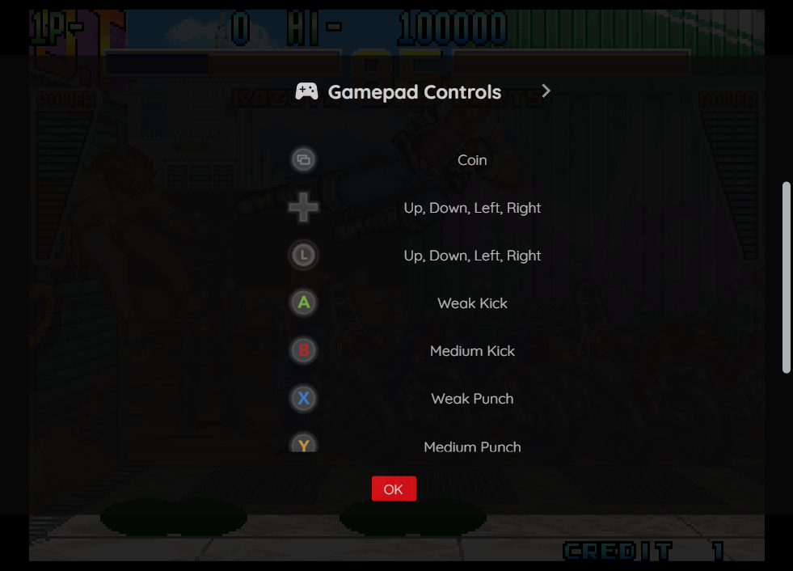

# Arcade

## Overview

The Arcade application is an emulator for various arcade hardware (both pre and post 90s). The underlying emulator is [FinalBurn Neo](https://github.com/finalburnneo/FBNeo) version 1.0.0.2.

See [this page](https://play.webrcade.com/app/neo/js/gamelist-arcade.txt) for a detailed list of all games supported by this application.

<figure>
  
</figure>

## Controls

The emulator supports up to four controllers.

Game-specific mappings for both keyboard and gamepads can be viewed by displaying the `Pause Screen` and then selecting the `View Controls` option (see screenshots below).

### Keyboard

Keyboard support is only available for controller one.

Game-specific keyboard mappings can be viewed by displaying the `Pause Screen` and then selecting the `View Controls` option (see screenshot below).

<figure>
  
  <figcaption>Keyboard Controls Screen</figcaption>
</figure>

Common keyboard mappings (not game-specific) are listed in the table below.

| __Name__ | <div style="min-width:140px">__Keys__</div> | __Comments__ |
|--------------------------|---------------------------------------------| |
| Show Pause Screen | {: class="control"} | |

### Gamepad

Gamepads are supported for up to four controllers.

Game-specific gamepad mappings can be viewed by displaying the `Pause Screen` and then selecting the `View Controls` option (see screenshot below).

<figure>
  
  <figcaption>Gamepad Controls Screen</figcaption>
</figure>

Common gamepad mappings (not game-specific) are listed in the table below.

| __Name__ | <div style="min-width:140px">__Gamepad__</div> | __Comments__ |
| --- | --- | --- |
| Show Pause Screen                    | {: class="control"} &nbsp;and&nbsp; {: class="control"} | Not available for Xbox and not recommended for iOS (see alternate 3 or 4)<br><br>Hold down the __Left Trigger__ and press the __Menu (Start) Button__. |
| Show Pause Screen<br>(Alternate)        | {: class="control"} &nbsp;and&nbsp; {: class="control"} | Not available for Xbox and not recommended for iOS (see alternate 3 or 4)<br><br>Hold down the __Left Trigger__ and press the __View (Back) Button__. |
| Show Pause Screen<br>(Alternate 2)        | {: class="control"} &nbsp;and&nbsp; {: class="control"} | Not available for Xbox and not recommended for iOS (see alternate 3 or 4)<br><br>Hold down the __X Button__ and press the __View (Back) Button__. |
| Show Pause Screen<br>(Alternate 3)        | {: class="control"} &nbsp;and&nbsp; {: class="control"} | Hold down the __Left Trigger__ and click (press down) on the __Left Thumbstick__. |
| Show Pause Screen<br>(Alternate 4)        | {: class="control"} &nbsp;and&nbsp; {: class="control"} | Hold down the __Left Trigger__ and click (press down) on the __Right Thumbstick__. |


## High Scores and NVRAM

Some arcade games include NVRAM and/or High Score state as a means of preserving state between sessions. The Arcade application supports persisting this state into the browser's local storage or optionally to [cloud-based storage](../../../storage/index.md). The state will be persisted whenever the pause screen is displayed (or the game is exited). Therefore, the menu should be displayed periodically for games that support such storage to ensure state is properly persisted.

## Feed

This section details how Arcade application instances can be added to feeds.

### Types

The type names for the Arcade application are listed in the table below.

Unlike other applications, the Arcade application supports multiple types. Having multiple types allows for reduced binary sizes and artwork that is specific to each type. The `fbneo-arcade` (alias `arcade`) is compatible with all of the games, but will have the largest binary size. More types may be added in the future.

| __Type__ | __Alias__ | __Game List__ | __Description__ |
| --- | --- | --- | --- |
| `fbneo-arcade` | `arcade` | [Supported Games](https://play.webrcade.com/app/neo/js/gamelist-arcade.txt)  | This type supports all of the games that are compatible with the Arcade application. |
| `fbneo-capcom` | `arcade-capcom` | [Supported Games](https://play.webrcade.com/app/neo/js/gamelist-capcom.txt)  | This type supports Capcom games that are compatible with the Arcade application. |
| `fbneo-konami` | `arcade-konami` | [Supported Games](https://play.webrcade.com/app/neo/js/gamelist-konami.txt)  | This type supports Konami games that are compatible with the Arcade application. |

!!! note
    The aliases listed above may be mapped to another arcade-based application (different emulator implementation)
    in the future if it is determined to be a more appropriate default.

### Item Properties

The table below contains the properties that are specific to the Arcade application. These properties are
specified in the `props` object of a feed item.

| __Property__ | __Type__ | __Required__ | __Details__ |
|----------|------|----------|---------|
| rom | URL | Yes | URL to the primary arcade ROM zip file. |
| additionalRoms | Array of URLs | No | An array of URLs to additional arcade ROM zip files.<br><br>This is required when the primary ROM file requires additional ROM files to execute.<br><br>For example, the primary ROM might be a clone or variant that relies on the "parent" ROM file. |
| samples | URL | No | URL to a zip file containing audio samples for the arcade game. A subset of games support the optional use of audio samples for sounds that are not currently emulated. |
| volAdjust | Numeric | No | Adjusts the volume from its default level.<br><br>Possible values range from `-99` to `99`.<br><br>In the vast majority of cases this setting should never be utilized. But, for some games where the default volume level is extremely low (inaudible), this property can be used to make the sound audible. |
| playerOrder | String | No | This string is used to determine the order of the players.<br><br>This is typically used for games that have characters that are mapped to a particular coin/start button. In many of these cases, the "preferred" characters are associated with players two and three. Using this string allows for mapping those players to gamepads one and two.<br><br>In the string below, gamepads one and two (zero-based) are mapped to players two and three.<br><br>`2:0:1:3` |
| zoomLevel | Numeric | No | A numeric value indicating how much the display image should be zoomed in (0-40).<br><br>This property is typically used to hide the black borders that are present on some games. |

### Example

The following is an example of a complete feed that consists of a single Arcade application instance (`type` value of `arcade`). The `rom` property value is a URL that points to a Dropbox location that contains the game Alien Arena by Duncan Brown.

``` json hl_lines="8 11"
{
  "title": "Arcade",
  "categories": [
    {
      "title": "Arcade Games",
      "items": [
        {
          "type": "arcade",
          "title": "Alien Arena",
          "props": {
            "rom": "https://www.dropbox.com/s/6ei5oxyb7ye0c3e/alienar.zip"
          }
        }
      ]
    }
  ]
}
```

This example can be tested by adding a feed with the following URL within the [webЯcade player](../../../userguide/index.md):

`https://tinyurl.com/sample-feed-arcade`

## References

- [Arcade Application GitHub Repository](https://github.com/webrcade/webrcade-app-fbneo)
