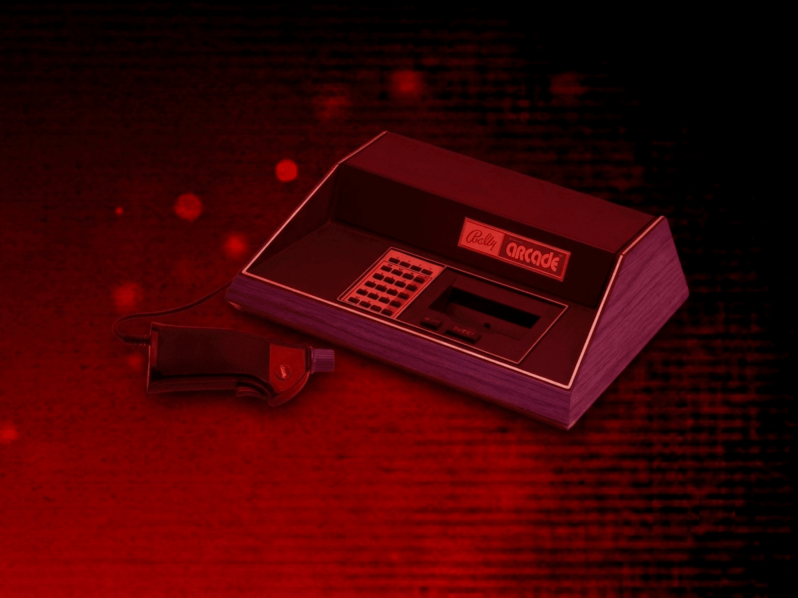
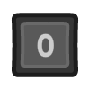
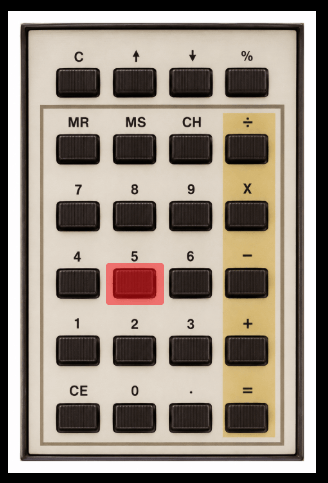
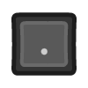
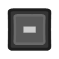
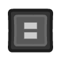
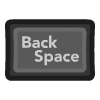
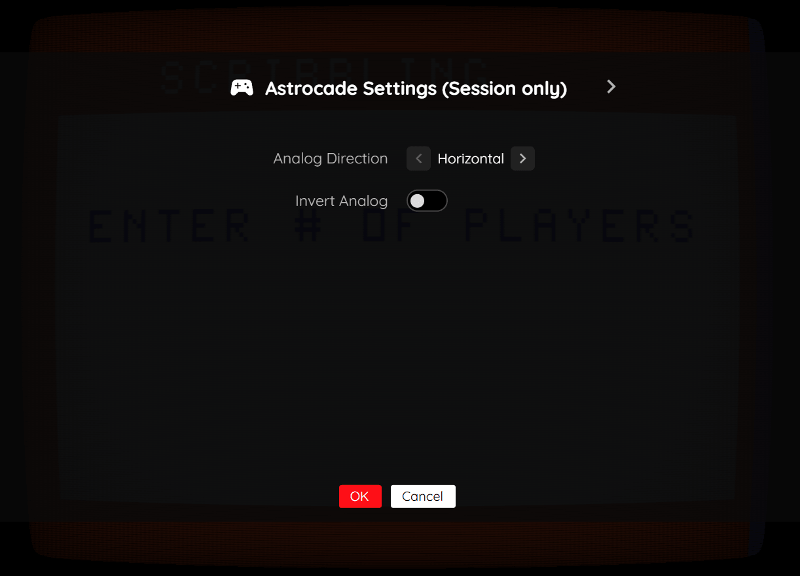

# Bally Astrocade

## Overview

The Bally Astrocade application is an emulator for the [Bally Astrocade](https://en.wikipedia.org/wiki/Bally_Astrocade) home video game console.

<figure>
  
  <figcaption>Bally Astrocade</figcaption>
</figure>

## BIOS File

In addition to Bally Astrocade ROM files, a *Bally Astrocade BIOS* file must be specified globally within the feed (See the [Feed Properties Dialog](../../../editor/dialogs/feed-dialog.md#properties-tab) and [Bally Astrocade Feed Properties](#feed-properties) sections).

| __File__ | __Hash (MD5)__ |
| --- | --- |
| `astro.bin` | 7d25a26e5c4841b364cfe6b1735eaf03 |

## Controls

The emulator supports up to four controllers. The Bally Astrocade hand controller features an integrated joystick, a trigger button, a paddle (rotary knob), and a 24-key keypad. The keyboard, gamepad mappings, and keypad interaction are listed below.

### Keyboard

| __Name__ | <div style="min-width:140px">__Keys__</div> | __Comments__ |
|--------------------------|---------------------------------------------| |
| Move | {: class="control"} {: class="control"} {: class="control"} {: class="control"} | |
| Fire | {: class="control"} | |
| Keypad 0–9 | {: class="control"} - {: class="control"} | Direct keypad key input. |
| Show Keypad | {: class="control"} | Displays the on-screen keypad. See [Keypad](#keypad) section. |
| Show Pause Screen | {: class="control"} | |

### Gamepad

| __Name__ | <div style="min-width:140px">__Gamepad__</div> | __Comments__ |
| --- | --- | --- |
| Move | {: class="control"} &nbsp;or&nbsp; {: class="control"} | |
| Fire | {: class="control"} &nbsp;or&nbsp; {: class="control"} &nbsp;or&nbsp; {: class="control"} &nbsp;or&nbsp; {: class="control"} | Default mapping. Can be changed via the *Mappings* tab in the editor. |
| Paddle | {: class="control"} | Right analog stick controls the paddle/knob. Direction and invert can be configured. |
| Show Keypad | {: class="control"} | Not available for Xbox and not recommended for iOS (see alternate)<br><br>Press the __Menu (Start) Button__. See [Keypad](#keypad) section. |
| Show Keypad<br>(Alternate) | {: class="control"} &nbsp;and&nbsp; {: class="control"} | Hold down the __Right Trigger__ and click (press down) on the __Right Thumbstick__. |
| Show Pause Screen | {: class="control"} &nbsp;and&nbsp; {: class="control"} | Hold down the __Left Trigger__ and click (press down) on the __Left Thumbstick__. |
| Show Pause Screen<br>(Alternate) | {: class="control"} &nbsp;and&nbsp; {: class="control"} | Hold down the __Left Trigger__ and click (press down) on the __Right Thumbstick__. |

## Keypad

The Bally Astrocade hand controller includes a 24-key keypad. An on-screen keypad display allows interacting with these keys using a gamepad or mouse.

<figure>
  
  <figcaption>On-screen Keypad Display</figcaption>
</figure>

### Gamepad (Virtual keypad)

| __Name__ | <div style="min-width:140px">__Gamepad__</div> | __Comments__ |
| --- | --- | --- |
| Show Keypad | {: class="control"} | Not available for Xbox and not recommended for iOS (see alternate)<br><br>Press the __Menu (Start) Button__. |
| Show Keypad<br>(Alternate) | {: class="control"} &nbsp;and&nbsp; {: class="control"} | Hold down the __Right Trigger__ and click (press down) on the __Right Thumbstick__. |
| Choose Key | {: class="control"} &nbsp;or&nbsp; {: class="control"} | |
| Press Key | {: class="control"} | The key will remain pressed until the button is released. |

### Keyboard (Direct mappings)

| __Name__ | <div style="min-width:140px">__Keys__</div> | __Comments__ |
|--------------------------|---------------------------------------------| |
| Keypad 0–9 | {: class="control"} - {: class="control"} | |
| Keypad . | {: class="control"} | |
| Keypad - | {: class="control"} | |
| Keypad / | {: class="control"} | |
| Keypad = | {: class="control"} | |
| Keypad + | {: class="control"} + {: class="control"} | |
| Keypad × | {: class="control"} + {: class="control"} | |
| Keypad % | {: class="control"} + {: class="control"} | |
| Clear Entry (CE) | {: class="control"} | |

## Pause Screen

The Bally Astrocade application's pause screen provides access to application settings.

<figure>
  
  <figcaption>Pause Screen</figcaption>
</figure>

### Astrocade Settings Tab (Session Only)

| __Field__ | __Description__ |
| --- | --- |
| Analog Direction | Whether the right analog stick maps to the paddle horizontally or vertically.<br><ul><li>`Horizontal` : Right analog X-axis controls the paddle</li><li>`Vertical` : Right analog Y-axis controls the paddle</li></ul> |
| Invert Analog | Inverts the paddle direction. |

### Display Settings Tab

| __Field__ | __Description__ |
| --- | --- |
| Screen size | The screen size to use when playing a game.<br><br>Options include:<br><ul><li>`Native` : The application's native resolution</li><li>`16:9` : Widescreen resolution</li><li>`Fill` : Fill the entire contents of the screen</li></ul> |
| Bilinear filter | The type of bilinear filter to apply to the output display.<br><br>Options include:<br><ul><li>`Sharp` : Applies a sharp bilinear filter</li><li>`Soft` : Applies a soft bilinear filter</li><li>`Off` : Disables bilinear filtering</li></ul> |

## Feed

This section details how Bally Astrocade application instances can be added to feeds.

### Type

The type name for the Bally Astrocade application is `retro-mame-astrocade`.

| __Type__ | __Cheats__ | __Shaders__ | __Retro<br>Achievements__ | __Low<br>CPU__ |
| --- | --- | --- | --- | --- |
| `retro-mame-astrocade` ⭐ | x | ✅ | x | x |

!!! note
    The alias `astrocade` also currently maps to this application. In the future, the `astrocade` alias may be mapped
    to another Bally Astrocade application (different emulator implementation) if it is determined to be a
    more appropriate default.

### Feed Properties

The table below contains global Bally Astrocade feed properties. These properties must be specified in the `props` object of the feed's [Feed Object](../../../feeds/format.md#feed-object).

| __Property__ | __Type__ | __Required__ | __Details__ |
|----------|------|----------|---------|
| astrocade_bios | URL | Yes | URL to the Bally Astrocade BIOS file or a zip file containing it (see [BIOS File](#bios-file)). |

### Item Properties

The table below contains the properties that are specific to the Bally Astrocade application. These properties are specified in the `props` object of a feed item.

| __Property__ | __Type__ | __Required__ | __Details__ |
|----------|------|----------|---------|
| rom | URL | Yes | URL to a Bally Astrocade ROM file or a zip file containing one. |
| controlMode | Numeric | No | The control scheme to use. Defaults to `0` (Standard).<br><ul><li>`0` : Standard (single player with analog paddle)</li><li>`1` : Dual Controller (one gamepad drives two players — right analog controls player 2's joystick, B and RB act as player 2's fire)</li><li>`2` : ICBM Attack (left analog moves the crosshair; X fires the left base, B fires the right base, Y fires the center base, A starts the game)</li></ul> |
| analogDirection | Numeric | No | The axis used for the analog paddle. Defaults to `0` (Horizontal).<br><ul><li>`0` : Horizontal (right analog X-axis)</li><li>`1` : Vertical (right analog Y-axis)</li></ul> |
| analogInvert | Boolean | No | Whether to invert the analog paddle direction. Defaults to `false`. |
| mappings | Map of Strings (key-value pairs) | No | <p>Game-specific mappings of Bally Astrocade actions and keypad keys to the gamepad.</p><p>The simplest way to determine these mappings is by creating a Bally Astrocade item in the [Feed Editor](../../../editor/index.md) and exporting it.</p><p>The following is a simple example of a set of mappings. The `key` is the gamepad controller button and the `value` is the Astrocade action (`fire`) or keypad key label (`0`–`9`, `.`, `-`, `/`, `=`, `+`, `×`, `%`, `CE`, `C`, `↑`, `↓`, `MR`, `MS`, `CH`) that it is mapped to.</p><p>``{``<br>&nbsp;&nbsp;&nbsp;&nbsp;``"a": "fire",``<br>&nbsp;&nbsp;&nbsp;&nbsp;``"b": "fire",``<br>&nbsp;&nbsp;&nbsp;&nbsp;``"x": "1",``<br>&nbsp;&nbsp;&nbsp;&nbsp;``"y": "2"``<br>``}``</p> |
| descriptions | Map of Strings (key-value pairs) | No | <p>Custom display names for Bally Astrocade keypad keys, shown in the on-screen keypad display and controls screen.</p><p>The `key` is a keypad key label (matching the `value` of a `mappings` entry or a keypad key label) and the `value` is the custom name to display.</p><p>``{``<br>&nbsp;&nbsp;&nbsp;&nbsp;``"1": "Fire Missile",``<br>&nbsp;&nbsp;&nbsp;&nbsp;``"2": "Drop Bomb"``<br>``}``</p> |
| zoomLevel | Numeric | No | A numeric value indicating how much the display image should be zoomed in (0-40). |

### Example

The following is an example of a complete feed that consists of a single Bally Astrocade application instance (`type` value of `astrocade`).

``` json hl_lines="4 12 14"
{
  "title": "Bally Astrocade",
  "props": {
    "astrocade_bios": "https://<host>/astro.bin"
  },
  "categories": [
    {
      "title": "Bally Astrocade Games",
      "items": [
        {
          "title": "Galaxian",
          "type": "astrocade",
          "props": {
            "rom": "https://<host>/galaxian.bin"
          }
        }
      ]
    }
  ]
}
```

## References

- [Bally Astrocade Application GitHub Repository](https://github.com/webrcade/webrcade-app-retro-mame-astrocade)
