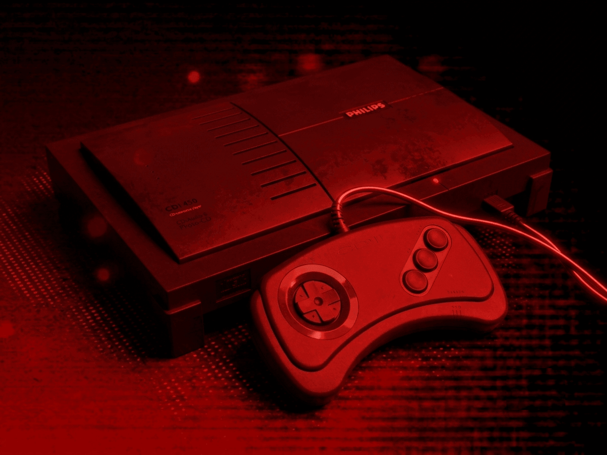

# Philips CD-i

## Overview

The Philips CD-i application is an emulator for the [Philips CD-i](https://en.wikipedia.org/wiki/CD-i) multimedia entertainment system.

<figure>
  
  <figcaption>Philips CD-i</figcaption>
</figure>

!!! important
    The [Digital Video Cartridge (DVC)](https://en.wikipedia.org/wiki/CD-i#Digital_Video_Cartridge) is not supported. The DVC was an optional hardware add-on for the Philips CD-i that provided MPEG-1 video decoding, enabling full-motion video (FMV) playback in supported titles. Games that require the DVC may fail to load entirely or will not display their video content correctly.

## Adding Games (Feed Editor)

Due to large Disc image sizes, adding Philips CD-i games in the [Feed Editor](../../../editor/index.md) must be done manually (versus using auto-detection).

!!! important
    The Philips CD-i application only supports the `.CHD` disc file format (`.ISO`, `.BIN`, and `.CUE` are not supported).

See the [Disc and Archive-based Items](../../../editor/workspace/addingitems.md#disc-and-archive-based-items) section for the list of steps required to add a Philips CD-i game in the [Feed Editor](../../../editor/index.md).

!!! important
    Both the iOS Safari and Xbox Series X|S Edge browsers limit the amount of memory that can be consumed by a particular web application (such as webЯcade).
    <p>
    The current limit is around 450 megabytes. Therefore, loading larger disc sizes may fail.
    </p>
    <p>
    To increase the likelihood of a game with a larger disc size loading, you can optionally choose to launch the game using a standalone-based link (versus launching the game within the webЯcade player or editor). See the [Standalone](../../../standalone/index.md) section of this documentation for further information (On Xbox, you would most likely want to bookmark the direct link. On iOS, you would most likely want to add the game to the home screen).
    </p>

## BIOS File

In addition to Philips CD-i disc images, a *Philips CD-i BIOS* file must be specified globally within the feed (See the [Feed Properties Dialog](../../../editor/dialogs/feed-dialog.md#properties-tab) and [Philips CD-i Feed Properties](#feed-properties) sections).

| __File__ | __Hash (MD5)__ |
| --- | --- |
| `cdimono1.zip` | c59f92647701428bc453976740eb75cf |

## Controls

The emulator supports one controller. The keyboard and gamepad mappings are listed in the tables below.

### Keyboard

| __Name__ | <div style="min-width:140px">__Keys__</div> | __Comments__ |
|--------------------------|---------------------------------------------| |
| Move Cursor | {: class="control"} {: class="control"} {: class="control"} {: class="control"} | |
| Button 1 | {: class="control"} | |
| Button 2 | {: class="control"} | |
| Button 3 | {: class="control"} | |
| Show Pause Screen | {: class="control"} | |

### Gamepad

| __Name__ | <div style="min-width:140px">__Gamepad__</div> | __Comments__ |
| --- | --- | --- |
| Move Cursor | {: class="control"} &nbsp;or&nbsp; {: class="control"} | |
| Button 1 | {: class="control"} | |
| Button 2 | {: class="control"} | |
| Button 3 | {: class="control"} | |
| Show Pause Screen | {: class="control"} &nbsp;and&nbsp; {: class="control"} | Hold down the __Left Trigger__ and click (press down) on the __Left Thumbstick__. |
| Show Pause Screen<br>(Alternate) | {: class="control"} &nbsp;and&nbsp; {: class="control"} | Hold down the __Left Trigger__ and click (press down) on the __Right Thumbstick__. |

### Mouse

The Philips CD-i application supports mouse input for cursor control. Click the display to lock the mouse pointer, and press __Escape__ to release it.

!!! note
    Touch-based mouse input is not yet supported. Use a physical mouse or the left analog stick on a gamepad to control the cursor.

## Pause Screen

The Philips CD-i application's pause screen provides access to application settings.

### Display Settings Tab

| __Field__ | __Description__ |
| --- | --- |
| Screen size | The screen size to use when playing a game.<br><br>Options include:<br><ul><li>`Native` : The application's native resolution</li><li>`16:9` : Widescreen resolution</li><li>`Fill` : Fill the entire contents of the screen</li></ul> |
| Bilinear filter | The type of bilinear filter to apply to the output display.<br><br>Options include:<br><ul><li>`Sharp` : Applies a sharp bilinear filter</li><li>`Soft` : Applies a soft bilinear filter</li><li>`Off` : Disables bilinear filtering</li></ul> |

## Internal Save Memory

The Philips CD-i application supports persisting the console's internal save memory into the browser's local storage or optionally to [cloud-based storage](../../../storage/index.md). The contents will be persisted to storage whenever the pause screen is displayed (or the game is exited). Therefore, the menu should be displayed periodically for games that support saving to memory to ensure the state is properly persisted.

## Feed

This section details how Philips CD-i application instances can be added to feeds.

### Type

The type name for the Philips CD-i application is `retro-mame-cdi`.

| __Type__ | __Cheats__ | __Shaders__ | __Retro<br>Achievements__ | __Low<br>CPU__ |
| --- | --- | --- | --- | --- |
| `retro-mame-cdi` ⭐ | x | ✅ | x | x |

!!! note
    The alias `cdi` also currently maps to this application. In the future, the `cdi` alias may be mapped
    to another Philips CD-i application (different emulator implementation) if it is determined to be a
    more appropriate default.

### Feed Properties

The table below contains global Philips CD-i feed properties. These properties must be specified in the `props` object of the feed's [Feed Object](../../../feeds/format.md#feed-object).

| __Property__ | __Type__ | __Required__ | __Details__ |
|----------|------|----------|---------|
| philipscdi_bios | URL | Yes | URL to the Philips CD-i BIOS file or a zip file containing it (see [BIOS File](#bios-file)). |

### Item Properties

The table below contains the properties that are specific to the Philips CD-i application. These properties are specified in the `props` object of a feed item.

| __Property__ | __Type__ | __Required__ | __Details__ |
|----------|------|----------|---------|
| discs | Array of URLs | Yes | <p>Array of URLs to one or more (for multi-disc games) Philips CD-i game discs.</p><p>The Philips CD-i application only supports the `.CHD` disc file format (`.ISO`, `.BIN`, and `.CUE` are not supported).</p> |
| zoomLevel | Numeric | No | A numeric value indicating how much the display image should be zoomed in (0-40). |

### Example

The following is an example of a complete feed that consists of a single Philips CD-i application instance (`type` value of `cdi`).

``` json hl_lines="4 12 14"
{
  "title": "Philips CD-i",
  "props": {
    "philipscdi_bios": "https://<host>/cdimono1.zip"
  },
  "categories": [
    {
      "title": "Philips CD-i Games",
      "items": [
        {
          "title": "My Game",
          "type": "cdi",
          "props": {
            "discs": ["https://<host>/mygame.chd"]
          }
        }
      ]
    }
  ]
}
```

## References

- [Philips CD-i Application GitHub Repository](https://github.com/webrcade/webrcade-app-retro-mame-cdi)
