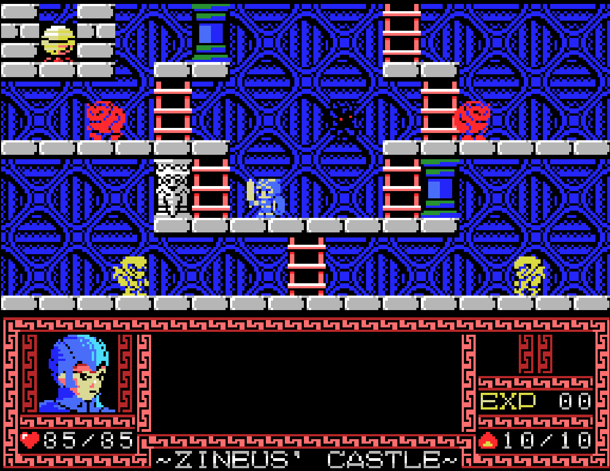

# ColecoVision

## Overview

The ColecoVision application is an emulator for the [ColecoVision](https://en.wikipedia.org/wiki/ColecoVision) game console.

<figure>
  
  <figcaption>Caos Begins by Antoni Burguera</figcaption>
</figure>

## BIOS File

In addition to ColecoVision ROM files, a *ColecoVision BIOS* (typically named `coleco.rom`) must be specified globally within the feed (See the [Feed Properties Dialog](../../../editor/dialogs/feed-dialog.md#properties-tab) and [ColecoVision Feed Properties](#feed-properties) sections).

| __File__ | __Hash (MD5)__ |
| --- | --- |
| `coleco.rom` | 2c66f5911e5b42b8ebe113403548eee7 |

## Controls

The emulator supports two controllers. The keyboard and gamepad mappings are listed in the tables below.

### Standard Controls

#### Keyboard

Keyboard controls are listed below.

| __Name__ | <div style="min-width:140px">__Keys__</div> | __Comments__ |
|--------------------------|---------------------------------------------| |
| Move | {: class="control"} {: class="control"} {: class="control"} {: class="control"}  | |
| Left Fire | {: class="control"} | |
| Right Fire | {: class="control"} | |
| Show Keypad Display | {: class="control"} | See [Keypad](#keypad) section for more details. |
| Show Pause Screen | {: class="control"} | |

#### Gamepad

Gamepad mappings are listed below.

| __Name__ | <div style="min-width:140px">__Gamepad__</div> | __Comments__ |
| --- | --- | --- |
| Move                         | {: class="control"} &nbsp;or&nbsp; {: class="control"} | |
| Left Fire                       | {: class="control"} | |
| Right Fire                       | {: class="control"} | |
| Toggle Keypad Display                        | {: class="control"} | Not available for Xbox and not recommended for iOS (see alternate)<br><br>Press the __Menu (Start) Button__.<br><br>See [Keypad](#keypad) section for more details. |
| Toggle Keypad Display <br>(Alternate)            | {: class="control"} &nbsp;and&nbsp; {: class="control"} | Hold down the __Right Trigger__ and click (press down) on the __Right Thumbstick__. |
| Show Pause Screen                    | {: class="control"} &nbsp;and&nbsp; {: class="control"} | Not available for Xbox and not recommended for iOS (see alternate 3 or 4)<br><br>Hold down the __Left Trigger__ and press the __Menu (Start) Button__. |
| Show Pause Screen<br>(Alternate)        | {: class="control"} &nbsp;and&nbsp; {: class="control"} | Not available for Xbox and not recommended for iOS (see alternate 3 or 4)<br><br>Hold down the __Left Trigger__ and press the __View (Back) Button__. |
| Show Pause Screen<br>(Alternate 2)        | {: class="control"} &nbsp;and&nbsp; {: class="control"} | Not available for Xbox and not recommended for iOS (see alternate 3 or 4)<br><br>Hold down the __X Button__ and press the __View (Back) Button__. |
| Show Pause Screen<br>(Alternate 3)        | {: class="control"} &nbsp;and&nbsp; {: class="control"} | Hold down the __Left Trigger__ and click (press down) on the __Left Thumbstick__. |
| Show Pause Screen<br>(Alternate 4)        | {: class="control"} &nbsp;and&nbsp; {: class="control"} | Hold down the __Left Trigger__ and click (press down) on the __Right Thumbstick__. |

### Super Action Controls

#### Keyboard

Keyboard controls are listed below.

| __Name__ | <div style="min-width:140px">__Keys__</div> | __Comments__ |
|--------------------------|---------------------------------------------| |
| Move | {: class="control"} {: class="control"} {: class="control"} {: class="control"}  | |
| Yellow Button | {: class="control"} | |
| Orange Button | {: class="control"} | |
| Purple Button | {: class="control"} | |
| Blue Button | {: class="control"} | |
| Show Keypad Display | {: class="control"} | See [Keypad](#keypad) section for more details. |
| Show Pause Screen | {: class="control"} | |

#### Gamepad

Gamepad mappings are listed below.

| __Name__ | <div style="min-width:140px">__Gamepad__</div> | __Comments__ |
| --- | --- | --- |
| Move                         | {: class="control"} &nbsp;or&nbsp; {: class="control"} | |
| Spinner  | {: class="control"} | |
class="control"} | |
| Yellow Button                       | {: class="control"} | |
| Orange Button                       | {: class="control"} | |
| Purple Button                       | {: class="control"} | |
| Yellow Button                       | {: class="control"} | |
| Toggle Keypad Display                        | {: class="control"} | Not available for Xbox and not recommended for iOS (see alternate)<br><br>Press the __Menu (Start) Button__.<br><br>See [Keypad](#keypad) section for more details. |
| Toggle Keypad Display <br>(Alternate)            | {: class="control"} &nbsp;and&nbsp; {: class="control"} | Hold down the __Right Trigger__ and click (press down) on the __Right Thumbstick__. |
| Show Pause Screen                    | {: class="control"} &nbsp;and&nbsp; {: class="control"} | Not available for Xbox and not recommended for iOS (see alternate 3 or 4)<br><br>Hold down the __Left Trigger__ and press the __Menu (Start) Button__. |
| Show Pause Screen<br>(Alternate)        | {: class="control"} &nbsp;and&nbsp; {: class="control"} | Not available for Xbox and not recommended for iOS (see alternate 3 or 4)<br><br>Hold down the __Left Trigger__ and press the __View (Back) Button__. |
| Show Pause Screen<br>(Alternate 2)        | {: class="control"} &nbsp;and&nbsp; {: class="control"} | Not available for Xbox and not recommended for iOS (see alternate 3 or 4)<br><br>Hold down the __X Button__ and press the __View (Back) Button__. |
| Show Pause Screen<br>(Alternate 3)        | {: class="control"} &nbsp;and&nbsp; {: class="control"} | Hold down the __Left Trigger__ and click (press down) on the __Left Thumbstick__. |
| Show Pause Screen<br>(Alternate 4)        | {: class="control"} &nbsp;and&nbsp; {: class="control"} | Hold down the __Left Trigger__ and click (press down) on the __Right Thumbstick__. |

### Driving Controls

#### Gamepad

Gamepad mappings are listed below.

| __Name__ | <div style="min-width:140px">__Gamepad__</div> | __Comments__ |
| --- | --- | --- |
| Steer                         | {: class="control"} | |
| Joystick                         | {: class="control"}  | Game-specific (for example, Turbo uses for shifting) |
| Spinner  | {: class="control"} | |
class="control"} | |
| Gas Button                       | {: class="control"} | |
| Brake Button                       | {: class="control"} | |
| Toggle Keypad Display                        | {: class="control"} | Not available for Xbox and not recommended for iOS (see alternate)<br><br>Press the __Menu (Start) Button__.<br><br>See [Keypad](#keypad) section for more details. |
| Toggle Keypad Display <br>(Alternate)            | {: class="control"} &nbsp;and&nbsp; {: class="control"} | Hold down the __Right Trigger__ and click (press down) on the __Right Thumbstick__. |
| Show Pause Screen                    | {: class="control"} &nbsp;and&nbsp; {: class="control"} | Not available for Xbox and not recommended for iOS (see alternate 3 or 4)<br><br>Hold down the __Left Trigger__ and press the __Menu (Start) Button__. |
| Show Pause Screen<br>(Alternate)        | {: class="control"} &nbsp;and&nbsp; {: class="control"} | Not available for Xbox and not recommended for iOS (see alternate 3 or 4)<br><br>Hold down the __Left Trigger__ and press the __View (Back) Button__. |
| Show Pause Screen<br>(Alternate 2)        | {: class="control"} &nbsp;and&nbsp; {: class="control"} | Not available for Xbox and not recommended for iOS (see alternate 3 or 4)<br><br>Hold down the __X Button__ and press the __View (Back) Button__. |
| Show Pause Screen<br>(Alternate 3)        | {: class="control"} &nbsp;and&nbsp; {: class="control"} | Hold down the __Left Trigger__ and click (press down) on the __Left Thumbstick__. |
| Show Pause Screen<br>(Alternate 4)        | {: class="control"} &nbsp;and&nbsp; {: class="control"} | Hold down the __Left Trigger__ and click (press down) on the __Right Thumbstick__. |

### Roller Controls

#### Gamepad

Gamepad mappings are listed below.

| __Name__ | <div style="min-width:140px">__Gamepad__</div> | __Comments__ |
| --- | --- | --- |
| Roller                         | {: class="control"} | |
| Joystick                         | {: class="control"}  |  |
| Spinner  | {: class="control"} | |
class="control"} | |
| Left Fire (2p)                       | {: class="control"} | |
| Right Fire (2p)                       | {: class="control"} | |
| Left Fire                        | {: class="control"} | |
| Right Fire                        | {: class="control"} | |
| Toggle Keypad Display                        | {: class="control"} | Not available for Xbox and not recommended for iOS (see alternate)<br><br>Press the __Menu (Start) Button__.<br><br>See [Keypad](#keypad) section for more details. |
| Toggle Keypad Display <br>(Alternate)            | {: class="control"} &nbsp;and&nbsp; {: class="control"} | Hold down the __Right Trigger__ and click (press down) on the __Right Thumbstick__. |
| Show Pause Screen                    | {: class="control"} &nbsp;and&nbsp; {: class="control"} | Not available for Xbox and not recommended for iOS (see alternate 3 or 4)<br><br>Hold down the __Left Trigger__ and press the __Menu (Start) Button__. |
| Show Pause Screen<br>(Alternate)        | {: class="control"} &nbsp;and&nbsp; {: class="control"} | Not available for Xbox and not recommended for iOS (see alternate 3 or 4)<br><br>Hold down the __Left Trigger__ and press the __View (Back) Button__. |
| Show Pause Screen<br>(Alternate 2)        | {: class="control"} &nbsp;and&nbsp; {: class="control"} | Not available for Xbox and not recommended for iOS (see alternate 3 or 4)<br><br>Hold down the __X Button__ and press the __View (Back) Button__. |
| Show Pause Screen<br>(Alternate 3)        | {: class="control"} &nbsp;and&nbsp; {: class="control"} | Hold down the __Left Trigger__ and click (press down) on the __Left Thumbstick__. |
| Show Pause Screen<br>(Alternate 4)        | {: class="control"} &nbsp;and&nbsp; {: class="control"} | Hold down the __Left Trigger__ and click (press down) on the __Right Thumbstick__. |

## Keypad

The following section describes how to interact with the ColecoVision controller's keypad buttons.

Virtual keypads and direct keyboard mappings are supported.

<figure>
  
  <figcaption>On-screen Keypad Display</figcaption>
</figure>

### Gamepad (Virtual keypad)

| __Name__ | <div style="min-width:140px">__Gamepad__</div> | __Comments__ |
| --- | --- | --- |
| Toggle Keypad Display                        | {: class="control"} | Not available for Xbox and not recommended for iOS (see alternate)<br><br>Press the __Menu (Start) Button__. |
| Toggle Keypad Display <br>(Alternate)            | {: class="control"} &nbsp;and&nbsp; {: class="control"} | Hold down the __Right Trigger__ and click (press down) on the __Right Thumbstick__. |
| Choose Key |{: class="control"} &nbsp;or&nbsp; {: class="control"}   |  |
| Press Key  | {: class="control"} | The key button will continue to be pressed until the button is released. This is important as some games require long presses for the key to be recognized. |

### Keyboard (Virtual keypad)

| __Name__ | <div style="min-width:140px">__Keys__</div> | __Comments__ |
|--------------------------|---------------------------------------------| |
| Show Keypad | {: class="control"} |  |
| Close Keypad | {: class="control"} | |
| Choose Key | {: class="control"} {: class="control"} {: class="control"} {: class="control"}  | |
| Press Key | {: class="control"} | When keypad is visible.<br><br>The key button will continue to be pressed until the keyboard key is released. This is important as some games require long presses for the key to be recognized. |

### Keyboard (Direct mappings)

The key button will continue to be pressed until the keyboard key is released. This is important as some games require long presses for the key to be recognized.

| __Name__ | <div style="min-width:140px">__Keys__</div> | __Comments__ |
|--------------------------|---------------------------------------------| |
| Press key (0-9) | {: class="control"} - {: class="control"}  |  |
| Press key (Asterick) | {: class="control"} |  |
| Press key (Pound) | {: class="control"}  |  |

## Feed

This section details how ColecoVision application instances can be added to feeds.

### Type

The type name for the ColecoVision application is `colem`.

!!! note
    The alias `coleco` also currently maps to this application. In the future, the `coleco` alias may be mapped
    to another ColecoVision application (different emulator implementation) if it is determined to be a
    more appropriate default.

### Feed Properties

The table below contains global ColecoVision feed properties. These properties must be specified in the `props` object of the feed's [Feed Object](../../../feeds/format.md#feed-object).

| __Property__ | __Type__ | __Required__ | __Details__ |
|----------|------|----------|---------|
| coleco_rom | URL | Yes | URL to a ColecoVision BIOS file or a zip file containing the BIOS file. |

### Item Properties

The table below contains the properties that are specific to the ColecoVision application. These properties are
specified in the `props` object of a feed item.

| __Property__ | __Type__ | __Required__ | __Details__ |
|----------|------|----------|---------|
| rom | URL | Yes | URL to a ColecoVision ROM file or a zip file containing a ROM file. |
| controlsMode | Numeric | No | The type of controls to use.<br><ul><li>`0` : Standard</li><li>`1` : Super Action</li><li>`2` : Driving</li><li>`3` : Roller</li></ul> |
| mappings | Map of Strings (key-value pairs) | No | Game-specific mappings from the ColecoVision keys and buttons to the gamepad.<br><br>The `key` in the map must be one of the following:<br><ul><li>`a`: A button</li><li>`b`: B button</li><li>`x`: X button</li><li>`y`: Y button</li><li>`lb`: Left bumper</li><li>`rb`: Right bumper</li><li>`lt`: Left trigger</li><li>`rt`: Right trigger</li></ul>The `value` in the map must be one of the following:<br><ul><li>Keypad button: `0`-`9`, `#`, `*`</li><li>Controller button: `firel` (left Fire), `firer` (Right Fire), `firel2` (Left Fire 2p), `firer2` (Right Fire 2p) `purple` (Super Action), `blue` (Super Action)</li></ul>  |
| descriptions | Map of Strings (key-value pairs) | No | Provides game-specific descriptions for the ColecoVision controller keys and buttons. Shown when the keypad or game-specific controls are displayed.<br><br>The `key` in the map must be one of the following:<br><ul><li>Keypad button: `0`-`9`, `#`, `*`</li><li>Controller button: `firel` (left Fire), `firer` (Right Fire), `firel2` (Left Fire 2p), `firer2` (Right Fire 2p) `purple` (Super Action), `blue` (Super Action)</li></ul>The `value` in the map will be the description for the `key` (keypad or controller button).  |
| zoomLevel | Numeric | No | A numeric value indicating how much the display image should be zoomed in (0-40).<br><br>This property is typically used to hide the black borders that are present on some ColecoVision games. |


### Example

The following is an example of a complete feed that consists of a single ColecoVision application instance (`type` value of `coleco`). The `rom` property value is a URL that points to a Dropbox location that contains the excellent homebrew game Caos Begins by Antoni Burguera.

It is also worth noting that the *ColecoVision BIOS location* (`coleco_rom`) is specified globally within the [Feed Object's](../../../feeds/format.md#feed-object) `props` object.

``` json hl_lines="4 12 14"
{
  "title": "ColecoVision",
  "props": {
    "coleco_rom": "https://<host>/coleco.rom"
  },
  "categories": [
    {
      "title": "ColecoVision Games",
      "items": [
        {
          "title": "Caos Begins",
          "type": "coleco",
          "props": {
            "rom": "https://www.dropbox.com/s/zbkxo8udhtey55j/caos-begins-2016.rom?dl=0"
          }
        }
      ]
    }
  ]
}
```

## References

- [ColecoVision Application GitHub Repository](https://github.com/webrcade/webrcade-app-colem)
