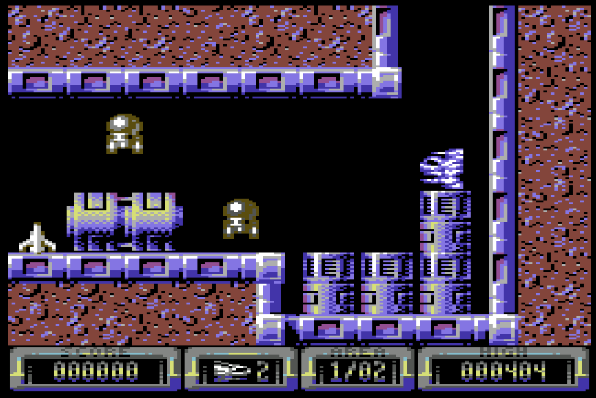
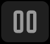
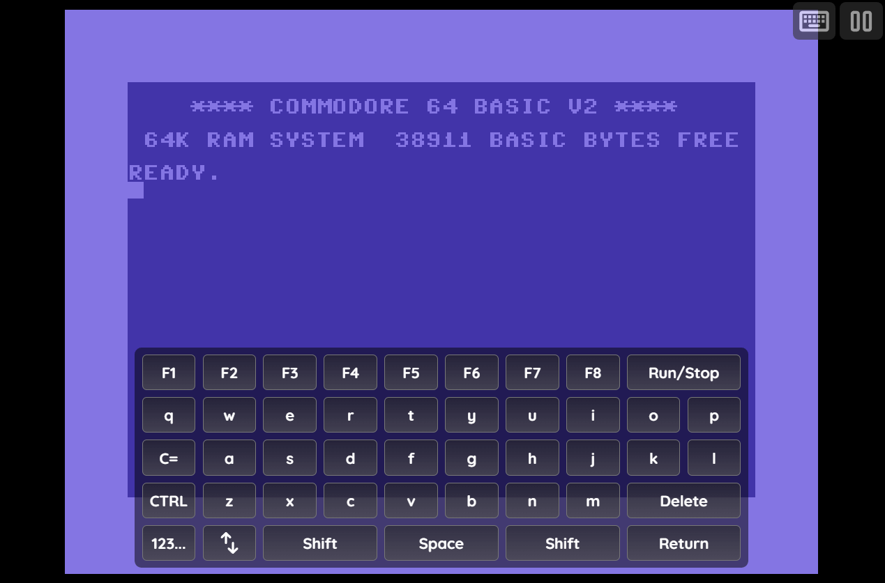
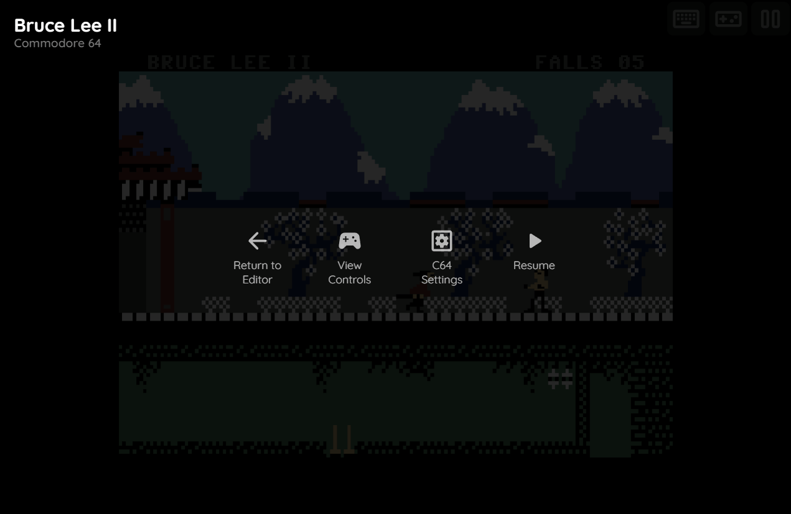
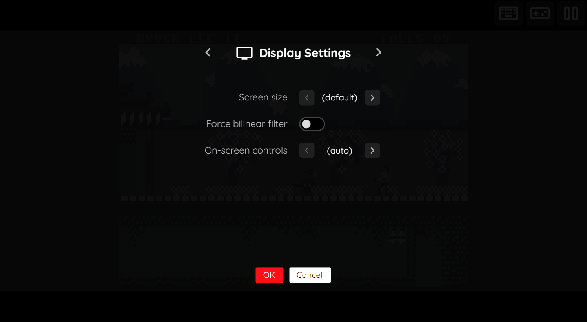
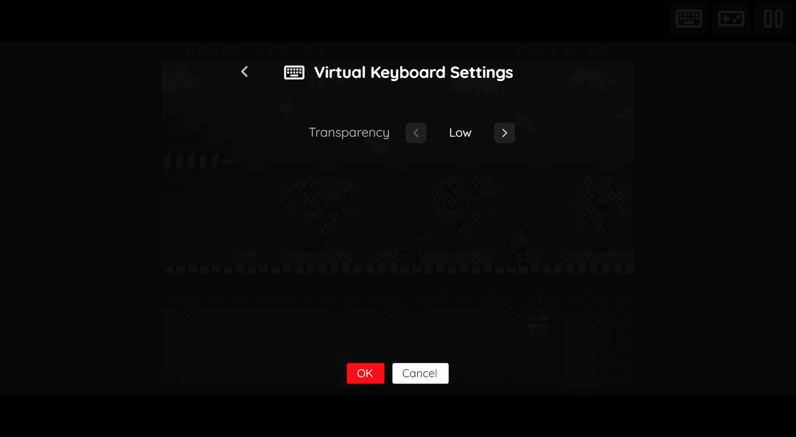

# Commodore 64

## Overview

The Commodore 64 application is an emulator for the [Commodore 64](https://en.wikipedia.org/wiki/Commodore_64) computer.

<figure>
  
  <figcaption>Vallation by Jason Kelk</figcaption>
</figure>

## JiffyDOS BIOS Files

By default, loading of Commodore 64 disks is quite slow as it mimics the original hardware for maximum compatibility. To significantly increase loading speeds, JiffyDOS BIOS files can be utilized. The following table lists these files which can be specified globally within the feed (See the [Feed Properties Dialog](../../../editor/dialogs/feed-dialog.md#properties-tab) and [Commodore 64 Feed Properties](#feed-properties) sections).

The use of JiffyDOS can be disabled on a game-by-game basis if there are compatibility issues.

| __File__ | __Hash (MD5)__ | __Description__ |
| --- | --- | --- |
| `JiffyDOS_C64.bin` | be09394f0576cf81fa8bacf634daf9a2 | JiffyDOS C64 Kernel |
| `JiffyDOS_1541-II.bin` | 1b1e985ea5325a1f46eb7fd9681707bf | JiffyDOS 1541 drive BIOS |
| `JiffyDOS_1571_repl310654.bin` | 41c6cc528e9515ffd0ed9b180f8467c0 | JiffyDOS 1571 drive BIOS |
| `JiffyDOS_1581.bin` | 20b6885c6dc2d42c38754a365b043d71 |  JiffyDOS 1581 drive BIOS |

## Default Controls

The default keyboard and gamepad mappings are listed in the tables below. It is important to note that these are merely the default settings and can be modified on a game-by-game basis.

### Keyboard

A computer physical keyboard maps to the Commdore 64 keyboard using a "positional" mapping approach (the computer keyboard maps closely to the actual location of Commodore 64 keys).

The easiest way to determine these mappings is to use the test program below. Click on the test program, and press keyboard keys to see how they map to the Commodore keys.

It is important to note that keyboard-based gamepad input should be disabled  to allow access to all keys (otherwise, some keys will be utilized for joystick input).

<iframe width="100%" height="450" src="https://play-staging.webrcade.com/app/standalone/?app=app%2Fretro-commodore-8bit%2F&props=JTdCJTIydHlwZSUyMiUzQSUyMnJldHJvLWNvbW1vZG9yZS1jNjQlMjIlMkMlMjJ0aXRsZSUyMiUzQSUyMktleWJvYXJkJTIwVGVzdCUyMiUyQyUyMmFwcCUyMiUzQSUyMkNvbW1vZG9yZSUyMDY0JTIyJTJDJTIyaWNvbiUyMiUzQSUyMi4uJTJGLi4lMkZpbWFnZXMlMkZhcHAlMkZjNjQtdGh1bWIucG5nJTIyJTJDJTIydWlkJTIyJTNBJTIyN2FiYzRmNWItYzQ5Zi00NGZkLTg4NDAtNTNiYjNjNGMxNWM4JTIyJTJDJTIybWVkaWElMjIlM0ElNUIlMjJodHRwcyUzQSUyRiUyRmdpdGh1Yi5jb20lMkZ3ZWJyY2FkZSUyRndlYnJjYWRlLWRlZmF1bHQtZmVlZCUyRnJhdyUyRm1haW4lMkZjb250ZW50JTJGYzY0JTJGS2V5Ym9hcmQtVGVzdC56aXAlMjIlNUQlMkMlMjJtYXBwaW5ncyUyMiUzQSU3QiUyMnN0YXJ0JTIyJTNBJTIycmV0dXJuJTIyJTJDJTIyYSUyMiUzQSUyMmZpcmUxJTIyJTJDJTIyYiUyMiUzQSUyMmZpcmUyJTIyJTJDJTIyeSUyMiUzQSUyMnNwYWNlJTIyJTJDJTIybGIlMjIlM0ElMjJydW5zdG9wJTIyJTJDJTIycmIlMjIlM0ElMjJmMSUyMiU3RCUyQyUyMnNhdmVEaXNrcyUyMiUzQTElN0Q%3D&ctx=standalone" allowfullscreen="allowfullscreen" frameborder="0"  style="margin:5px 15px  0 15px; border-radius: 10px; box-shadow: 4.0px 8.0px 8.0px hsl(0deg 0% 0% / 0.38);"></iframe>

The following table contains the default keyboard joystick mappings.

| __Name__ | <div style="min-width:140px">__Keys__</div> | __Comments__ |
|--------------------------|---------------------------------------------| |
| Move | {: class="control"} {: class="control"} {: class="control"} {: class="control"}  | |
| Fire 1 | {: class="control"} | |
| Fire 2 | {: class="control"} | |

### Gamepad

The default gamepad mappings are listed in the table below.

| __Name__ | <div style="min-width:140px">__Gamepad__</div> | __Comments__ |
| --- | --- | --- |
| Move                         | {: class="control"} &nbsp;or&nbsp; {: class="control"} | |
| Left Fire                       | {: class="control"} | |
| Right Fire                       | {: class="control"} | |
| Space Bar                       | {: class="control"} | |
| Run/Stop                        | {: class="control"} | |
| F1                        | {: class="control"} | |
| Return Key                 | {: class="control"} | Not available for Xbox and not recommended for iOS (see alternate)<br><br>Press the __Menu (Start) Button__. |
| Return Key<br>(Alternate)            | {: class="control"} &nbsp;and&nbsp; {: class="control"} | Hold down the __Right Trigger__ and click (press down) on the __Right Thumbstick__. |
| Show Virtual Keyboard                       | {: class="control"}  | Not available for Xbox and not recommended for iOS (see alternate)<br><br>Press the __View (Back) Button__. |
| Show Virtual Keyboard<br>(Alternate)           | {: class="control"} &nbsp;and&nbsp; {: class="control"} | Hold down the __Right Trigger__ and click (press down) on the __Left Thumbstick__. |
| Show Virtual Keyboard<br>(Alternate)           | {: class="control"} &nbsp;and&nbsp; {: class="control"} | Hold down the __Left Trigger__ and click (press down) on the __Right Thumbstick__. |


Standard webЯcade mappings to display the pause screen.

| __Name__ | <div style="min-width:140px">__Gamepad__</div> | __Comments__ |
| --- | --- | --- |
| Show WebЯcade Pause Screen                    | {: class="control"} &nbsp;and&nbsp; {: class="control"} | Not available for Xbox and not recommended for iOS (see alternate 3 or 4)<br><br>Hold down the __Left Trigger__ and press the __Menu (Start) Button__. |
| Show WebЯcade Pause Screen<br>(Alternate)        | {: class="control"} &nbsp;and&nbsp; {: class="control"} | Not available for Xbox and not recommended for iOS (see alternate 3 or 4)<br><br>Hold down the __Left Trigger__ and press the __View (Back) Button__. |
| Show WebЯcade Pause Screen<br>(Alternate 2)        | {: class="control"} &nbsp;and&nbsp; {: class="control"} | Not available for Xbox and not recommended for iOS (see alternate 3 or 4)<br><br>Hold down the __X Button__ and press the __View (Back) Button__. |
| Show WebЯcade Pause Screen<br>(Alternate 3)        | {: class="control"} &nbsp;and&nbsp; {: class="control"} | Hold down the __Left Trigger__ and click (press down) on the __Left Thumbstick__. |
| Show WebЯcade Pause Screen<br>(Alternate 4)        | {: class="control"} &nbsp;and&nbsp; {: class="control"} | Hold down the __Left Trigger__ and click (press down) on the __Right Thumbstick__. |

## On-screen Controls

<figure>
  
  <figcaption>On-screen Controls</figcaption>
</figure>

The Commodore 64 application includes a set of on-screen controls which are detailed below.

| __Button__ |  | __Description__ |
| --- | --- | --- |
| Virtual Keyboard |    | Displays the [Virtual Keyboard](#virtual-keyboard). |
| Toggle Gamepad Keyboard Mode |   | <p>Toggles whether or not the keyboard should be used for joystick input. When disabled, the full keyboard is used to map to the Commodore 64 keyboard. When enabled, a subset of the keyboard keys are used for joystick input.</p><p>*NOTE: This button is only visible if a physical keyboard key has been pressed.*</p> |
| Pause (Show Pause Screen) |   | Displays the webЯcade pause screen. |

## Virtual Keyboard

The Commodore 64 application includes a virtual keyboard that can be utilized on devices that don't have a physical keyboard readily available (mobile, Xbox, etc.).

Display of the virtual keyboard can be toggled via the "Virtual Keyboard" button within the [On-screen controls](#on-screen-controls).

### Special Keys

The virtual keyboard includes the following "special" keys.

| __Key__ |  | __Description__ |
| --- | --- | --- |
| Switch to Letters Mode |    | Pressing this key will switch to the [Letters Mode](#letters-mode) of the keyboard. |
| Switch to Numbers Mode |    | Pressing this key will switch to the [Numbers Mode](#numbers-mode) of the keyboard. |
| Switch to Symbols Mode |    | Pressing this key will switch to the [Symbols Mode](#symbols-mode) of the keyboard. |
| Change Keyboard Position |    | <p>Toggles between the various keyboard positions (center, bottom, etc.).</p><p>This key is available via the [Numbers Mode](#numbers-mode) of the keyboard.</p>  |

### Letters Mode

This mode primarily contains letters.

<figure>
  
  <figcaption>Virtual Keyboard: Letters Mode</figcaption>
</figure>

### Numbers Mode

This mode primarily contains numbers, the arrow keys, and a subset of symbols.

<figure>
  
  <figcaption>Virtual Keyboard: Numbers Mode</figcaption>
</figure>

### Symbols Mode

This mode primarily contains symbols, the arrow keys, and the `HOME` and `RESTORE` keys.

<figure>
  
  <figcaption>Virtual Keyboard: Symbols Mode</figcaption>
</figure>

## Pause Screen

The Commodore 64 application's pause screen provides options to access the [Commodore 64 Application Settings](#commodore-64-settings).

<figure>
  
  <figcaption>Pause Screen</figcaption>
</figure>

### Commodore 64 Settings

The Commodore 64 application includes a custom settings dialog.

To access these settings, display the "Pause" screen and select the "C64 Settings" option (*See screenshot above*).

#### C64 Settings (Session)

<figure>
  
  <figcaption>C64 Settings (Session only)</figcaption>
</figure>

The Commodore 64 Application's "settings" tab is detailed below. It is important to note that the settings on this tab are *Session only* meaning they will not persist between gaming sessions.

| __Field__ | __Description__ |
| --- | --- |
| Swap controllers | Swaps the controller ports. |
| Current Media | Displays the current media (Disk, tape, cartrdige, etc.). This control is used to swap to another disk of a multi-disk game, etc. |

#### Display Settings Tab

<figure>
  
  <figcaption>Display Settings</figcaption>
</figure>

The Commodore 64 application's "Display Settings" tab is detailed below.

| __Field__ | __Description__ |
| --- | --- |
| Screen size | The screen size to use when playing a game.<br><br>Options include:<br><ul><li>`Native` : The application's native resolution</li><li>`16:9` : Widescreen resolution</li><li>`Fill` : Fill the entire contents of the screen</li></ul> |
| Force bilinear filter | <p>Forces bilinear interpolation on the output display. Enabling bilinear filtering produces display output where pixels are not as sharp and pronounced.</p>  |
| On-screen controls | Toggle whether the on-screen controls should always be displayed, or only when keyboard, mouse, or touch is detected. |

#### Virtual Keyboard Settings

<figure>
  
  <figcaption>Virtual Keyboard Settings</figcaption>
</figure>

The Commodore 64 application's "Virtual Keyboard Settings" tab is detailed below.

| __Field__ | __Description__ |
| --- | --- |
| Transparency | <p>Toggles the degree of transparency the virtual keyboard should have.</p><p>A higher degree of transparency allows more of the game to be visible through the keyboard (which may make the keyboard itself less visible).</p> |

## Saving Changes to Media

This application supports persisting changes to a game's media (disks, cartridge-based ram) into the browser's local storage or optionally to [cloud-based storage](../../../storage/index.md).

## Feed

This section details how Commodore 64 application instances can be added to feeds.

### Type

The type name for the ScummVM application is `retro-commodore-c64`.

!!! note
    The alias `commodore-c64` also currently maps to this application. In the future, the `commodore-c64` alias may be mapped
    to another Commodore 64 application (different emulator implementation) if it is determined to be a
    more appropriate default.

### Feed Properties

The table below contains global Commodore 64 feed properties. These properties must be specified in the `props` object of the feed's [Feed Object](../../../feeds/format.md#feed-object).

| __Property__ | __Type__ | __Required__ | __Details__ |
|----------|------|----------|---------|
| commodore8bit_bios | Array of URLs | No | <p>An optional array of URLs to Commodore 64 BIOS files.</p><p>See [JIffyDOS BIOS files](#jiffydos-bios-files).</p>  |

### Item Properties

The table below contains the properties that are specific to the Commodore 64 application. These properties are
specified in the `props` object of a feed item.

| __Property__ | __Type__ | __Required__ | __Details__ |
|----------|------|----------|---------|
| uid | String | Yes | <p>A unique identifier for the particular game (must be unique across all Commodore 64 games).</p><p>This identifier is primarily used to associate persistent state with the game.</p>|
| media | Array of URLs | No | <p>An optional array of URLs that point to the media (disks, tapes, cartridges, programs) for the game.</p>  |
| swap | Boolean | No | Whether to swap the controller ports. |
| region | Numeric | No | Sets the region of the computer.<br>(defaults to "auto")<br><ul><li>`0` : (auto)</li><li>`1` : NTSC</li><li>`2` : PAL</li></ul> |
| saveDisks | Numeric | No | <p>The count of "save disks" to create for the game.<p>Save disks can be used in a variety of ways (save programs that are created, save disks for the game being played, etc.).</p><p>Defaults to 1 save disk.</p> |
| disableAutoload | Boolean | No | <p>Whether to disable auto-loading of the Commodore 64 media (disk, tape, etc.). If disabled, boots to the Commodore 64 prompt.</p><p>(Defaults to `false`, auto-loading is enabled)</p> |
| jiffydos | Numeric | No | <p>Whether to enable the use of JiffyDOS BIOS files (if they are present).</p><p><ul><li>`0` : (auto)</li><li>`1` : Disabled</li></ul></p><p>Default to `auto`, which will utilize the JiffyDOS BIOS files if they are present.</p> |
| disableTrueDriveEmulation | Boolean | No | <p>Whether to disable true drive emulation (TDE). True drive emulation mimics the behavior of original Commdore disk drives, at a significantly reduced speed.<p>Disabling true drive emulation significantly increases loading speeds, but may result in compatibility issues.</p><p>Utilizing [JIffyDOS BIOS files](#jiffydos-bios-files) is an alternative to disabling true drive emulation with the added benefit of much better compatibility.</p></p><p>(Defaults to `false`, true drive emulation is enabled)</p> |
| zoomLevel | Numeric | No | A numeric value indicating how much the display image should be zoomed in (0-40). |
| ramExpansion | Numeric | No | <p>The amount of RAM to add to the computer.</p><p><ul><li>`0` : (none)</li><li>`1` : 128kB (1700)</li><li>`2` : 256kB (1764)</li><li>`3` : 512kB (1750)</li><li>`4` : 1024kB</li><li>`5` : 2048kB</li><li>`6` : 4096kB</li><li>`7` : 8192kB</li><li>`8` : 16384kB</li></ul></p><p>Defaults to `0`, no RAM expansion.<p> |
| mappings | Map of Strings (key-value pairs) | No | <p>Game-specific mappings of Commodore 64 keys and joystick controls to the gamepad.</p><p>The simplest way to determine these mappings is by creating a Commodore 64 item in the [Feed Editor](../../../editor/index.md) and exporting it.</p><p>The following is a simple example of a set of mappings. The `key` is the gamepad controller button and the `value` is the Commdore 64 key or joystick control that it is mapped to.</p><p>``{``<br>&nbsp;&nbsp;&nbsp;&nbsp;``start": "return",``<br>&nbsp;&nbsp;&nbsp;&nbsp;``"a": "fire1",``<br>&nbsp;&nbsp;&nbsp;&nbsp;``"b": "fire2",``<br>&nbsp;&nbsp;&nbsp;&nbsp;``"y": "space",``<br>&nbsp;&nbsp;&nbsp;&nbsp;``"lb": "runstop",``<br>&nbsp;&nbsp;&nbsp;&nbsp;``"rb": "f1"``<br>``}``</p></ul> |

### Example

The following is an example of a complete feed that consists of a single Commodore 64 application instance (`type` value of `commodore-c64`). The `media` property contains a single URL that points to the excellent homebrew game Vallation by Jason Kelk. The `uid` property value contains a unique identifier for this specific game (must be unique across all Commodore 64 games).

``` json hl_lines="10 13 15"
{
  "title": "Commodore 64 Feed",
  "props": {},
  "categories": [
    {
      "title": "Commodore 64 Games",
      "items": [
        {
          "title": "Vallation",
          "type": "commodore-c64",
          "props": {
            "media": [
              "https://raw.githubusercontent.com/webrcade/webrcade-default-feed/main/content/c64/vallation_16k.zip"
            ],
            "uid": "d7c73cc9-5182-4b58-b7b8-f2e7b58bf394"
          }
        }
      ]
    }
  ]
}
```

This example can be tested by adding a feed with the following URL within the [webЯcade player](../../../userguide/index.md):

`https://tinyurl.com/sample-c64-feed`

## References

- [Commodore 64 Application GitHub Repository](https://github.com/webrcade/webrcade-app-retro-commodore-8bit)
