# DOS

!!! warning
    WebЯcade is not designed for installing games onto hard disks from CD or similar sources, as this will result in large save files being created (either locally or to the cloud). Instead, installations should be performed outside of WebЯcade using something like DOSBox Pure in RetroArch. Once the installation is complete, the resulting files can be packaged for use within WebЯcade.

## Overview

The DOS application is an emulator that runs programs or games that were designed for [DOS](https://en.wikipedia.org/wiki/DOS)-based systems.

<figure>
  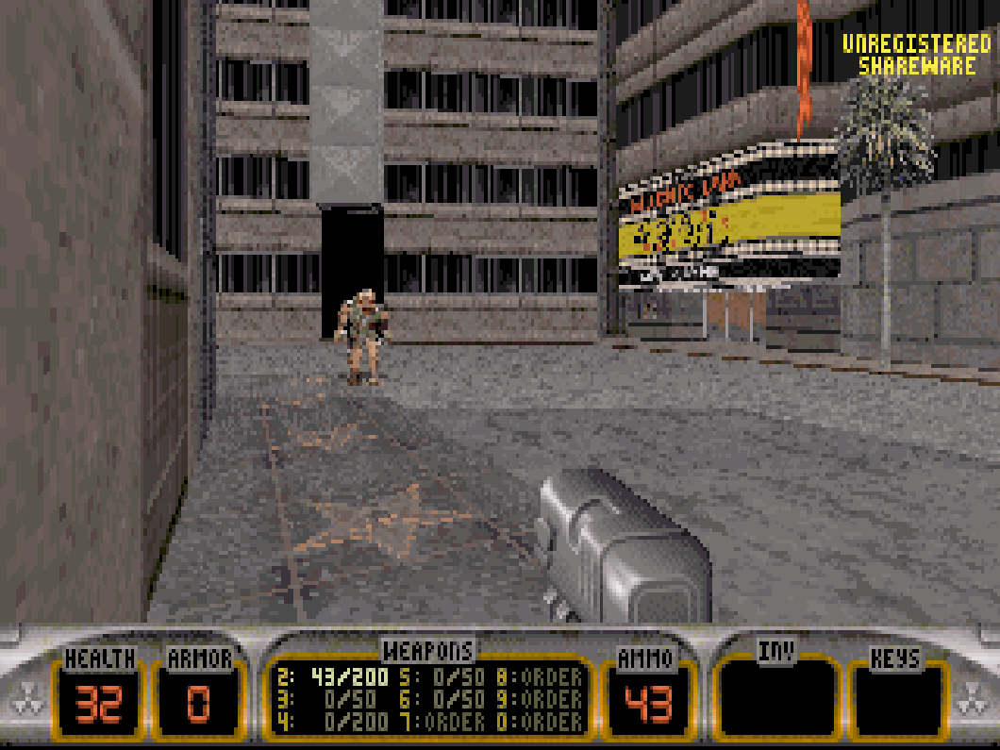
  <figcaption>Duke Nukem 3D (Shareware)</figcaption>
</figure>

## Controls

The keyboard/mouse controls, gamepad mappings, and touch controls are listed in the tables below.

### Keyboard and Mouse

The following table contains the standard keyboard mappings. The DOS application supports full keyboard and mouse functionality. Each game will have its own specific keyboard and mouse bindings.

| __Name__ | <div style="min-width:140px">__Keys__</div> | __Comments__ |
|--------------------------|---------------------------------------------| |
| Pause Screen | {: class="control"} +  {: class="control"} | Displays the webЯcade pause screen.  |
| Pause Screen | {: class="control"} +  {: class="control"} | Displays the webЯcade pause screen. |

### Gamepad

The following table contains the common gamepad mappings. The DOS application currently supports only a single connected gamepad, which can operate in two modes: standard gamepad mode, functioning like a joystick, and mouse emulation mode, where the gamepad emulates a mouse.

#### Controller Mode: *Gamepad*

In gamepad mode, the connected gamepad functions like a joystick, providing standard input controls for the game.

See the [Gamepad Controls Tab](#gamepad-controls-tab) in the [View Controls](#view-controls) section of the Pause screen to view how the gamepad is mapped to the current game.

| __Name__ | <div style="min-width:140px">__Gamepad__</div> | __Comments__ |
| --- | --- | --- |
| Switch to __Mouse Mode__  | {: class="control"} &nbsp;and&nbsp; {: class="control"} | Hold down the __Left Trigger__ and click (press down) on the __Right Thumbstick__ for several seconds until the message, "Switched to mouse mode" appears. |

#### Controller Mode: *Mouse Emulation*

In mouse emulation mode, the connected gamepad emulates the mouse, allowing for mouse-like input.

| __Name__ | <div style="min-width:140px">__Gamepad__</div> | __Comments__ |
| --- | --- | --- |
| Mouse | {: class="control"} | |
| Left Mouse  | {: class="control"}  | |
| Right Mouse  | {: class="control"}  | |
| Show Virtual Keyboard           | {: class="control"} &nbsp;and&nbsp; {: class="control"} | Hold down the __Left Trigger__ and click (press down) on the __Right Thumbstick__. |
| Switch to __Gamepad Mode__  | {: class="control"} &nbsp;and&nbsp; {: class="control"} | Hold down the __Left Trigger__ and click (press down) on the __Right Thumbstick__ for several seconds until the message, "Switched to gamepad mode" message appears. |

Standard webЯcade mappings to display the pause screen are listed below (regardless of controller mode).

| __Name__ | <div style="min-width:140px">__Gamepad__</div> | __Comments__ |
| --- | --- | --- |
| Show WebЯcade Pause Screen                    | {: class="control"} &nbsp;and&nbsp; {: class="control"} | Not available for Xbox and not recommended for iOS (see alternate 3 or 4)<br><br>Hold down the __Left Trigger__ and press the __Menu (Start) Button__. |
| Show WebЯcade Pause Screen<br>(Alternate)        | {: class="control"} &nbsp;and&nbsp; {: class="control"} | Not available for Xbox and not recommended for iOS (see alternate 3 or 4)<br><br>Hold down the __Left Trigger__ and press the __View (Back) Button__. |
| Show WebЯcade Pause Screen<br>(Alternate 2)        | {: class="control"} &nbsp;and&nbsp; {: class="control"} | Not available for Xbox and not recommended for iOS (see alternate 3 or 4)<br><br>Hold down the __X Button__ and press the __View (Back) Button__. |
| Show WebЯcade Pause Screen<br>(Alternate 3)        | {: class="control"} &nbsp;and&nbsp; {: class="control"} | Hold down the __Left Trigger__ and click (press down) on the __Left Thumbstick__. |

### Touch Controls

Touch input can be used to simulate mouse input in the game.

Dragging your finger behaves similarly to using a touchpad, where the mouse cursor moves relative to the movement of your finger.

| __Gesture__ | __Description__ |
| --- | --- |
| Short single finger tap | Left mouse button click |
| Short second finger tap while holding one finger | Right mouse button click |
| Single finger drag | Move pointer indirectly with finger |
| Two finger drag | <p>Move pointer while left mouse button is held down (drag and drop).</p><p>The pointer motion is affected by the first finger.</p><p>The drag is ended when the last finger is removed.</p> |
| Three finger drag | <p>Move pointer while right mouse button is held down (drag and drop).</p><p>The pointer motion is affected by the first finger.</p><p>The drag is ended when the last finger is removed.</p> |

## Packaging Games

DOS games must be packaged as an archive (`.zip`) file for use with webЯcade. This archive file can also be *(optionally)* converted to a webЯcade [package archive manifest](../../../advanced/archive-manifests.md) (`.json`) layout to reduce browser memory use and increase compatibility with memory limited devices (iOS and Xbox).

!!! important
    The  webЯcade editor's [repackage archive tool](../../../editor/tools/repackage-archive.md) can be used
    to automatically generate package archive manifests.

!!! important
    For DOS game archive (`.zip`) sizes that are over 100 megabytes in size, it is highly recommended that the webЯcade [package archive manifest](../../../advanced/archive-manifests.md) (`.json`) layout be utilized. This will greatly reduce the amount of memory necessary for the browser to load the game, and increase
    compatibility with devices with higher memory use limitations (iOS and Xbox).

## Adding Games (Feed Editor)

Due to the variability of packaging DOS games, adding DOS-based games in the [Feed Editor](../../../editor/index.md) must be done manually (versus using auto-detection).

See the [Adding Disc and Archive-based Items](../../../editor/workspace/addingitems.md#disc-and-archive-based-items) section for details on adding DOS-based games in the [Feed Editor](../../../editor/index.md).

!!! important
    Both the Safari (iOS and macOS) and Xbox Series X|S Edge browsers limit the amount of memory that can be consumed by a particular web application (such as webЯcade).
    <p>
    On macOS, it is recommended that the Chrome Browser be utilized to increase the size of DOS games that can be loaded.
    </p>
    <p>
    To increase the likelihood of loading larger DOS games on iOS and Xbox you can optionally choose to launch the game using a standalone-based link (versus launching the game within the webЯcade player or editor). See the [Standalone](../../../standalone/index.md) section of this documentation for further information (On Xbox, you would most likely want to bookmark the direct link. On iOS, you would most likely want to add the game to the home screen).
    </p>

## On-screen Controls

<figure>
  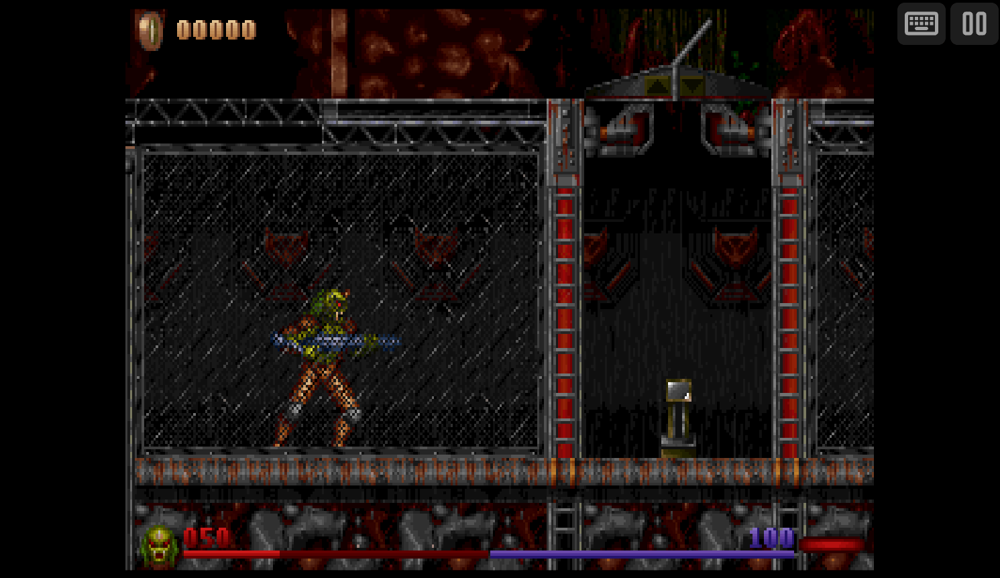
  <figcaption>On-screen Controls</figcaption>
</figure>

The DOS application includes a set of on-screen controls which are detailed below.

| __Button__ |  | __Description__ |
| --- | --- | --- |
| Virtual Keyboard |  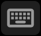  | Displays the [Virtual Keyboard](#virtual-keyboard). |
| Pause (Show Pause Screen) | 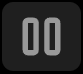  | Displays the webЯcade pause screen. |

## Virtual Keyboard

The DOS application includes a virtual keyboard that can be utilized on devices that don't have a physical keyboard readily available (mobile, Xbox, etc.).

Display of the virtual keyboard can be toggled via the "Virtual Keyboard" button within the [On-screen controls](#on-screen-controls).

### Special Keys

The virtual keyboard includes the following "special" keys.

| __Key__ |  | __Description__ |
| --- | --- | --- |
| Switch to Letters Mode |    | Pressing this key will switch to the [Letters Mode](#letters-mode) of the keyboard. |
| Switch to Numbers Mode |    | Pressing this key will switch to the [Numbers Mode](#numbers-mode) of the keyboard. |
| Switch to Symbols Mode |    | Pressing this key will switch to the [Symbols Mode](#symbols-mode) of the keyboard. |
| Change Keyboard Position |    | <p>Toggles between the various keyboard positions (center, bottom, etc.).</p><p>This key is available via the [Numbers Mode](#numbers-mode) of the keyboard.</p>  |

### Letters Mode

This mode primarily contains letters.

<figure>
  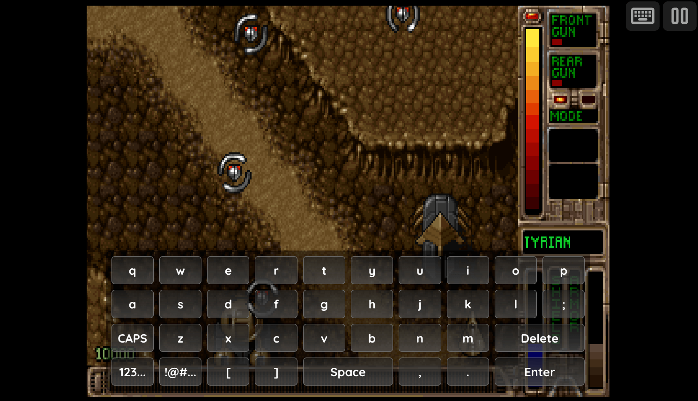
  <figcaption>Virtual Keyboard: Letters Mode</figcaption>
</figure>

### Numbers Mode

This mode primarily contains numbers, the `ESCAPE` key, and the ability to toggle holding down the `SHIFT` and `CONTROL` keys.

<figure>
  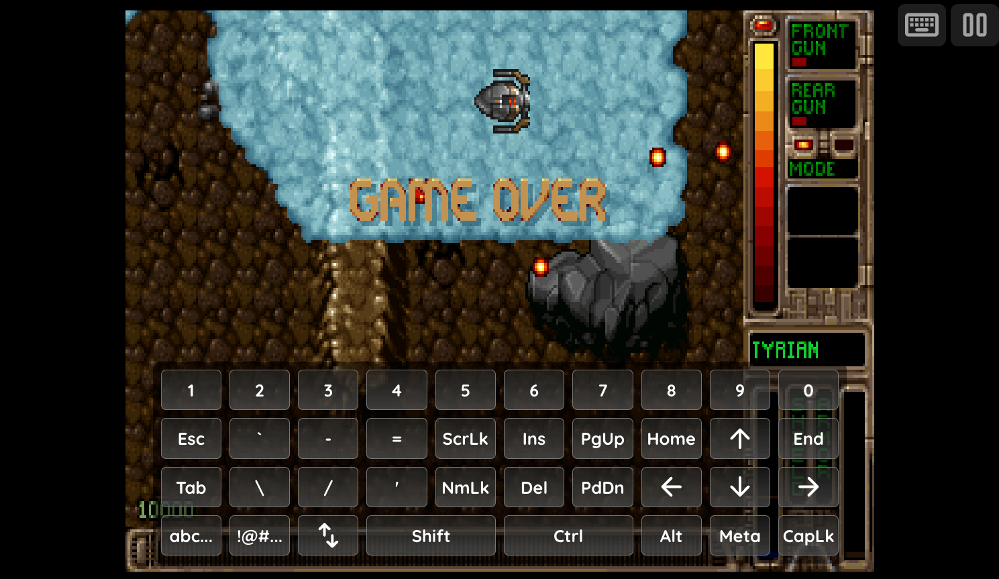
  <figcaption>Virtual Keyboard: Numbers Mode</figcaption>
</figure>

### Symbols Mode

This mode primarily contains symbols and `FUNCTION` keys.

<figure>
  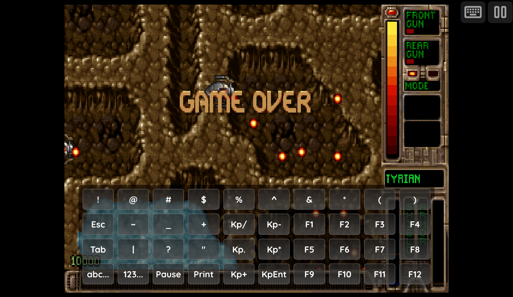
  <figcaption>Virtual Keyboard: Symbols Mode</figcaption>
</figure>

## Pause Screen

The DOS application's pause screen provides access to [DOS Application Settings](#dos-settings).

<figure>
  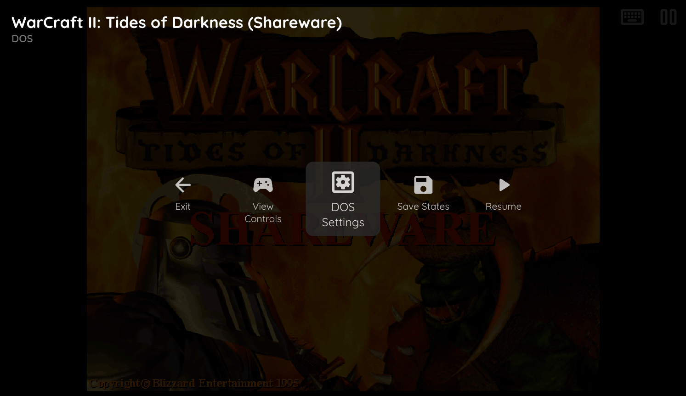
  <figcaption>Pause Screen</figcaption>
</figure>

### DOS Settings

The DOS application includes a custom settings dialog.

To access these settings, display the "Pause" screen and select the "DOS Settings" option (*See screenshot above*).

#### DOS Settings Tab

<figure>
  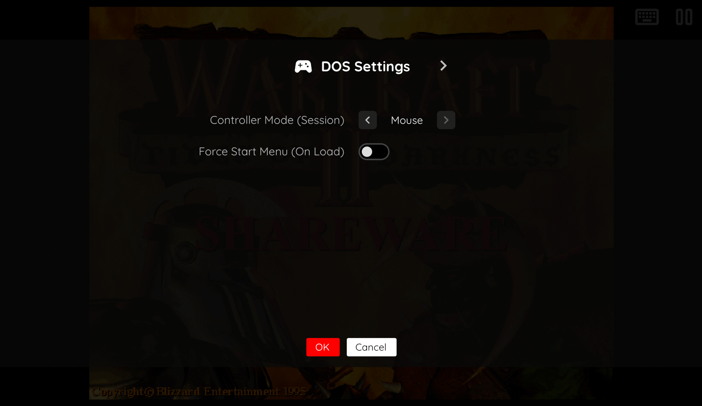
  <figcaption>DOS Settings</figcaption>
</figure>

The DOS Application's "settings" tab is detailed below.

| __Field__ | __Description__ |
| --- | --- |
| Controller Mode (Session) | Allows for selecting between [Gamepad](#controller-mode-gamepad) and [Mouse emulation](#controller-mode-mouse-emulation) controller modes. |
| Force Start Menu (On Load) | Enabling this option forces the [DOSBox Pure Start Menu](#dosbox-pure-start-menu) to always appear when launching a game, regardless of the auto-start settings or executables found for the game. |

#### Display Settings Tab

<figure>
  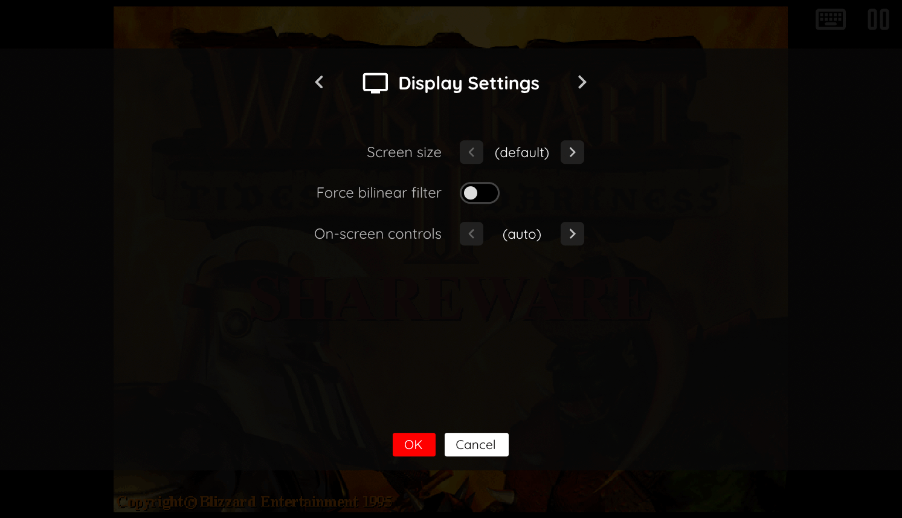
  <figcaption>Display Settings</figcaption>
</figure>

The DOS application's "Display Settings" tab is detailed below.

| __Field__ | __Description__ |
| --- | --- |
| Screen size | The screen size to use when playing a game.<br><br>Options include:<br><ul><li>`Native` : The application's native resolution</li><li>`16:9` : Widescreen resolution</li><li>`Fill` : Fill the entire contents of the screen</li></ul> |
| On-screen controls | Toggle whether the on-screen controls should always be displayed, or only displayed once touch input has been detected. |
| Show system pointer | <p>Whether to always show the browser's mouse pointer in addition to the game-specific pointer.</p><p>While this essentially displays two pointers (on top of each other), it prevents not being able to find the mouse pointer when a game is not actively displaying one (during cut scenes, various modes, etc.).</p> |

#### Virtual Keyboard Settings

<figure>
  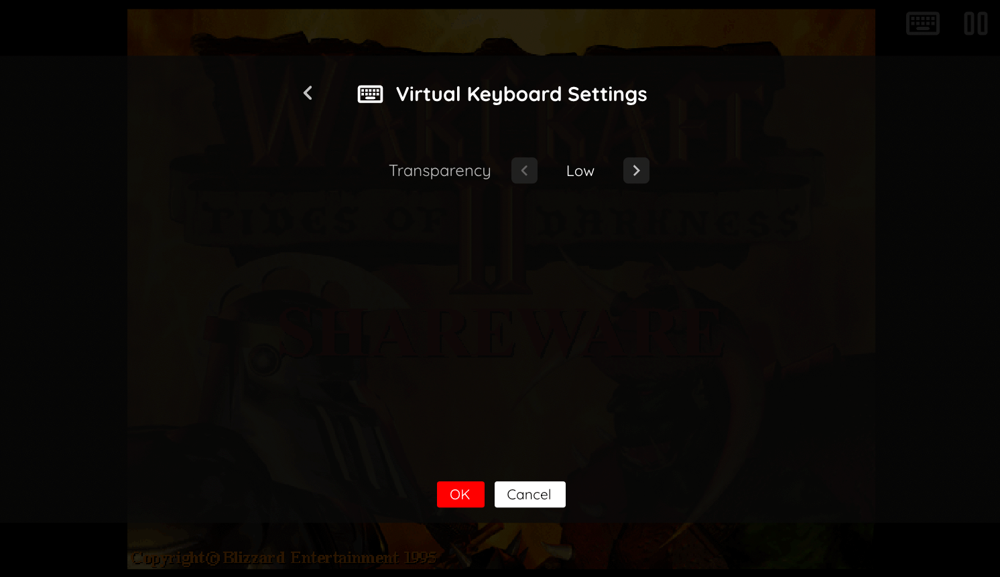
  <figcaption>Virtual Keyboard Settings</figcaption>
</figure>

The DOS application's "Virtual Keyboard Settings" tab is detailed below.

| __Field__ | __Description__ |
| --- | --- |
| Transparency | <p>Toggles the degree of transparency the virtual keyboard should have.</p><p>A higher degree of transparency allows more of the game to be visible through the keyboard (which may make the keyboard itself less visible).</p> |

### View Controls

The View Controls settings provide information about how controls are mapped for the current game. To access these settings, display the "Pause" screen and select the "View Controls" option.

#### Gamepad Controls Tab

<figure>
  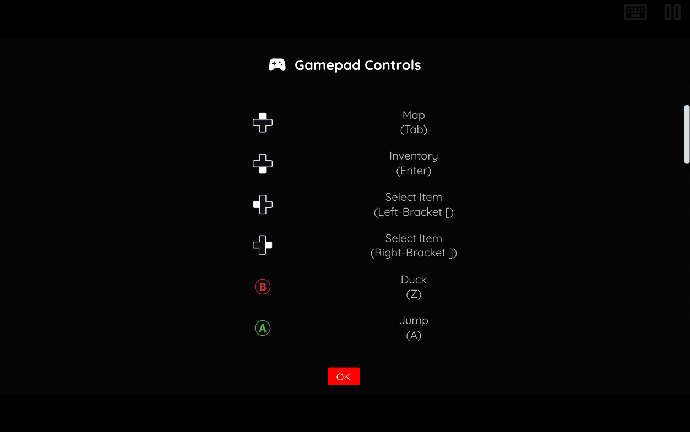
  <figcaption>Gamepad Controls</figcaption>
</figure>

The Gamepad Controls tab shows how the gamepad is mapped to the current game (*See screenshot above*).

### DOSBox Pure Start Menu

The DOSBox Pure Start Menu will appear when a game is launched without an `autoStartPath` set in the feed, no executable has been previously set to auto-start via this menu, or multiple executables are found.

This menu allows for selecting which executable to launch and provides the option to set that executable to auto-start for future sessions on the current device. Additionally, it allows for adjusting the mappings of keyboard and mouse input to the controller (gamepad).

<figure>
  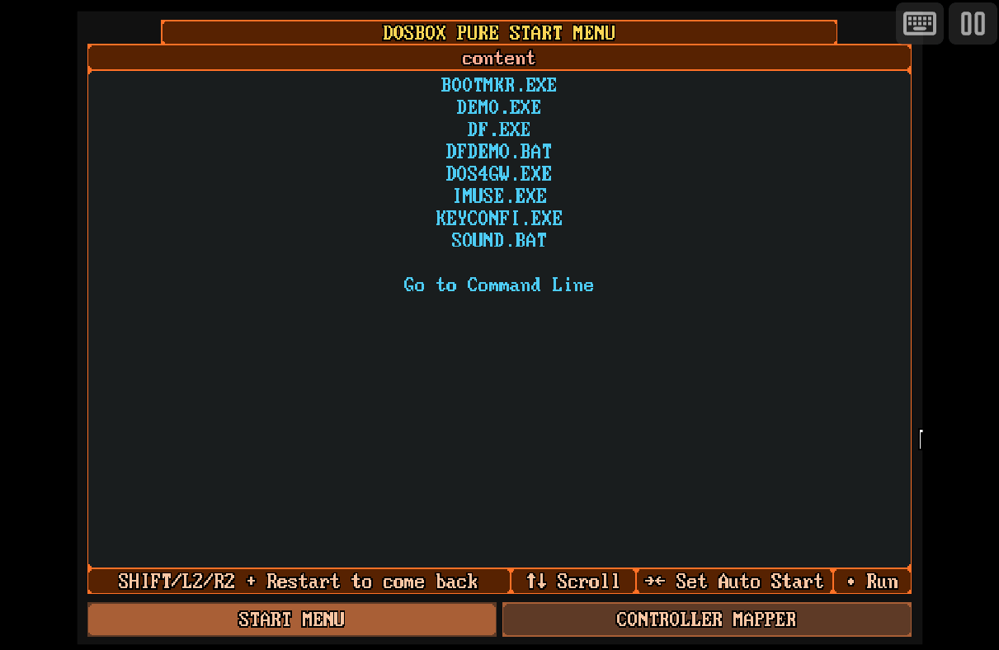
  <figcaption>DOSBox Pure Start Menu</figcaption>
</figure>

It is important to note that this menu will not appear if an executable has been specified to auto-start (either in the feed or previously via the menu), or if only a single executable is found for the game.

However, you can force this menu to always display by enabling the "Force Start Menu" option in the [DOS Settings](#dos-settings) portion of the webЯcade pause screen. If this option is enabled, the menu will always appear on any game that is launched, regardless of the auto-start settings, or executables found for the game.

## Saving Changes to Media

This application supports persisting changes to a game's media (hard disks, etc.) into the browser's local storage or optionally to [cloud-based storage](../../../storage/index.md).

## Feed

This section details how DOS application instances can be added to feeds.

### Type

The type name for the DOS application is `retro-dosbox-pure`.

!!! note
    The alias `dos` also currently maps to this application. In the future, the `dos` alias may be mapped
    to another DOS application (different engine implementation) if it is determined to be a
    more appropriate default.

### Properties

The table below contains the properties that are specific to the DOS application. These properties are
specified in the `props` object of a feed item.

| __Property__ | __Type__ | __Required__ | __Details__ |
|----------|------|----------|---------|
| uid | String | Yes | <p>A unique identifier for the particular game (must be unique across all DOS games).</p><p>This identifier is primarily used to associate persistent state with the game.</p>|
| archive | URL | Yes | URL to a DOS game archive (`.zip`) or webЯcade [package archive manifest](../../../advanced/archive-manifests.md) (`.json`) file. |
| autoStartPath | String | No | <p>A path to the binary to launch when the game starts.</p><p>Partial file names and paths are supported. For example, specifying `run.bat` would launch the first file it finds that matches, such as `first_run.bat`, `go_run.bat`, etc.</p><p>Using `autoStartPath` is equivalent to setting an "Auto Run" in the DOSBox Pure Start Menu when the game is first launched on a device. However, unlike the Start Menu option, this setting is part of the feed itself, ensuring the specified binary automatically launches on any device that uses the feed.</p>  |
| controllerMode | Numeric | No | Specifies the mode for the gamepad when the game is first launched (defaults to 0).<br><ul><li>`0` : Gamepad mode</li><li>`1` : Mouse Emulation mode</li></ul>  |
| mouseSpeed | Numeric | No | A numeric value ranging from `-5` to `5`, with `0` as the default. This controls the mouse speed for the current game. Positive values increase the mouse speed, while negative values slow it down. |
| zoomLevel | Numeric | No | A numeric value indicating how much the display image should be zoomed in (0-40). |

### Example

The following is an example of a complete feed that consists of a single DOS application instance (`type` value of `dos`). The `archive` property value is a URL that points to a Dropbox location that contains a webЯcade [package archive manifest](../../../advanced/archive-manifests.md) file for the game, "Tyrian 2000".

``` json hl_lines="9 12"

{
  "title": "DOS Feed",
  "categories": [
    {
      "title": "DOS Games",
      "items": [
        {
          "title": "Tyrian 2000",
          "type": "dos",
          "props": {
            "uid": "e3e4781c-9ac2-45ef-8a7d-1a9648799e09",
            "archive": "https://www.dropbox.com/scl/fi/yas4deya9t2y83y2t2fjr/tyrian2000.zip?rlkey=7gz61f8peuyrzdfqgc8u3d8tf&dl=0"
          }
        }
      ]
    }
  ]
}
```

This example can be tested by adding a feed with the following URL within the [webЯcade player](../../../userguide/index.md):

`http://tinyurl.com/sample-dos-feed`

## References

- [DOS Application GitHub Repository](https://github.com/webrcade/webrcade-app-retro-dosbox-pure)
