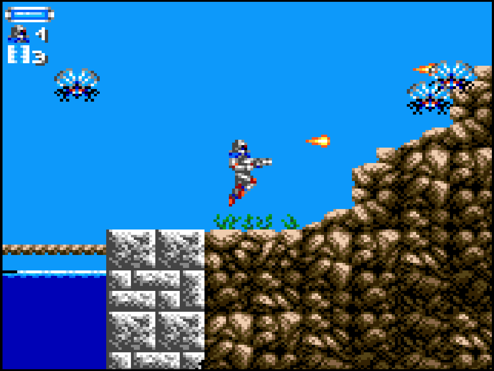

# Sega Game Gear

## Overview

The Sega Game Gear application is an emulator for the [Sega Game Gear handheld game console](https://en.wikipedia.org/wiki/Game_Gear).

<figure>
  
  <figcaption>Turrican (Demo) by Martin Konrad</figcaption>
</figure>


## Controls

The emulator supports one controller. The keyboard and gamepad mappings are listed in the tables below.

### Keyboard

Keyboard controls are listed below.

| __Name__ | <div style="min-width:140px">__Keys__</div> | __Comments__ |
|--------------------------|---------------------------------------------| |
| Move | {: class="control"} {: class="control"} {: class="control"} {: class="control"}  | |
| 1 | {: class="control"} | |
| 2 | {: class="control"} | |
| Start | {: class="control"} | |
| Show Pause Screen | {: class="control"} | |

### Gamepad

Gamepad mappings are listed below.

| __Name__ | <div style="min-width:140px">__Gamepad__</div> | __Comments__ |
| --- | --- | --- |
| Move                         | {: class="control"} &nbsp;or&nbsp; {: class="control"} | |
| 1                      | {: class="control"} | |
| 2                            | {: class="control"} | |
| Start                        | {: class="control"} | Not available for Xbox and not recommended for iOS (see alternate)<br><br>Press the __Menu (Start) Button__. |
| Start<br>(Alternate)            | {: class="control"} &nbsp;and&nbsp; {: class="control"} | Hold down the __Right Trigger__ and click (press down) on the __Right Thumbstick__. |
| Show Pause Screen                    | {: class="control"} &nbsp;and&nbsp; {: class="control"} | Not available for Xbox and not recommended for iOS (see alternate 3 or 4)<br><br>Hold down the __Left Trigger__ and press the __Menu (Start) Button__. |
| Show Pause Screen<br>(Alternate)        | {: class="control"} &nbsp;and&nbsp; {: class="control"} | Not available for Xbox and not recommended for iOS (see alternate 3 or 4)<br><br>Hold down the __Left Trigger__ and press the __View (Back) Button__. |
| Show Pause Screen<br>(Alternate 2)        | {: class="control"} &nbsp;and&nbsp; {: class="control"} | Not available for Xbox and not recommended for iOS (see alternate 3 or 4)<br><br>Hold down the __X Button__ and press the __View (Back) Button__. |
| Show Pause Screen<br>(Alternate 3)        | {: class="control"} &nbsp;and&nbsp; {: class="control"} | Hold down the __Left Trigger__ and click (press down) on the __Left Thumbstick__. |
| Show Pause Screen<br>(Alternate 4)        | {: class="control"} &nbsp;and&nbsp; {: class="control"} | Hold down the __Left Trigger__ and click (press down) on the __Right Thumbstick__. |

## Battery-backed SRAM

Some Game Gear cartridges include battery-backed SRAM as a means of preserving state between sessions. The Game Gear application supports persisting this SRAM state into the browser's local storage or optionally to [cloud-based storage](../../../storage/index.md). The SRAM contents will be persisted to storage whenever the pause screen is displayed (or the game is exited). Therefore, the menu should be displayed periodically for games that support battery-backed SRAM to ensure the state is properly persisted.

## Feed

This section details how Game Gear application instances can be added to feeds.

### Types

Two Sega Game Gear application types are available, each offering different trade-offs in compatibility, features, and system resource requirements. *Libretro Genesis Plus GX* is the default (⭐) and is mapped to the `gg` alias. The default can be overridden globally in [Settings](../../../userguide/settings.md) > *Applications*, or on a per-item basis in the [Feed Editor](../../../editor/index.md).

| __Name__ | __Type__ | __Filters__ | __Cheats__ | __Low CPU__ |
| --- | --- | --- | --- | --- |
| Libretro Genesis Plus GX ⭐ | `retro-genplusgx-gg` | ✅ | ✅ | |
| Genesis Plus GX | `genplusgx-gg` | | | ✅ |

### Properties

The table below contains the properties that are specific to the Game Gear application. These properties are
specified in the `props` object of a feed item.

| __Property__ | __Type__ | __Required__ | __Details__ |
|----------|------|----------|---------|
| cheat | URL | No | URL to a cheat file for the current ROM. See the [Cheats Tab](../../../editor/dialogs/item-dialog.md#cheats-tab) in the Item Editor for details on assigning cheat files.<br><br>*(Libretro Genesis Plus GX only)* |
| rom | URL | Yes | URL to a Game Gear ROM file or a zip file containing a ROM file. |
| zoomLevel | Numeric | No | A numeric value indicating how much the display image should be zoomed in (0-40).<br><br>This property is typically used to hide the black borders that are present on some games. |

### Example

The following is an example of a complete feed that consists of a single Game Gear application instance (`type` value of `gg`). The `rom` property value is a URL that points to a Dropbox location that contains the excellent homebrew game Wing Warriors by Fran Matsusaka.

``` json hl_lines="11 13"
{
  "title": "Game Gear Feed",
  "longTitle": "Sega Game Gear Example Feed",
  "categories": [
    {
      "title": "Game Gear Games",
      "longTitle": "Sega Game Gear Games",
      "items": [
        {
          "title": "Wing Warriors",
          "type": "gg",
          "props": {
            "rom": "https://dl.dropboxusercontent.com/s/uy4teaun7bno0jn/WingWarriors.gg"
          }
        }
      ]
    }
  ]
}
```

This example can be tested by adding a feed with the following URL within the[webЯcade player](../../../userguide/index.md):

`https://tinyurl.com/sample-gg-feed`

## References

- [Sega Game Gear (Libretro Genesis Plus GX) GitHub Repository](https://github.com/webrcade/webrcade-app-retro-genplusgx)
- [Sega Game Gear (Genesis Plus GX) GitHub Repository](https://github.com/webrcade/webrcade-app-genplusgx)
