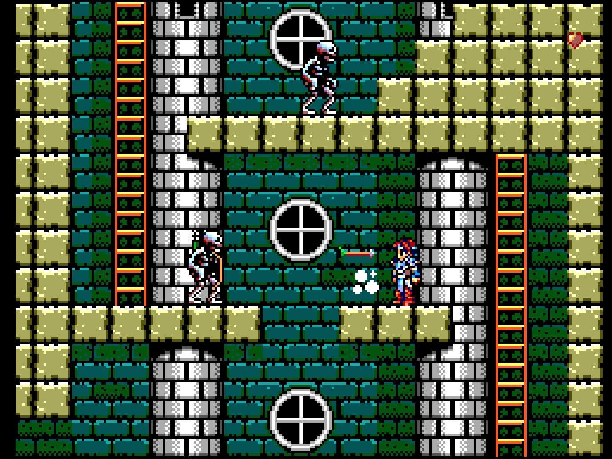

# Sega Master System

## Overview

The Sega Master System application is an emulator for the [Sega Master System game console](https://en.wikipedia.org/wiki/Master_System). 

<figure>
  
  <figcaption>Silver Valley by Enrique Ruiz</figcaption>
</figure>

## Controls

The emulator supports up to two controllers. The keyboard and gamepad mappings are listed in the tables below.

### Keyboard

Keyboard support is only available for controller one.

| __Name__ | <div style="min-width:140px">__Keys__</div> | __Comments__ |
|--------------------------|---------------------------------------------| |
| Move | {: class="control"} {: class="control"} {: class="control"} {: class="control"}  | |                  
| 1/Start | {: class="control"} | |                  
| 2 | {: class="control"} | |                  
| Pause | {: class="control"} | |                  
| Show Pause Screen | {: class="control"} | |                  

### Gamepad

Gamepad support is available for both controllers.

| __Name__ | <div style="min-width:140px">__Gamepad__</div> | __Comments__ |
| --- | --- | --- |
| Move                         | {: class="control"} &nbsp;or&nbsp; {: class="control"} | |
| 1/Start                      | {: class="control"} | |
| 2                            | {: class="control"} | |
| Pause                        | {: class="control"} | Not available for Xbox and not recommended for iOS (see alternate)<br><br>Press the __Menu (Start) Button__. |
| Pause<br>(Alternate)            | {: class="control"} &nbsp;and&nbsp; {: class="control"} | Hold down the __Right Trigger__ and click (press down) on the __Right Thumbstick__. |
| Show Pause Screen                    | {: class="control"} &nbsp;and&nbsp; {: class="control"} | Not available for Xbox and not recommended for iOS (see alternate 3 or 4)<br><br>Hold down the __Left Trigger__ and press the __Menu (Start) Button__. |
| Show Pause Screen<br>(Alternate)        | {: class="control"} &nbsp;and&nbsp; {: class="control"} | Not available for Xbox and not recommended for iOS (see alternate 3 or 4)<br><br>Hold down the __Left Trigger__ and press the __View (Back) Button__. |
| Show Pause Screen<br>(Alternate 2)        | {: class="control"} &nbsp;and&nbsp; {: class="control"} | Not available for Xbox and not recommended for iOS (see alternate 3 or 4)<br><br>Hold down the __X Button__ and press the __View (Back) Button__. |
| Show Pause Screen<br>(Alternate 3)        | {: class="control"} &nbsp;and&nbsp; {: class="control"} | Hold down the __Left Trigger__ and click (press down) on the __Left Thumbstick__. |
| Show Pause Screen<br>(Alternate 4)        | {: class="control"} &nbsp;and&nbsp; {: class="control"} | Hold down the __Left Trigger__ and click (press down) on the __Right Thumbstick__. |

## Battery-backed SRAM

Some Master System cartridges include battery-backed SRAM as a means of preserving state between sessions. The Master System application supports persisting this SRAM state into the browser's local storage. The SRAM contents will be persisted to local storage whenever the pause screen is displayed (or the game is existed). Therefore, the menu should be displayed periodically for games that support battery-backed SRAM to ensure the state is properly persisted.

## Feed 

This section details how Master System application instances can be added to feeds.

### Type

The type name for the Master System application is `genplusgx-sms`. 

!!! note
    The alias `sms` also currently maps to this application. In the future, the `sms` alias may be mapped
    to another Sega Master System application (different emulator implementation) if it is determined to be a 
    more appropriate default.

### Properties

The table below contains the properties that are specific to the Master System application. These properties are
specified in the `props` object of a feed item. 

| __Property__ | __Type__ | __Required__ | __Details__ |
|----------|------|----------|---------|
| pal | Boolean | No | Whether to force PAL video mode for the specified ROM. |
| rom | URL | Yes | URL to a Master System ROM file or a zip file containing a ROM file. |
| sms2 | Boolean | No | Whether to emulate the Sega Master System II console. The Master System II contains the 315-5246 VDP which supports the extra-height 224 and 240-line modes. |
| ym2413 | Boolean | No | Whether to emulator the YM2413 FM sound generator produced by Yamaha. The YM2413 was an add-on for the Sega Mark III and is built into the Japanese Sega Master System. |

### Example

The following is an example of a complete feed that consists of a single Master System application instance (`type` value of `sms`). The `rom` property value is a URL that points to a Dropbox location that contains the excellent homebrew game DARC by Richard Cornelisse and John Hassink (Music). It is also important to note that the `ym2413` value has also been set to `true` to enable Yamaha-based FM music support (this particular game requires YM2413 support for its music).

``` json hl_lines="11 13 14"
{
  "title": "Master System Feed",
  "longTitle": "Sega Master System Example Feed",
  "categories": [
    {
      "title": "Master System Games",
      "longTitle": "Sega Master System Games",
      "items": [
        {
          "title": "DARC",
          "type": "sms",
          "props": {
            "ym2413": true,
            "rom": "https://dl.dropboxusercontent.com/s/mjp3odan08deqp2/DARC.sms"
          }
        }
      ]
    }
  ]
}
```

This example can be tested by adding a feed with the following URL within the [webЯcade player](../../../userguide/index.md):

`https://tinyurl.com/sample-sms-feed`

## References

- [Sega Master System Application GitHub Repository](https://github.com/webrcade/webrcade-app-genplusgx)
