# Nintendo DS

## Overview

The Nintendo DS application is an emulator for the [Nintendo DS](https://en.wikipedia.org/wiki/Nintendo_DS) handheld game console.

<figure>
  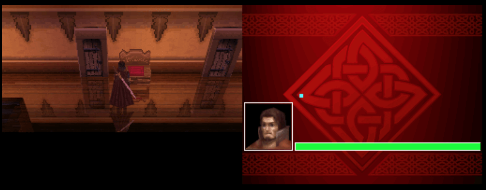
  <figcaption>WolveSlayer by Firehazard Studio</figcaption>
</figure>

!!! important
    A Nintendo DS ROM can be specified using a direct URL to a ROM file or a ZIP file containing one; however,
    using a ZIP file—especially for larger games (200MB or more)—can significantly increase memory usage in the
    browser, so direct ROM links are recommended for memory-constrained devices such as the Xbox Series X|S.

## BIOS Files (Optional)

In addition to Nintendo DS ROM files, optional BIOS and firmware files can be specified globally within the feed (See the [Feed Properties Dialog](../../../editor/dialogs/feed-dialog.md#properties-tab) and [Nintendo DS Feed Properties](#feed-properties) sections).

Adding these files can improve game compatibility, accuracy, and boot behavior—particularly for titles that rely on specific hardware initialization or firmware routines. While not strictly required for most games, they are recommended for the best experience.

| __File__ | __Hash (MD5)__ |
| --- | --- |
| `bios7.bin` | df692a80a5b1bc90728bc3dfc76cd948 |
| `bios9.bin` | a392174eb3e572fed6447e956bde4b25 |
| `firmware.bin` | 3c704824663ce26b6a1ed4d85238ae5b |
| `firmware.bin` (Alternate) | 94bc5094607c5e6598d50472c52f27f2 |

## Controls

The keyboard and mouse, gamepad mappings, and touch controls are listed in the tables below.

### Keyboard

Keyboard controls are listed below.

| __Name__ | <div style="min-width:140px">__Keys__</div> | __Comments__ |
|--------------------------|---------------------------------------------| |
| Move | 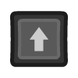{: class="control"} 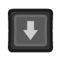{: class="control"} 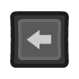{: class="control"} 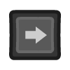{: class="control"}  | |
| A | 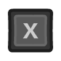{: class="control"} | |
| B | 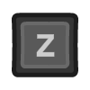{: class="control"} | |
| X | 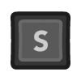{: class="control"} | |
| Y | 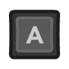{: class="control"} | |
| Left Shoulder | {: class="control"} | |
| Right Shoulder | {: class="control"} | |
| Start | {: class="control"} | |
| Select | 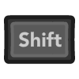{: class="control"} | The __Right Shift Key__.|
| Microphone (Blow) | 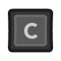{: class="control"} |  Simulates blowing on the microphone while the key is held down.  |
| Pause Screen | 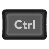{: class="control"} +  {: class="control"} | Displays the webЯcade pause screen.  |
| Pause Screen | {: class="control"} +  {: class="control"} | Displays the webЯcade pause screen. |

### Mouse

The Nintendo DS application supports mouse input that works like the original stylus. Pressing and holding the left mouse button on the Nintendo DS screen that supports touch behaves like holding the stylus down on a real DS. Moving the mouse while holding the button moves the stylus across the screen. Releasing the button ends the touch input.

### Gamepad

Gamepad mappings are listed below.

| __Name__ | <div style="min-width:140px">__Gamepad__</div> | __Comments__ |
| --- | --- | --- |
| Move                         | 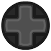{: class="control"} &nbsp;or&nbsp; 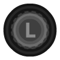{: class="control"} | |
| A                       | {: class="control"} | |
| B                       | {: class="control"}  | |
| X                       | {: class="control"} | |
| Y                       | {: class="control"}  | |
| Left Shoulder           | 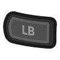{: class="control"} | |
| Right Shoulder          | 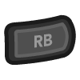{: class="control"}  | |
| Stylus (Move)            | {: class="control"} | |
| Stylus (Touch)            | 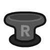{: class="control"} | |
| Stylus (Touch)            | {: class="control"} | |
| Stylus (Center)            | 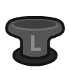{: class="control"} | |
| Microphone (Blow)            | 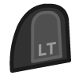{: class="control"} |  Simulates blowing on the microphone while the button is held down. |
| Toggle Screens            | {: class="control"} &nbsp;and&nbsp; {: class="control"} | |
| Start                        | {: class="control"} | Not available for Xbox and not recommended for iOS (see alternate)<br><br>Press the __Menu (Start) Button__. |
| Start<br>(Alternate)            | {: class="control"} &nbsp;and&nbsp; {: class="control"} | Hold down the __Right Trigger__ and click (press down) on the __Right Thumbstick__. |
| Select                       | {: class="control"}  | Not available for Xbox and not recommended for iOS (see alternate)<br><br>Press the __View (Back) Button__. |
| Select<br>(Alternate)           | {: class="control"} &nbsp;and&nbsp; {: class="control"} | Hold down the __Right Trigger__ and click (press down) on the __Left Thumbstick__. |
| Show Pause Screen        | {: class="control"} &nbsp;and&nbsp; {: class="control"} | Not available for Xbox and not recommended for iOS (see alternate 2 or 3)<br><br>Hold down the __X Button__ and press the __View (Back) Button__. |
| Show Pause Screen<br>(Alternate 2)        | {: class="control"} &nbsp;and&nbsp; {: class="control"} | Hold down the __Left Trigger__ and click (press down) on the __Left Thumbstick__. |
| Show Pause Screen<br>(Alternate 3)        | {: class="control"} &nbsp;and&nbsp; {: class="control"} | Hold down the __Left Trigger__ and click (press down) on the __Right Thumbstick__. |

### Touch

The Nintendo DS application supports touch input that works like the original stylus. When you press and hold your finger on the Nintendo DS screen that supports touch, it behaves like holding the stylus down on a real DS. Moving your finger while keeping it pressed moves the stylus across the screen.

## On-screen Controls

<figure>
  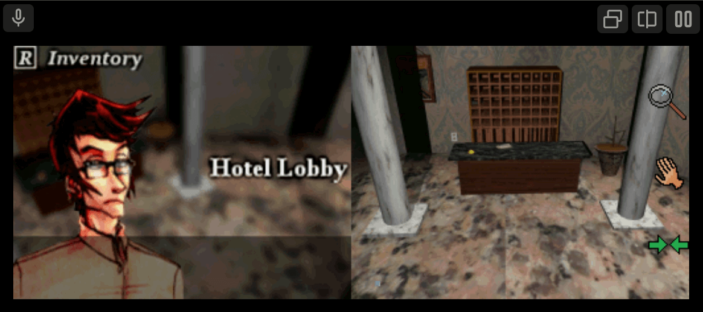
  <figcaption>On-screen Controls</figcaption>
</figure>

The Nintendo DS application includes a set of on-screen controls which are detailed below.

| __Button__ |  | __Description__ |
| --- | --- | --- |
| Swap Single Screens  | 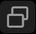  | Swaps between the top and bottom DS screens (only one screen is displayed).  |
| Swap Dual Screen Orientations | 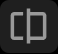  |  Cycles through the available dual-screen layout configurations. |
| Microphone (Blow) | 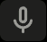  | Simulates blowing on the microphone while the button is held down. |
| Pause (Show Pause Screen) | 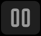  | Displays the webЯcade pause screen. |

## Pause Screen

The Nintendo DS Application includes a custom settings dialog.

To access these settings, display the "Pause" screen and select the "DS Settings" option (*See screenshot above*).

<figure>
  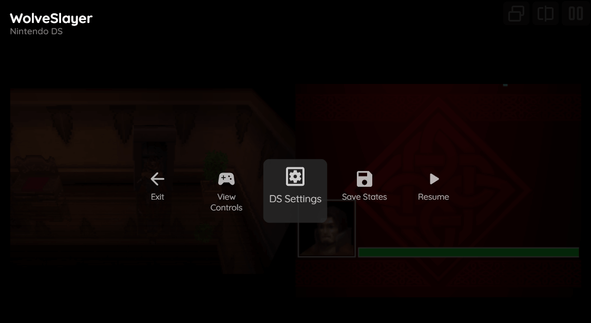
  <figcaption>Pause Screen</figcaption>
</figure>

### DS Settings Tab (Session Only)

The Nintendo DS Application's "settings" tab is detailed below. It is important to note that the settings on this tab are *Session only* meaning they will not persist between gaming sessions.

<figure>
  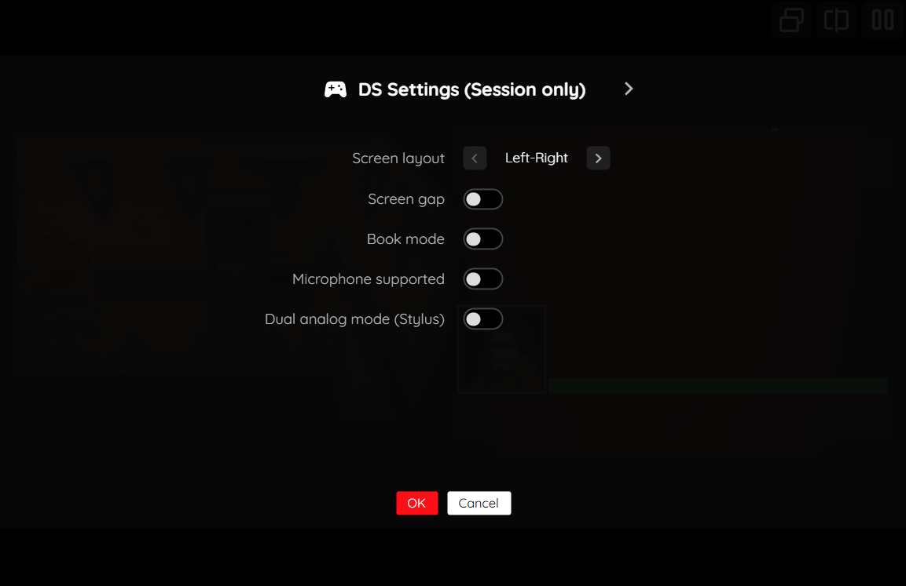
  <figcaption>DS Settings</figcaption>
</figure>

| __Field__ | __Description__ |
| --- | --- |
| Screen layout | The layout of the Nintendo DS screens.<br><ul><li>`left-right` : Horizontal layout (touch screen on right)</li><li>`right-left` : Horizontal layout (touch screen on left)</li><li>`top-bottom` : Vertical layout (touch screen on bottom)</li><li>`bottom-top` : Vertical layout (touch screen on top)</li><li>`top-only` : Only display the top screen (non-touch)</li><li>`bottom-only` : Only display the bottom screen (touch)</li></ul> |
| Screen gap | Whether to display a gap between the screens (only applicable to vertical layouts and book mode). |
| Book mode | Whether to display the screens as if the entire DS is rotated sideways, typically used for "book"-based games. |
| Microphone supported | Whether the game uses the microphone. Displays a microphone icon for touch or mouse interaction. |
| Dual analog mode (stylus) | Whether the game uses the stylus as a dual analog control. When this is enabled, the right analog stick of the gamepad will automatically reset as it reaches the end of the screen. This greatly simplifies playing dual-analog based games (typically FPS games). |

## Battery-backed SRAM

Some Nintendo DS cartridges include battery-backed SRAM as a means of preserving state between sessions. The Nintendo DS application supports persisting this SRAM state into the browser's local storage or optionally to [cloud-based storage](../../../storage/index.md). The SRAM contents will be persisted to storage whenever the pause screen is displayed (or the game is exited). Therefore, the menu should be displayed periodically for games that support battery-backed SRAM to ensure the state is properly persisted.

## Feed

This section details how Nintendo DS application instances can be added to feeds.

### Type

The type name for the Nintendo DS application is `retro-melonds`.

!!! note
    The alias `nds` also currently maps to this application. In the future, the `nds` alias may be mapped
    to another Nintendo DS (different emulator implementation) if it is determined to be a
    more appropriate default.

### Feed Properties

The table below contains global Nintendo DS feed properties. These properties must be specified in the `props` object of the feed's [Feed Object](../../../feeds/format.md#feed-object).

| __Property__ | __Type__ | __Required__ | __Details__ |
|----------|------|----------|---------|
| ds_bios |  Array of URLs | No | (optional) <p>An array of URLs to Nintendo DS BIOS files (see [BIOS Files](#bios-files-optional)).</p> |
| ds_nickname | String | No | (optional) An optional nickname (the default name) to use when games require a name to be entered. This is only applicable if Nintendo DS BIOS files have been specified. |

### Item Properties

The table below contains the properties that are specific to the Nintendo DS application. These properties are
specified in the `props` object of a feed item.

| __Property__ | __Type__ | __Required__ | __Details__ |
|----------|------|----------|---------|
| rom | URL | Yes | URL to a Nintendo DS ROM file, or a ZIP file containing one. |
| screenLayout | String | No | Initial layout of the Nintendo DS screens. This can be changed after the game starts.<br><ul><li>`left-right` : Horizontal layout (touch screen on right)</li><li>`right-left` : Horizontal layout (touch screen on left)</li><li>`top-bottom` : Vertical layout (touch screen on bottom)</li><li>`bottom-top` : Vertical layout (touch screen on top)</li><li>`top-only` : Only display the top screen (non-touch)</li><li>`bottom-only` : Only display the bottom screen (touch)</li></ul> |
| screenGap | Boolean | No | Whether to display a gap between the screens (only applicable to vertical layouts and book mode). |
| bookMode | Boolean | No | Whether to display the screens as if the entire DS is rotated sideways, typically used for "book"-based games. |
| dualAnalog | Boolean | No | Whether the game uses the stylus as a dual analog control. When this is enabled, the right analog stick of the gamepad will automatically reset as it reaches the end of the screen. This greatly simplifies playing dual-analog based games (typically FPS games). |
| microphone | Boolean | No | Indicates whether the game uses the microphone. Displays a microphone icon for touch or mouse interaction. |
| zoomLevel | Numeric | No | A numeric value indicating how much the display image should be zoomed in (0-40). |

### Example

The following is an example of a complete feed that consists of a single Nintendo DS application instance (`type` value of `nds`). The `rom` property value is a URL that points to a Dropbox location that contains the excellent game WolveSlayer by Firehazard Studio.

``` json hl_lines="9 11"
{
  "title": "Nintendo DS",
  "categories": [
    {
      "title": "Nintendo DS Games",
      "items": [
        {
          "title": "WolveSlayer",
          "type": "nds",
          "props": {
            "rom": "https://dl.dropbox.com/scl/fi/stazkmx80wk4p8ixge5lq/wolveslayer.nds?rlkey=bp3phtt51znjvz4a66jx6s4h7&dl=1"
          }
        }
      ]
    }
  ]
}
```

## References

- [Nintendo DS Application GitHub Repository](https://github.com/webrcade/webrcade-app-retro-melonds)
