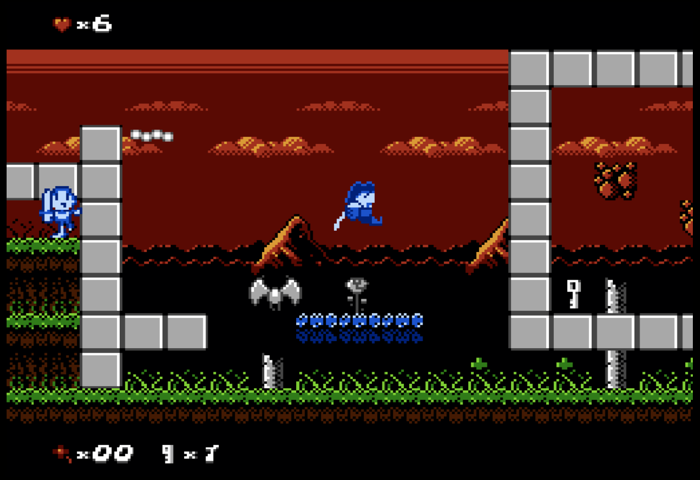
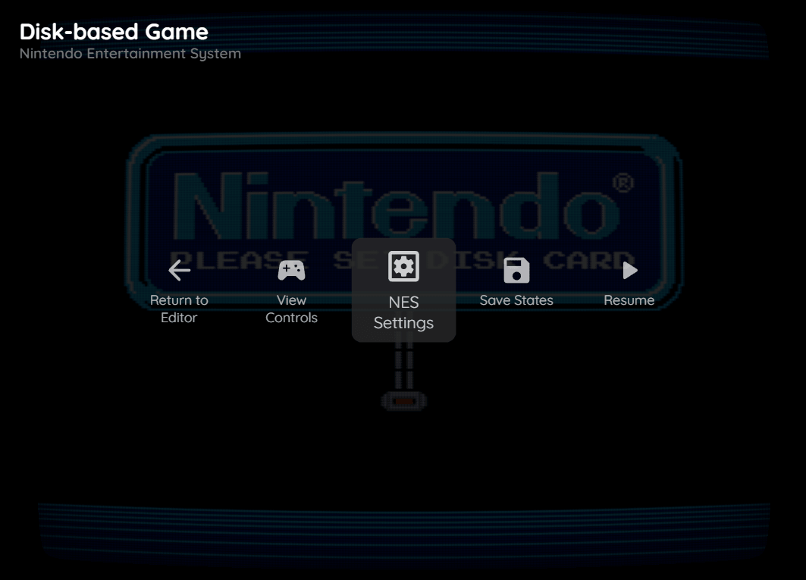
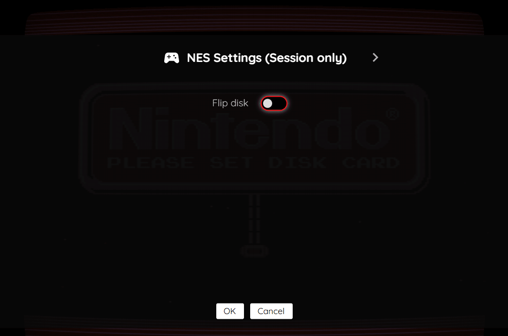
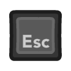

# Nintendo Entertainment System (NES)

## Overview

The Nintendo Entertainment System (NES) application is an emulator for the [Nintendo Entertainment System game console](https://en.wikipedia.org/wiki/Nintendo_Entertainment_System).

<figure>
  
  <figcaption>Sir Ababol by The Mojon Twins</figcaption>
</figure>

## BIOS Files

The NES application supports the [Famicom Disk System (FDS)](https://en.wikipedia.org/wiki/Famicom_Disk_System). To play FDS games, an optional *FDS BIOS file* can be specified globally within the feed (See the [Feed Properties Dialog](../../../editor/dialogs/feed-dialog.md#properties-tab) and [NES Feed Properties](#feed-properties) sections). 

| __File__ | __Hash (MD5)__ | __Description__ |
| --- | --- | --- |
| `disksys.rom` | ca30b50f880eb660a320674ed365ef7a | Famicom Disk System BIOS |

## Settings

The NES Application includes a custom settings dialog.

{: class="center zoomD"}

To access these settings, display the "Pause" screen and select the "NES Settings" option (*See screenshot above*).

{: class="center zoomD"}

### NES Settings Tab (Session Only)

The NES Application's "settings" tab is detailed below. It is important to note that the settings on this tab are *Session only* meaning they will not persist between gaming sessions.

| __Field__ | __Description__ |
| --- | --- |
| Flip disk | Flips the currently inserted FDS disk. This is used for FDS games that require flipping the disk to access content on the other side. |

## Controls

The emulator supports up to two controllers. The keyboard and gamepad mappings are listed in the tables below.

### Keyboard

Keyboard support is only available for controller one.

| __Name__ | <div style="min-width:140px">__Keys__</div> | __Comments__ |
|--------------------------|---------------------------------------------| |
| Move | {: class="control"} {: class="control"} {: class="control"} {: class="control"}  | |
| A | {: class="control"} or {: class="control"} | |
| B | {: class="control"} or {: class="control"} | |
| Start | {: class="control"} | |
| Select | {: class="control"} | The __Right Shift Key__.|
| Show Pause Screen | {: class="control"} | |

### Gamepad

Gamepad support is available for both controllers.

| __Name__ | <div style="min-width:140px">__Gamepad__</div> | __Comments__ |
| --- | --- | --- |
| Move                         | {: class="control"} &nbsp;or&nbsp; {: class="control"} | |
| A                       | {: class="control"} or {: class="control"} | |
| B                       | {: class="control"} or {: class="control"} | |
| Start                        | {: class="control"} | Not available for Xbox and not recommended for iOS (see alternate)<br><br>Press the __Menu (Start) Button__. |
| Start<br>(Alternate)            | {: class="control"} &nbsp;and&nbsp; {: class="control"} | Hold down the __Right Trigger__ and click (press down) on the __Right Thumbstick__. |
| Select                       | {: class="control"}  | Not available for Xbox and not recommended for iOS (see alternate)<br><br>Press the __View (Back) Button__. |
| Select<br>(Alternate)           | {: class="control"} &nbsp;and&nbsp; {: class="control"} | Hold down the __Right Trigger__ and click (press down) on the __Left Thumbstick__. |
| Show Pause Screen                    | {: class="control"} &nbsp;and&nbsp; {: class="control"} | Not available for Xbox and not recommended for iOS (see alternate 3 or 4)<br><br>Hold down the __Left Trigger__ and press the __Menu (Start) Button__. |
| Show Pause Screen<br>(Alternate)        | {: class="control"} &nbsp;and&nbsp; {: class="control"} | Not available for Xbox and not recommended for iOS (see alternate 3 or 4)<br><br>Hold down the __Left Trigger__ and press the __View (Back) Button__. |
| Show Pause Screen<br>(Alternate 2)        | {: class="control"} &nbsp;and&nbsp; {: class="control"} | Not available for Xbox and not recommended for iOS (see alternate 3 or 4)<br><br>Hold down the __X Button__ and press the __View (Back) Button__. |
| Show Pause Screen<br>(Alternate 3)        | {: class="control"} &nbsp;and&nbsp; {: class="control"} | Hold down the __Left Trigger__ and click (press down) on the __Left Thumbstick__. |
| Show Pause Screen<br>(Alternate 4)        | {: class="control"} &nbsp;and&nbsp; {: class="control"} | Hold down the __Left Trigger__ and click (press down) on the __Right Thumbstick__. |

## Battery-backed SRAM

Some NES cartridges include battery-backed SRAM as a means of preserving state between sessions. The NES application supports persisting this SRAM state into the browser's local storage or optionally to [cloud-based storage](../../../storage/index.md). The SRAM contents will be persisted to storage whenever the pause screen is displayed (or the game is exited). Therefore, the menu should be displayed periodically for games that support battery-backed SRAM to ensure the state is properly persisted.

## Feed

This section details how NES application instances can be added to feeds.

### Type

The type name for the NES application is `retro-fceumm`.

!!! note
    The alias `nes` also currently maps to this application. In the future, the `nes` alias may be mapped
    to another NES application (different emulator implementation) if it is determined to be a
    more appropriate default.

### Feed Properties

The table below contains global NES feed properties. These properties must be specified in the `props` object of the feed's [Feed Object](../../../feeds/format.md#feed-object).

| __Property__ | __Type__ | __Required__ | __Details__ |
|----------|------|----------|---------|
| fds_bios | URL | No | <p>An optional URL to the Famicom Disk System BIOS file (`disksys.rom`).</p><p>This is only required for playing FDS games.</p> |

### Item Properties

The table below contains the properties that are specific to the NES application. These properties are
specified in the `props` object of a feed item.

| __Property__ | __Type__ | __Required__ | __Details__ |
|----------|------|----------|---------|
| pal | Boolean | No | Whether to force PAL video mode for the specified ROM. |
| rom | URL | Yes | URL to an NES or FDS ROM file (`.nes`, `.fds`) or a zip file containing a ROM file. |
| zoomLevel | Numeric | No | A numeric value indicating how much the display image should be zoomed in (0-40).<br><br>This property is typically used to hide the black borders that are present on some games. |

### Example

The following is an example of a complete feed that consists of a single NES application instance (`type` value of `nes`). The `rom` property value is a URL that points to a Dropbox location that contains the excellent homebrew game Blade Buster by Japanese doujin group High Level Challenge.

``` json hl_lines="11 13"
{
  "title": "NES Feed",
  "longTitle": "Nintendo Entertainment System Example Feed",
  "categories": [
    {
      "title": "NES Games",
      "longTitle": "Nintendo Entertainment System Games",
      "items": [
        {
          "title": "Blade Buster",
          "type": "nes",
          "props": {
            "rom": "https://dl.dropboxusercontent.com/s/qylh6jezs1qzz6u/BladeBuster.nes"
          }
        }
      ]
    }
  ]
}
```

This example can be tested by adding a feed with the following URL within the [webЯcade player](../../../userguide/index.md):

`https://tinyurl.com/sample-nes-feed`

## References

- [Nintendo Entertainment System Application GitHub Repository](https://github.com/webrcade/webrcade-app-fceux)