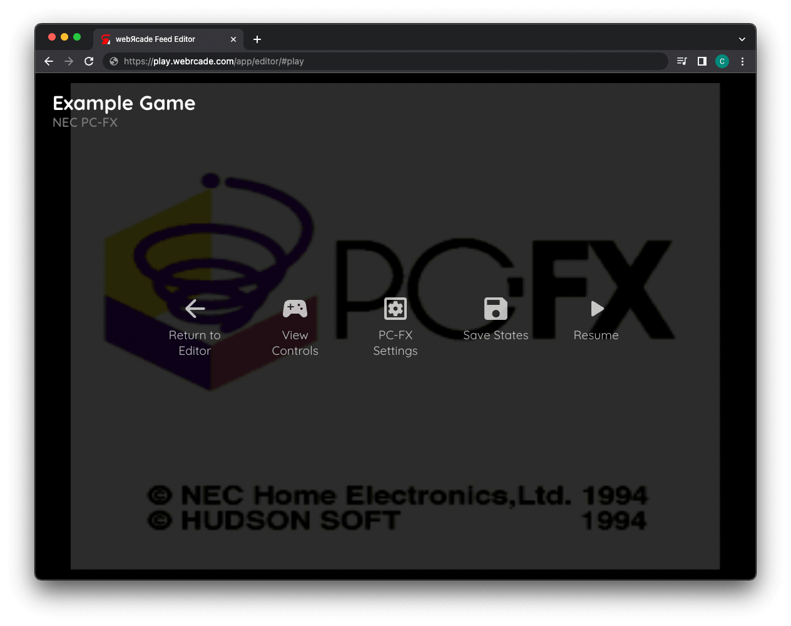
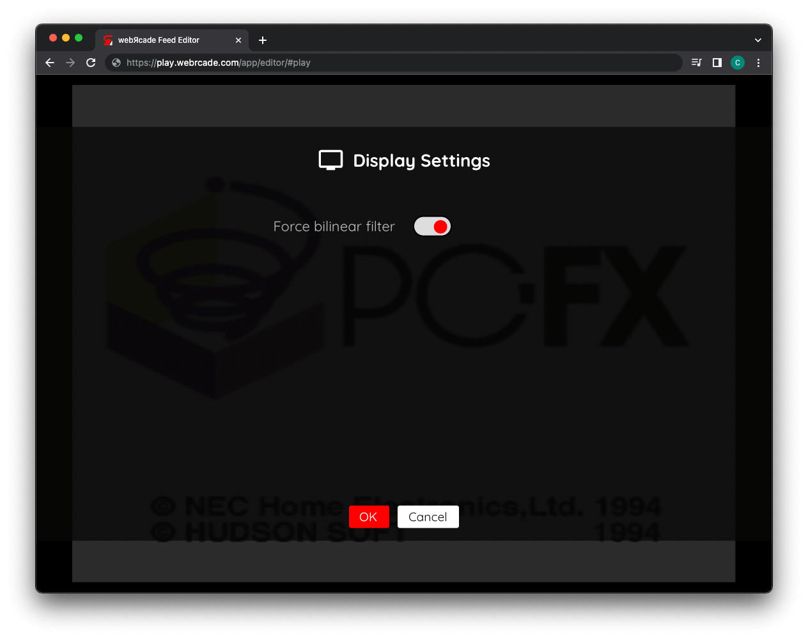

# PC-FX

## Overview

The PC-FX application is an emulator for the [PC-FX](https://en.wikipedia.org/wiki/PC-FX) game console.

<figure>
  
</figure>

## Adding Games (Feed Editor)

Due to large Disc image sizes, adding PC-FX-based games in the [Feed Editor](../../../editor/index.md) must be done manually (versus using auto-detection).

!!! important
    The PC-FX application only supports the `.CHD` disc file format (`.ISO`, `.BIN`, and `.CUE` are not supported).

See the [Disc-based Items](../../../editor/workspace/addingitems.md#disc-based-items) section for the list of steps required to add a PC-FX game in the [Feed Editor](../../../editor/index.md).

!!! important
    Both the iOS Safari and Xbox Series X|S Edge browsers limit the amount of memory that can be consumed by a particular web application (such as webЯcade).
    <p>
    The current limit is around 450 megabytes. Therefore, loading larger disc sizes may fail.
    </p>
    <p>
    To increase the likelihood of a game with a larger disc size loading, you can optionally choose to launch the game using a standalone-based link (versus launching the game within the webЯcade player or editor). See the [Standalone](../../../standalone/index.md) section of this documentation for further information (On Xbox, you would most likely want to bookmark the direct link. On iOS, you would most likely want to add the game to the home screen).
    </p>

## BIOS File

In addition to PC-FX Disc images, the following BIOS file must be specified globally within the feed (See the [Feed Properties Dialog](../../../editor/dialogs/feed-dialog.md#properties-tab) and [PC-FX Feed Properties](#feed-properties) sections).

| __File__ | __Hash (MD5)__ |
| --- | --- |
| `pcfx.rom` | 08e36edbea28a017f79f8d4f7ff9b6d7 |

## Settings

The PC-FX Application includes a custom settings dialog.

{: class="center zoomD"}

To access these settings, display the "Pause" screen and select the "PC-FX Settings" option (*See screenshot above*).

### Display Tab

The PC-FX Application "display tab" settings are detailed below.

| __Field__ | __Description__ |
| --- | --- |
| Force bilinear filter | <p>Forces bilinear interpolation on the output display. Enabling bilinear filtering produces display output where pixels are not as sharp and pronounced.</p><p>Enabling this setting will override the global bilinear filter setting for the PC-FX application.</p>  |

{: class="center zoomD"}

## Controls

The emulator supports up to two controllers. The keyboard and gamepad mappings are listed in the tables below.

### Keyboard

Keyboard support is only available for controller one.

| __Name__ | <div style="min-width:140px">__Keys__</div> | __Comments__ |
|--------------------------|---------------------------------------------| |
| Move | {: class="control"} {: class="control"} {: class="control"} {: class="control"}  | |
| I | {: class="control"} | |
| II | {: class="control"}  | |
| III | {: class="control"} |  |
| IV | {: class="control"} | |
| V | {: class="control"} | |
| VI | {: class="control"} | |
| Run | {: class="control"} | |
| Select | {: class="control"} | The __Right Shift Key__.|
| Show Pause Screen | {: class="control"} | |

### Gamepad

Gamepad support is available for both controllers.

| __Name__ | <div style="min-width:140px">__Gamepad__</div> | __Comments__ |
| --- | --- | --- |
| Move                         | {: class="control"} &nbsp;or&nbsp; {: class="control"} | |
| I                       | {: class="control"} |  |
| II                       | {: class="control"}  | |
| III                       | {: class="control"} | |
| IV                       | {: class="control"}  | |
| V           | {: class="control"} | |
| VI          | {: class="control"}  | |
| Run                        | {: class="control"} | Not available for Xbox and not recommended for iOS (see alternate)<br><br>Press the __Menu (Start) Button__. |
| Run<br>(Alternate)            | {: class="control"} &nbsp;and&nbsp; {: class="control"} | Hold down the __Right Trigger__ and click (press down) on the __Right Thumbstick__. |
| Select                       | {: class="control"}  | Not available for Xbox and not recommended for iOS (see alternate)<br><br>Press the __View (Back) Button__. |
| Select<br>(Alternate)           | {: class="control"} &nbsp;and&nbsp; {: class="control"} | Hold down the __Right Trigger__ and click (press down) on the __Left Thumbstick__. |
| Show Pause Screen                    | {: class="control"} &nbsp;and&nbsp; {: class="control"} | Not available for Xbox and not recommended for iOS (see alternate 3 or 4)<br><br>Hold down the __Left Trigger__ and press the __Menu (Start) Button__. |
| Show Pause Screen<br>(Alternate)        | {: class="control"} &nbsp;and&nbsp; {: class="control"} | Not available for Xbox and not recommended for iOS (see alternate 3 or 4)<br><br>Hold down the __Left Trigger__ and press the __View (Back) Button__. |
| Show Pause Screen<br>(Alternate 2)        | {: class="control"} &nbsp;and&nbsp; {: class="control"} | Not available for Xbox and not recommended for iOS (see alternate 3 or 4)<br><br>Hold down the __X Button__ and press the __View (Back) Button__. |
| Show Pause Screen<br>(Alternate 3)        | {: class="control"} &nbsp;and&nbsp; {: class="control"} | Hold down the __Left Trigger__ and click (press down) on the __Left Thumbstick__. |
| Show Pause Screen<br>(Alternate 4)        | {: class="control"} &nbsp;and&nbsp; {: class="control"} | Hold down the __Left Trigger__ and click (press down) on the __Right Thumbstick__. |

## Internal and External Backup Memory

The PC-FX application supports persisting internal and external backup memory to the browser's local storage or optionally to [cloud-based storage](../../../storage/index.md). The  memory will be persisted to storage whenever the pause screen is displayed (or the game is exited). Therefore, the menu should be displayed periodically to ensure the state is properly persisted.

## Feed

This section details how PC-FX application instances can be added to feeds.

### Type

The type name for the PC-FX application is `beetle-pcfx`.

!!! note
    The alias `pcfx` also currently maps to this application. In the future, the `pcfx` alias may be mapped to another PC-FX application (different emulator implementation) if it is determined to be a more appropriate default.

### Feed Properties

The table below contains global PC-FX feed properties. These properties must be specified in the `props` object of the feed's [Feed Object](../../../feeds/format.md#feed-object).

| __Property__ | __Type__ | __Required__ | __Details__ |
|----------|------|----------|---------|
| pcfx_bios | URL | Yes | <p>URL to a valid PC-FX BIOS file.</p><p>See the [BIOS File](#bios-file) section for additional information.</p>  |

### Item Properties

The table below contains the properties that are specific to the PC-FX application. These properties are specified in the `props` object of a feed item.

| __Property__ | __Type__ | __Required__ | __Details__ |
|----------|------|----------|---------|
| uid | String | Yes | <p>A unique identifier for the particular game (must be unique across all PC-FX games).</p><p>This identifier is primarily used to associate persistent state with the game.</p>|
| discs | Array of URLs | Yes | <p>Array of URLs to one or more (for multi-disc games) PC-FX game discs.</p><p>The PC-FX application only supports the `.CHD` disc file format (`.ISO`, `.BIN`, and `.CUE` are not supported).</p> |
| zoomLevel | Numeric | No | A numeric value indicating how much the display image should be zoomed in (0-40).<br><br>This property is typically used to hide the black borders that are present on some PC-FX games. |

### Example

The following is an example of a complete feed that consists of a single PC-FX application instance (`type` value of `pcecd`). The `discs` property value contains a URL that points to a PC-FX game disc image. The `uid` property value contains a unique identifier for this specific game (must be unique across all PC-FX games).

It is also worth noting that the *PC-FX BIOS location* (`pcfx_bios`) is specified globally within the [Feed Object's](../../../feeds/format.md#feed-object) `props` object.

``` json hl_lines="4 12 14-17"
{
  "title": "PC-FX",
  "props": {
    "pcecd_bios": "https://<host>/pcfx.rom"
  },
  "categories": [
    {
      "title": "PC-FX Games",
      "items": [
        {
          "title": "Some Game",
          "type": "pcfx",
          "props": {
            "uid": "38395a25-dc21-41ff-8ef7-bb1261933423",
            "discs": [
                "https://<host>/somegame.chd"
            ]
          }
        }
      ]
    }
  ]
}
```

## References

- [PC-FX Application GitHub Repository](https://github.com/webrcade/webrcade-app-beetle-pcfx)

