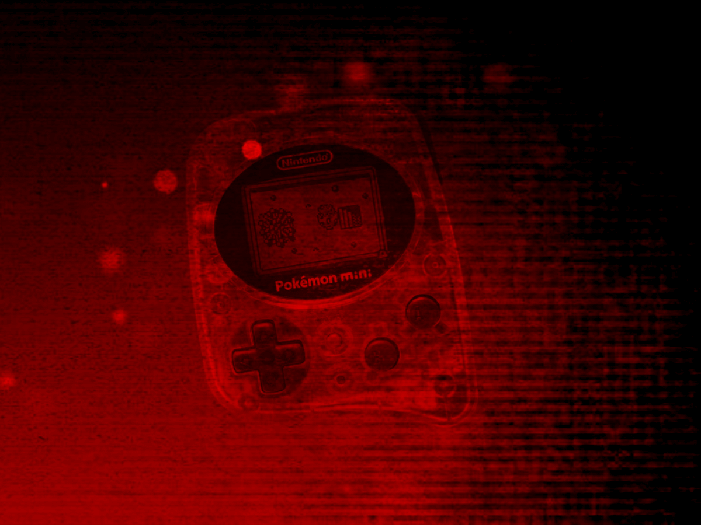

# Nintendo Pokémon Mini

## Overview

The Nintendo Pokémon Mini application is an emulator for the [Nintendo Pokémon Mini handheld console](https://en.wikipedia.org/wiki/Pok%C3%A9mon_Mini).

<figure>
  
</figure>

## Controls

The emulator supports up to one controller. The keyboard and gamepad mappings are listed in the tables below.

### Keyboard

| __Name__ | <div style="min-width:140px">__Keys__</div> | __Comments__ |
|--------------------------|---------------------------------------------| |
| D-pad | {: class="control"} {: class="control"} {: class="control"} {: class="control"} | |
| A | {: class="control"} | |
| B | {: class="control"} | |
| C | {: class="control"} | |
| Shake | {: class="control"} | |
| Power | {: class="control"} | The __Right Shift Key__. |
| Show Pause Screen | {: class="control"} | |

### Gamepad

| __Name__ | <div style="min-width:140px">__Gamepad__</div> | __Comments__ |
| --- | --- | --- |
| D-pad | {: class="control"} | |
| Move | {: class="control"} | |
| A | {: class="control"} | |
| B | {: class="control"} | |
| C | {: class="control"} | |
| Shake | {: class="control"} | |
| Power | {: class="control"} | Not available for Xbox and not recommended for iOS (see alternate)<br><br>Press the __View (Back) Button__. |
| Power<br>(Alternate) | {: class="control"} &nbsp;and&nbsp; {: class="control"} | Hold down the __Right Trigger__ and click (press down) on the __Left Thumbstick__. |
| Show Pause Screen | {: class="control"} &nbsp;and&nbsp; {: class="control"} | Not available for Xbox and not recommended for iOS (see alternate 3 or 4)<br><br>Hold down the __Left Trigger__ and press the __Menu (Start) Button__. |
| Show Pause Screen<br>(Alternate) | {: class="control"} &nbsp;and&nbsp; {: class="control"} | Not available for Xbox and not recommended for iOS (see alternate 3 or 4)<br><br>Hold down the __Left Trigger__ and press the __View (Back) Button__. |
| Show Pause Screen<br>(Alternate 2) | {: class="control"} &nbsp;and&nbsp; {: class="control"} | Not available for Xbox and not recommended for iOS (see alternate 3 or 4)<br><br>Hold down the __X Button__ and press the __View (Back) Button__. |
| Show Pause Screen<br>(Alternate 3) | {: class="control"} &nbsp;and&nbsp; {: class="control"} | Hold down the __Left Trigger__ and click (press down) on the __Left Thumbstick__. |
| Show Pause Screen<br>(Alternate 4) | {: class="control"} &nbsp;and&nbsp; {: class="control"} | Hold down the __Left Trigger__ and click (press down) on the __Right Thumbstick__. |

## EEPROM Storage

The Pokémon Mini application supports preserving EEPROM save data between sessions. This state is persisted in the browser's local storage or optionally to [cloud-based storage](../../../storage/index.md). State information will be persisted whenever the pause screen is displayed (or the game is exited). Therefore, the pause screen should be displayed periodically to ensure the state is properly persisted.

## Feed

This section details how Pokémon Mini application instances can be added to feeds.

### Type

The type name for the Pokémon Mini application is `retro-pokemini`.

!!! note
    The alias `pokemini` also currently maps to this application. In the future, the `pokemini` alias may be mapped
    to another Pokémon Mini application (different emulator implementation) if it is determined to be a
    more appropriate default.

### Properties

The table below contains the properties that are specific to the Pokémon Mini application. These properties are specified in the `props` object of a feed item.

| __Property__ | __Type__ | __Required__ | __Details__ |
|----------|------|----------|---------|
| rom | URL | Yes | URL to a Pokémon Mini ROM file (`.min`) or a zip file containing a ROM file. |
| zoomLevel | Numeric | No | A numeric value indicating how much the display image should be zoomed in (0-40).<br><br>This property is typically used to hide the black borders that are present on some games. |

### Example

The following is an example of a complete feed that consists of a single Pokémon Mini application instance (`type` value of `pokemini`).

``` json hl_lines="11 13"
{
  "title": "Pokémon Mini Feed",
  "longTitle": "Nintendo Pokémon Mini Example Feed",
  "categories": [
    {
      "title": "Pokémon Mini Games",
      "longTitle": "Nintendo Pokémon Mini Games",
      "items": [
        {
          "title": "My Pokémon Mini Game",
          "type": "pokemini",
          "props": {
            "rom": "https://<host>/my-pokemini-game.min"
          }
        }
      ]
    }
  ]
}
```

## References

- [Nintendo Pokémon Mini Application GitHub Repository](https://github.com/webrcade/webrcade-app-retro-pokemini)