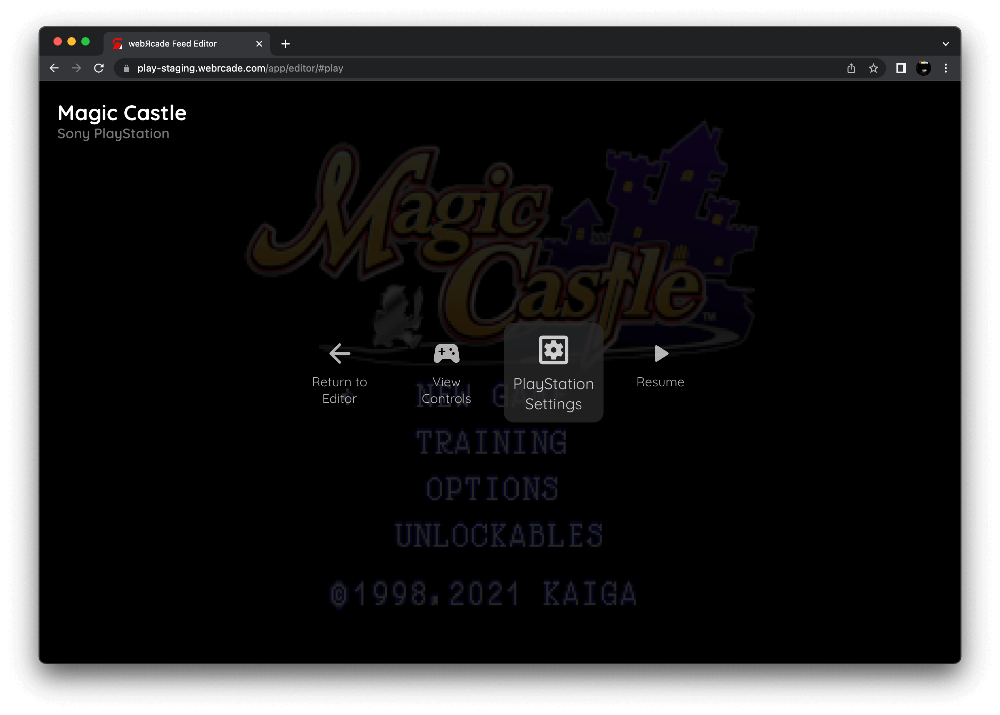
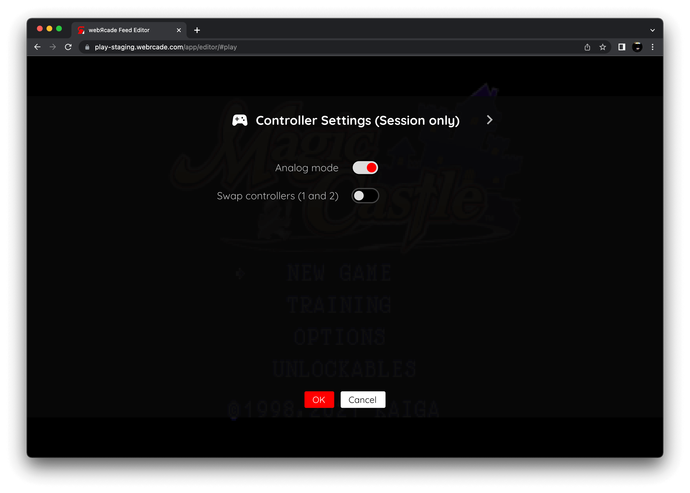

# Sony PlayStation (Experimental)

!!! warning
    The Sony PlayStation application is currently designated as an *experimental* application.
    <p>
    This designation has been applied due to the following:
    </p>
    <ul>
    <li>The resource requirements to properly run the emulator are high.</li>
    <li>Disc images are large and can take a substantial amount of time to download.</li>
    </ul>
    <p>
    By default, *Experimental* applications are not displayed in the webЯcade *[player](../../../userguide/index.md)* or *[feed editor](../../../editor/index.md)*.
    </p>
    <p>
    To enable the Sony PlayStation application, refer to the *advanced settings* sections of the player ([player advanced settings](../../../userguide/index.md#advanced-settings-tab)) or editor ([editor advanced settings](../../../editor/workspace/settings.md#advanced-tab)).
    </p>

## Overview

The Sony PlayStation application is an emulator for the [Sony PlayStation game console](https://en.wikipedia.org/wiki/PlayStation_(console)).

<figure>
  
  <figcaption>Magic Castle by KAIGA</figcaption>
</figure>

Due to its high resource requirements (see *warning* at top of this page), the following devices are minimally recommended for running this application:

* Modern PC or Mac
* iPhone 11 or iPad 9th Generation (or newer)
* Xbox Series X|S gaming consoles
* Newer Android devices with a highly performant processor (high single core speed)

!!! important
    Both the iOS Safari and Xbox Series X|S Edge browsers limit the amount of memory that can be consumed by a particular web application (such as webЯcade).
    <p>
    The current limit is around 450 megabytes. Therefore, loading larger disc sizes may fail.
    </p>
    <p>
    To increase the likelihood of a game with a larger disc size loading, it is recommended to launch the game using a standalone-based link (versus launching the game within the webЯcade player or editor). See the [Standalone](../../../standalone/index.md) section of this documentation for further information (On Xbox, you would most likely want to bookmark the direct link. On iOS, you would most likely want to add the game to the home screen).
    </p>

## Settings

The Sony PlayStation Application includes a custom settings dialog.

{: class="center zoomD"}

To access these settings, display the "Pause" screen and select the "PlayStation Settings" option (*See screenshot above*).

{: class="center zoomD"}

### Controller Tab

The PlayStation Application "controller tab" settings are detailed below. It is important to note that the settings on this tab are *Session only* meaning they will not persist between gaming sessions.

| __Field__ | __Description__ |
| --- | --- |
| Analog mode | Enables *Analog mode* on the PlayStation DualShock controller. Some games will automatically force this mode. However, this setting allows for forcing the controller into analog mode. |
| Swap controllers (ports 1 and 2) | Swaps controllers 1 and 2. This is necessary in some games as they require the use of both controller ports (even during a single player game). |

### Display Tab

The PlayStation Application "display tab" settings are detailed below.

| __Field__ | __Description__ |
| --- | --- |
| Force bilinear filter | <p>Forces bilinear interpolation on the output display. Enabling bilinear filtering produces display output where pixels are not as sharp and pronounced.</p><p>Enabling this setting will override the global bilinear filter setting for the PlayStation application.</p>  |

{: class="center zoomD"}

## Adding Games (Feed Editor)

Due to large Disc image sizes, adding PlayStation games in the [Feed Editor](../../../editor/index.md) must be done manually (versus using auto-detection).

!!! important
    The PlayStation application only supports `.CHD` and `.PBP` disc file formats (`.ISO`, `.BIN`, and `.CUE` are not supported).

To add a game, perform the following steps.

* Navigate to the "Items" tab in the Feed Editor (See [Feed Items Tab](../../../editor/workspace/itemstab.md) documentation).


* Select the "Create Item" action in the "Items Table" toolbar (See [Items Table](../../../editor/workspace/itemstab.md#table-toolbar) documentation). The [Create Item Editor](../../../editor/dialogs/item-dialog.md) will be displayed.


* On the [General Tab](../../../editor/dialogs/item-dialog.md#general-tab) of the [Create Item Editor](../../../editor/dialogs/item-dialog.md) perform the following steps:
    * Select `Sony PlayStation` in the "Application" pull-down.
    * In the "Title" field, start to type in the name of the game that is being added. An *autocomplete list* will be displayed directly below the *title* field. Select one of the items in the *autocomplete list* to have the game's description and artwork retrieved.
* On the [Properties Tab](../../../editor/dialogs/item-dialog.md#properties-tab) of the [Create Item Editor](../../../editor/dialogs/item-dialog.md) perform the following steps:
    * Provide one or more Disc URLs in the "Discs (URLs)" multi-line text field (directly or via the chooser button to the right of the field). It is important to note that the PlayStation application only supports `.CHD` and `.PBP` disc file formats.
* Click the `OK` button to add the newly created item to the feed.

## Controls

The emulator supports up to four controllers. The keyboard and gamepad mappings are listed in the tables below.

### Keyboard

Keyboard support is only available for controller one.

| __Name__ | <div style="min-width:140px">__Keys__</div> | __Comments__ |
|--------------------------|---------------------------------------------| |
| D-pad | {: class="control"} {: class="control"} {: class="control"} {: class="control"}  | |
| Circle | {: class="control"} | |
| Cross | {: class="control"} | |
| Triangle | {: class="control"} | |
| Square | {: class="control"} | |
| L2 | {: class="control"} | |
| L1 | {: class="control"} | |
| R1 | {: class="control"} | |
| R2 | {: class="control"} | |
| Start | {: class="control"} | |
| Select | {: class="control"} | The __Right Shift Key__.|
| Show Pause Screen | {: class="control"} | |

### Gamepad

Gamepad support is available for all controllers.

| __Name__ | <div style="min-width:140px">__Gamepad__</div> | __Comments__ |
| --- | --- | --- |
| D-pad                         | {: class="control"} | |
| D-pad                         | {: class="control"} | When __Analog Mode__ disabled. |
| Left analog | {: class="control"} | When __Analog Mode__ enabled. |
| Right analog | {: class="control"} | When __Analog Mode__ enabled. |
| Circle                       | {: class="control"} | |
| Cross                       | {: class="control"}  | |
| Triangle                       | {: class="control"} | |
| Square                       | {: class="control"}  | |
| L2           | {: class="control"} | |
| L1           | {: class="control"} | |
| R1           | {: class="control"} | |
| R2           | {: class="control"}  | |
| Start                        | {: class="control"} | Not available for Xbox and not recommended for iOS (see alternate)<br><br>Press the __Menu (Start) Button__. |
| Start<br>(Alternate)            | {: class="control"} &nbsp;and&nbsp; {: class="control"} | Hold down the __Right Trigger__ and click (press down) on the __Right Thumbstick__. |
| Select                       | {: class="control"}  | Not available for Xbox and not recommended for iOS (see alternate)<br><br>Press the __View (Back) Button__. |
| Select<br>(Alternate)           | {: class="control"} &nbsp;and&nbsp; {: class="control"} | Hold down the __Right Trigger__ and click (press down) on the __Left Thumbstick__. |
| Show Pause Screen                    | {: class="control"} &nbsp;and&nbsp; {: class="control"} | Not available for Xbox and not recommended for iOS (see alternate 3 or 4)<br><br>Hold down the __Left Trigger__ and press the __Menu (Start) Button__. |
| Show Pause Screen<br>(Alternate)        | {: class="control"} &nbsp;and&nbsp; {: class="control"} | Not available for Xbox and not recommended for iOS (see alternate 3 or 4)<br><br>Hold down the __Left Trigger__ and press the __View (Back) Button__. |
| Show Pause Screen<br>(Alternate 2)        | {: class="control"} &nbsp;and&nbsp; {: class="control"} | Not available for Xbox and not recommended for iOS (see alternate 3 or 4)<br><br>Hold down the __X Button__ and press the __View (Back) Button__. |
| Show Pause Screen<br>(Alternate 3)        | {: class="control"} &nbsp;and&nbsp; {: class="control"} | Hold down the __Left Trigger__ and click (press down) on the __Left Thumbstick__. |
| Show Pause Screen<br>(Alternate 4)        | {: class="control"} &nbsp;and&nbsp; {: class="control"} | Hold down the __Left Trigger__ and click (press down) on the __Right Thumbstick__. |

## Memory Card Storage

The PlayStation application supports preserving state from Memory Cards between sessions. This state is persisted in the browser's local storage or optionally to [cloud-based storage](../../../storage/index.md). State information will be persisted whenever the pause screen is displayed (or the game is exited). Therefore, the pause screen should be displayed periodically to ensure the state is properly persisted.

## Feed

This section details how PlayStation application instances can be added to feeds.

### Type

The type name for the PlayStation application is `beetle-psx`.

!!! note
    The alias `psx` also currently maps to this application. In the future, the `psx` alias may be mapped
    to another PlayStation application (different emulator implementation) if it is determined to be a
    more appropriate default.

### Feed Properties

The table below contains global PlayStation feed properties. These properties must be specified in the `props` object of the feed's [Feed Object](../../../feeds/format.md#feed-object).

| __Property__ | __Type__ | __Required__ | __Details__ |
|----------|------|----------|---------|
| psx_bios | Array of URLs | Yes | <p>An array of URLs to PlayStation BIOS files.</p><p>The BIOS files must be one of the following three sets:<ul><li>(PS1) `scph5500.bin`, `scph5501.bin`, and `scph5502.bin`</li><li>(PSP) `PSXONPSP660.bin`</li><li>(PS3) `ps1_rom.bin`</li></ul></p>  |

### Item Properties

The table below contains the properties that are specific to the PlayStation application. These properties are
specified in the `props` object of a feed item.

| __Property__ | __Type__ | __Required__ | __Details__ |
|----------|------|----------|---------|
| uid | String | Yes | <p>A unique identifier for the particular game (must be unique across all PlayStation games).</p><p>This identifier is primarily used to associate persistent state with the game.</p>|
| discs | Array of URLs | Yes | <p>Array of URLs to one or more (for multi-disc games) PlayStation game discs.</p><p>The PlayStation application only supports `.CHD` and `.PBP` disc file formats (`.ISO`, `.BIN`, and `.CUE` are not supported).</p> |

### Example

The following is an example of a complete feed that consists of a single PlayStation application instance (`type` value of `psx`). The `discs` property value contains a URL that points to a Dropbox location that contains the excellent homebrew game Magic Castle by KAIGA. The `uid` property value contains a unique identifier for this specific game (must be unique across all PlayStation games).

It is also worth noting that the *PlayStation BIOS locations* (`psx_bios`) is specified globally within the [Feed Object's](../../../feeds/format.md#feed-object) `props` object.

``` json hl_lines="4-8 18-21"
{
  "title": "Sony PlayStation",
  "props": {
    "psx_bios": [
        "https://<host>/scph5500.bin",
        "https://<host>/scph5501.bin",
        "https://<host>/scph5502.bin"
    ]
  },
  "categories": [
    {
      "title": "Sony PlayStation Games",
      "items": [
        {
          "title": "Magic Castle",
          "type": "psx",
          "props": {
            "uid": "60f942b4-b4e5-47c0-9759-5d9d191c58e8",
            "discs": [
                "https://dl.dropboxusercontent.com/s/1fkmiszh1hj98d0/magiccastle.chd"
            ]
          }
        }
      ]
    }
  ]
}
```

## References

- [Sony PlayStation Application GitHub Repository](https://github.com/webrcade/webrcade-app-beetle-psx)

