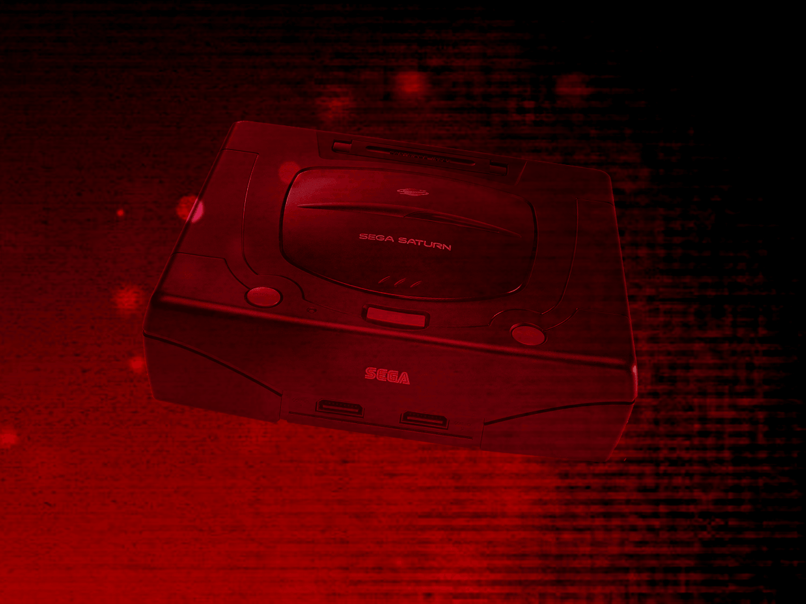
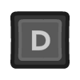
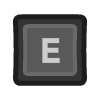

# Sega Saturn (Experimental)

!!! warning
    The Sega Saturn application is currently designated as an *experimental* application.
    <p>
    This designation has been applied due to the following:
    </p>
    <ul>
    <li>The resource requirements to properly run the emulator are high.</li>
    <li>Many games exhibit compatibility issues and defects.</li>
    </ul>
    <p>
    By default, *Experimental* applications are not displayed in the webЯcade *[player](../../../userguide/index.md)* or *[feed editor](../../../editor/index.md)*.
    </p>
    <p>
    To enable the Saturn application, refer to the *advanced settings* sections of the player ([player advanced settings](../../../userguide/index.md#advanced-settings-tab)) or editor ([editor advanced settings](../../../editor/workspace/settings.md#advanced-tab)).
    </p>

## Overview

The Sega Saturn application is an emulator for the [Sega Saturn game console](https://en.wikipedia.org/wiki/Sega_Saturn).

<figure>
  
</figure>

Due to its high resource requirements (see *warning* at top of this page), the following devices are minimally recommended for running this application:

* Modern PC or Mac
* iPhone 11 or iPad 9th Generation (or newer)
* Xbox Series X|S gaming consoles
* Newer Android devices with a highly performant processor (high single core speed)

## Adding Games (Feed Editor)

Due to large Disc image sizes, adding Saturn games in the [Feed Editor](../../../editor/index.md) must be done manually (versus using auto-detection).

!!! important
    The Saturn application only supports the `.CHD` disc file format (`.ISO`, `.BIN`, and `.CUE` are not supported).

See the [Disc and Archive-based Items](../../../editor/workspace/addingitems.md#disc-and-archive-based-items) section for the list of steps required to add a Saturn game in the [Feed Editor](../../../editor/index.md).

!!! important
    Both the iOS Safari and Xbox Series X|S Edge browsers limit the amount of memory that can be consumed by a particular web application (such as webЯcade).
    <p>
    The current limit is around 450 megabytes. Therefore, loading larger disc sizes may fail.
    </p>
    <p>
    To increase the likelihood of a game with a larger disc size loading, you can optionally choose to launch the game using a standalone-based link (versus launching the game within the webЯcade player or editor). See the [Standalone](../../../standalone/index.md) section of this documentation for further information (On Xbox, you would most likely want to bookmark the direct link. On iOS, you would most likely want to add the game to the home screen).
    </p>

## BIOS Files

Optionally, a *Saturn BIOS file* can be specified globally within the feed (See the [Feed Properties Dialog](../../../editor/dialogs/feed-dialog.md#properties-tab) and [Saturn Feed Properties](#feed-properties) sections). If no BIOS file is provided, the emulator will fall back to its built-in emulated BIOS.

| __File__ | __Hash (MD5)__ | __Description__ |
| --- | --- | --- |
| `saturn_bios.bin` | af5828fdff51384f99b3c4926be27762 | Sega Saturn BIOS |

## Controls

The emulator supports up to two controllers. The keyboard and gamepad mappings are listed in the tables below.

### Keyboard

Keyboard support is only available for controller one.

| __Name__ | <div style="min-width:140px">__Keys__</div> | __Comments__ |
|--------------------------|---------------------------------------------| |
| D-pad | {: class="control"} {: class="control"} {: class="control"} {: class="control"} | |
| Button A | {: class="control"} | |
| Button B | {: class="control"} | |
| Button C | {: class="control"} | |
| Button X | {: class="control"} | |
| Button Y | {: class="control"} | |
| Button Z | {: class="control"} | |
| Left Bumper | {: class="control"} | |
| Right Bumper | {: class="control"} | |
| Start | {: class="control"} | |
| Show Pause Screen | {: class="control"} | |

### Gamepad

Gamepad support is available for all controllers.

| __Name__ | <div style="min-width:140px">__Gamepad__</div> | __Comments__ |
| --- | --- | --- |
| D-pad | {: class="control"} | |
| Move | {: class="control"} | |
| Button A | {: class="control"} | |
| Button B | {: class="control"} | |
| Button C | {: class="control"} | |
| Button X | {: class="control"} | |
| Button Y | {: class="control"} | |
| Button Z | {: class="control"} | |
| Left Bumper | {: class="control"} | |
| Right Bumper | {: class="control"} | |
| Start | {: class="control"} | Not available for Xbox and not recommended for iOS (see alternate)<br><br>Press the __Menu (Start) Button__. |
| Start<br>(Alternate) | {: class="control"} &nbsp;and&nbsp; {: class="control"} | Hold down the __Right Trigger__ and click (press down) on the __Right Thumbstick__. |
| Show Pause Screen | {: class="control"} &nbsp;and&nbsp; {: class="control"} | Not available for Xbox and not recommended for iOS (see alternate 3 or 4)<br><br>Hold down the __Left Trigger__ and press the __Menu (Start) Button__. |
| Show Pause Screen<br>(Alternate) | {: class="control"} &nbsp;and&nbsp; {: class="control"} | Not available for Xbox and not recommended for iOS (see alternate 3 or 4)<br><br>Hold down the __Left Trigger__ and press the __View (Back) Button__. |
| Show Pause Screen<br>(Alternate 2) | {: class="control"} &nbsp;and&nbsp; {: class="control"} | Not available for Xbox and not recommended for iOS (see alternate 3 or 4)<br><br>Hold down the __X Button__ and press the __View (Back) Button__. |
| Show Pause Screen<br>(Alternate 3) | {: class="control"} &nbsp;and&nbsp; {: class="control"} | Hold down the __Left Trigger__ and click (press down) on the __Left Thumbstick__. |
| Show Pause Screen<br>(Alternate 4) | {: class="control"} &nbsp;and&nbsp; {: class="control"} | Hold down the __Left Trigger__ and click (press down) on the __Right Thumbstick__. |

## Memory Card Storage

The Saturn application supports preserving state from internal saves between sessions. This state is persisted in the browser's local storage or optionally to [cloud-based storage](../../../storage/index.md). State information will be persisted whenever the pause screen is displayed (or the game is exited). Therefore, the pause screen should be displayed periodically to ensure the state is properly persisted.

## Feed

This section details how Saturn application instances can be added to feeds.

### Type

The type name for the Saturn application is `retro-yabause`.

!!! note
    The alias `saturn` also currently maps to this application. In the future, the `saturn` alias may be mapped
    to another Saturn application (different emulator implementation) if it is determined to be a
    more appropriate default.

### Feed Properties

The table below contains global Saturn feed properties. These properties must be specified in the `props` object of the feed's [Feed Object](../../../feeds/format.md#feed-object).

| __Property__ | __Type__ | __Required__ | __Details__ |
|----------|------|----------|---------|
| saturn_bios | URL | No | <p>An optional URL to the Saturn BIOS file (`saturn_bios.bin`).</p><p>If not specified, the emulator will use its built-in emulated BIOS.</p> |

### Item Properties

The table below contains the properties that are specific to the Saturn application. These properties are specified in the `props` object of a feed item.

| __Property__ | __Type__ | __Required__ | __Details__ |
|----------|------|----------|---------|
| uid | String | Yes | <p>A unique identifier for the particular game (must be unique across all Saturn games).</p><p>This identifier is primarily used to associate persistent state with the game.</p> |
| discs | Array of URLs | Yes | <p>Array of URLs to one or more (for multi-disc games) Saturn game discs.</p><p>The Saturn application only supports the `.CHD` disc file format (`.ISO`, `.BIN`, and `.CUE` are not supported).</p> |
| cheat | URL | No | URL to a cheat file for the current ROM. See the [Cheats Tab](../../../editor/dialogs/item-dialog.md#cheats-tab) in the Item Editor for details on assigning cheat files. |
| zoomLevel | Numeric | No | A numeric value indicating how much the display image should be zoomed in (0-40).<br><br>This property is typically used to hide the black borders that are present on some Saturn games. |
| forceEmulatedBios | Boolean | No | Forces use of the emulated (built-in) BIOS rather than the supplied BIOS file. |
| ramExpansion | Numeric | No | Enables RAM expansion cartridge emulation (0 = disabled, 1 = 1MB, 2 = 4MB). Some games require a RAM expansion cartridge to run. |

### Example

The following is an example of a complete feed that consists of a single Saturn application instance (`type` value of `saturn`).

It is also worth noting that the *Saturn BIOS location* (`saturn_bios`) is specified globally within the [Feed Object's](../../../feeds/format.md#feed-object) `props` object.

``` json hl_lines="4 14-17"
{
  "title": "Sega Saturn",
  "props": {
    "saturn_bios": "https://<host>/saturn_bios.bin",
  },
  "categories": [
    {
      "title": "Sega Saturn Games",
      "items": [
        {
          "title": "My Saturn Game",
          "type": "saturn",
          "props": {
            "uid": "a1b2c3d4-e5f6-7890-abcd-ef1234567890",
            "discs": [
                "https://<host>/my-saturn-game.chd"
            ]
          }
        }
      ]
    }
  ]
}
```

## References

- [Sega Saturn Application GitHub Repository](https://github.com/webrcade/webrcade-app-retro-yabause)