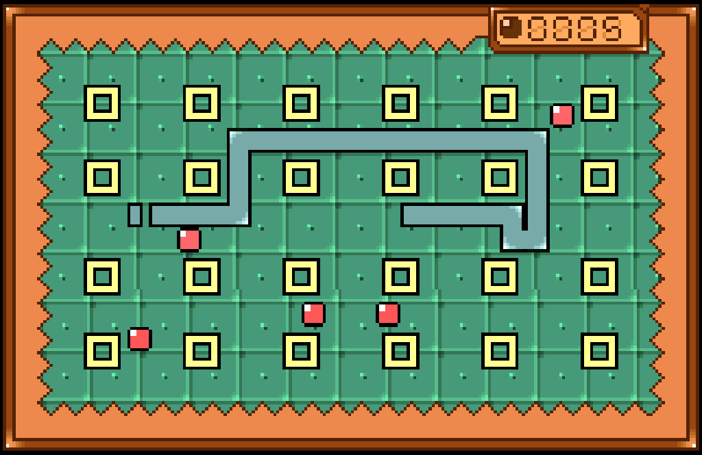

# Bandai WonderSwan (and WonderSwan Color)

## Overview

The WonderSwan application is an emulator for the [WonderSwan](https://en.wikipedia.org/wiki/WonderSwan) and [WonderSwan Color](https://en.wikipedia.org/wiki/WonderSwan) game consoles. 

<figure>
  
  <figcaption>Wondersnake 2 by Dox & Kojote</figcaption>
</figure>


## Controls

The emulator supports one controller. The keyboard and gamepad mappings are listed in the tables below.

### Keyboard

Keyboard controls for the standard orientation are listed below:

| __Name__ | <div style="min-width:140px">__Keys__</div> | __Comments__ |
|--------------------------|---------------------------------------------| |
| X Buttons | {: class="control"} {: class="control"} {: class="control"} {: class="control"}  | |                  
| Y4 | {: class="control"} | |
| Y2 | {: class="control"} | |
| B | {: class="control"} or {: class="control"} | |  
| A | {: class="control"} or {: class="control"} |  |                  
| Start | {: class="control"} | |    
| Rotate | {: class="control"} | Toggles between standard and rotated orientations (The __Right Shift Key__).|                  
| Show Pause Screen | {: class="control"} | |                  

Keyboard controls for the rotated orientation are listed below:

| __Name__ | <div style="min-width:140px">__Keys__</div> | __Comments__ |
|--------------------------|---------------------------------------------| |
| Y Buttons | {: class="control"} {: class="control"} {: class="control"} {: class="control"}  | |                  
| X1 | {: class="control"} | |
| X2 | {: class="control"} | |                
| X3 | {: class="control"} | |                  
| X4 | {: class="control"} | | 
| A | {: class="control"} | |
| B | {: class="control"} | |
| Start | {: class="control"} | |    
| Rotate | {: class="control"} | Toggles between standard and rotated orientations (The __Right Shift Key__).|                  
| Show Pause Screen | {: class="control"} | |                  

### Gamepad

Gamepad mappings for the standard orientation are listed below:

| __Name__ | <div style="min-width:140px">__Gamepad__</div> | __Comments__ |
| --- | --- | --- |
| X Buttons  | {: class="control"} &nbsp;or&nbsp; {: class="control"} | |
| Y1          | {: class="control"}  | |
| Y2          | {: class="control"}  | |
| Y3           | {: class="control"} | |
| Y4           | {: class="control"} | |
| B                       | {: class="control"} or {: class="control"} | |
| A                       | {: class="control"} or {: class="control"} | |
| Start                        | {: class="control"} | Not available for Xbox and not recommended for iOS (see alternate)<br><br>Press the __Menu (Start) Button__. |
| Start<br>(Alternate)            | {: class="control"} &nbsp;and&nbsp; {: class="control"} | Hold down the __Right Trigger__ and click (press down) on the __Right Thumbstick__. |
| Rotate                       | {: class="control"}  | Not available for Xbox and not recommended for iOS (see alternate)<br><br>Press the __View (Back) Button__. |
| Rotate<br>(Alternate)           | {: class="control"} &nbsp;and&nbsp; {: class="control"} | Hold down the __Right Trigger__ and click (press down) on the __Left Thumbstick__. |
| Show Pause Screen                    | {: class="control"} &nbsp;and&nbsp; {: class="control"} | Not available for Xbox and not recommended for iOS (see alternate 3 or 4)<br><br>Hold down the __Left Trigger__ and press the __Menu (Start) Button__. |
| Show Pause Screen<br>(Alternate)        | {: class="control"} &nbsp;and&nbsp; {: class="control"} | Not available for Xbox and not recommended for iOS (see alternate 3 or 4)<br><br>Hold down the __Left Trigger__ and press the __View (Back) Button__. |
| Show Pause Screen<br>(Alternate 2)        | {: class="control"} &nbsp;and&nbsp; {: class="control"} | Not available for Xbox and not recommended for iOS (see alternate 3 or 4)<br><br>Hold down the __X Button__ and press the __View (Back) Button__. |
| Show Pause Screen<br>(Alternate 3)        | {: class="control"} &nbsp;and&nbsp; {: class="control"} | Hold down the __Left Trigger__ and click (press down) on the __Left Thumbstick__. |
| Show Pause Screen<br>(Alternate 4)        | {: class="control"} &nbsp;and&nbsp; {: class="control"} | Hold down the __Left Trigger__ and click (press down) on the __Right Thumbstick__. |

Gamepad mappings for the rotated orientation are listed below:

| __Name__ | <div style="min-width:140px">__Gamepad__</div> | __Comments__ |
| --- | --- | --- |
| Y Buttons  | {: class="control"} &nbsp;or&nbsp; {: class="control"} | |
| X1          | {: class="control"}  &nbsp;or&nbsp; {: class="control"} | `Right Analog` left. |
| X2           | {: class="control"} &nbsp;or&nbsp; {: class="control"} | `Right Analog` up. |
| X3                      | {: class="control"} &nbsp;or&nbsp; {: class="control"}  | `Right Analog` right. |
| X4                       |  {: class="control"} &nbsp;or&nbsp; {: class="control"}  | `Right Analog` down. |
| A           | {: class="control"} | |
| B          | {: class="control"}  | |
| Start                        | {: class="control"} | Not available for Xbox and not recommended for iOS (see alternate)<br><br>Press the __Menu (Start) Button__. |
| Start<br>(Alternate)            | {: class="control"} &nbsp;and&nbsp; {: class="control"} | Hold down the __Right Trigger__ and click (press down) on the __Right Thumbstick__. |
| Rotate                       | {: class="control"}  | Not available for Xbox and not recommended for iOS (see alternate)<br><br>Press the __View (Back) Button__. |
| Rotate<br>(Alternate)           | {: class="control"} &nbsp;and&nbsp; {: class="control"} | Hold down the __Right Trigger__ and click (press down) on the __Left Thumbstick__. |
| Show Pause Screen                    | {: class="control"} &nbsp;and&nbsp; {: class="control"} | Not available for Xbox and not recommended for iOS (see alternate 3 or 4)<br><br>Hold down the __Left Trigger__ and press the __Menu (Start) Button__. |
| Show Pause Screen<br>(Alternate)        | {: class="control"} &nbsp;and&nbsp; {: class="control"} | Not available for Xbox and not recommended for iOS (see alternate 3 or 4)<br><br>Hold down the __Left Trigger__ and press the __View (Back) Button__. |
| Show Pause Screen<br>(Alternate 2)        | {: class="control"} &nbsp;and&nbsp; {: class="control"} | Not available for Xbox and not recommended for iOS (see alternate 3 or 4)<br><br>Hold down the __X Button__ and press the __View (Back) Button__. |
| Show Pause Screen<br>(Alternate 3)        | {: class="control"} &nbsp;and&nbsp; {: class="control"} | Hold down the __Left Trigger__ and click (press down) on the __Left Thumbstick__. |
| Show Pause Screen<br>(Alternate 4)        | {: class="control"} &nbsp;and&nbsp; {: class="control"} | Hold down the __Left Trigger__ and click (press down) on the __Right Thumbstick__. |

## Battery-backed SRAM

Some WonderSwan cartridges include battery-backed SRAM as a means of preserving state between sessions. The WonderSwan application supports persisting this SRAM state into the browser's local storage. The SRAM contents will be persisted to local storage whenever the pause screen is displayed (or the game is existed). Therefore, the menu should be displayed periodically for games that support battery-backed SRAM to ensure the state is properly persisted.

## Feed 

This section details how WonderSwan application instances can be added to feeds.

### Type

The type names for the WonderSwan application are listed below:

   *  WonderSwan: `mednafen-ws` 
   *  WonderSwan Color: `mednafen-wsc` 

!!! note
    The aliases `ws` and `wsc` also currently map to the WonderSwan and WonderSwan Color applications respectively. In the future, these aliases may be mapped to different applications (different emulator implementations) if it is determined that there are more appropriate defaults.

### Properties

The table below contains the properties that are specific to the WonderSwan application. These properties are
specified in the `props` object of a feed item. 

| __Property__ | __Type__ | __Required__ | __Details__ |
|----------|------|----------|---------|
| rom | URL | Yes | URL to a WonderSwan (or Color) ROM file or a zip file containing a ROM file. |
| rotated | Boolean | No | Whether to rotate the screen and controls (defaults to `false`). |
| language | Numeric | No | The language to use for displaying game text (if applicable) (defaults to `English`).<br><ul><li>`0` : English</li><li>`1` : Japanese</li><ul> |

### Example

The following is an example of a complete feed that consists of a single WonderSwan Color application instance (`type` value of `wsc`). The `rom` property value is a URL that points to a Dropbox location that contains the excellent homebrew game Wondersnake 2 by Dox & Kojote.

``` json hl_lines="10 12"
{
  "title": "WonderSwan Color Feed",
  "longTitle": "WonderSwan Color Example Feed",
  "categories": [
    {
      "title": "WonderSwan Games",
      "items": [
        {
          "title": "Wondersnake 2",
          "type": "wsc",
          "props": {
            "rom": "https://www.dropbox.com/s/ucjwx2wpjgcpdgn/wsnake2.wsc?dl=0"
          }
        }
      ]
    }
  ]
}
```

This example can be tested by adding a feed with the following URL within the[webЯcade player](../../../userguide/index.md):

`https://tinyurl.com/sample-wsc-feed`

## References

- [WonderSwan Application GitHub Repository](https://github.com/webrcade/webrcade-app-mednafen)
