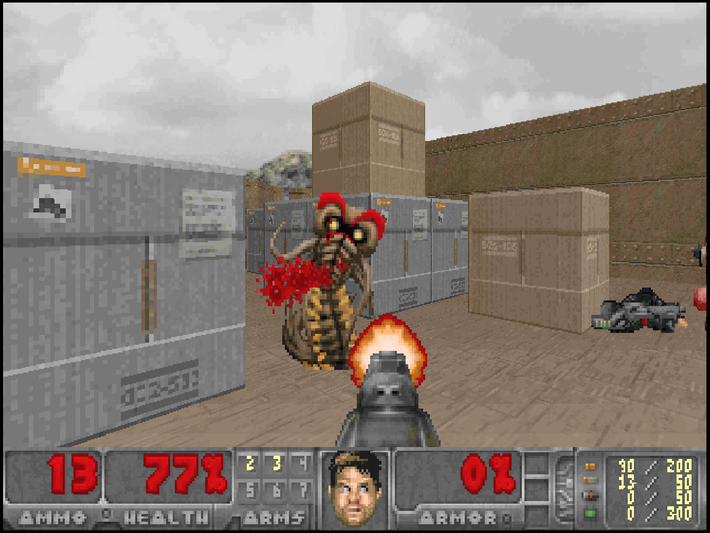

# Classic Doom

## Overview

The Classic Doom application is a [Doom game engine](https://en.wikipedia.org/wiki/Doom_engine) that can be used to play the shareware version of Doom as well as the freely redistributable Freedoom games. 

<figure>
  
  <figcaption>Freedoom Phase 1 by Freedoom Team </figcaption>
</figure>

## Controls

The keyboard/mouse controls and gamepad mappings are listed in the tables below.

### Keyboard and Mouse

The following table contains the basic keyboard and mouse mappings. Press the equal (`=`) key while playing a game to view the complete set of mappings.

| __Name__ | <div style="min-width:140px">__Keys__</div> | __Comments__ |
|--------------------------|---------------------------------------------| |
| Move | {: class="control"} {: class="control"} {: class="control"} {: class="control"}  | |                  
| Turn | {: class="control"}  | Move mouse left or right to turn in the corresponding direction. |                  
| Fire | {: class="control"} | |                  
| Move Forward | {: class="control"} | | 
| Run | {: class="control"} | |                
| Use | {: class="control"} | |                
| Select Weapon | Number Keys 1 through 9 | Press the equal (`=`) key while playing a game to view what weapon each numeric key is mapped to. |                
| Show Pause Screen | {: class="control"} | | 

#### Mouse Support (Pointer Lock)

This application supports Pointer Lock on compatible browsers. Pointer lock binds mouse input to the game window, preventing the game from losing mouse input when the mouse travels outside the window. This functionality is critical when playing a 3rd person shooter. To enable pointer lock, double click on the game window (this may have to be repeated a couple of times). Once the pointer is "locked", the pointer (arrow, etc.) will no longer be visible. To "unlock" from the window, press the escape key (this may also have to be repeated a couple of times).

### Gamepad

Gamepad mappings are listed in the table below.

| __Name__ | <div style="min-width:140px">__Gamepad__</div> | __Comments__ |
| --- | --- | --- |
| Move                         | {: class="control"} &nbsp;or&nbsp; {: class="control"} | |
| Run                       | {: class="control"} | |
| Fire                       | {: class="control"}  | |
| Strafe                       | {: class="control"} | |
| Use                       | {: class="control"}  | |
| Previous Weapon          | {: class="control"}  | |
| Next Weapon          | {: class="control"}  | |
| Show Pause Screen                    | {: class="control"} &nbsp;and&nbsp; {: class="control"} | Not available for Xbox and not recommended for iOS (see alternate 3 or 4)<br><br>Hold down the __Left Trigger__ and press the __Menu (Start) Button__. |
| Show Pause Screen<br>(Alternate)        | {: class="control"} &nbsp;and&nbsp; {: class="control"} | Not available for Xbox and not recommended for iOS (see alternate 3 or 4)<br><br>Hold down the __Left Trigger__ and press the __View (Back) Button__. |
| Show Pause Screen<br>(Alternate 2)        | {: class="control"} &nbsp;and&nbsp; {: class="control"} | Not available for Xbox and not recommended for iOS (see alternate 3 or 4)<br><br>Hold down the __X Button__ and press the __View (Back) Button__. |
| Show Pause Screen<br>(Alternate 3)        | {: class="control"} &nbsp;and&nbsp; {: class="control"} | Hold down the __Left Trigger__ and click (press down) on the __Left Thumbstick__. |
| Show Pause Screen<br>(Alternate 4)        | {: class="control"} &nbsp;and&nbsp; {: class="control"} | Hold down the __Left Trigger__ and click (press down) on the __Right Thumbstick__. |

The following table lists the buttons to use when presented with a Yes/No prompt.

| __Name__ | <div style="min-width:140px">__Gamepad__</div> | 
| --- | --- | 
| Yes                       | {: class="control"} |
| No                       | {: class="control"}  |

## Saved Games

This application supports persisting game saves into the browser's local storage. Saved games can be loaded and resumed on subsequent gaming sessions.

## Feed 

This section details how Classic Doom application instances can be added to feeds.

### Type

The type name for the Classic Doom application is `prboom`. 

!!! note
    The alias `doom` also currently maps to this application. In the future, the `doom` alias may be mapped
    to another Classic Doom application (different engine implementation) if it is determined to be a 
    more appropriate default.

### Properties

The table below contains the properties that are specific to the Classic Doom application. These properties are
specified in the `props` object of a feed item. 

| __Property__ | __Type__ | __Required__ | __Details__ |
|----------|------|----------|---------|
| game | String | Yes | The choice of game to play (one of the following):<br><ul><li>`doom1` : Doom 1 (shareware version)</li><li>`freedoom1` : Freedoom Phase 1</li><li>`freedoom2` : Freedoom Phase 2</li></ul> |

### Example

The following is an example of a complete feed that consists of a single Classic Doom application instance (`type` value of `doom`). The `game` property is set to `freedoom2` which corresponds to the excellent [Freedoom II game](https://freedoom.github.io/) developed by the Freedoom project.

``` json hl_lines="10 12"
{
  "title": "Classic Doom Feed",
  "longTitle": "Classic Doom Example Feed",
  "categories": [
    {
      "title": "Classic Doom Games",
      "items": [
        {
          "title": "Freedoom II",
          "type": "doom",
          "props": {
            "game": "freedoom2"
          }
        }
      ]
    }
  ]
}
```

This example can be tested by adding a feed with the following URL within the webЯcade front-end:

`https://tinyurl.com/sample-doom-feed`

## References

- [Classic Doom Application GitHub Repository](https://github.com/webrcade/webrcade-app-prboom)
