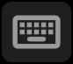
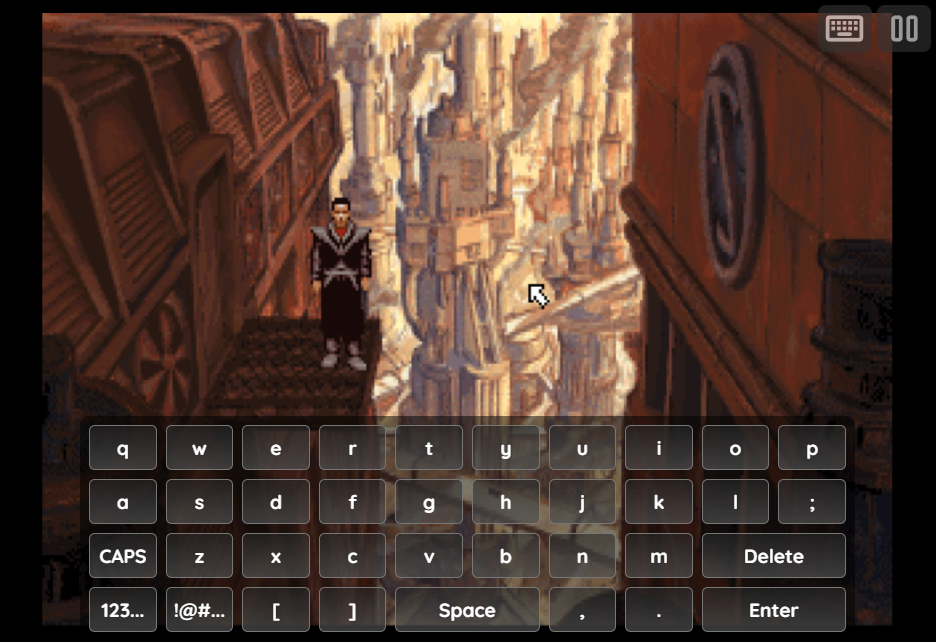
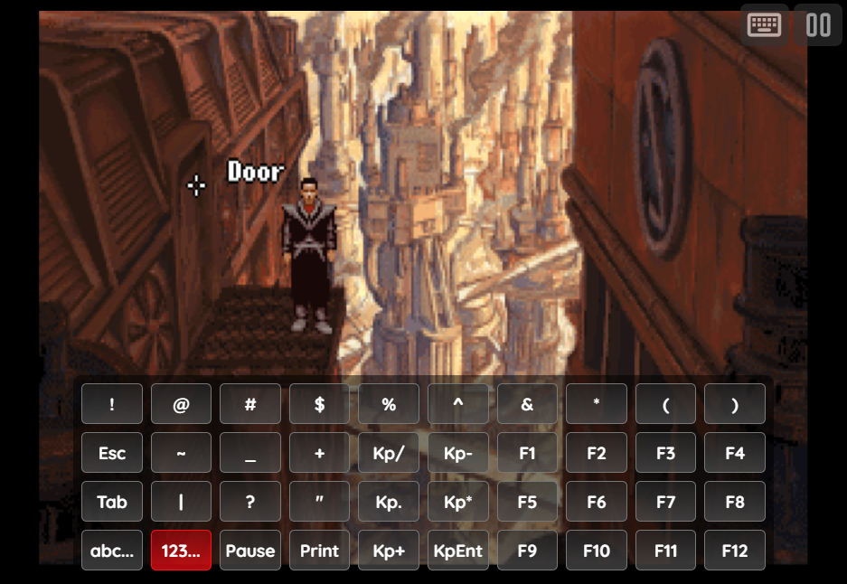
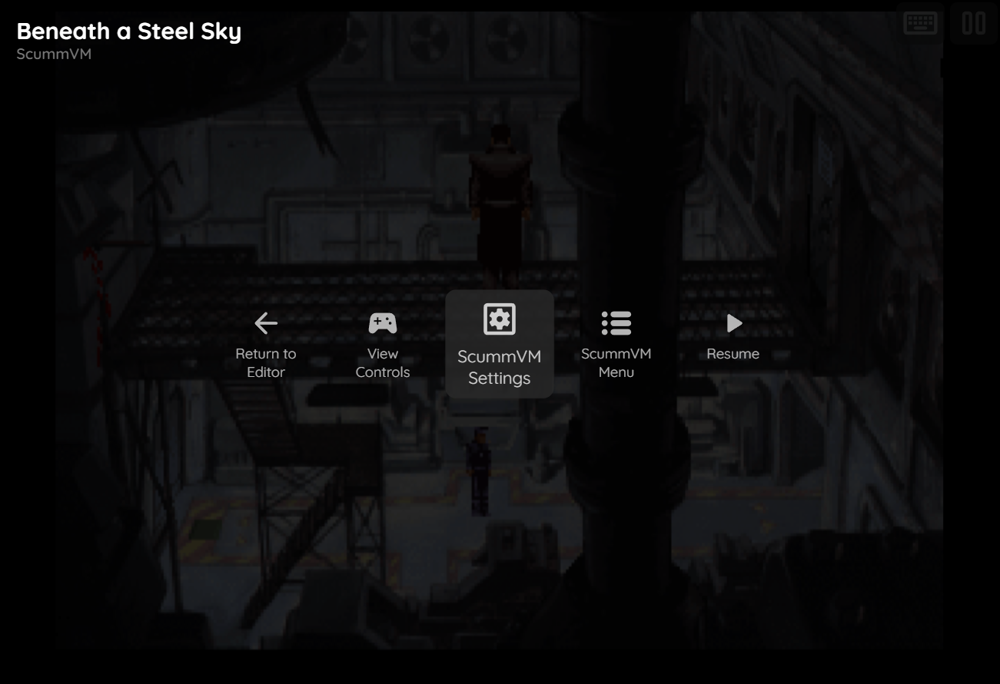
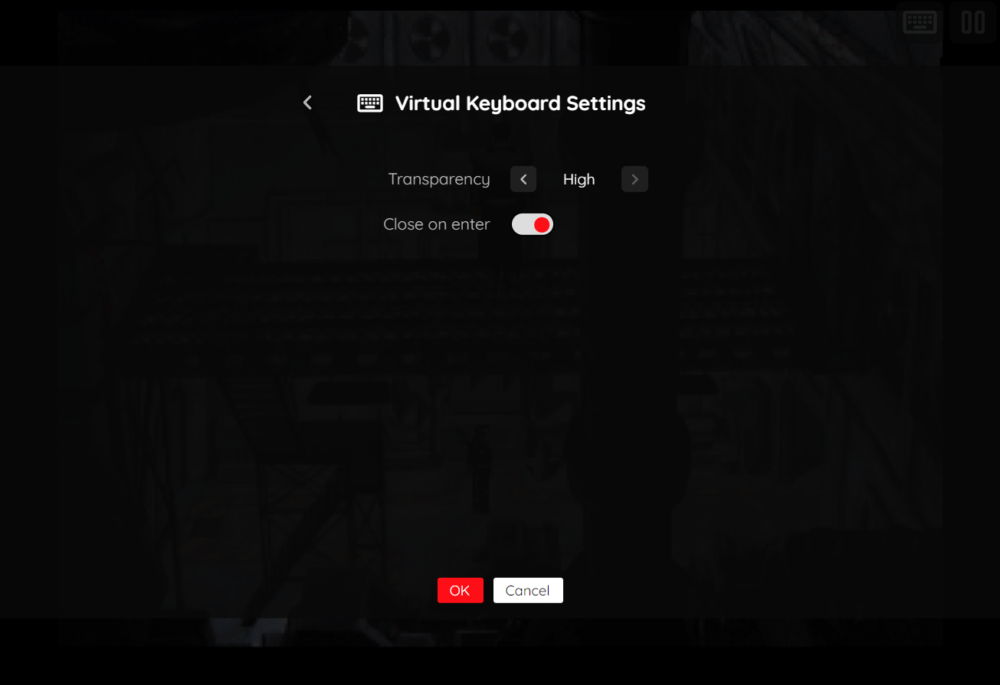
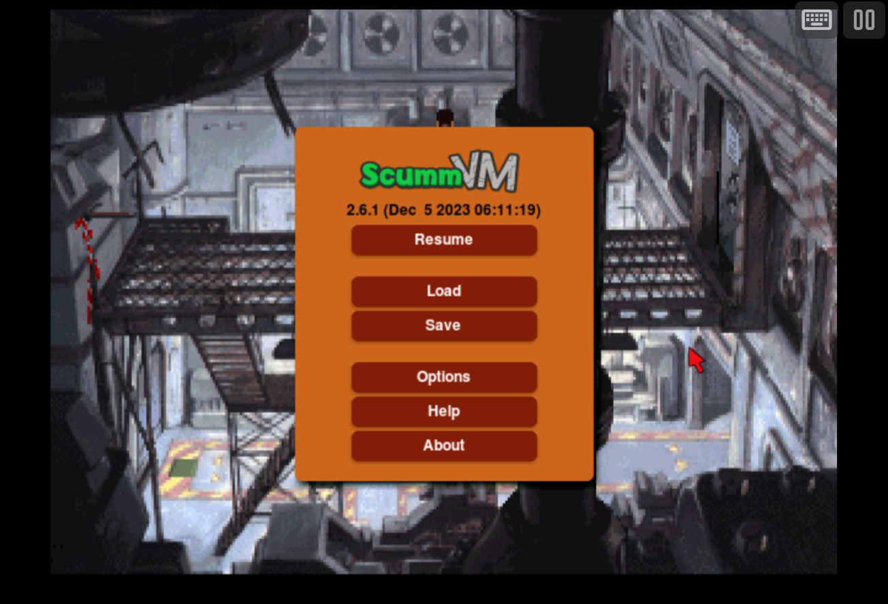

# ScummVM

## Overview

The [ScummVM](https://en.wikipedia.org/wiki/ScummVM) application plays classic graphical adventure and role-playing games.

The webЯcade ScummVM application is currently based on the 2.6.1 version of ScummVM. See the [Compatibility Page](https://www.scummvm.org/compatibility/2.6.1/) hosted on the ScummVM site for details on which games are supported by this version of ScummVM.

Due to the size and variety of games supported by ScummVM, not all games are available across the supported webЯcade platforms. See the [webЯcade ScummVM Compatibility](./compatibility.md) page for full details.

<figure>
  
  <figcaption>Flight of the Amazon Queen</figcaption>
</figure>

## Controls

The keyboard/mouse controls, gamepad mappings, and touch controls are listed in the tables below.

### Keyboard and Mouse

The following table contains the basic keyboard and mouse mappings.

| __Name__ | <div style="min-width:140px">__Keys__</div> | __Comments__ |
|--------------------------|---------------------------------------------| |
| Skip | {: class="control"}  | Skip the current sequence. |
| Skip Line | {: class="control"}  | Skip the current dialogue line. |
| Confirm | {: class="control"}  | Confirm the current prompt. |
| Pause Screen | {: class="control"} +  {: class="control"} | Displays the webЯcade pause screen.  |
| Pause Screen | {: class="control"} +  {: class="control"} | Displays the webЯcade pause screen. |

### Gamepad

Gamepad mappings are listed in the table below.

| __Name__ | <div style="min-width:140px">__Gamepad__</div> | __Comments__ |
| --- | --- | --- |
| Mouse | {: class="control"} | |
| Slow Mouse (Hold) | {: class="control"} | Hold to decrease the speed of mouse movement. |
| Cursor Keys | {: class="control"} | |
| Left Mouse  | {: class="control"}  | |
| Right Mouse  | {: class="control"}  | |
| Skip(Escape)  | {: class="control"}  | Skip the current sequence. |
| Skip Line (Period)  | {: class="control"}  | Skip the current dialogue line.  |
| Game-specific Menu (if applicable)  | {: class="control"}  | |
| Show Virtual Keyboard                       | {: class="control"}  | Not available for Xbox and not recommended for iOS (see alternate)<br><br>Press the __View (Back) Button__. |
| Show Virtual Keyboard<br>(Alternate)           | {: class="control"} &nbsp;and&nbsp; {: class="control"} | Hold down the __Right Trigger__ and click (press down) on the __Left Thumbstick__. |
|  Show WebЯcade Pause Screen                        | {: class="control"} | Not available for Xbox and not recommended for iOS (see alternate)<br><br>Press the __Menu (Start) Button__. |
|  Show WebЯcade Pause Screen<br>(Alternate)            | {: class="control"} &nbsp;and&nbsp; {: class="control"} | Hold down the __Right Trigger__ and click (press down) on the __Right Thumbstick__. |

Standard webЯcade mappings to display the pause screen.

| __Name__ | <div style="min-width:140px">__Gamepad__</div> | __Comments__ |
| --- | --- | --- |
| Show WebЯcade Pause Screen                    | {: class="control"} &nbsp;and&nbsp; {: class="control"} | Not available for Xbox and not recommended for iOS (see alternate 3 or 4)<br><br>Hold down the __Left Trigger__ and press the __Menu (Start) Button__. |
| Show WebЯcade Pause Screen<br>(Alternate)        | {: class="control"} &nbsp;and&nbsp; {: class="control"} | Not available for Xbox and not recommended for iOS (see alternate 3 or 4)<br><br>Hold down the __Left Trigger__ and press the __View (Back) Button__. |
| Show WebЯcade Pause Screen<br>(Alternate 2)        | {: class="control"} &nbsp;and&nbsp; {: class="control"} | Not available for Xbox and not recommended for iOS (see alternate 3 or 4)<br><br>Hold down the __X Button__ and press the __View (Back) Button__. |
| Show WebЯcade Pause Screen<br>(Alternate 3)        | {: class="control"} &nbsp;and&nbsp; {: class="control"} | Hold down the __Left Trigger__ and click (press down) on the __Left Thumbstick__. |
| Show WebЯcade Pause Screen<br>(Alternate 4)        | {: class="control"} &nbsp;and&nbsp; {: class="control"} | Hold down the __Left Trigger__ and click (press down) on the __Right Thumbstick__. |

### Touch Controls

WebЯcade supports two different touch control modes for webЯcade as described below.

This mode can be toggled via the "Toggle Touch Mode" button within the [On-screen controls](#on-screen-controls).

---

#### Touchpad Mode: <span style="color:#ee5755">Disabled</span>

When touchpad mode is *disabled*, the cursor will move directly to where the finger is tapped. While this mode can be fairly intuitive, it does have a tenancy to obstruct visibility to items that are beneath the finger. Additionally, it makes it difficult to navigate and click on the edges of the screen.

| __Gesture__ | __Description__ |
| --- | --- |
| Short single finger tap | Move pointer to finger position and left mouse button click |
| Short second finger tap while holding one finger | Move pointer to first finger position and right mouse button click |
| Single finger drag | Move pointer directly with finger |
| Two finger drag | <p>Move pointer while left mouse button is held down (drag and drop).</p><p>The pointer directly follows the first finger.</p><p>The drag is ended when the last finger is removed.</p>|
| Three finger drag | <p>Move pointer while right mouse button is held down (drag and drop).</p><p>The pointer directly follows the first finger.</p><p>The drag is ended when the last finger is removed.</p>|

---

#### Touchpad Mode: <span style="color:#4eae57">Enabled</span>

When touchpad mode is *enabled*, dragging the finger tends to act like using a touchpad on a laptop, etc. The mouse cursor is moved relative to the movement of the finger. While this mode may not be as initially intuitive, it does allow for increased visibility of the items that are being interacted with, and it is much simpler to navigate and click on the edges of the screen.

| __Gesture__ | __Description__ |
| --- | --- |
| Short single finger tap | Left mouse button click |
| Short second finger tap while holding one finger | Right mouse button click |
| Single finger drag | Move pointer indirectly with finger |
| Two finger drag | <p>Move pointer while left mouse button is held down (drag and drop).</p><p>The pointer motion is affected by the first finger.</p><p>The drag is ended when the last finger is removed.</p> |
| Three finger drag | <p>Move pointer while right mouse button is held down (drag and drop).</p><p>The pointer motion is affected by the first finger.</p><p>The drag is ended when the last finger is removed.</p> |

## Packaging Games

ScummVM games must be packaged as an archive (`.zip`) file for use with webЯcade. This archive file can also be *(optionally)* converted to a webЯcade [package archive manifest](../../../advanced/archive-manifests.md) (`.json`) layout to reduce browser memory use and increase compatibility with memory limited devices (iOS and Xbox).

!!! important
    The  webЯcade editor's [repackage archive tool](../editor/tools/repackage-archive.md) can be used
    to automatically generate package archive manifests.

Each ScummVM game has its own specific file layout requirements. One of the best ways to determine this layout is via the [ScummVM Wiki](https://wiki.scummvm.org/index.php?title=Category:Supported_Games).

For example, [this ScummVM Wiki page](https://wiki.scummvm.org/index.php?title=Flight_of_the_Amazon_Queen) details the structure necessary for the game, "Flight of the Amazon Queen" (see the *Installation* and *Required Data Files* sections).

!!! important
    For ScummVM game archive (`.zip`) sizes that are over 100 megabytes in size, it is highly recommended that the webЯcade [package archive manifest](../../../advanced/archive-manifests.md) (`.json`) layout be utilized. This will greatly
    reduce the amount of memory necessary for the browser to load the game, and increase
    compatibility with devices with higher memory use limitations (iOS and Xbox).

## Adding Games (Feed Editor)

Due to the variability of packaging ScummVM games, adding ScummVM-based games in the [Feed Editor](../../../editor/index.md) must be done manually (versus using auto-detection).

See the [Adding Disc and Archive-based Items](../../../editor/workspace/addingitems.md#disc-and-archive-based-items) section for details on adding ScummVM-based games in the [Feed Editor](../../../editor/index.md).

!!! important
    Both the Safari (iOS and macOS) and Xbox Series X|S Edge browsers limit the amount of memory that can be consumed by a particular web application (such as webЯcade).
    <p>
    On macOS, it is recommended that the Chrome Browser be utilized to increase the size of ScummVM games that can be loaded.
    </p>
    <p>
    To increase the likelihood of loading larger ScummVM games on iOS and Xbox you can optionally choose to launch the game using a standalone-based link (versus launching the game within the webЯcade player or editor). See the [Standalone](../../../standalone/index.md) section of this documentation for further information (On Xbox, you would most likely want to bookmark the direct link. On iOS, you would most likely want to add the game to the home screen).
    </p>

## On-screen Controls

<figure>
  
  <figcaption>On-screen Controls</figcaption>
</figure>

The ScummVM application includes a set of on-screen controls which are detailed below.

| __Button__ |  | __Description__ |
| --- | --- | --- |
| Virtual Keyboard |    | Displays the [Virtual Keyboard](#virtual-keyboard). |
| Toggle Touch Mode |   | Toggles the current touch mode (See [Touch Controls](#touch-controls)).<p>*NOTE: This button is only visible if touch input has been detected.*</p> |
| Pause (Show Pause Screen) |   | Displays the webЯcade pause screen. |

## Virtual Keyboard

The ScummVM application includes a virtual keyboard that can be utilized on devices that don't have a physical keyboard readily available (mobile, Xbox, etc.).

Display of the virtual keyboard can be toggled via the "Virtual Keyboard" button within the [On-screen controls](#on-screen-controls).

### Special Keys

The virtual keyboard includes the following "special" keys.

| __Key__ |  | __Description__ |
| --- | --- | --- |
| Switch to Letters Mode |    | Pressing this key will switch to the [Letters Mode](#letters-mode) of the keyboard. |
| Switch to Numbers Mode |    | Pressing this key will switch to the [Numbers Mode](#numbers-mode) of the keyboard. |
| Switch to Symbols Mode |    | Pressing this key will switch to the [Symbols Mode](#symbols-mode) of the keyboard. |
| Change Keyboard Position |    | <p>Toggles between the various keyboard positions (center, bottom, etc.).</p><p>This key is available via the [Numbers Mode](#numbers-mode) of the keyboard.</p>  |

### Letters Mode

This mode primarily contains letters.

<figure>
  
  <figcaption>Virtual Keyboard: Letters Mode</figcaption>
</figure>

### Numbers Mode

This mode primarily contains numbers, the `ESCAPE` key, and the ability to toggle holding down the `SHIFT` and `CONTROL` keys.

<figure>
  
  <figcaption>Virtual Keyboard: Numbers Mode</figcaption>
</figure>

### Symbols Mode

This mode primarily contains symbols and `FUNCTION` keys.

<figure>
  
  <figcaption>Virtual Keyboard: Symbols Mode</figcaption>
</figure>

## Pause Screen

The ScummVM application's pause screen provides options to access the [ScummVM Application Settings](#scummvm-settings) as well as the ability to display the native [ScummVM Menu](#scummvm-menu).

<figure>
  
  <figcaption>Pause Screen</figcaption>
</figure>

### ScummVM Settings

The ScummVM application includes a custom settings dialog.

To access these settings, display the "Pause" screen and select the "ScummVM Settings" option (*See screenshot above*).

#### Display Settings Tab

<figure>
  
  <figcaption>Display Settings</figcaption>
</figure>

The ScummVM application's "Display Settings" tab is detailed below.

| __Field__ | __Description__ |
| --- | --- |
| Screen size | The screen size to use when playing a game.<br><br>Options include:<br><ul><li>`Native` : The application's native resolution</li><li>`16:9` : Widescreen resolution</li><li>`Fill` : Fill the entire contents of the screen</li></ul> |
| On-screen controls | Toggle whether the on-screen controls should always be displayed, or only displayed once touch input has been detected. |
| Show system pointer | <p>Whether to always show the browser's mouse pointer in addition to the game-specific pointer.</p><p>While this essentially displays two pointers (on top of each other), it prevents not being able to find the mouse pointer when a game is not actively displaying one (during cut scenes, various modes, etc.).</p> |

#### Virtual Keyboard Settings

<figure>
  
  <figcaption>Virtual Keyboard Settings</figcaption>
</figure>

The ScummVM application's "Virtual Keyboard Settings" tab is detailed below.

| __Field__ | __Description__ |
| --- | --- |
| Transparency | <p>Toggles the degree of transparency the virtual keyboard should have.</p><p>A higher degree of transparency allows more of the game to be visible through the keyboard (which may make the keyboard itself less visible).</p> |
| Clone on Enter | Whether the keyboard should be closed when the `Enter` key is pressed. |

### ScummVM Menu

The webЯcade ScummVM application provides access to the native ScummVM menu.

To access this menu, display the "Pause" screen and select the "ScummVM Menu" option ([See Pause Screen](#pause-screen)).

<figure>
  
  <figcaption>ScummVM Menu</figcaption>
</figure>

The options within the native ScummVM menu will vary based on the game being played. However, the menu will typically contain options for saving and loading the state of the current game, setting game-specific configuration options, etc.

## Saved Games

This application supports persisting game saves as well as game-specific settings into the browser's local storage or optionally to [cloud-based storage](../../../storage/index.md). Saved games can be loaded and resumed on subsequent gaming sessions.

## Feed

This section details how ScummVM application instances can be added to feeds.

### Type

The type name for the ScummVM application is `scummvm`.

!!! note
    The alias `scumm` also currently maps to this application. In the future, the `scumm` alias may be mapped
    to another ScummVM application (different engine implementation) if it is determined to be a
    more appropriate default.

### Properties

The table below contains the properties that are specific to the ScummVM application. These properties are
specified in the `props` object of a feed item.

| __Property__ | __Type__ | __Required__ | __Details__ |
|----------|------|----------|---------|
| uid | String | Yes | <p>A unique identifier for the particular game (must be unique across all ScummVM games).</p><p>This identifier is primarily used to associate persistent state with the game.</p>|
| archive | URL | Yes | URL to a ScummMVM game archive (`.zip`) or webЯcade [package archive manifest](../../../advanced/archive-manifests.md) (`.json`) file. |
| zoomLevel | Numeric | No | A numeric value indicating how much the display image should be zoomed in (0-40). |

### Example

The following is an example of a complete feed that consists of a single ScummVM application instance (`type` value of `scumm`). The `archive` property value is a URL that points to a Dropbox location that contains a webЯcade [package archive manifest](../../../advanced/archive-manifests.md) file for the game, "Flight of the Amazon".

``` json hl_lines="9 12"
{
  "title": "ScummVM Feed",
  "categories": [
    {
      "title": "ScummVM Games",
      "items": [
        {
          "title": "Flight of the Amazon Queen",
          "type": "scumm",
          "props": {
            "uid": "5edb2784-1acb-42c1-beed-6470a546cad5",
            "archive": "https://www.dropbox.com/scl/fi/djrtdavrj5p5f2jvqitgx/WRC-MANIFEST.JSON?rlkey=gnvm8tvagr3urvdff1chvd4cs&dl=0"
          }
        }
      ]
    }
  ]
}
```

This example can be tested by adding a feed with the following URL within the [webЯcade player](../../../userguide/index.md):

`http://tinyurl.com/sample-scumm-feed`

## References

- [ScummVM Application GitHub Repository](https://github.com/webrcade/webrcade-app-scummvm)
