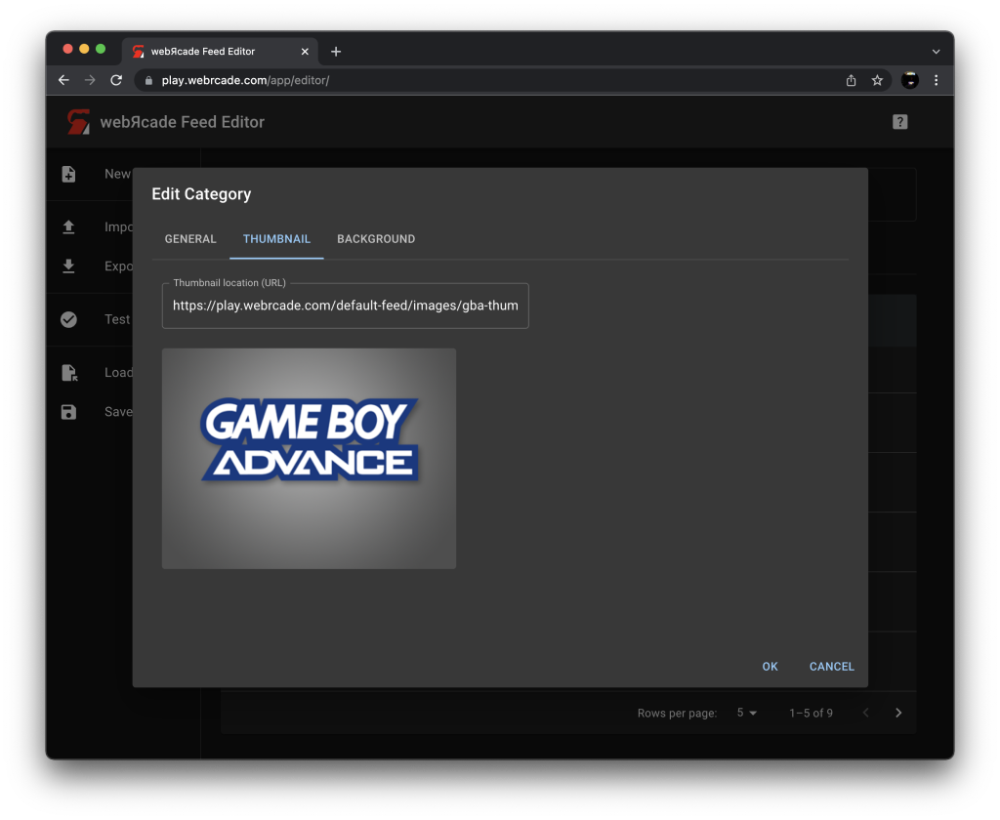

# Category Editor

The "Category Editor" is used to create and/or edit "category" entries within a webЯcade feed. Category entries provide a means of classifying items (games, etc.) into user-defined groups
(by game type, console type, etc.). 

For a feed to be considered valid it must contain at least one category object.

  * Categories can be added to the current feed via the [Categories Tab](../workspace/categoriestab.md) of the [Feed Workspace](../workspace/index.md). 
  * Items can be added to categories via the [Items Tab](../workspace/itemstab.md) of the [Feed Workspace](../workspace/index.md).

!!! note
    The fields within the "Category Editor" support drag and drop functionality. See the [Drag and Drop](../draganddrop.md) section for more information. Specifically the sections demonstrating how to [Drag Text](../draganddrop.md#drag-text) and [Drag Images](../draganddrop.md#drag-images).

## General Tab

The general tab consists of basic information about the category (title, description, etc.).

{: class="center zoomD"}

### Fields

| __Field__ | __Description__ |
| --- | --- |
| Title | A title for the category. |
| Long title |A long title for the category (will be used in locations with additional room for display). |
| Description | A description of the category. |

## Thumbnail Tab

{: class="center zoomD"}

## Background Tab

{: class="center zoomD"}
