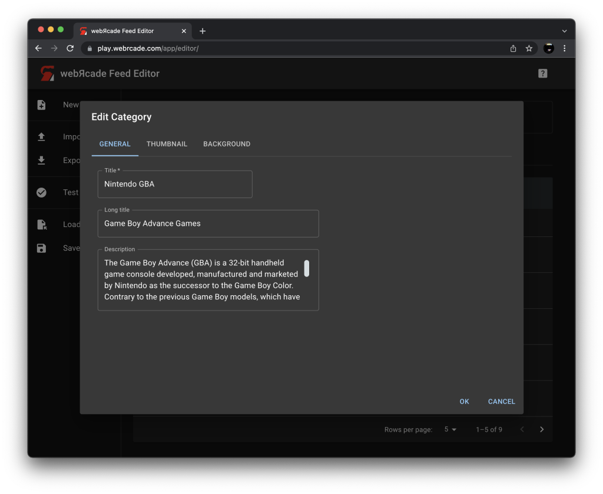
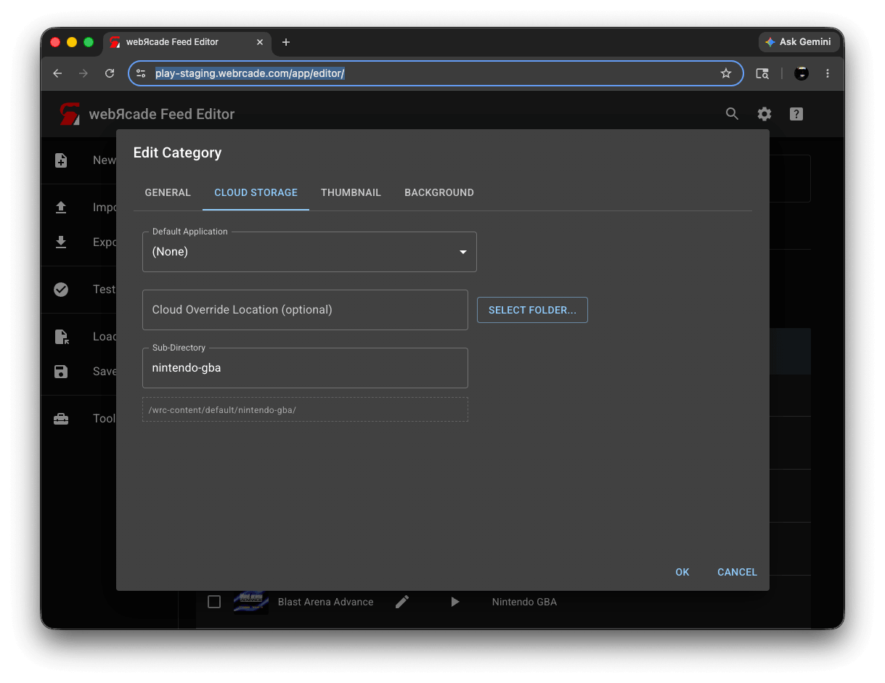
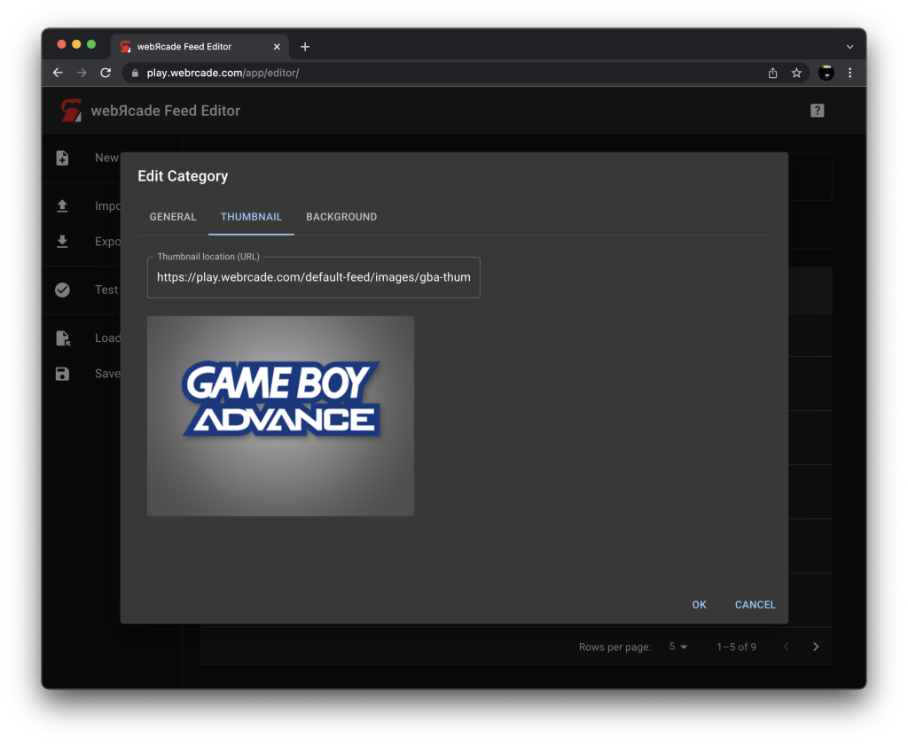
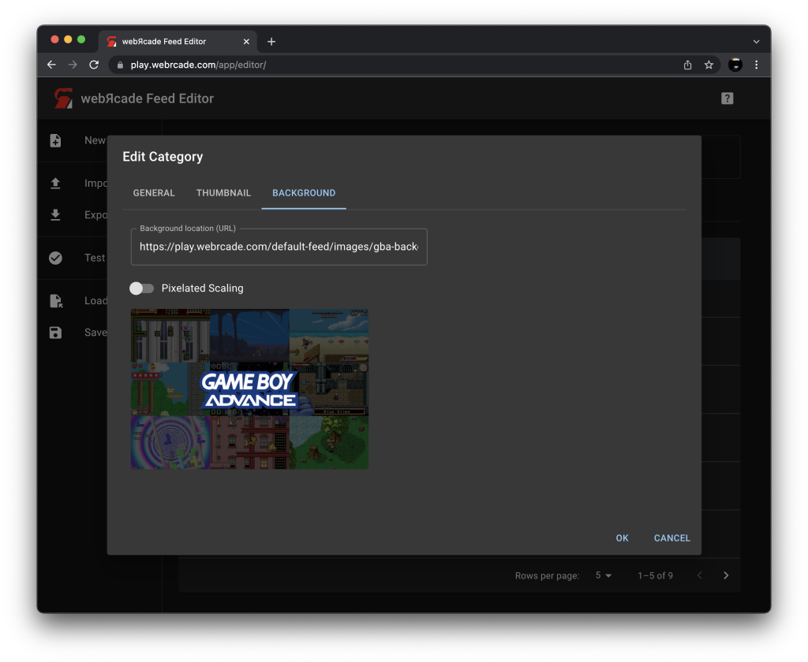

# Category Editor

The "Category Editor" is used to create and/or edit "category" entries within a webЯcade feed. Category entries provide a means of classifying items (games, etc.) into user-defined groups
(by game type, console type, etc.).

For a feed to be considered valid it must contain at least one category object.

  * Categories can be added to the active feed via the [Categories Tab](../workspace/categoriestab.md) of the [Feed Workspace](../workspace/index.md).
  * Items can be added to categories via the [Items Tab](../workspace/itemstab.md) of the [Feed Workspace](../workspace/index.md).

!!! note
    The fields within the "Category Editor" support drag and drop functionality. See the [Drag and Drop](../draganddrop.md) section for more information. Specifically the sections demonstrating how to [Drag Text](../draganddrop.md#drag-text) and [Drag Images](../draganddrop.md#drag-images).

## General Tab

The general tab consists of basic information about the category (title, description, etc.).

{: class="center zoomD"}

### Fields

| __Field__ | __Description__ |
| --- | --- |
| Title | A title for the category. |
| Long title | A long title for the category (will be used in locations with additional room for display). |
| Description | A description of the category. |

## Cloud Storage Tab

!!! note
    The Cloud Storage tab is only shown when cloud storage has been enabled. See the [Cloud Storage](../workspace/settings.md#cloud-storage-tab) section of the Settings dialog for setup instructions.

The Cloud Storage tab controls where this category's content is stored in your cloud storage, and sets an optional default application for local file uploads.

By default, a category's content is stored inside the feed's storage path (set in the [Feed Editor Cloud Storage tab](feed-dialog.md#cloud-storage-tab)), in a sub-folder named after the category. You can override this on a per-category basis using the Cloud Override Location field, which lets you store a category in any folder in your cloud storage, independent of where the feed's content lives.

A read-only display at the bottom of the tab shows the full path for this category and updates automatically as you make changes.

Content uploaded for items in this category is organized as follows within the category path:

* ROM, disc, and other game files are stored in an `items` sub-folder.
* Thumbnail and background images for items are stored in `items/images`.
* Thumbnail and background images for the category itself are stored in `images`.

{: class="center zoomD"}

### Fields

| __Field__ | __Description__ |
| --- | --- |
| Default Application | When set, any file added to this category that cannot be identified automatically will be assigned this application type, provided the file is compatible with it (for example, a `.chd` file is compatible with PlayStation, Sega CD, Neo Geo CD, and others). Files that are not compatible with the default application are left unassigned and will need to be assigned manually. See [Adding Items: Local Files](../workspace/addingitems-local.md) for details on the local file workflow. |
| Cloud Override Location (optional) | By default, this category is stored inside the feed's storage path. If you set an override here, the category is stored at the chosen folder instead, completely independent of the feed path. The Sub-Directory is still appended to the override folder. Click *Select folder...* to choose a folder. Click the `X` to remove the override. |
| Sub-Directory | The name of the sub-folder for this category's content. When no override is set, this folder is created inside the feed's storage path. When an override is set, it is created inside the override folder. Defaults to the category name in lowercase with spaces replaced by hyphens. Use the reset button to restore the default. |
| Storage Path | Read-only. Shows the full storage path for this category as it will be used, and updates automatically as you adjust the fields above. |

## Thumbnail Tab

The thumbnail tab allows a thumbnail for the category to be specified. The thumbnail image will be displayed in the [webЯcade player](../../userguide/index.md).

{: class="center zoomD"}

### Fields

| __Field__ | __Description__ |
| --- | --- |
| Thumbnail location (URL) | The location (URL) of a thumbnail image for the category.  This field supports drag and drop of image-based URLs (see [Drag Images](../draganddrop.md#drag-images) for more information). |
| Thumbnail image | The image corresponding to the specified URL in `Thumbnail location`.  Image-based URLs can be dragged and dropped on the image to set the `Thumbnail location` (see [Drag Images](../draganddrop.md#drag-images) for more information). |

## Background Tab

The background tab allows a background image for the category to be specified. The background image will be displayed in the [webЯcade player](../../userguide/index.md).

{: class="center zoomD"}

### Fields

| __Field__ | __Description__ |
| --- | --- |
| Background location (URL) | The location (URL) of a background image for the category.  This field supports drag and drop of image-based URLs (see [Drag Images](../draganddrop.md#drag-images) for more information). |
| Pixelated Scaling | Whether to pixelate the image when it is sized to fit the dimensions of the [webЯcade player](../../userguide/index.md). This option should typically be enabled when a screenshot with smaller dimensions is being used as a background image. Without enabling this option, the screenshot will most likely appear blurry when stretched to fit the player's dimensions. |
| Background image | The image corresponding to the specified URL in `Background location`.  Image-based URLs can be dragged and dropped on the image to set the `Background location` (see [Drag Images](../draganddrop.md#drag-images) for more information).   |
