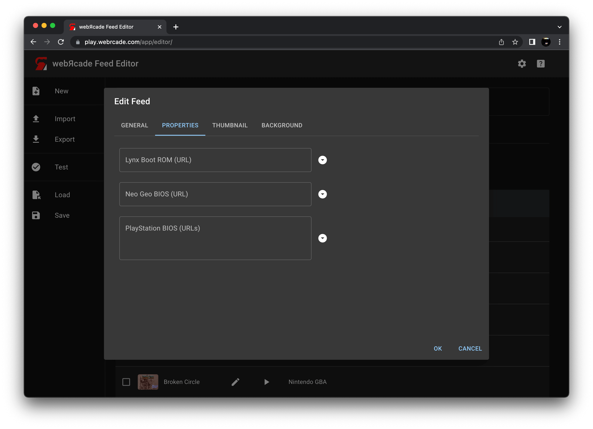
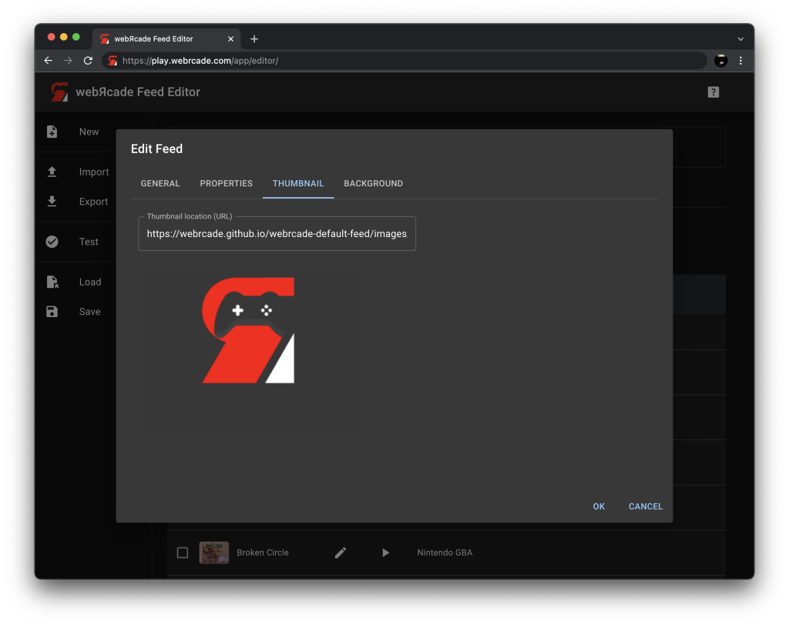

# Feed Properties Editor

The "Feed Properties Editor" is used to edit high-level information about the feed, including a title, an optional description, and optional images.

  * Categories can be added to the active feed via the [Categories Tab](../workspace/categoriestab.md) of the [Feed Workspace](../workspace/index.md).
  * Items can be added to categories via the [Items Tab](../workspace/itemstab.md) of the [Feed Workspace](../workspace/index.md).

!!! note
    The fields within the "Feed Properties Editor" support drag and drop functionality. See the [Drag and Drop](../draganddrop.md) section for more information. Specifically the sections demonstrating how to [Drag Text](../draganddrop.md#drag-text) and [Drag Images](../draganddrop.md#drag-images).

## General Tab

The general tab consists of basic information about the feed (title, description, etc.).

{: class="center zoomD"}

### Fields

| __Field__ | __Description__ |
| --- | --- |
| Title | A title for the feed. |
| Long title | A long title for the feed (will be used in locations with additional room for display). |
| Description | A description of the feed. |

## Properties Tab

The properties tab consists of fields that are global for the various [Application](../../apps/index.md) types that are contained within the feed.

{: class="center zoomD"}

For example, the *Atari Lynx Boot ROM* field shown in the screenshot above, is used to specify the location (URL) of the Lynx Boot ROM that is required by [Atari Lynx](../../apps/emulators/lynx/index.md) items. The *Neo Geo BIOS* field is used to specify the location (URL) of a `.zip` file containing one or more Neo Geo BIOS files required by [Neo Geo](../../apps/emulators/neogeo/index.md) items.

## Thumbnail Tab

The thumbnail tab allows a thumbnail for the feed to be specified. The thumbnail image will be displayed in the [webЯcade player](../../userguide/index.md).

{: class="center zoomD"}

### Fields

| __Field__ | __Description__ |
| --- | --- |
| Thumbnail location (URL) | The location (URL) of a thumbnail image for the feed.  The dimensions of the image must be `400x300` or it may not be displayed (see [Thumbnails](../thumbnails.md) section for more information).  This field supports drag and drop of image-based URLs (see [Drag Images](../draganddrop.md#drag-images) for more information). |
| Thumbnail image | The image corresponding to the specified URL in `Thumbnail location`.  Image-based URLs can be dragged and dropped on the image to set the `Thumbnail location` (see [Drag Images](../draganddrop.md#drag-images) for more information). |

## Background Tab

The background tab allows a background image for the feed to be specified. The background image will be displayed in the [webЯcade player](../../userguide/index.md).

{: class="center zoomD"}

### Fields

| __Field__ | __Description__ |
| --- | --- |
| Background location (URL) | The location (URL) of a background image for the feed.  This field supports drag and drop of image-based URLs (see [Drag Images](../draganddrop.md#drag-images) for more information). |
| Pixelated Scaling | Whether to pixelate the image when it is sized to fit the dimensions of the [webЯcade player](../../userguide/index.md). This option should typically be enabled when a screenshot with smaller dimensions is being used as a background image. Without enabling this option, the screenshot will most likely appear blurry when stretched to fit the player's dimensions. |
| Background image | The image corresponding to the specified URL in `Background location`.  Image-based URLs can be dragged and dropped on the image to set the `Background location` (see [Drag Images](../draganddrop.md#drag-images) for more information).   |