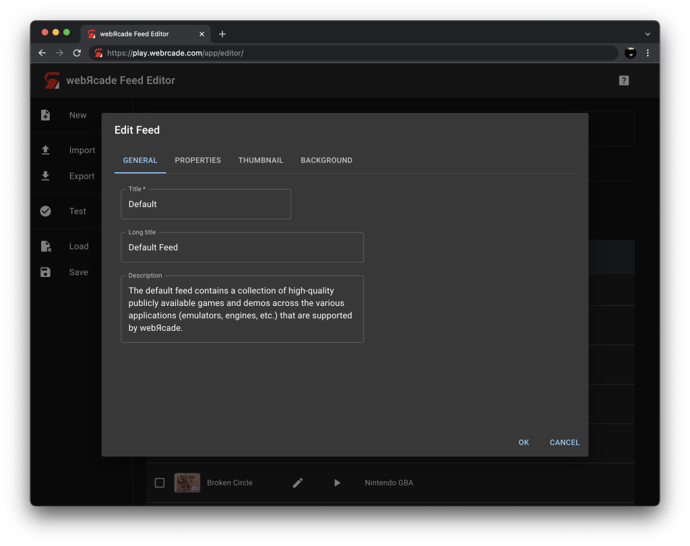
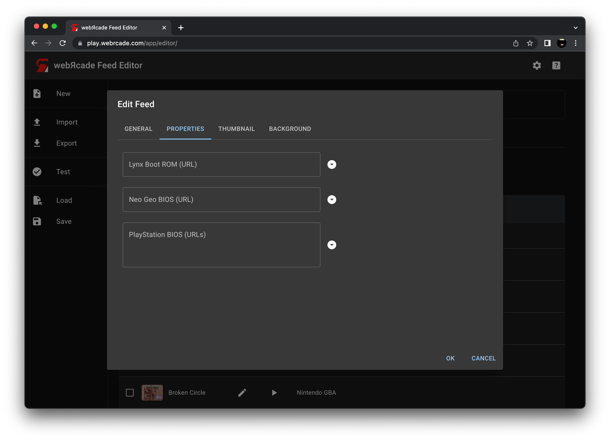
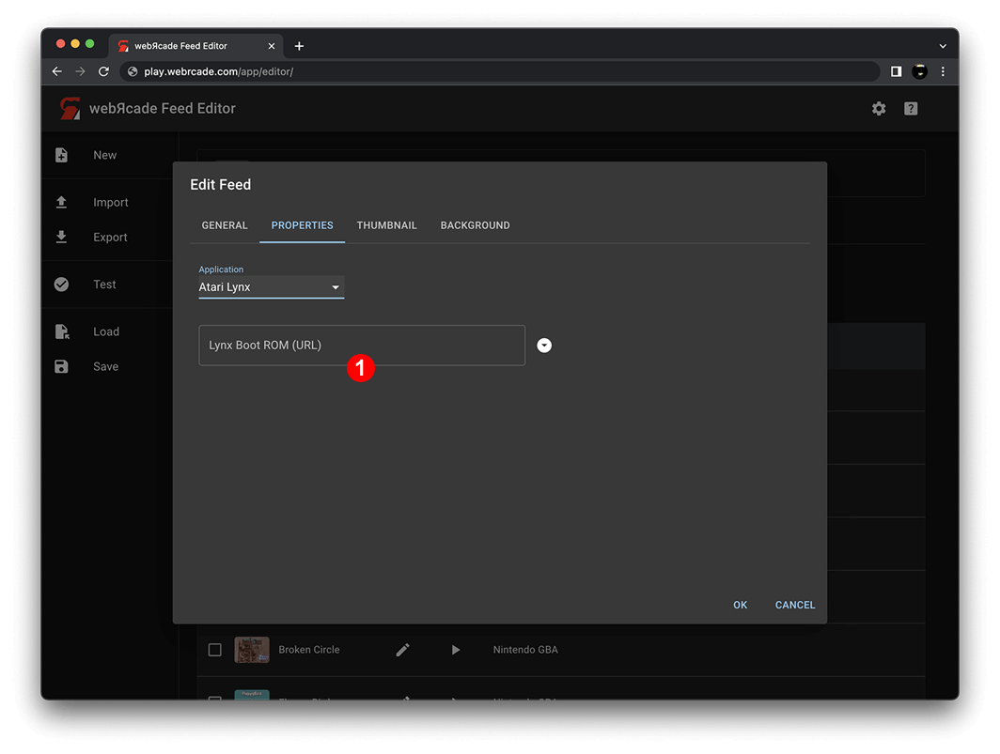
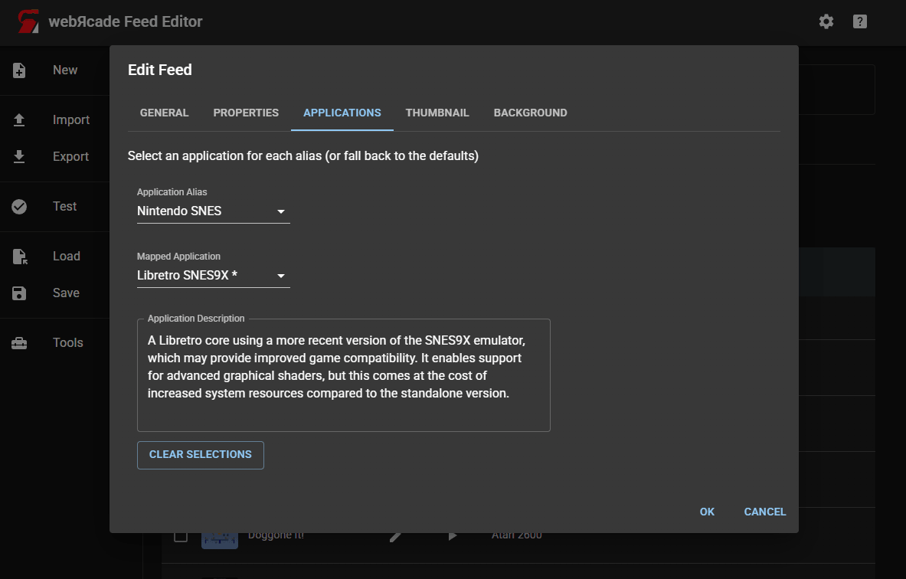
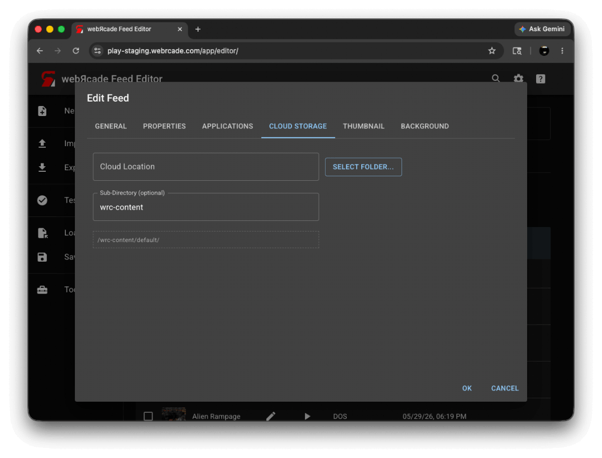
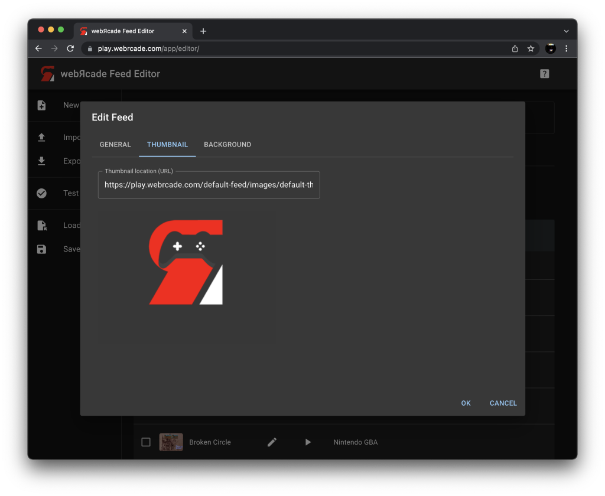
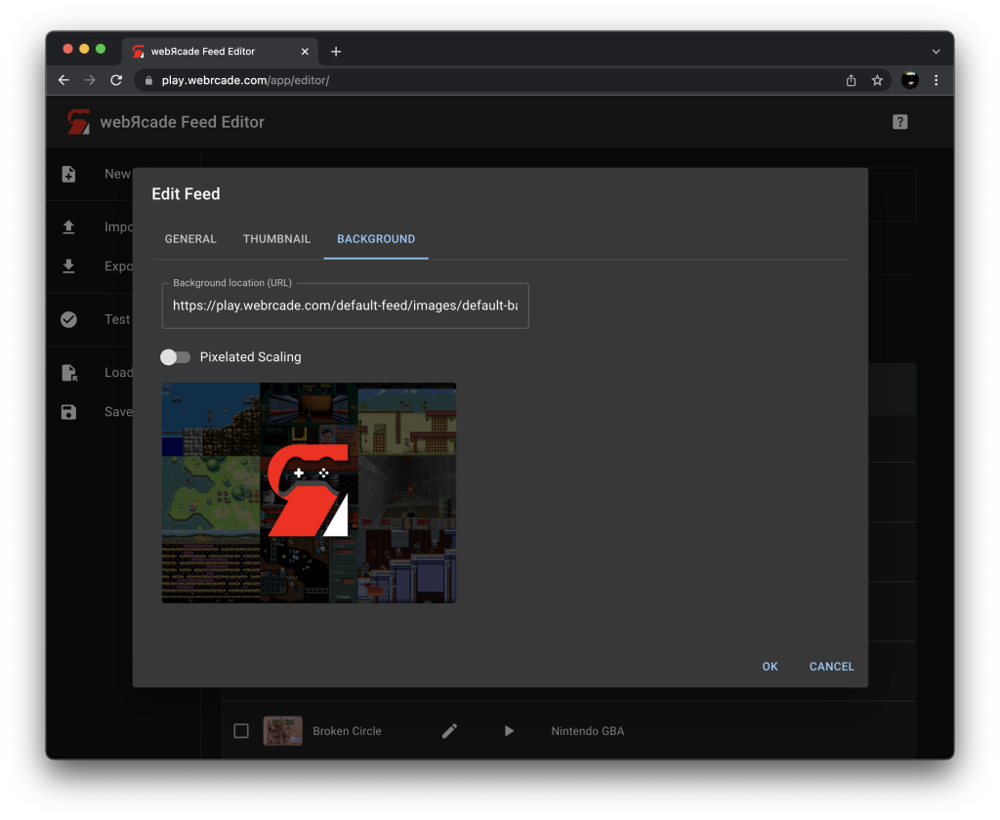

# Feed Properties Editor

The "Feed Properties Editor" is used to edit high-level information about the feed, including a title, an optional description, and optional images.

  * Categories can be added to the active feed via the [Categories Tab](../workspace/categoriestab.md) of the [Feed Workspace](../workspace/index.md).
  * Items can be added to categories via the [Items Tab](../workspace/itemstab.md) of the [Feed Workspace](../workspace/index.md).

!!! note
    The fields within the "Feed Properties Editor" support drag and drop functionality. See the [Drag and Drop](../draganddrop.md) section for more information. Specifically the sections demonstrating how to [Drag Text](../draganddrop.md#drag-text) and [Drag Images](../draganddrop.md#drag-images).

## General Tab

The general tab consists of basic information about the feed (title, description, etc.).

{: class="center zoomD"}

### Fields

| __Field__ | __Description__ |
| --- | --- |
| Title | A title for the feed. |
| Long title | A long title for the feed (will be used in locations with additional room for display). |
| Description | A description of the feed. |

## Properties Tab

The properties tab consists of fields that are global for the various [Application](../../apps/index.md) types that are contained within the feed.

{: class="center zoomD"}

Use the `Application` pull-down to select the application to edit settings for (*See #1 in screenshot above*).

### Fields

| __Field__ | __Description__ |
| --- | --- |
| Application | Used to select the application to edit settings for (*See #1 in screenshot above*). |

{: class="center zoomD"}

Once an application type is selected, its corresponding fields will be displayed. For example, the *Atari Lynx Boot ROM* field shown in the screenshot above, is used to specify the location (URL) of the Lynx Boot ROM that is required by [Atari Lynx](../../apps/emulators/lynx/index.md) items.

## Applications Tab

The applications tab is used to select the specific application (emulator implementation) to use for each application alias (e.g., `nes`, `snes`, `saturn`) *for this feed*. This allows for specifying preferred applications on a per-feed basis.

{: class="center zoomD"}

!!! note
    Application mappings are resolved in the following order:

    1. **Item-specific setting** — If a specific application (emulator) has been set for the item, it is used.
    2. **User default setting** — If no item-specific mapping exists, the user’s default mapping from the [Settings Dialog](../workspace/settings.md#applications-tab) is used (if configured).
    3. **Feed setting** — If no user mapping is set, the mapping defined in the feed is used.
    4. **Global default** — If none of the above are set, the alias falls back to its global default application.

### Fields

| __Field__ | __Description__ |
| --- | --- |
| Application Alias | The alias to configure. Use the dropdown to select from the available aliases (e.g., `NEC PC Engine`, `NEC SuperGrafx`, `NES`, `SNES`, etc.). |
| Mapped Application | The application (emulator implementation) to use for the selected alias within this feed. Use the dropdown to select from the available options. |
| Clear Selections | Pressing the `Clear Selections` button resets all alias mappings back to `(use default)`. |

## Cloud Storage Tab

!!! note
    The Cloud Storage tab is only shown when cloud storage has been enabled. See the [Cloud Storage](../workspace/settings.md#cloud-storage-tab) section of the Settings dialog for setup instructions.

The Cloud Storage tab determines where this feed's content is stored in your cloud storage. The full storage path is built from the Cloud Location you select, the Sub-Directory, and the feed's name, combined into a single folder. All category content for this feed is stored inside that folder, each category in its own sub-folder.

A read-only display at the bottom of the tab shows the full path as it will be used, and updates automatically as you make changes.

{: class="center zoomD"}

### Fields

| __Field__ | __Description__ |
| --- | --- |
| Cloud Location | The folder in your cloud storage to use as the starting point for this feed. The Sub-Directory and feed name are appended to this to form the full storage path. Click *Select folder...* to choose a folder. Click the `X` to remove the selection. |
| Sub-Directory (optional) | A sub-folder appended to the Cloud Location. The feed's name is then appended after this, giving a final storage path of `{Cloud Location}/{Sub-Directory}/{feed-name}/`. Defaults to `wrc-content`. Click *Reset* to return to the default. |
| Storage Path | Read-only. Shows the full storage path for this feed as it will be used, and updates automatically as you adjust the fields above. |

!!! note
    Feed-level assets such as BIOS files are stored in a reserved `__feed__` sub-folder inside the feed's storage path (for example, `{feed-path}/__feed__/psx/` for PlayStation BIOS files). Category content sits alongside it, each category in its own sub-folder. See [Cloud Storage Tab](#cloud-storage-tab-1) in the Category Editor for how category paths are resolved.

## Thumbnail Tab

The thumbnail tab allows a thumbnail for the feed to be specified. The thumbnail image will be displayed in the [webЯcade player](../../userguide/index.md).

{: class="center zoomD"}

### Fields

| __Field__ | __Description__ |
| --- | --- |
| Thumbnail location (URL) | The location (URL) of a thumbnail image for the feed.  This field supports drag and drop of image-based URLs (see [Drag Images](../draganddrop.md#drag-images) for more information). |
| Thumbnail image | The image corresponding to the specified URL in `Thumbnail location`.  Image-based URLs can be dragged and dropped on the image to set the `Thumbnail location` (see [Drag Images](../draganddrop.md#drag-images) for more information). |

## Background Tab

The background tab allows a background image for the feed to be specified. The background image will be displayed in the [webЯcade player](../../userguide/index.md).

{: class="center zoomD"}

### Fields

| __Field__ | __Description__ |
| --- | --- |
| Background location (URL) | The location (URL) of a background image for the feed.  This field supports drag and drop of image-based URLs (see [Drag Images](../draganddrop.md#drag-images) for more information). |
| Pixelated Scaling | Whether to pixelate the image when it is sized to fit the dimensions of the [webЯcade player](../../userguide/index.md). This option should typically be enabled when a screenshot with smaller dimensions is being used as a background image. Without enabling this option, the screenshot will most likely appear blurry when stretched to fit the player's dimensions. |
| Background image | The image corresponding to the specified URL in `Background location`.  Image-based URLs can be dragged and dropped on the image to set the `Background location` (see [Drag Images](../draganddrop.md#drag-images) for more information).   |