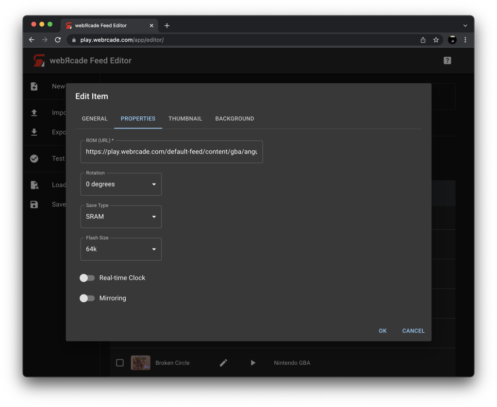
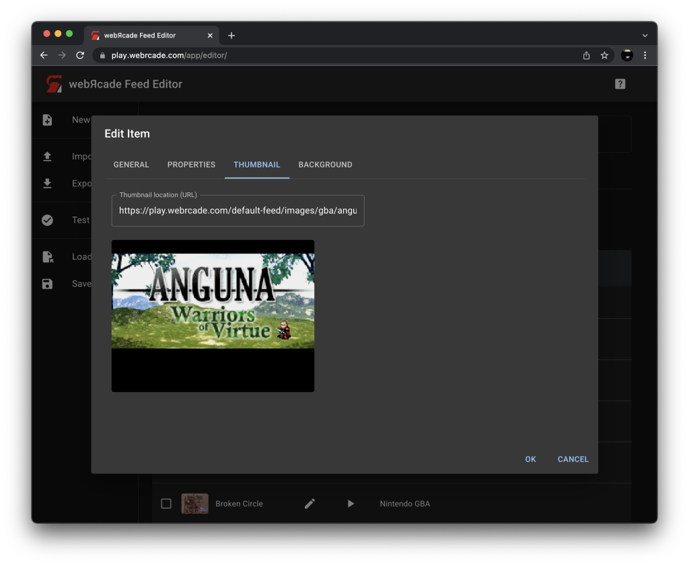

# Item Editor

## General Tab

{: class="center zoomD"}

### Fields

| __Field__ | __Description__ |
| --- | --- |
| Title | This is a test to see what long text looks like in here. This text will ultimately be replaced, this is only a test. |
| Long title |  |
| Description |  |
| Application |  |

## Properties Tab

{: class="center zoomD"}

## Thumbnail Tab

{: class="center zoomD"}

### Fields

| __Field__ | __Description__ |
| --- | --- |
| Thumbnail location (URL) | This is a test to see what long text looks like in here. This text will ultimately be replaced, this is only a test. |
| Thumbnail image |  |

## Background Tab

{: class="center zoomD"}

### Fields

| __Field__ | __Description__ |
| --- | --- |
| Background location (URL) | This is a test to see what long text looks like in here. This text will ultimately be replaced, this is only a test. |
| Pixelated Scaling |  |
| Background image |  |
