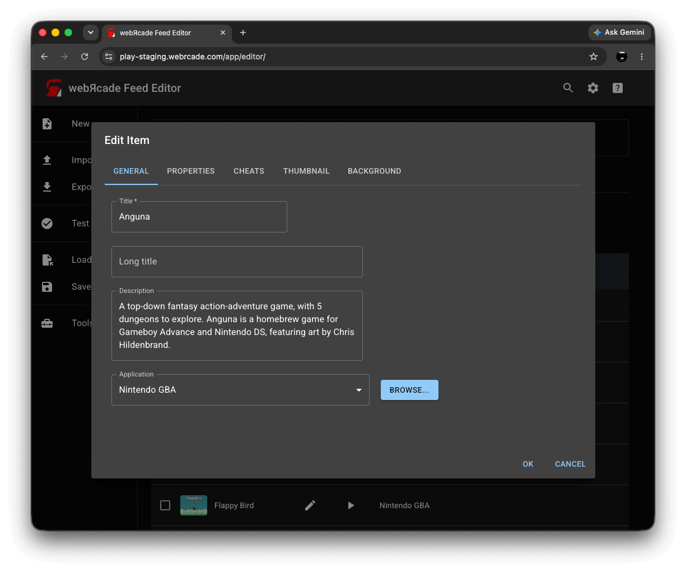
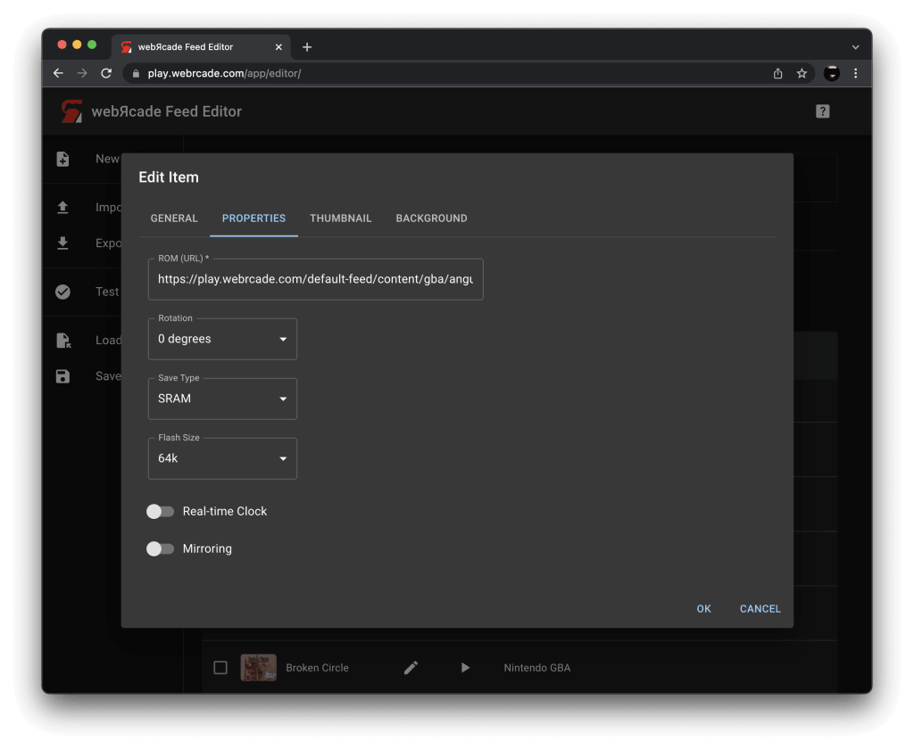
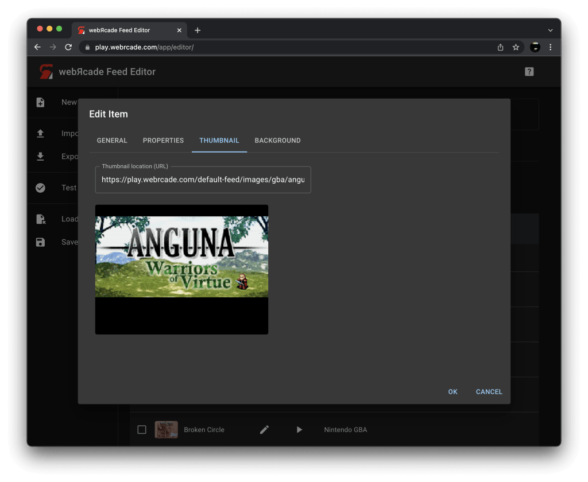
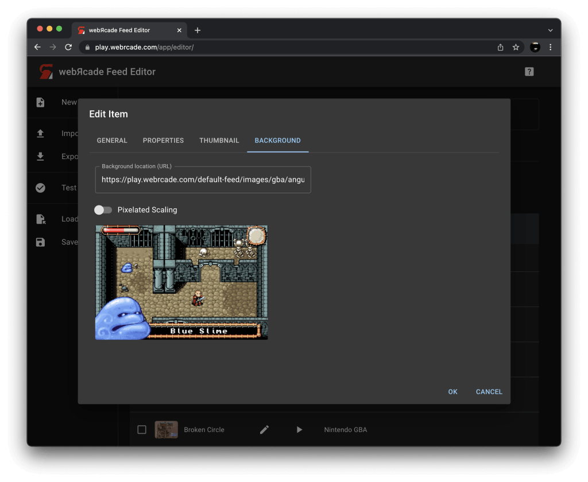
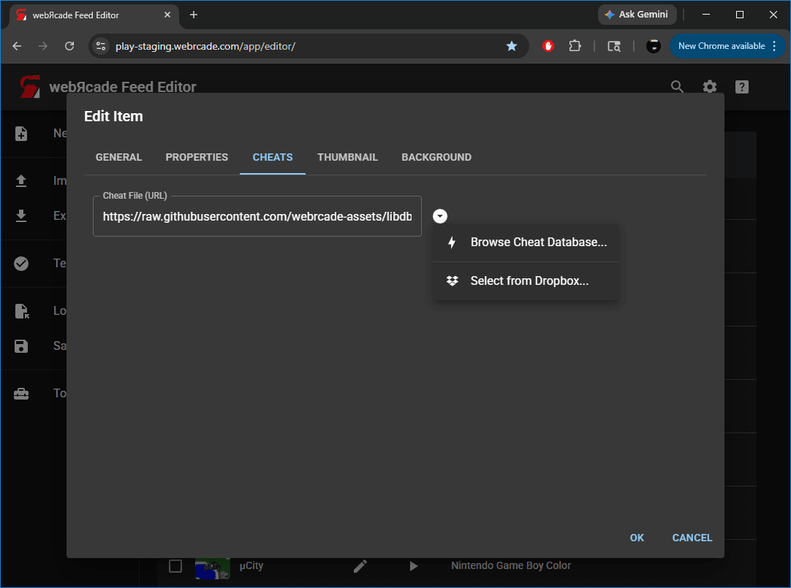
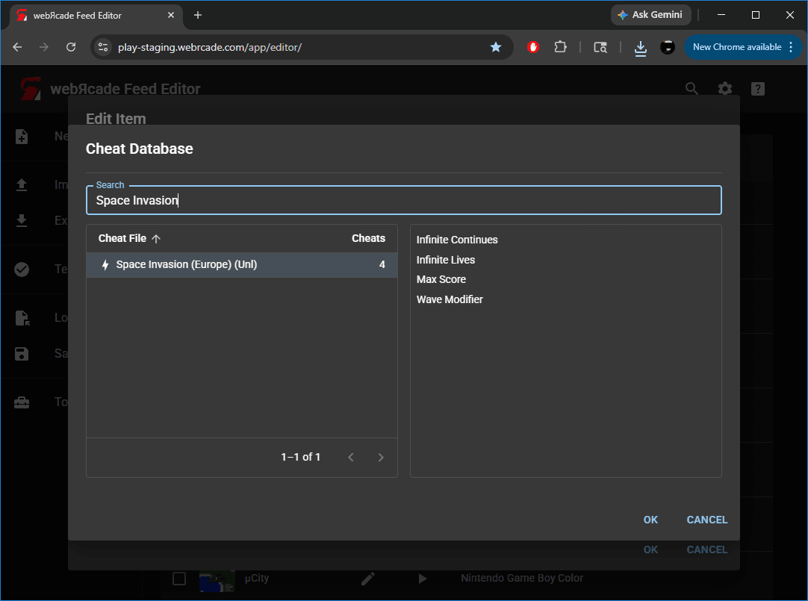

# Item Editor

The "Item Editor" is used to create and/or edit "Item" entries within a webЯcade feed. Item entries correspond to items (games, etc.) that can be launched (played, etc.). Each item identifies an application type (the specific emulator or game engine, etc. to launch). The [Applications](../../apps/index.md) page contains a listing of all of the available applications.

!!! note
    The fields within the "Item Editor" support drag and drop functionality. See the [Drag and Drop](../draganddrop.md) section for more information. Specifically the sections demonstrating how to [Drag Text](../draganddrop.md#drag-text) and [Drag Images](../draganddrop.md#drag-images).

## General Tab

The general tab consists of basic information about the item (title, description, etc.). It also contains an `Application` field which determines the type of emulator or game engine, etc. to utilize when running (playing) the item.

{: class="center zoomD"}

### Fields

| __Field__ | __Description__ |
| --- | --- |
| Title |  A title for the item. |
| Long title | A long title for the item (will be used in locations with additional room for display). |
| Description | A description of the item. |
| Application |  The application (emulator, etc.) associated with the item.  Refer to the [Applications](../../apps/index.md) page for a list of available applications. |

## Properties Tab

The properties tab consists of fields that are specific to the [Application](../../apps/index.md) type that is associated with the item being edited.

{: class="center zoomD"}

The fields in the screenshot above are specific to the [Game Boy Advance Application](../../apps/emulators/gba/index.md) type. Each application type's documentation page contains a `Properties` section that details the properties specific to the type. For example, the [Game Boy Advance Application Properties](../../apps/emulators/gba/index.md#properties) section describes the fields present in the screenshot above.

All items associated with an emulator-based application contain a `ROM` field which is a URL that points to a ROM file or a zip file that contains a ROM file. The webЯcade editor provides several options for quickly creating emulator-based items that have a ROM URL. See the [Adding Items](../workspace/addingitems.md) and [Drag and Drop](../draganddrop.md) sections for information on rapidly creating ROM-based items.

## Thumbnail Tab

The thumbnail tab allows a thumbnail for the item to be specified. The thumbnail image will be displayed in the [webЯcade player](../../userguide/index.md).

{: class="center zoomD"}

### Fields

| __Field__ | __Description__ |
| --- | --- |
| Thumbnail location (URL) | The location (URL) of a thumbnail image for the item.  This field supports drag and drop of image-based URLs (see [Drag Images](../draganddrop.md#drag-images) for more information). |
| Thumbnail image | The image corresponding to the specified URL in `Thumbnail location`.  Image-based URLs can be dragged and dropped on the image to set the `Thumbnail location` (see [Drag Images](../draganddrop.md#drag-images) for more information). |

## Background Tab

The background tab allows a background image for the item to be specified. The background image will be displayed in the [webЯcade player](../../userguide/index.md).

{: class="center zoomD"}

### Fields

| __Field__ | __Description__ |
| --- | --- |
| Background location (URL) | The location (URL) of a background image for the item.  This field supports drag and drop of image-based URLs (see [Drag Images](../draganddrop.md#drag-images) for more information). |
| Pixelated Scaling | Whether to pixelate the image when it is sized to fit the dimensions of the [webЯcade player](../../userguide/index.md). This option should typically be enabled when a screenshot with smaller dimensions is being used as a background image. Without enabling this option, the screenshot will most likely appear blurry when stretched to fit the player's dimensions. |
| Background image | The image corresponding to the specified URL in `Background location`.  Image-based URLs can be dragged and dropped on the image to set the `Background location` (see [Drag Images](../draganddrop.md#drag-images) for more information).   |

## Cheats Tab

The cheats tab allows a cheat file to be associated with the item. The cheats tab is only available for [application types](../../apps/index.md) that support cheats (see the `Cheats` column in each application type's `Types` table).

{: class="center zoomD"}

### Fields

| __Field__ | __Description__ |
| --- | --- |
| Cheat File (URL) | The location (URL) of a RetroArch-format cheat file (`.cht`) for the item.  For supported application types, a *Browse Cheat Database...* option is available in the field's dropdown menu, which opens the [Cheat Database Dialog](#cheat-database-dialog) for selecting a cheat file.  This field supports drag and drop of text-based URLs (see [Drag Text](../draganddrop.md#drag-text) for more information).  **Note:** The cheat file must match the specific region and variant of the ROM being used for cheats to function correctly. |

## Cheat Database Dialog

The "Cheat Database" dialog is used to locate and select a cheat file from the webЯcade cheat database.

{: class="center zoomD"}

### Fields

| __Field__ | __Description__ |
| --- | --- |
| Search | Filters the list of cheat files by name. Pre-populated with the item's title when the dialog is opened. |
| Cheat Files | The left panel lists cheat files matching the current search. Click a row to select a file and preview its cheat names in the right panel.  Cheat files are listed by game name including region and variant (e.g., *Batman - The Video Game (USA)*). Select the entry that matches the specific ROM being used. |
| Cheat Preview | The right panel displays the cheat names contained in the selected cheat file. |

Clicking *OK* populates the *Cheat File (URL)* field in the [Cheats Tab](#cheats-tab) with the URL of the selected cheat file.
