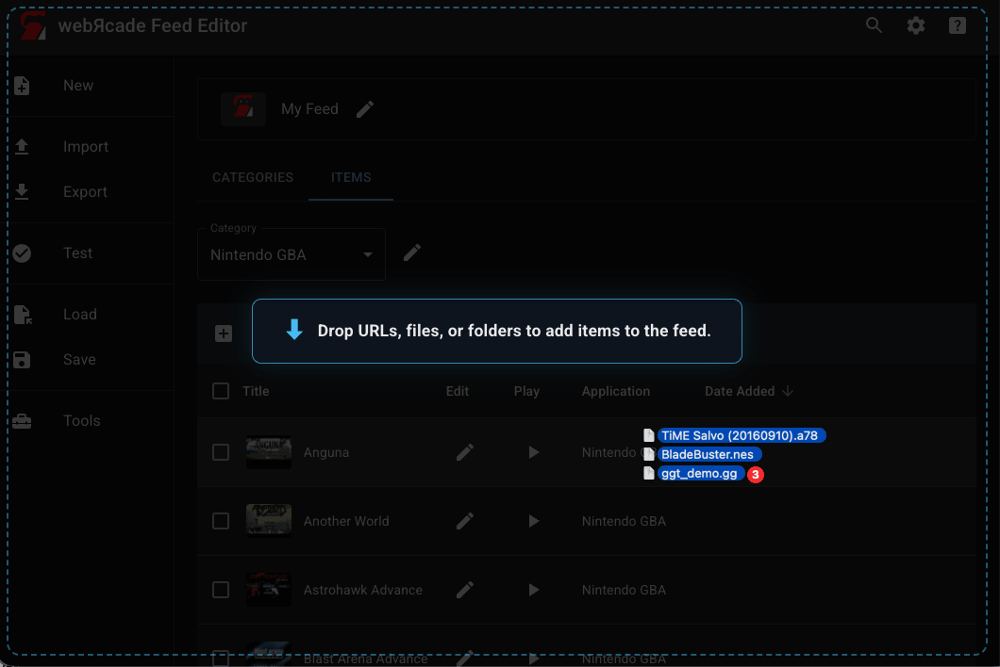
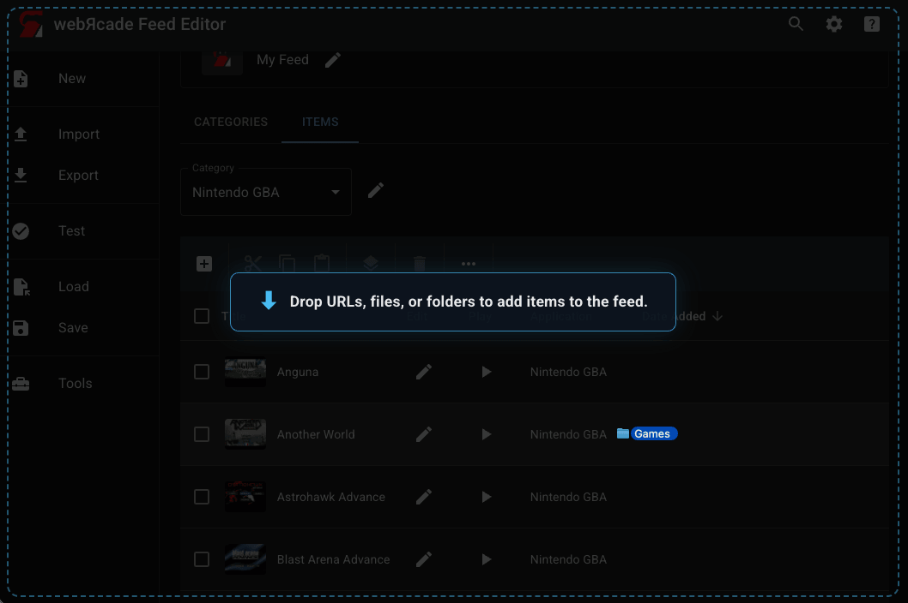
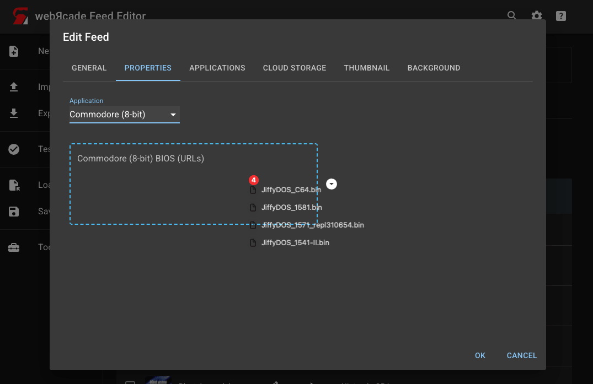

# Drag and Drop: Local Files

The editor supports dragging files and folders from your computer directly onto the workspace or into individual URL fields.

!!! note
    Dragging files or folders onto the workspace requires [cloud storage](../storage/index.md) to be enabled. Dropped files are uploaded to your linked Dropbox account automatically.

## Files onto the Workspace

Drag one or more ROM or game files from your file manager and drop them anywhere on the editor workspace.

{: style="padding:5px;" class="center zoomD"}

When you start dragging, an overlay appears on the editor with the message *"Drop URLs, files, or folders to add items to the feed."* Drop the files to begin. The editor analyzes each file, determines its application type, and starts the upload process.

For a full description of what happens after the drop, see [Adding Items: Local Files](workspace/addingitems-local.md).

## Folder onto the Workspace

Drag a folder from your file manager and drop it anywhere on the editor workspace.

{: style="padding:5px;" class="center zoomD"}

The editor recursively reads all files inside the folder (including sub-folders) and runs the same analysis and upload pipeline as dropping individual files. This is useful for adding an entire collection at once.

For a full description of what happens after the drop, see [Adding Items: Local Files](workspace/addingitems-local.md).

## File into a URL Field

Individual URL fields in the editor (ROM fields, disc fields, BIOS fields, image fields, etc.) support dragging a single file directly onto them.

{: style="padding:5px;" class="center zoomD"}

When you drag a file over a compatible field, the field highlights to indicate it will accept the drop. Dropping the file uploads it to your cloud storage and populates the field with the resulting URL automatically. A progress overlay is shown for larger files while the upload is in progress.

This works in the Item Editor (ROM and disc URL fields), the Feed Editor (BIOS fields), and the thumbnail and background image fields across all editors.
