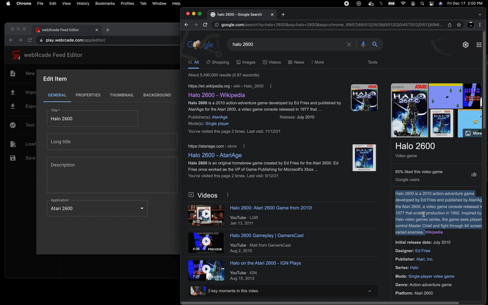

# Drag and Drop

To make the process of creating a feed as simple as possible, the editor supports the ability to develop feeds by dragging and dropping feed-related content.

## Drag ROMs (URLs)

The editor supports dragging and dropping URLs that point to ROM files onto the [Workspace](#workspace) itself or into the [Create Items From URLs Dialog](#create-items-from-urls-dialog).

### Workspace

The image below shows a URL that points to the Atari 2600 homebrew title, *Halo 2600*, being dragged from the [Internet Archive](../feeds/resources/inetarchive.md) and onto editor's workspace. 

{: class="center zoomD"}

Dragging and dropping a ROM-based URL onto the workspace is equivalent to adding a single item via the *Create Items from URLs* dialog (see the [Create from URLs](workspace/itemstab.md#create-from-urls) section within the [Items Tab](workspace/itemstab.md) page for more information).

### Create Items from URLs Dialog

The image below shows a URL that points to the Sega Genesis homebrew title, *Chase*, being dragged from the [Internet Archive](../feeds/resources/inetarchive.md) and onto the *Create Items from URLs* dialog. 

{: class="center zoomD"}

Dragging URLs onto the *Create Items from URLs* dialog eliminates the need to copy and paste or manually type URLs (see the [Create from URLs](workspace/itemstab.md#create-from-urls) section within the [Items Tab](workspace/itemstab.md) page for more information). 

## Drag Text

As show below, the editor's text-based fields support the ability to drag and drop textual content.

{: class="center zoomD"}

Dragging and dropping text eliminates the need to copy and paste or manually type content.

## Drag Images

As shown below, the editor's image fields support the ability to drag and drop image-based URLs.

{: class="center zoomD"}

Dragging and dropping image-based URLs eliminates the need to copy and paste or manually type URLs.