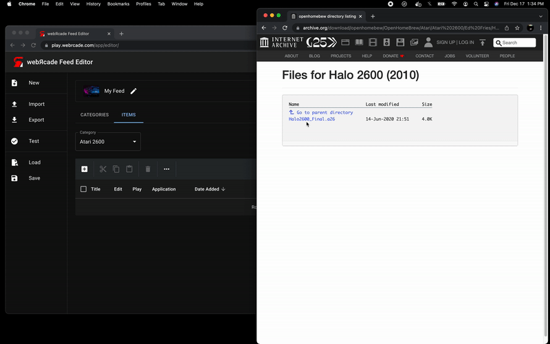
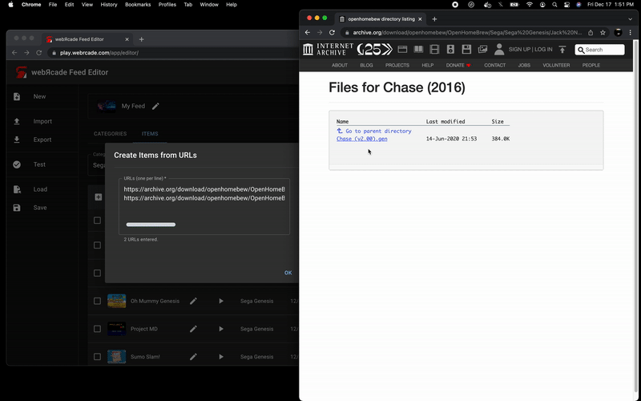
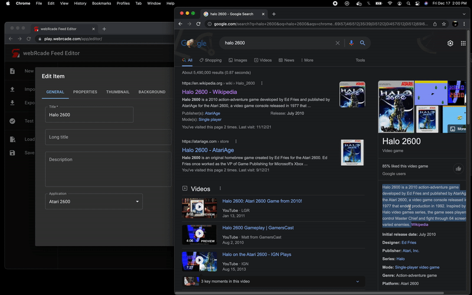

# Drag and Drop: URL Links

The editor supports dragging and dropping URL links directly into the workspace and into various fields and dialogs.

## URL Links

You can drag URL links from your browser or another application directly into the editor. There are two places you can drop them.

### Onto the Workspace

The image below shows a URL pointing to the Atari 2600 homebrew title, *Halo 2600*, being dragged from the [Internet Archive](../feeds/resources/inetarchive.md) and dropped onto the editor workspace.

{: class="center zoomD"}

Dropping a URL onto the workspace is equivalent to pasting it into the *Create Items From URLs* dialog. The editor analyzes the URL and, if it can determine the application type, creates an item automatically. See [Create From URLs](workspace/addingitems-url.md#create-from-urls) for more details.

### Into the Create Items From URLs Dialog

The image below shows a URL pointing to the Sega Genesis homebrew title, *Chase*, being dragged from the [Internet Archive](../feeds/resources/inetarchive.md) and dropped onto the *Create Items From URLs* dialog.

{: class="center zoomD"}

Dropping URLs directly onto the dialog adds them to the list without needing to copy and paste. You can drop multiple URLs one at a time before submitting. See [Create From URLs](workspace/addingitems-url.md#create-from-urls) for more details.

## Drag Text

As shown below, the editor's text-based fields support dragging and dropping text content.

{: class="center zoomD"}

Dragging and dropping text eliminates the need to copy and paste or manually type content.

## Drag Images

As shown below, the editor's image fields support dragging and dropping image URLs.

{: class="center zoomD"}

Dragging and dropping image URLs onto an image field sets the image directly without needing to copy and paste the URL.