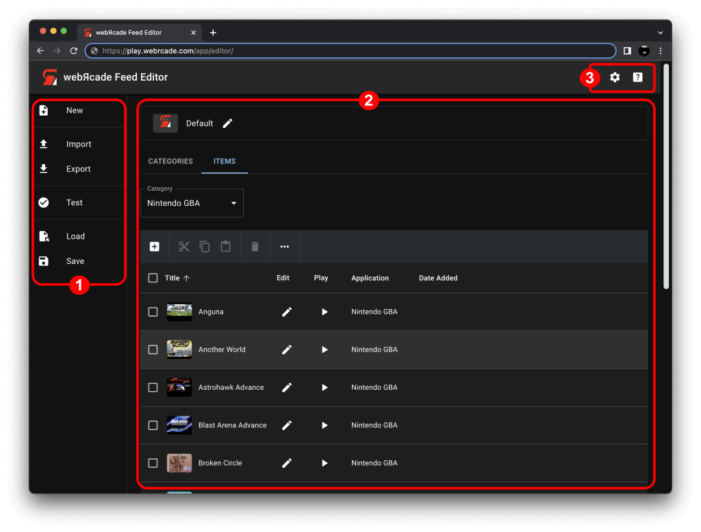

# Feed Editor

The webЯcade feed editor, located at [editor.webrcade.com](https://editor.webrcade.com), provides a much simpler alternative to the [manual creation](../feeds/tutorial.md) of feeds. The editor allows for quickly creating webЯcade feeds without requiring any knowledge of the underlying [document format](../feeds/format.md).

{: class="center zoomD"}

The editor also includes a ROM *analyzer* that is capable of determining the appropriate [Application](../apps/index.md) type (emulator, etc.) for ROMs as well as any associated meta-information (title, properties, description, and related artwork). The *analyze* operation is similar to *scraping* functionality found in other front-ends with the primary difference being that in addition to meta-information the analyzer also establishes the application type and related properties.

The editor provides [multiple ways](workspace/addingitems.md) of creating and adding new items (games, etc.) to feeds. The simplest way being to simply [drag and drop ROM-based links](draganddrop.md#drag-rom-urls) into the editor's [workspace](workspace/index.md).

## Components

The editor consists of two primary components as shown in the screenshot below.

{: class="center zoomD"}

The [Sidebar](sidebar.md) *(#1 in screenshot above)* contains top-level actions that can be performed within the webЯcade editor, while the [Feed Workspace](workspace/index.md) *(#2 in screenshot above)* provides the ability to view and edit the contents of the *active feed* (the feed currently being edited).

