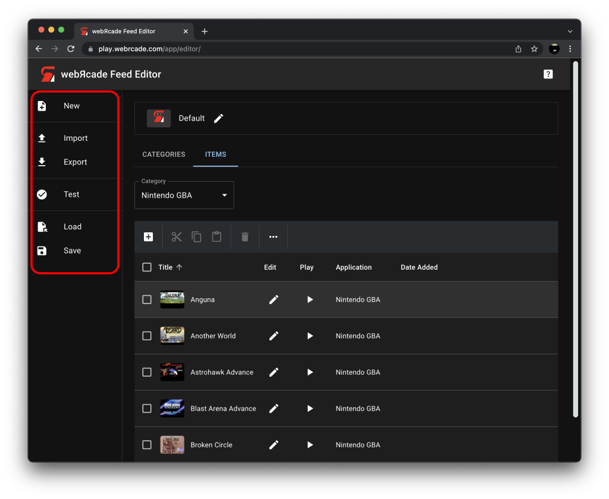
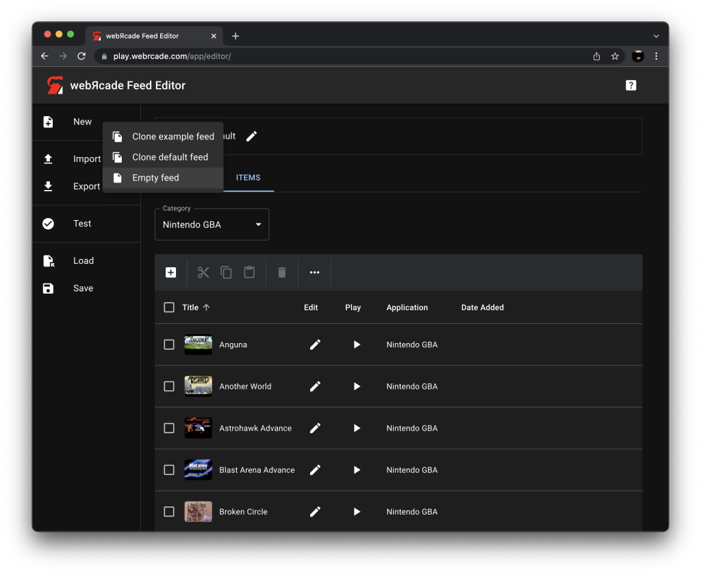
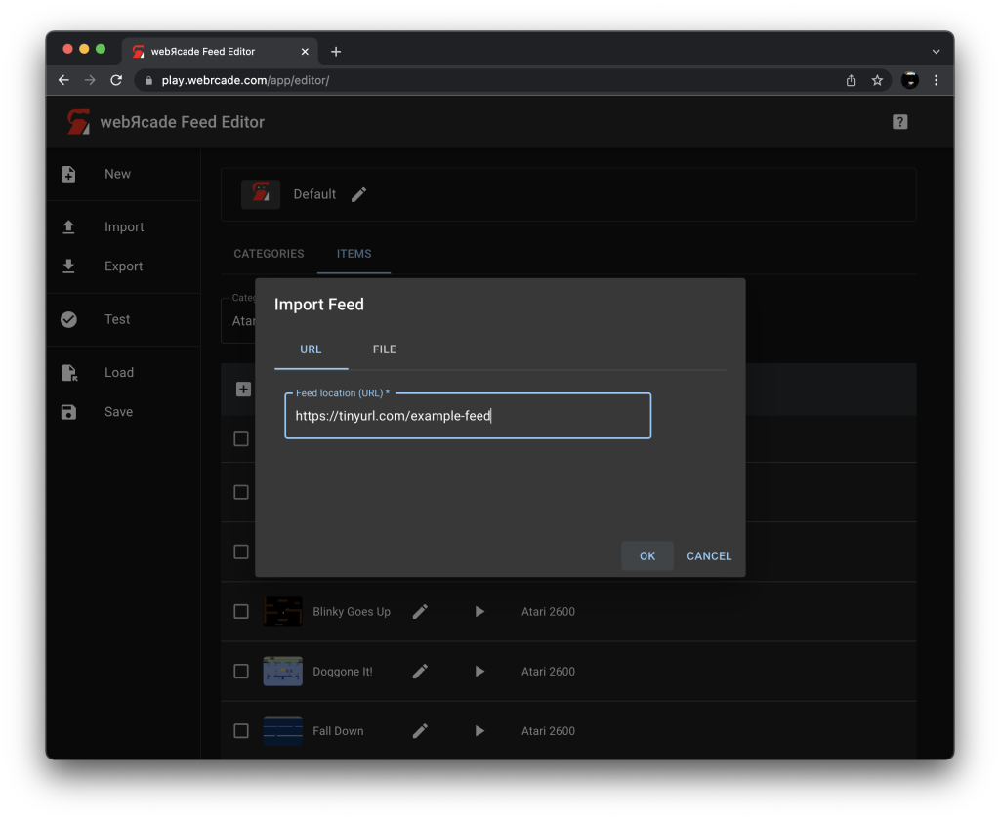
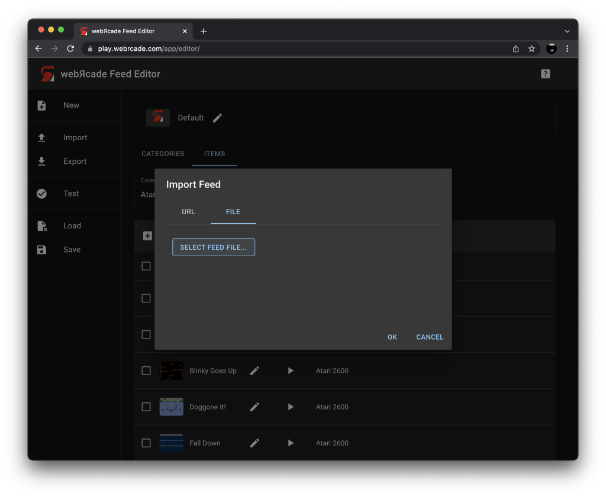
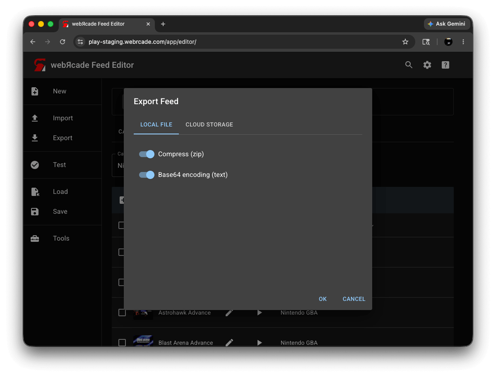
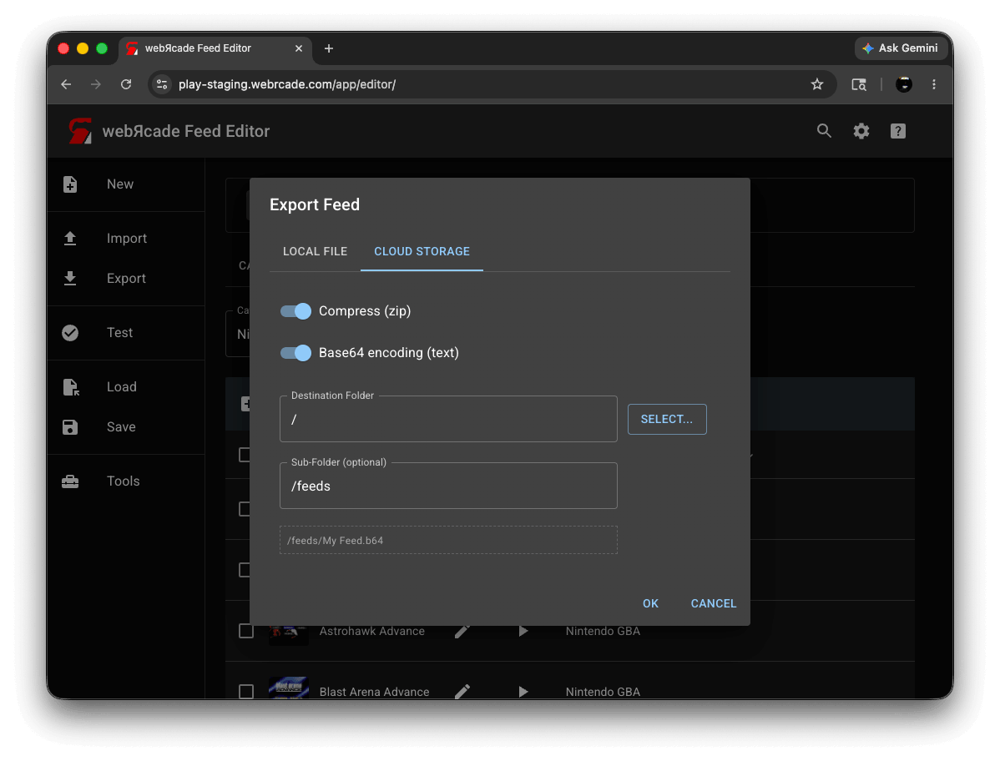
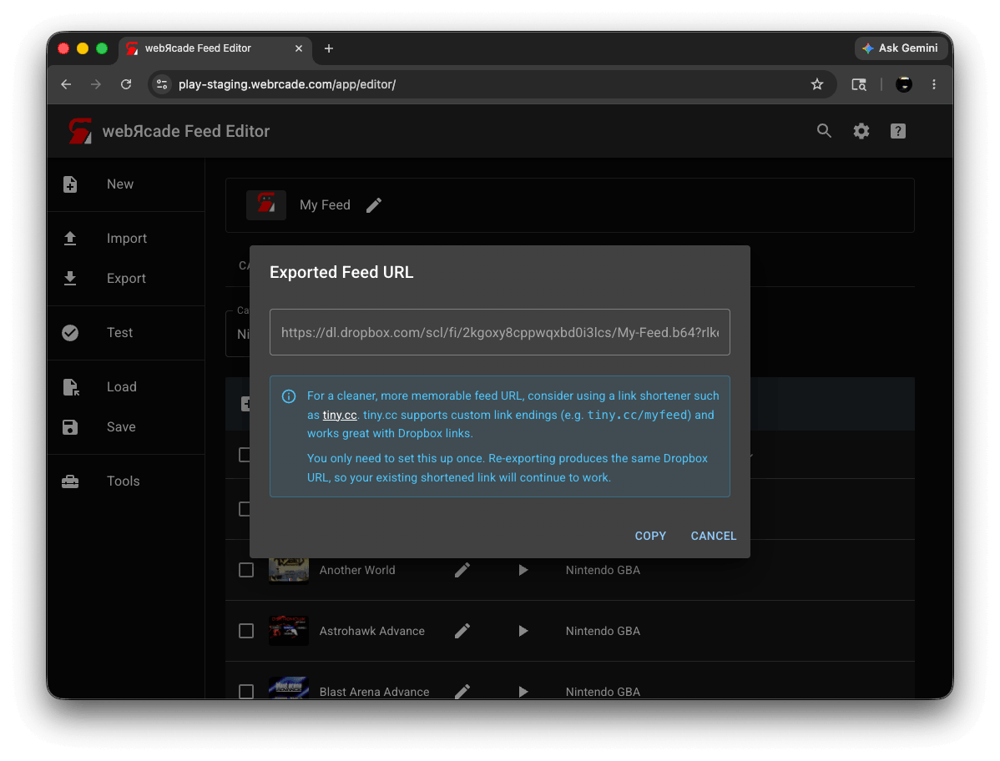
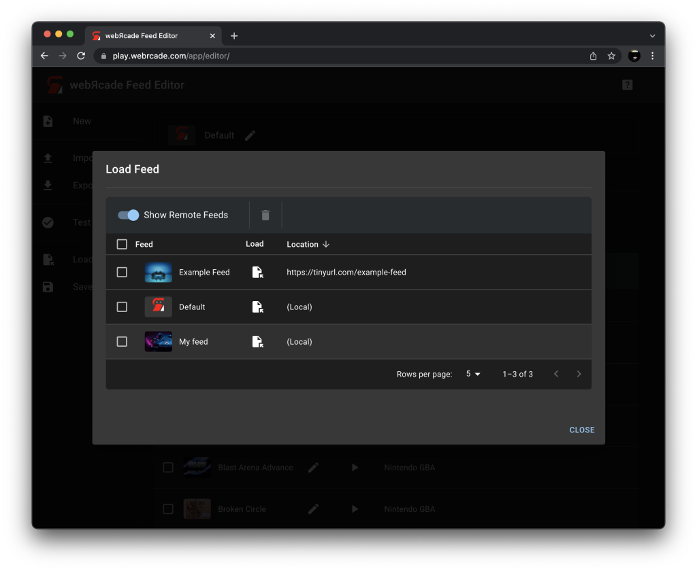
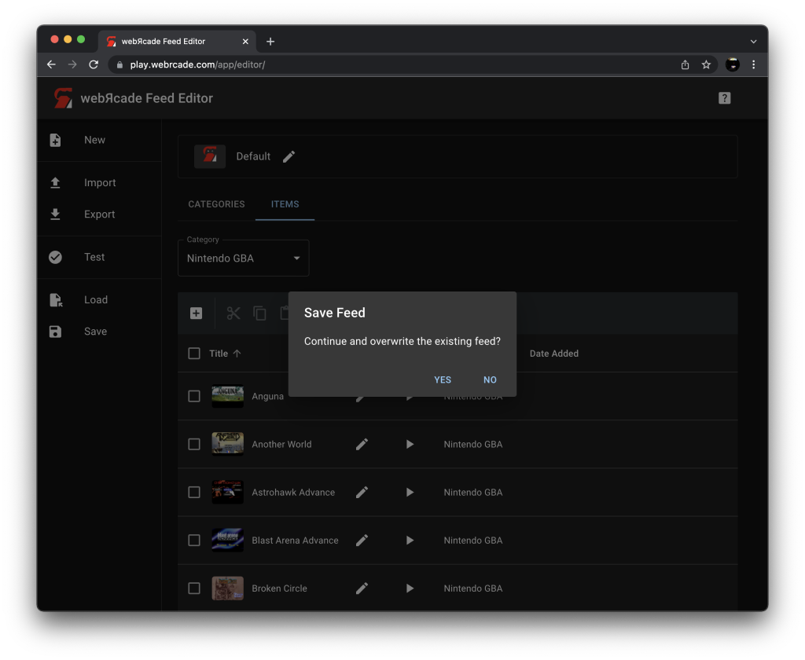
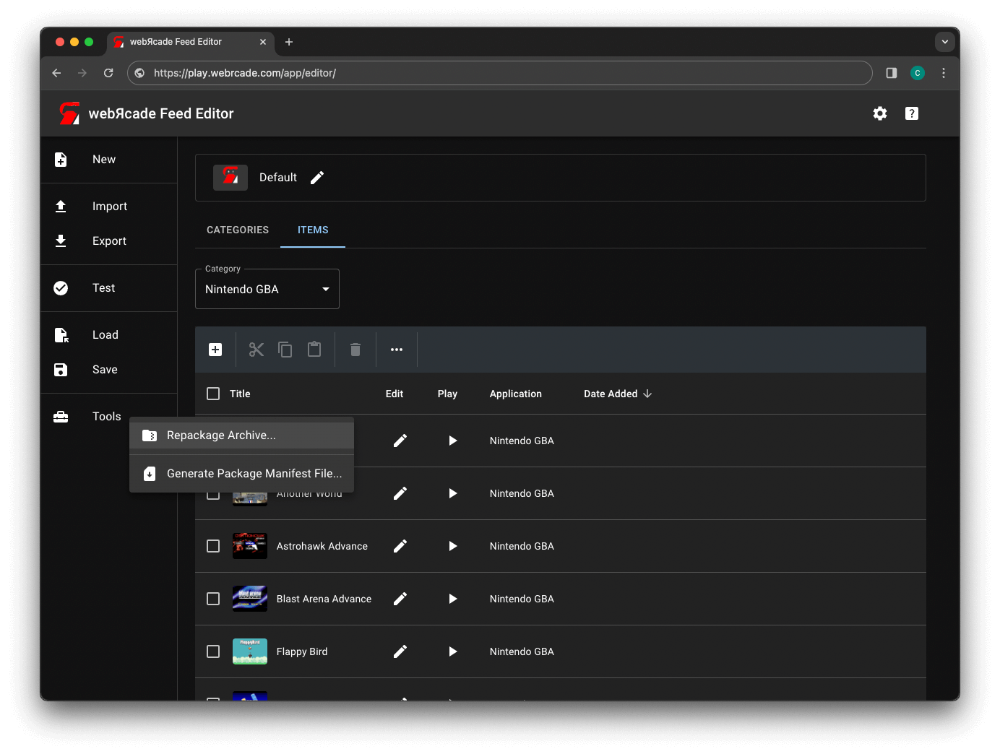

# Left Sidebar

The "Left Sidebar" (highlighted in red in the screenshot below) contains the top-level actions that can be performed within the webЯcade editor.

{: class="center zoomD"}

Each of the actions located in the "Left Sidebar" are described in the table below.

| __Action__ | __Icon__ | __Description__ |
| --- | --- | --- |
| [New](#new-action) | {: class="action"} | Displays a context menu containing several options for creating a new feed.  See the [New Action](#new-action) section for more information. |
| [Import](#import-action) | {: class="action"} | Displays the "Import Feed" dialog.  See the [Import Action](#import-action) section for more information.   |
| [Export](#export-action) | {: class="action"} | Exports the *active feed* (the feed currently being edited in the feed workspace) to JSON format. The feed can be saved as a local file download or uploaded directly to cloud storage.  See the [Export Action](#export-action) section for more information.  |
| [Test](#test-action) | {: class="action"} | Displays the *active feed* (the feed currently being edited in the feed workspace) in the [webЯcade player](../userguide/index.md).  See the [Test Action](#test-action) section for more information.  |
| [Load](#load-action) | {: class="action"} | Displays the "Load Feed" dialog.  See the [Load Action](#load-action) section for more information.
| [Save](#save-action) | {: class="action"} | Saves the *active feed* (the feed currently being edited in the feed workspace) to the browser's *local* storage. The title of the feed is used to uniquely identify it.  See the [Save Action](#save-action) section for more information.  |
| [Tools](#tools-action) | {: class="action"} | Displays a context menu containing several tools.  See the [Tools](#tools-action) section for more information. |

## Actions

The following sections describe in detail the various actions that are located in the "Left Sidebar".

### New Action

The new action initiates the creation of a new feed within the webЯcade editor. After creation, the new feed becomes the *active feed* (the feed currently being edited in the feed workspace) in the editor.

{: class="center zoomD"}

When the "New Action" is clicked, a context menu is displayed containing several options for creating a new feed. The options within the context menu are detailed in the table below.

| __Menu Item__ | __Icon__ | __Description__ |
| --- | --- | --- |
| Clone example feed | {: class="action"} | Creates a copy of the *example feed* (a feed consisting of two categories with three items each) and makes it the *active feed* (the feed currently being edited in the feed workspace). |
| Clone default feed | {: class="action"} | Creates a copy of the *default feed* (the default feed for webЯcade comprised of high-quality homebrew across the various application types supported by webЯcade) and makes it the *active feed* (the feed currently being edited in the feed workspace).  |
| Empty feed | {: class="action"} | Creates an empty feed comprised of a single category and no items and makes it the *active feed* (the feed currently being edited in the feed workspace). |

### Import Action

The "Import Action" creates a copy of a feed located remotely (via URL) or locally (via a file) and makes it the *active feed* (the feed currently being edited in the feed workspace).

When the "Import Action" is clicked, a dialog is displayed that allows for selecting a remote (via URL) or local (via file) feed. The following two sections describe each of these scenarios.

**Import from URL**

To import a remote feed, select the `URL` tab as shown in the screenshot below. Next, enter the URL for the remote feed in the `Feed Location` text field and press the `OK` button.

{: class="center zoomD"}

If the download is successful, a copy of the feed will become the *active feed* (the feed currently being edited in the feed workspace).

**Import From File**

To import a feed from a local file, select the `File` tab as shown in the screenshot below. Next, click the `Select Feed File...` button and select the local file. Once the file has been selected, click the `OK` button.

{: class="center zoomD"}

If a valid feed is found in the selected file, a copy of the feed will become the *active feed* (the feed currently being edited in the feed workspace).

### Export Action

The "Export Action" exports the *active feed* (the feed currently being edited in the feed workspace). The "Export Feed" dialog includes two tabs: **Local file** and **Cloud storage**. The Cloud storage tab is only available when [cloud storage](../storage/index.md) has been enabled.

The following options appear on both tabs:

| __Field__ | __Description__ |
| --- | --- |
| Compress (zip) | Whether to compress the feed into a `.zip` file.  Compression has been shown to greatly reduce feed file size. |
| Base64 encoding (text) | Whether to Base64-encode the feed, forcing it into a plain-text format even when compressed.  This allows compressed feeds to be posted to text-pasting services such as [Snippet.host](https://snippet.host/){target=_blank}. It also avoids false positives for restricted language since the content is no longer human-readable. |

#### Local File Tab

The **Local file** tab downloads the exported feed directly to your device.

{: class="center zoomD"}

Click **OK** to download the file. The filename is derived from the feed title with an extension of `.json`, `.zip`, or `.b64` depending on the options selected.

Once downloaded, the file (or its contents) can be shared using a hosting service such as [Snippet.host](../feeds/resources/snippet.md) or [Dropbox](../feeds/resources/dropbox.md). See the [Feed Resources](../feeds/resources/index.md) section for more options.

#### Cloud Storage Tab

The **Cloud storage** tab uploads the exported feed directly to your linked Dropbox account and provides a shareable URL.

{: class="center zoomD"}

| __Field__ | __Description__ |
| --- | --- |
| Destination Folder | The root folder in your cloud storage where the feed will be saved. Click **Select...** to browse and choose a folder. Defaults to the root of your Dropbox. |
| Sub-Folder (optional) | An optional sub-folder appended to the Destination Folder. Defaults to `/feeds`. Leave blank to export directly into the Destination Folder. |

The full destination path is shown below the fields and updates automatically as you adjust the settings.

Click **OK** to upload the feed. Once complete, a dialog opens displaying the shareable URL for the uploaded feed.

{: class="center zoomD"}

The URL can be copied to the clipboard for use in the [webЯcade player](../userguide/index.md) or shared with others.

!!! tip
    For a shorter, more memorable feed URL, consider using a link shortener such as [tiny.cc](https://tiny.cc){target=_blank}, which supports custom link endings (e.g. `tiny.cc/myfeed`). Because re-exporting to the same path produces the same Dropbox URL, your shortened link will continue to work after future exports.

### Test Action

The "Test Action" displays the *active feed* (the feed currently being edited in the feed workspace) in the [webЯcade player](../userguide/index.md).

This provides the ability to quickly examine how the current feed will appear in the player without requiring the feed to be formally registered.

### Load Action

The "Load Action" creates a copy of a feed (either local or remote) and makes it the *active feed* (the feed currently being edited in the feed workspace).

{: class="center zoomD"}

**Table Toolbar**

The following table describes the actions found in the toolbar of the "Load Feed" table.

| __Action__ | __Icon__ | __Description__ |
| --- | --- | --- |
| Show Remote Feeds | {: class="action"} | Determines whether to display *remote* feeds that were registered within the [webЯcade player](../userguide/index.md). |
| Delete | {: class="action"} | Deletes the currently selected feeds.  *Remote* feeds are simply unregistered (the remote feed is not actually deleted). |

**Table Columns**

The following table describes the columns that comprise the "Load Feed" table.

| __Column__ |  | __Description__ |
| --- | --- | --- |
| Feed | | The title of the feed associated with the row. |
| Load | {: class="action"} | When the load icon is clicked, the feed associated with the row is retrieved, a copy of the feed is made, and it becomes the *active feed* (the feed currently being edited in the feed workspace).  |
| Location | | Whether the feed is located locally (in the browser's local storage) or remotely (via a URL).  If the feed is *remote* its associated URL is displayed. |

### Save Action

The "Save Action" saves the active feed (the feed currently being edited in the feed workspace) to the browser's local storage. The title of the feed is used to uniquely identify it.

{: class="center zoomD"}

If a feed already exists in the browser's local storage with the same title, a prompt for overwriting is displayed (see screenshot above).

### Tools Action

When the "Tools Action" is clicked, a context menu is displayed containing several tools (described in the table below).

{: class="center zoomD"}

| __Menu Item__ | __Icon__ | __Description__ |
| --- | --- | --- |
| [Repackage Archive](./tools/repackage-archive.md) | {: class="action"} | The ["Repackage Archive"](./tools/repackage-archive.md) tool provides the ability to automatically create a webЯcade [package archive manifest](../advanced/archive-manifests.md) format and layout from a selected package archive file (`.zip`). |
| [Generate Package Manifest File](./tools/generate-manifest.md) | {: class="action"} | 
The ["Generate Package Manifest File"](./tools/generate-manifest.md) tool generates and stores a webЯcade [package archive manifest](../advanced/archive-manifests.md) file for content that already exists within [cloud storage](../../storage/). The generated manifest file will be written at the root of the selected folder.

This tool is only available if [cloud storage](../../storage/) has been enabled for webЯcade on the current device.

  |

