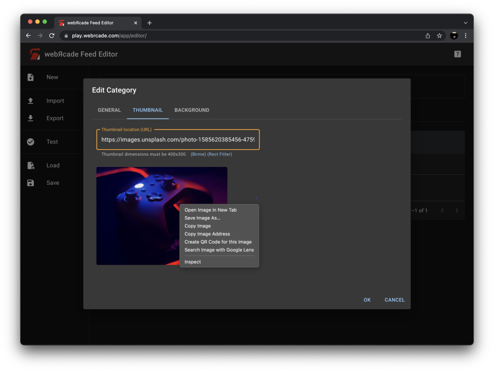

# Thumbnails

Currently, the required dimensions for thumbnail images within webЯcade is `400x300`. If an image is used that does not meet those specifications a yellow warning border will appear around the URL fields located on `Thumbnail Tabs` in the editor (see screen below).

{: class="center zoomD"}

When a non-compliant image is used, webЯcade attempts to use an external image processing proxy to resize it dynamically. This solution is less than ideal as it isn't compatible with all images or hosts, and isn't guaranteed to work long term. 

Therefore, it is recommended that non-compliant images are cropped and/or resized and subsequently published to an appropriate image hosting service (such as [Imgur](../feeds/resources/imgur.md)).

There are several options for resizing the image.

* If the image is displayed on the `Thumbnail Tab` (as is shown in the screen above), that indicates that the image proxy was able to successfully resize it. If that is the case, you can simply right click on the image and save it (it will be saved with the correct dimensions).
* Use the [Birme](https://www.birme.net/?target_width=400&target_height=300&auto_focal=false) image resizing site (A link to the site is displayed directly under the `Thumbnail location` text field for non-compliant images, see image above).
* Use the [PNG in Rectangle Fitter](https://onlinepngtools.com/fit-png-in-rectangle) image resizing site (A link to the site is displayed directly under the `Thumbnail location` text field for non-compliant images, see image above).
