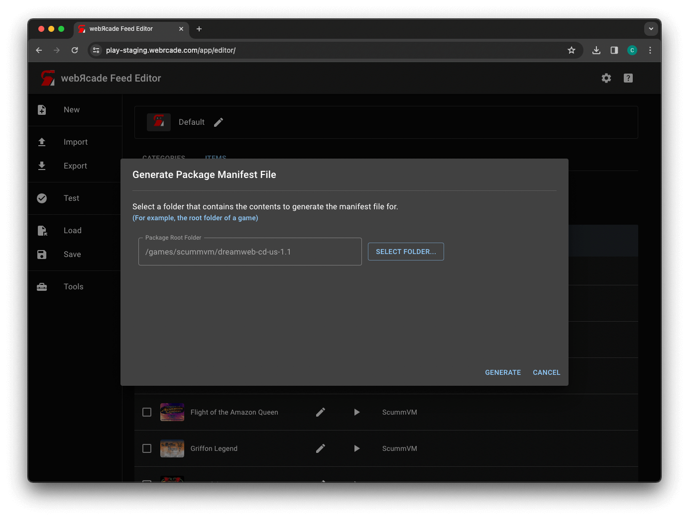
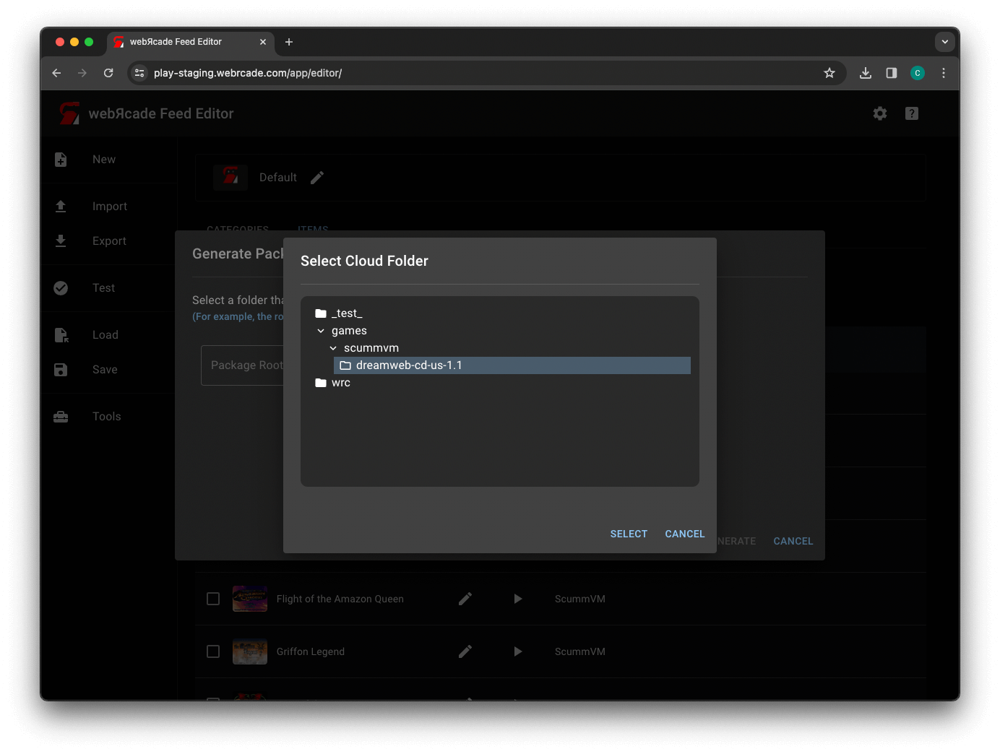
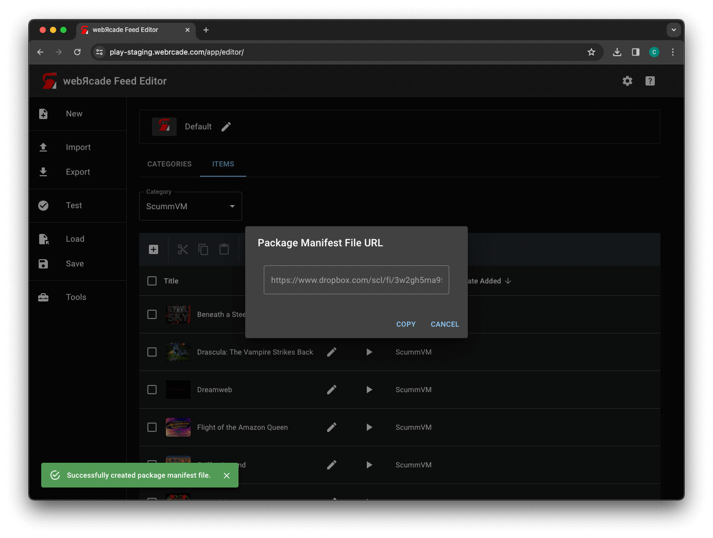

# Generate Package Manifest File

ONLY AVAILABLE IF CLOUD IS ENABLED

### Generate Manifest Dialog

{: style="padding:5px 15px;" class="center zoomD"}

The TODO dialog includes the following options:

| __Field__ | __Description__ |
| --- | --- |
| Package archive | The package archive file (`.zip`) to create a package manifest file for. |

### Select Cloud Folder Dialog

{: style="padding:5px 15px;" class="center zoomD"}

The TODO dialog includes the following options:

| __Field__ | __Description__ |
| --- | --- |
| Compress (zip) | Whether to compress the feed. This will create a zip file that contains a single file (the feed).  Using this option has been shown to greatly reduce the feed size. |
| Base64 encoding (text) | Whether to base64 encode the feed. This will force the feed to be in a text format (even if it is being compressed/zipped).  Using this option allows for posting compressed feeds on text pasting services (such as Pastebin). Additionally, it will avoid false positives for abusive language as the file is no longer human-readable (it is base64 encoded). |

### Results

{: style="padding:5px 15px;" class="center zoomD"}