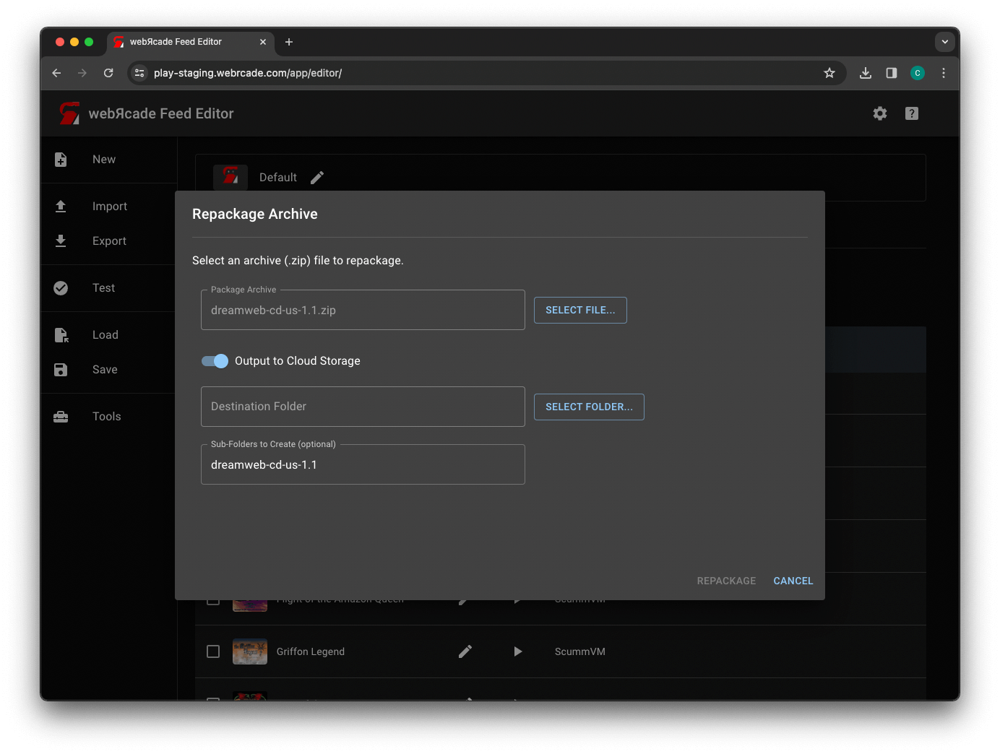
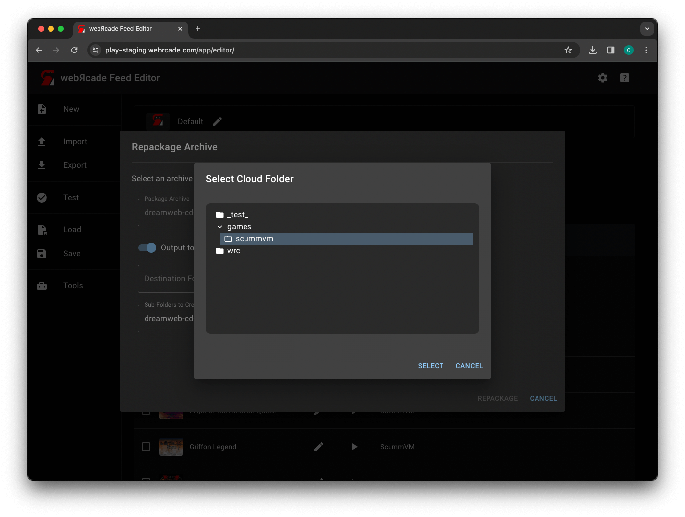

# Repackage Archive

The "Repackage Archive" tool provides the ability to automatically create a
[webЯcade archive manifest](../../advanced/archive-manifests.md) format and layout
from a selected package archive file (`.zip`).

The webЯcade archive manifest format was developed to reduce the amount of memory required
by applications (emulators and engines) whose content is a set of files packaged in a
single archive (`.zip`) file. Examples of applications that utilize archive files include
[Quake](../../../apps/engines/quake/) and [ScummVM](../../../apps/engines/scummvm/).

!!! important
    The "Repackage Archive" tool takes a significant amount of memory to operate, and therefore
    should only be used on platforms such as Windows or MacOS that are running the Chrome browser.

The "Repackage Archive" tool provides the ability to output the [webЯcade archive manifest](../../advanced/archive-manifests.md) format layout [directly to cloud storage](#repackage-to-cloud) or to [download the results](#repackage-locally) of the repackage operation locally.

## Repackage to Cloud

The following section details the steps required to create a
[webЯcade archive manifest](../../advanced/archive-manifests.md) format and layout directly to cloud storage
from a selected package archive file (`.zip`).

### Generate Manifest Dialog

The "Generate Manifest" dialog is used to select the package archive (`.zip`) from which to create the
[webЯcade archive manifest](../../advanced/archive-manifests.md) format and layout as well as the location
in cloud storage to write the results to.

{: style="padding:5px 15px;" class="center zoomD"}

The dialog includes the following options:

| __Field__ | __Description__ |
| --- | --- |
| Package Archive | The package archive (`.zip`) file to repackage.<br/><br/>The `"Select File..."` button displays a file chooser used to select a package archive (`.zip`) file.  |
| Output to Cloud Storage | Whether the package archive (`.zip`) should be repackaged and written directly to [cloud storage](../../storage/index.md).  |
| Destination Folder | The folder within cloud storage to write the results of the repackage operation to.<br/><br/>The `"Select Folder..."` button displays the [Select Cloud Folder](#select-cloud-folder-dialog) Dialog used to select the destination folder. |
| Sub-Folders to Create (optional) | Additional sub-folders to create under the destination folder. The results of the repackage operation wil be written to the last sub-folder.<br/><br/>Multiple sub-folders must be separated by a forward slash.  |

!!! important
    The `Output to Cloud Storage` option will only be visible if [cloud storage](../../../storage/) has been enabled
    for webЯcade for the current device.

### Select Cloud Folder Dialog

The "Select Cloud Folder" dialog is used to select the location in cloud storage to write the results
of the repackage operation to.

{: style="padding:5px 15px;" class="center zoomD"}

The dialog includes the following options:

| __Field__ | __Description__ |
| --- | --- |
| Cloud Folder Tree | Used to select the folder within [cloud storage](../../storage/index.md) to write the results of the repackage operation to.  |

!!! important
    The destination folder must be a sub-folder beneath `Apps/webrcade` for Dropbox. This is the only portion
    of the Dropbox hierarchy that webЯcade has permission to write to.

### After Select

After selection the source package archive file (`.zip`) and the target location within cloud storage, the dialog should look similar to the following screenshot.

{: style="padding:5px 15px;" class="center zoomD"}

Press the `REPACKAGE` button to proceed and perform the repackage operation.

!!! important
    <p>
    If you receive the following error when attempting to perform the repackage operation, the
    Dropbox token linked to webRcade needs to be updated to have the appropriate permissions.
    </p>
    <p>
    ```
    This operation requires an updated Dropbox token.
    Please use settings to unlink and relink to Dropbox.
    ```
    </p>
    <p>
    To update the Dropbox token, unlink and relink Dropbox with webRcade (see the [cloud storage](../../../storage)
    section for details).
    </p>

### Results

If the repackage operation completes successfully, a dialog similar to the following will be displayed.

{: style="padding:5px 15px;" class="center zoomD"}

The URL displayed is the webЯcade archive manifest (`.json`) file in cloud storage that was created as a
result of the repackage operation. The `COPY` button copies this URL to the clipboard. It can be used
directly in the `Package Archive or Package Manifest (URL)` field on the `Properties` tab of a archive-based
item (For example, [Quake](../../../apps/engines/quake/) or [ScummVM](../../../apps/engines/scummvm/)).

If for some reason, you forget to copy the URL, it can be found within cloud storage at the location you
selected as the destination for the repackage operation.

## Repackage Locally

{: style="padding:5px 15px;" class="center zoomD"}


The TODO dialog includes the following options:

| __Field__ | __Description__ |
| --- | --- |
| Package Archive | The package archive (`.zip`) file to repackage.<br/><br/>The `"Select File..."` button displays a file chooser used to select a package archive (`.zip`) file.  |

{: style="padding:5px 15px;" class="center zoomD"}

