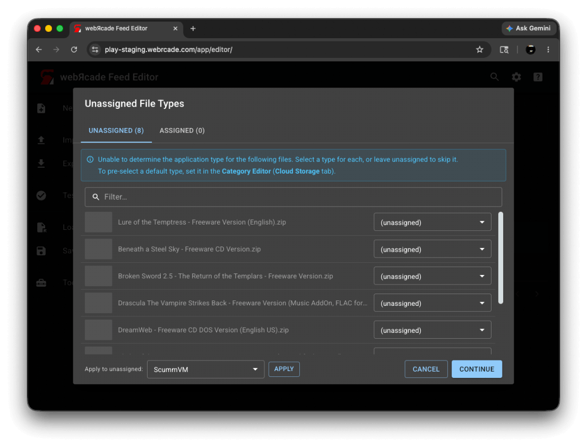
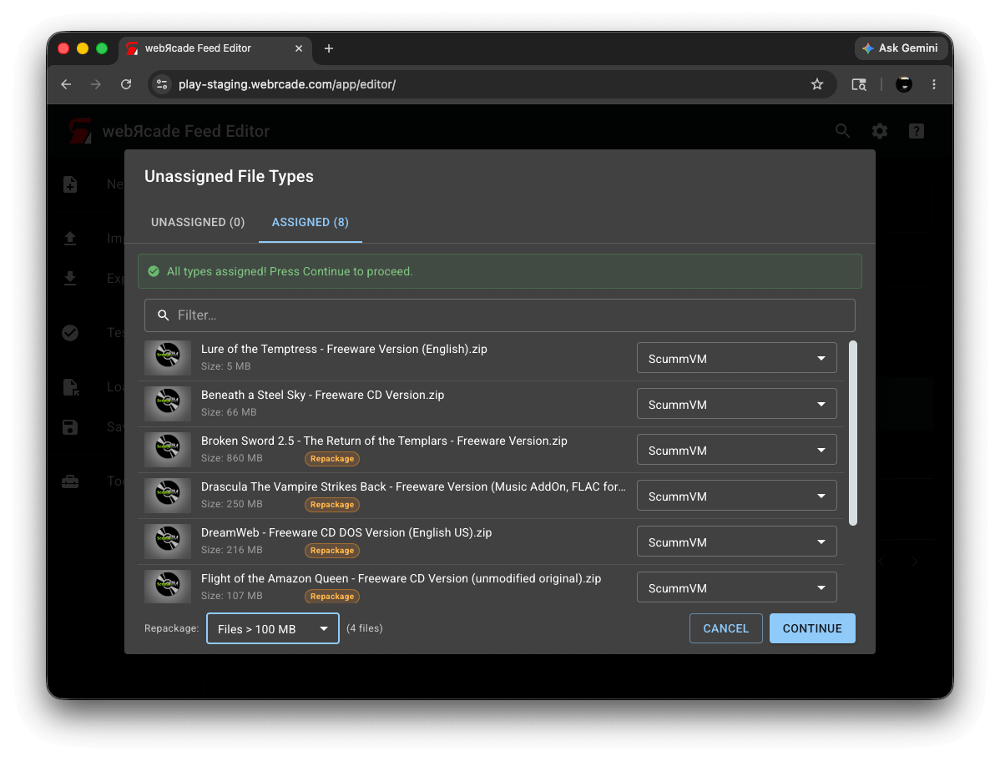
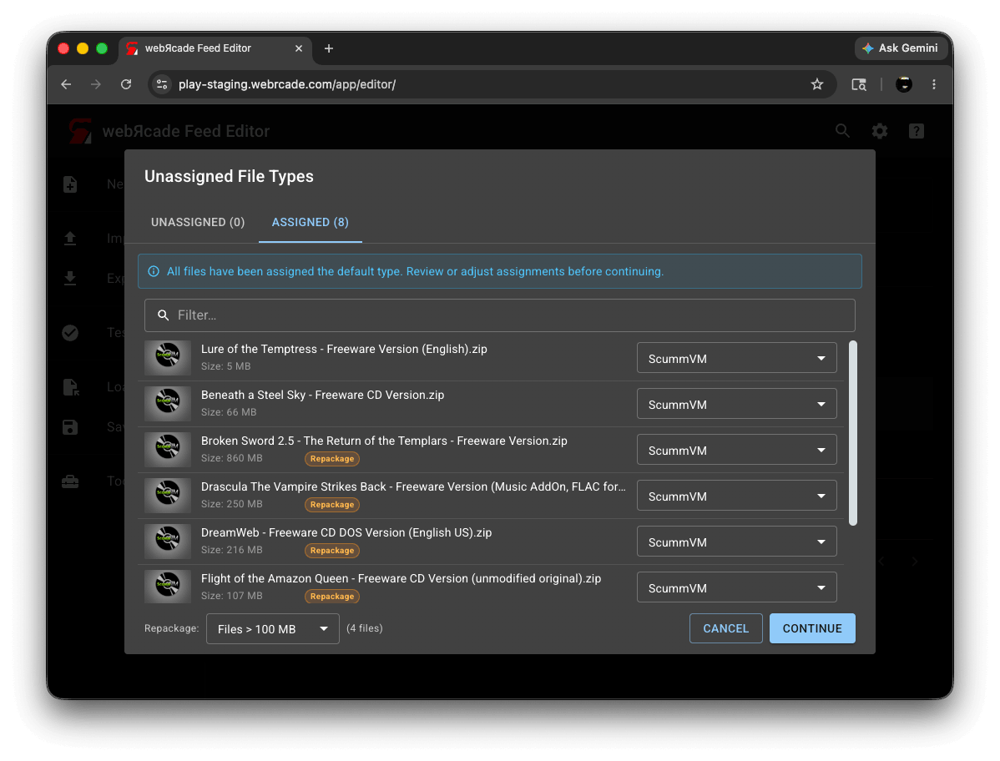
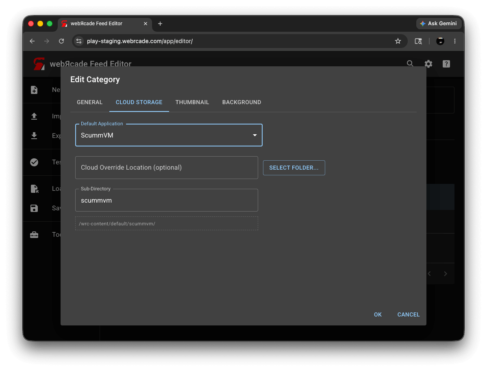
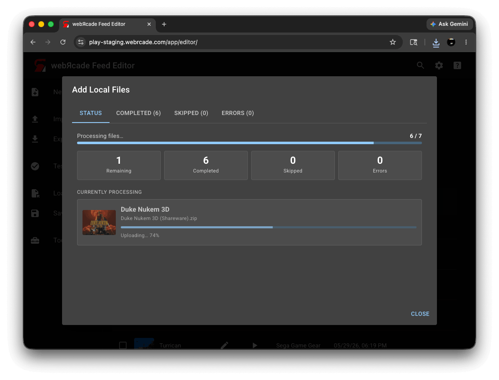
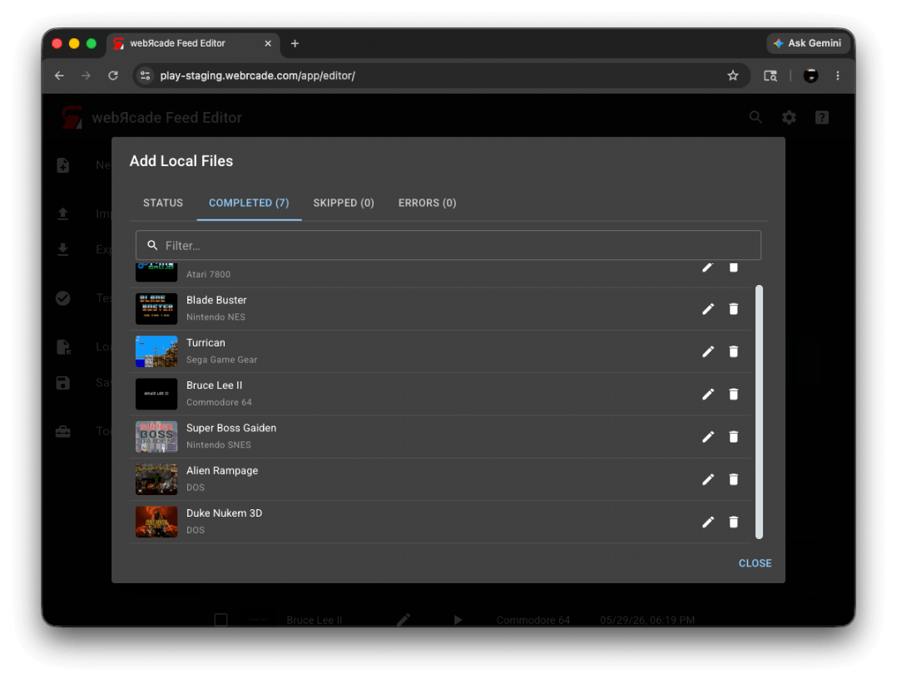
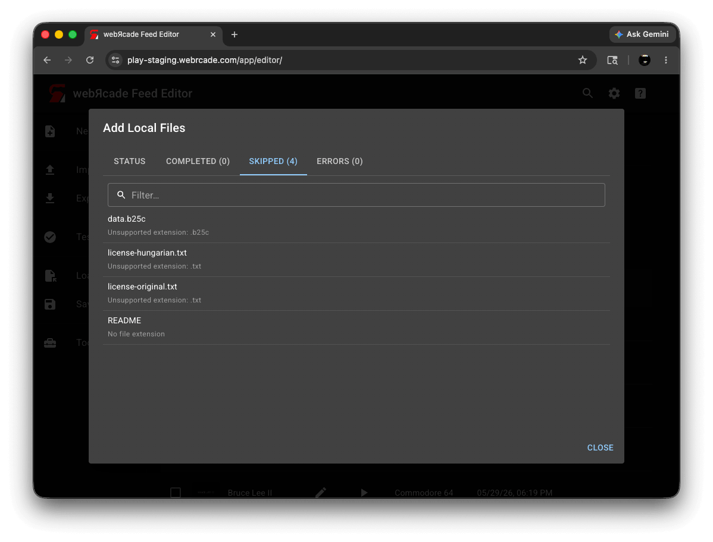
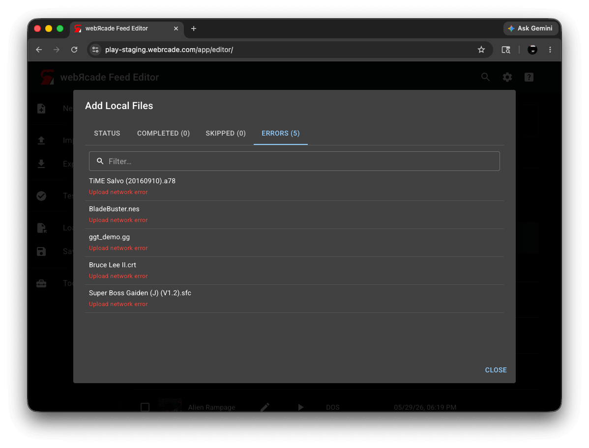
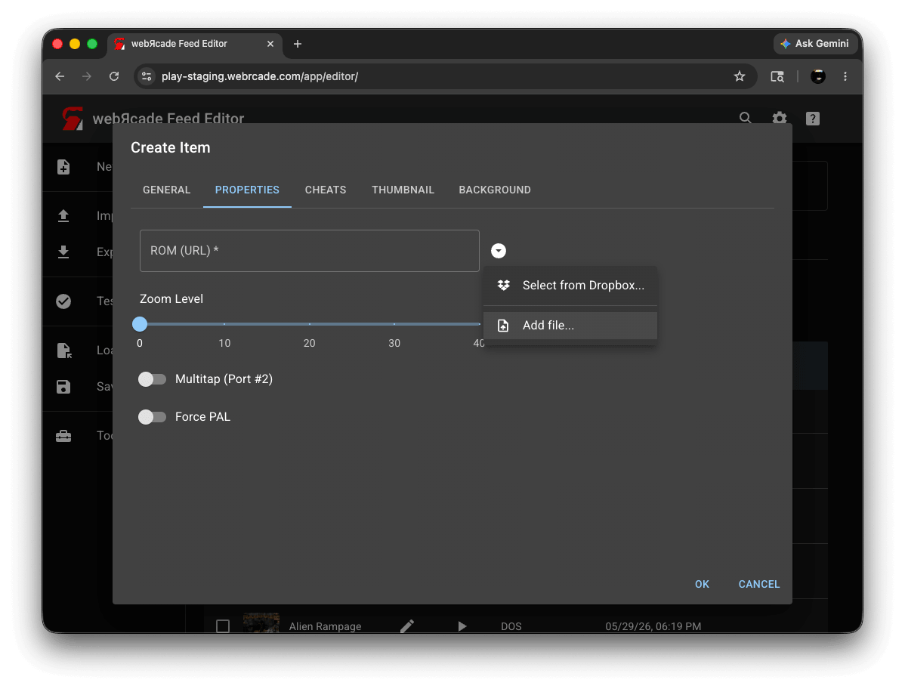

# Adding Items: Local Files

When your game files are on your computer, you can add them to your feed directly. The editor uploads the files to your cloud storage and adds the resulting items to your feed.

!!! note
    Cloud storage must be enabled to use this workflow. See the [Cloud Storage](settings.md#cloud-storage-tab) settings if you have not set it up yet.

This is different from [Adding Items: From URL Links](addingitems-url.md), where files are already hosted online and the editor simply references them by URL.

## Automated Workflow

The automated workflow lets you add a large number of files in a single operation. You can select individual files, a batch of files, or an entire folder, and the editor will analyze each file, determine the application type where it can, and upload everything automatically.

There are three ways to start:

* **Add from files...**: Select one or more individual files using the *Add from files...* action in the [Items Tab more menu](itemstab.md#more-menu).
* **Add from folder...**: Select an entire folder using the *Add from folder...* action in the [Items Tab more menu](itemstab.md#more-menu). The editor will recurse into sub-folders and pick up all supported files.
* **Drag and Drop**: Drag files or folders from your file manager directly onto the editor workspace. See [Drag and Drop: Local Files](../draganddrop-local.md) for details.

### Step 1: Analysis

After you select files or folders, the editor analyzes each file to determine the application type. A progress indicator is shown while this is happening. For most common ROM formats the application is determined automatically and the file moves straight to upload. Files that cannot be analyzed, and files whose application type requires manual assignment (such as `.zip` archives for DOS or ScummVM games, and CD images), are collected and presented in the next step.

Files that are unsupported entirely (for example, image files like `.jpg` or `.png`) are skipped at this stage and will appear in the Skipped tab when the upload dialog opens.

### Step 2: Unassigned File Types

The *Unassigned File Types* dialog appears when one or more files could not be assigned an application automatically. If a [category default application](../dialogs/category-dialog.md#cloud-storage-tab) is set, compatible files will already be assigned. Any remaining unassigned files must be assigned before the upload can proceed. Files left unassigned will be skipped.

#### Unassigned Tab

The Unassigned tab lists all files that need an application assigned.

{: class="center zoomD"}

| __Control__ | __Description__ |
| --- | --- |
| Application drop-down (per row) | Selects the application for the file in that row. The drop-down lists only the applications that are valid for that file's extension. |
| Apply to unassigned | Selects an application to assign to all currently unassigned files at once. This is useful when adding a batch of files that are all the same type, for example a folder of DOS games. |
| Apply | Applies the application selected in *Apply to unassigned* to all unassigned files. |

#### Assigned Tab

Once all files have been assigned an application, the Unassigned tab count drops to zero and the Assigned tab shows all files with their assigned applications and file sizes. A green callout confirms that all applications are assigned and you can press *Continue*.

{: class="center zoomD"}

| __Control__ | __Description__ |
| --- | --- |
| File list | Shows each file with its assigned application and file size. For archive-based applications, files that meet the current Repackage threshold are marked with a *Repackage* badge, indicating they will be repackaged. |
| Repackage threshold | Sets the file size threshold above which archive-based files will be repackaged into a [Package Archive Manifest](../../advanced/archive-manifests.md). Only appears when at least one archive-capable file (such as a `.zip` for ScummVM, DOS, or Quake) is assigned and is 100 MB or larger. See [Repackage](#repackage) below. |
| Continue | Closes the dialog and starts the upload. |

#### Using a Category Default Application

If you frequently add files of the same type to a category, you can set a default application on that category. When a default application is set, the editor assigns it to any file that cannot be identified automatically, as long as the file is compatible with that application. Files that are not compatible with the default are left unassigned and will need to be assigned manually.

{: class="center zoomD"}

The blue callout in this state reads "All files have been assigned the default type. Review or adjust assignments before continuing."

To set a default application, open the [Category Editor](../dialogs/category-dialog.md) and go to the *Cloud Storage* tab.

{: class="center zoomD"}

| __Field__ | __Description__ |
| --- | --- |
| Default Application | When set, any file that cannot be identified automatically is assigned this application type, provided the file is compatible with it. Files that are not compatible are left unassigned. |
| Cloud Override Location (optional) | Replaces the feed's cloud root folder as the base storage path for this category. Click *Select folder...* to choose a folder from your cloud storage. |
| Sub-Directory | The sub-folder appended to the base path where uploaded files are stored. Defaults to the category name. |
| Storage Path | Read-only. Shows the full storage path for this category as it will be used, and updates automatically as you adjust the fields above. |

#### Repackage

When archive-based files (such as `.zip` files for DOS or ScummVM games) are large, the editor can repackage them into a [Package Archive Manifest](../../advanced/archive-manifests.md) format. This splits the archive into smaller pieces and reduces the memory needed to load the content in the browser.

The *Repackage* threshold drop-down at the bottom of the Assigned tab sets the size above which files will be repackaged. Files above the threshold are marked with a *Repackage* badge. The default is *Files > 100 MB*.

!!! note
    Repackaging is optional but recommended for large archives. It significantly improves compatibility on memory-constrained devices such as iOS and Xbox.

### Step 3: Upload

After you press *Continue* in the *Unassigned File Types* dialog (or immediately after analysis if all applications were determined automatically), the *Add Local Files* dialog opens and the upload begins.

#### Status Tab

The Status tab shows overall progress.

{: class="center zoomD"}

| __Control__ | __Description__ |
| --- | --- |
| Progress bar | Shows how many files have been completed out of the total. |
| Remaining | Number of files still waiting to be processed. |
| Completed | Number of files successfully uploaded and added to the feed. Click to jump to the Completed tab. |
| Skipped | Number of files that were skipped. Click to jump to the Skipped tab. |
| Errors | Number of files that failed. Shown in red when there are failures. Click to jump to the Errors tab. |
| Currently Processing | Shows the file being uploaded at that moment, along with its thumbnail, filename, and a per-file progress bar. |

#### Completed Tab

The Completed tab lists all files that were successfully uploaded and added to your feed.

{: class="center zoomD"}

| __Control__ | __Description__ |
| --- | --- |
| Filter | Filters the list by title as you type. |
| Item list | Each row shows the item's thumbnail, title, and application. |
| Edit | Opens the [Item Editor](../dialogs/item-dialog.md) for that item so you can review or change its settings. |
| Delete | Removes the item from the feed. |

#### Skipped Tab

The Skipped tab lists files that were not uploaded, along with the reason.

{: class="center zoomD"}

| __Column__ | __Description__ |
| --- | --- |
| Filter | Filters the list by filename as you type. |
| Filename | The name of the file that was skipped. |
| Reason | Why the file was skipped. Common reasons include unsupported file extensions (such as `.jpg` or `.png`) and files left unassigned in the *Unassigned File Types* dialog. |

#### Errors Tab

The Errors tab lists any files that failed during upload, along with an error message.

{: class="center zoomD"}

| __Column__ | __Description__ |
| --- | --- |
| Filter | Filters the list by filename as you type. |
| Filename | The name of the file that failed. |
| Error | The error message. If you see a Dropbox authentication error, try unlinking and relinking your Dropbox account in the [Cloud Storage](settings.md#cloud-storage-tab) settings. |

## Manual File Upload

You can also upload a local file to any individual URL field in the editor. This is the approach to use when you are creating or editing a single item and want to upload a specific file to a specific field. It works in the Item Editor (ROM and disc URL fields), the Feed Editor (BIOS fields), and the thumbnail and background image fields across all editors (feed, category, and item).

{: class="center zoomD"}

There are two ways to upload a file to a URL field:

* Click the dropdown button to the right of the field and select *Add file...* (or *Add files...* for fields that accept multiple files). A file picker opens, and after you select a file it is uploaded to your cloud storage. The field is populated with the resulting URL automatically.
* Drag a file from your file manager directly onto the field. The field highlights when a valid file is dragged over it.

A progress overlay is shown for larger files while the upload is in progress.

## Notes

* For files already hosted online, see [Adding Items: From URL Links](addingitems-url.md) instead.
