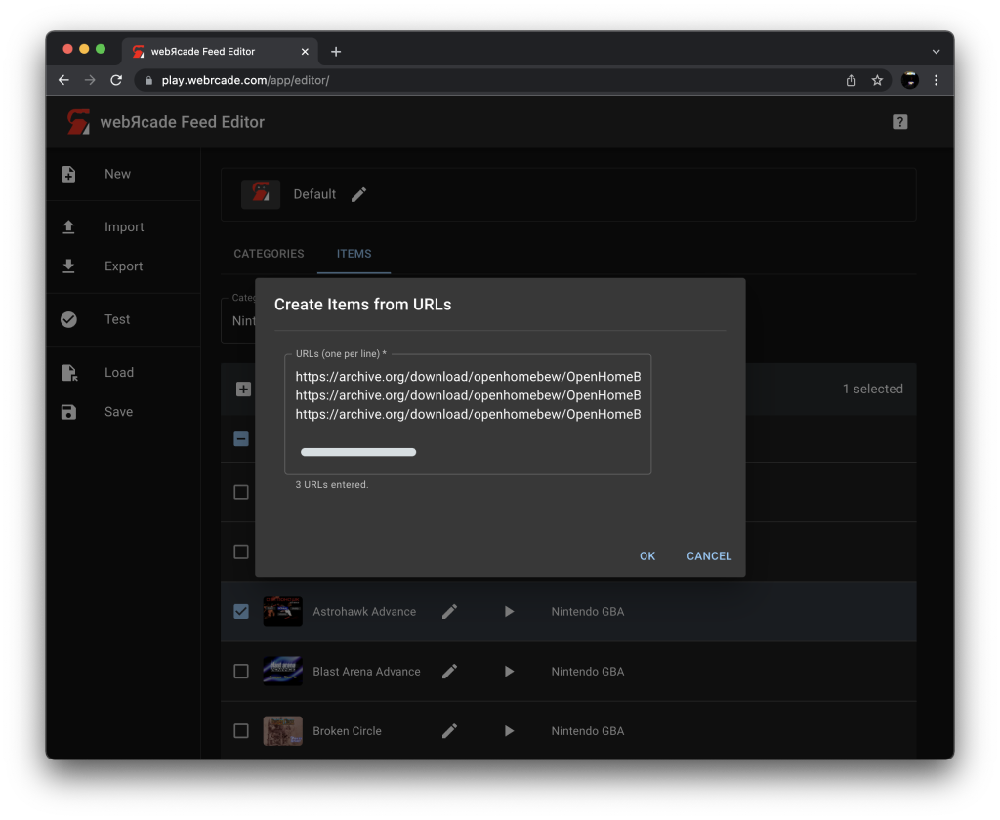
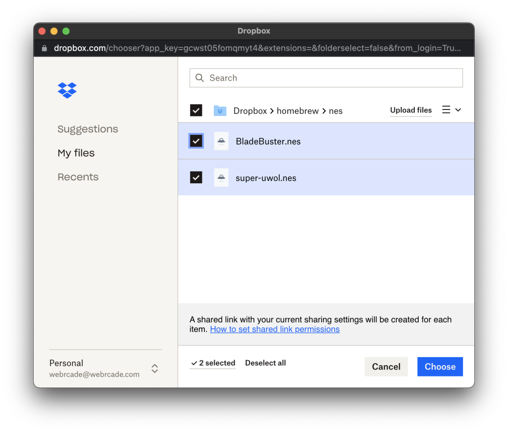
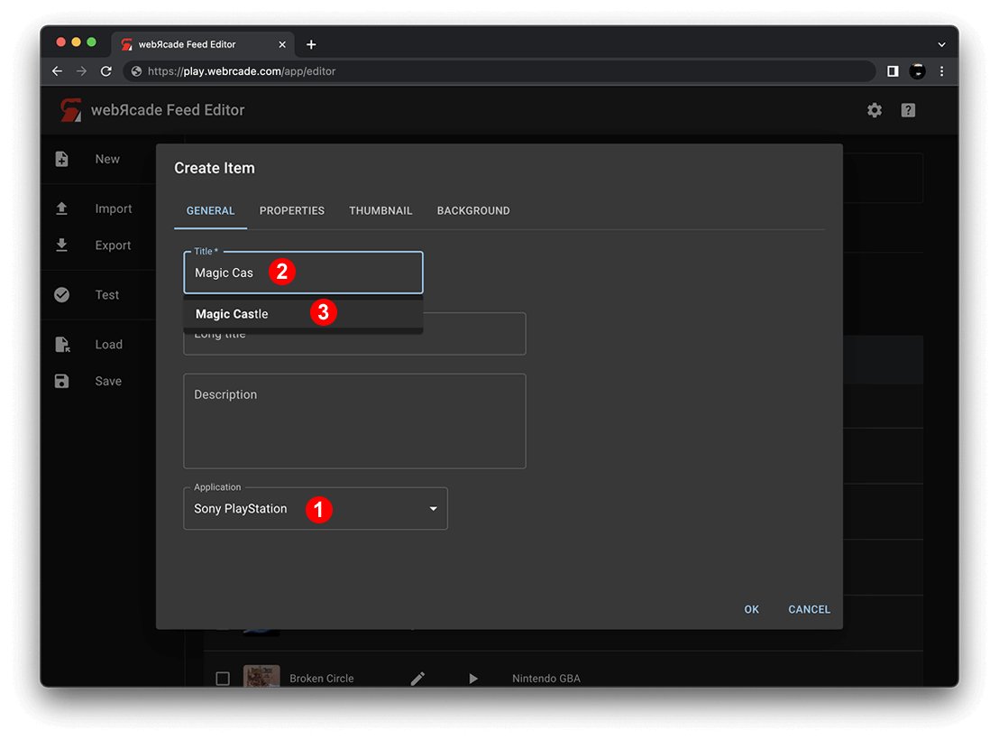
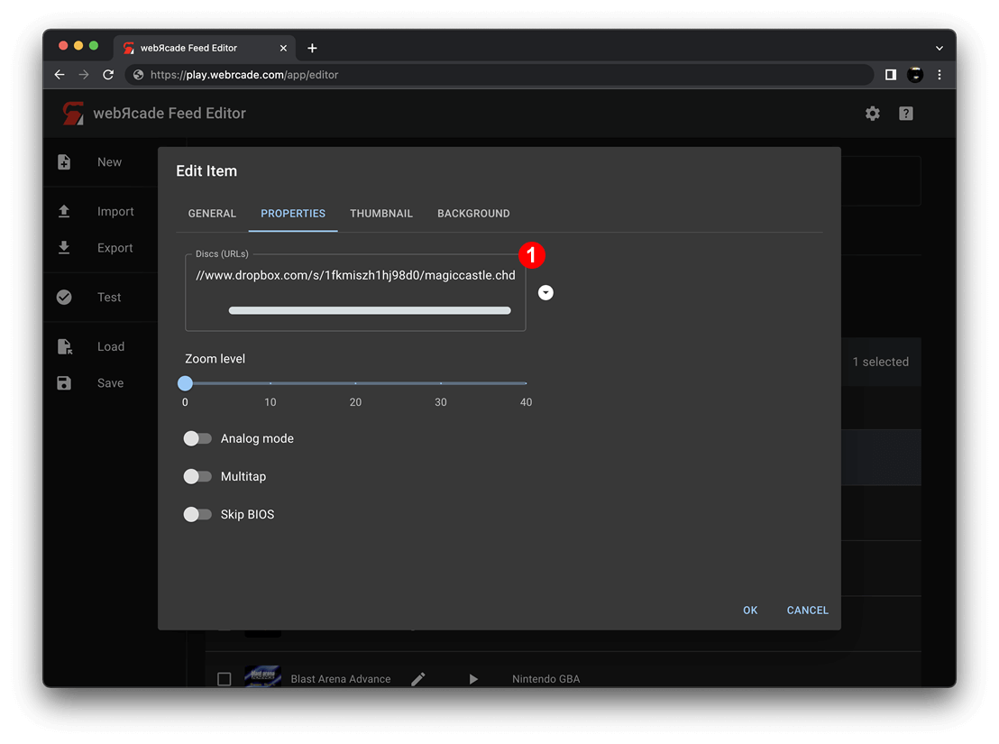

# Adding Items: From URL Links

When your game files are already hosted online, you can add them to your feed by referencing them with URLs. Your files stay where they are; there is nothing to upload.

This is different from [Adding Items: Local Files](addingitems-local.md), where you select files from your computer and the editor uploads them to your cloud storage. With URLs, the files are already online and the editor simply references them.

## Automated Workflows

For most common ROM formats, the editor can analyze a URL automatically to determine the application type, title, and artwork. The three methods below all use this automated analysis.

### Create From URLs

The *Create From URLs* action in the [Items Tab more menu](itemstab.md#more-menu) opens a dialog where you can paste one or more URLs.

{: class="center zoomD"}

After you submit the URLs, the editor analyzes each one to determine the application type, title, and artwork. Items are created automatically for each URL that can be identified. URLs that cannot be identified are skipped.

### Add From Dropbox

The *Add From Dropbox* action in the [Items Tab more menu](itemstab.md#more-menu) opens the Dropbox file picker so you can select files directly from your Dropbox account.

{: class="center zoomD"}

Selected files go through the same analysis as *Create From URLs*. Dropbox links are resolved automatically so you do not need to copy or manage the URLs yourself.

### Drag and Drop URL Links

You can drag URL links directly from your browser into the editor workspace or into the *Create Items From URLs* dialog.

Dragging a URL onto the workspace creates a single item, equivalent to pasting it into the *Create Items From URLs* dialog. Dragging onto the dialog adds the URL to the list so you can submit several at once.

See [Drag and Drop: URL Links](../draganddrop.md#url-links) for details and animated examples.

## Manual Item Creation

Manual item creation is always an option, either as a fallback when the automated workflow cannot identify a file (for example, an Atari 2600 `.bin` that comes back unrecognized), or as the required path for content types that cannot be analyzed automatically (disc-based and archive-based games such as PlayStation, ScummVM, Quake, and DOS games).

!!! note
    Archive-based games can optionally use a [Package Archive Manifest](../../advanced/archive-manifests.md) (`.json`) instead of a single `.zip` file. The manifest format reduces memory usage and is recommended for large archives. The editor's [Repackage Archive](../tools/repackage-archive.md) tool can generate a manifest automatically from an existing `.zip` file.

To manually create an item, perform the following steps:

1. Open the [Items Tab](itemstab.md).
2. Select *Create Item* in the [table toolbar](itemstab.md#table-toolbar). The Create Item Editor will be displayed.

On the **General Tab** of the Create Item Editor, perform the following steps:

{: class="center zoomD"}

* Select the appropriate application (Sony PlayStation, etc.) in the *Application* drop-down (See #1 in screenshot above).
* In the *Title* field, start typing the name of the game. An autocomplete list will appear directly below the field (See #2 in screenshot above).
* Select one of the items in the autocomplete list to have the game's description and artwork retrieved (See #3 in screenshot above).

On the **Properties Tab** of the Create Item Editor, provide the content URL(s) based on the type of content being added:

{: class="center zoomD"}

* For ROM-based items, provide the ROM file URL in the *ROM* field.
* For CD-based items, provide one or more disc URLs in the *Discs (URLs)* field directly or via the chooser button to the right of the field (See #1 in screenshot above).
* For archive-based items, provide the URL to the package archive (`.zip`) or package manifest (`.json`) in the *Package Archive or Package Manifest (URL)* field.

Click *OK* to add the newly created item to the feed.

## Notes

* For files on your computer rather than hosted online, see [Adding Items: Local Files](addingitems-local.md).
