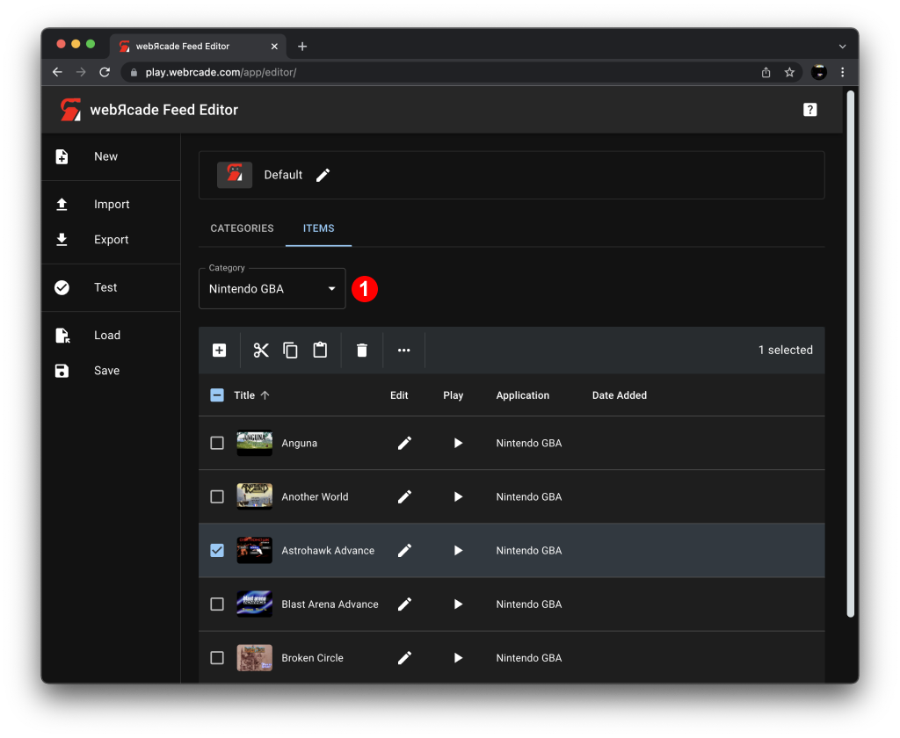

# Feed Items Tab

The "Feed Items Tab" consists of the items (games, etc.) contained in the currently selected category of the active feed.

{: class="center zoomD"}

The category drop-down list (*See #1 in screenshot above*) is used to selected the category whose items are displayed.

## Items Table

The "Items Table" contains the items (games, etc.) associated with the currently selected category (*See #1 in screenshot above*).

The [Table Toolbar](#table-toolbar) consists of the various item-based actions that can be performed on the items table. The [Table Columns](#table-columns) section describes the columns that comprise the items table.

### Table Toolbar

The following table describes the various item-based actions that can be performed on the items table.

| __Action__ | __Icon__ | __Description__ |
| --- | --- | --- |
| Create Item | {: class="action"} | Displays the [Create Item Editor](../dialogs/item-dialog.md) which is used to *manually* add a new item to the current category.  There are several methods available that simplify adding items to a category. See the [Adding Items](addingitems.md) section for more information. |
| Cut | {: class="action"} | Cuts the selected items from the current category and stores them on the clipboard. |
| Copy | {: class="action"} | Copies the selected items and stores them on the clipboard. |
| Paste | {: class="action"} | Pastes the items that are on the clipboard into the current category.  |
| Delete | {: class="action"} | Deletes the currently selected items. |
| More | {: class="action"} | Displays the [More Menu](#more-menu). |

### Table Columns

The following table describes the columns that comprise the items table.

| __Column__ |  | __Description__ |
| --- | --- | --- |
| Title | | The title of the item associated with the row. |
| Edit | {: class="action"} | When the pencil icon is clicked, the [Item Editor](../dialogs/item-dialog.md) is displayed, providing the ability to edit the item associated with the row. |
| Play | {: class="action"} | When the play icon is clicked, the item (game, etc.) will be launched. Exiting the item (game, etc.) will return back to the feed editor. |
| Application | | The name of the [Application](../../apps/index.md) (emulator, etc.) associated with the item. |
| Date Added | | The date/time that the item associated with the row was added to the category.  Sorting by this column in descending order is very useful as it ensures that recently added items appear near the top of the table's first page. This simplifies the process of finding and validating newly added items (See [Adding Items](addingitems.md)). |

## More Menu

The "More Menu" provides additional actions that can be performed on the items table.

{: class="center zoomD"}

| __Menu Item__ | __Icon__ | __Description__ |
| --- | --- | --- |
| Create From URLs | {: class="action"} | Displays the "Create Items From URLs" dialog.  See the [Create From URLS](#create-from-urls) section for complete information. |
| Add from Dropbox | {: class="action"} | Displays the "Dropbox chooser".  See the [Add from Dropbox](#add-from-dropbox) section for complete information.   |
| Copy stand-alone link (URL) | {: class="action"} | Creates a stand-alone link (direct link) to the selected item (game, etc.).  Stand-alone links can be shared, hosted via embedding, or added directly to mobile device home screens.  See the [Stand-alone](../../standalone/index.md) section for more information. |
| Analyze | {: class="action"} |  *Analyzes* the currently selected items.  Analysis of an item consists of determining and updating the following aspects of the item (if able to be discovered): <ul><li>The [Application](../../apps/index.md) for the item. (for ROM-based items)</li><li>The [Properties](../dialogs/item-dialog.md#properties-tab) for the item. (for ROM-based items)</li><li>The title (and long title) for the item.</li><li>The artwork (thumbnail and background images) for the item.</li></ul> The *analyze* operation is similar to *scraping* functionality found in other front-ends. The primary difference is that the *analyze* operation attempts to determine the application type and related properties in addition to meta-data (titles and artwork). |

### Add From Dropbox

The "Add From Dropbox" action provides the ability to select one or more ROM files via the "Dropbox chooser" (see screenshot below) and have a set of corresponding items created and added to the current category (the chooser will prompt for login credentials if necessary).

{: class="center zoomD"}

An *analyze* operation is performed on each of the selected ROMs that attempts to determine the following:

* The [Application](../../apps/index.md) for the item.
* The [Properties](../dialogs/item-dialog.md#properties-tab) for the item.
* The title (and long title) for the item.
* The artwork (thumbnail and background images) for the item.

If the *analyze* operation is unable to determine an appropriate [Application](../../apps/index.md) for a particular ROM, a corresponding item will not be created. In such cases, manual creation of an item via the "Create Item" action of the [Items Table Toolbar](#table-toolbar) is required.

### Create From URLs

The "Create From URLs" action provides the ability to specify one or more URLs that point to ROM files and have a set of corresponding items created and added to the current category.

{: class="center zoomD"}

As shown in the screenshot above, three URLs are specified that point to homebrew ROM files within the [OpenHomeBrew](https://archive.org/details/openhomebew) repository in the Internet Archive (See the [Internet Archive Resource](../../feeds/resources/inetarchive.md) section for more information on using URLs from the Internet Archive).

In addition to typing or pasting in URLs manually, the "Create Items from URLs" dialog supports drag and drop functionality (see the [Create from URLs Dialog](../draganddrop.md#create-from-urls-dialog) section of the [Drag and Drop](../draganddrop.md) documentation for more information).

An *analyze* operation is performed on each of the ROMs located at the URLs provided that attempts to determine the following:

* The [Application](../../apps/index.md) for the item.
* The [Properties](../dialogs/item-dialog.md#properties-tab) for the item.
* The title (and long title) for the item.
* The artwork (thumbnail and background images) for the item.

If the *analyze* operation is unable to determine an appropriate [Application](../../apps/index.md) for a particular ROM, a corresponding item will not be created. In such cases, manual creation of an item via the "Create Item" action of the [Items Table Toolbar](#table-toolbar) is required.
