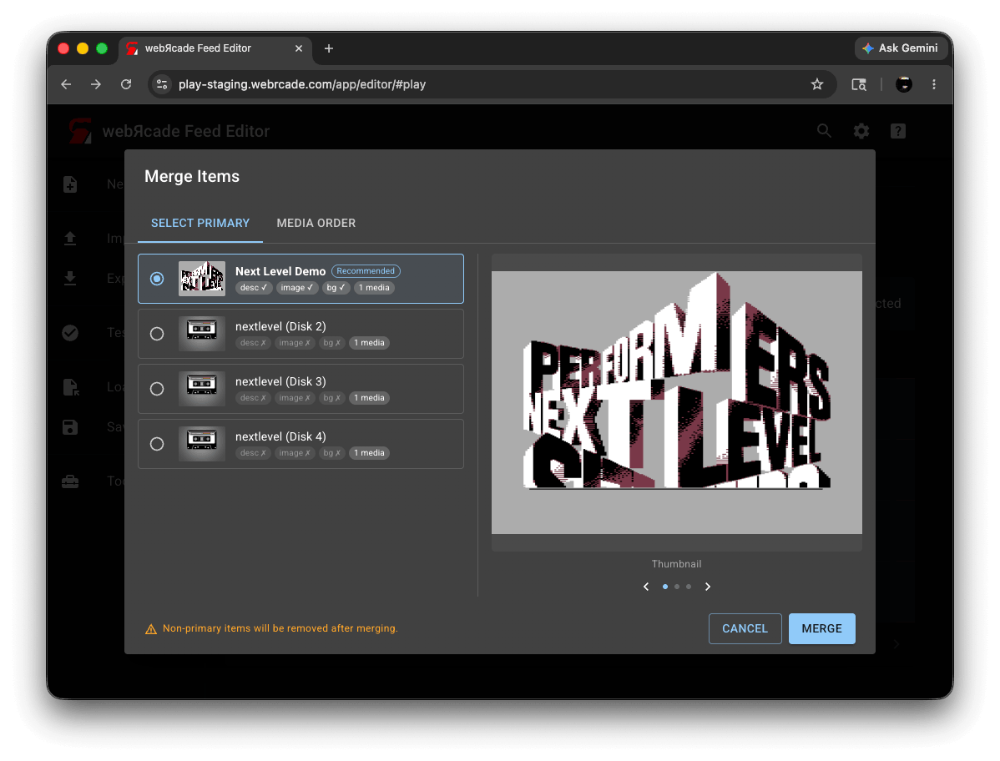
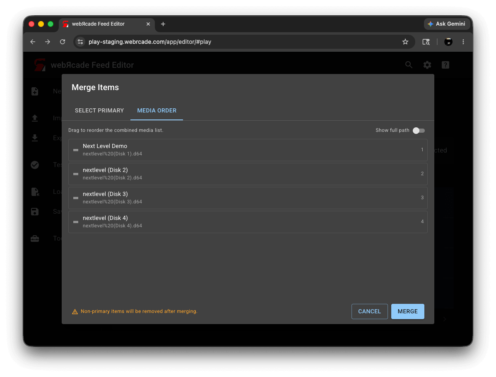

# Merge Items

The *Merge Items* dialog combines two or more items of the same application type into a single item. It is useful when you have the same game spread across multiple item entries (for example, a multi-disc game captured as separate items) and you want to consolidate them into one item with an ordered disc or media list.

To open the dialog, select two or more items in the [Items Tab](itemstab.md) and click the *Merge* button in the toolbar.

!!! note
    The *Merge* button is only enabled when all of the following are true:

    * Two or more items are selected.
    * All selected items are the same application type.
    * The application type supports multiple discs or media files (for example, PlayStation, Sega CD, or ScummVM).

## Select Primary Tab

The *Select Primary* tab is shown first. Here you choose which item will be kept after the merge. The remaining items are removed, and their disc or media files are added to the primary item's media list.

{: class="center zoomD"}

Each item appears as a card showing its thumbnail, title, and a set of status chips indicating whether a description, thumbnail image, and background image are present, along with the number of disc or media files it contains. The item the editor considers the best candidate based on those attributes is marked *Recommended*.

| __Control__ | __Description__ |
| --- | --- |
| Item cards | Select the primary item by clicking its card or radio button. The primary item's title, description, thumbnail, and background are kept after the merge. |
| Recommended chip | Marks the item with the highest overall completeness score across description, thumbnail, background, and media count. |
| Preview panel | Displays the selected item's thumbnail, background image, and description. Use the arrow buttons or the dot indicators to cycle through the three preview pages. |

## Media Order Tab

The *Media Order* tab shows all disc or media files from the selected items combined into a single list. The primary item's files appear first. Drag entries to set the order they will appear in the merged item.

{: class="center zoomD"}

| __Control__ | __Description__ |
| --- | --- |
| Media list | The combined list of all disc or media files. Drag an entry by its handle to reorder it. When an item contributed more than one file, its entries are grouped under a header showing the source item's title. |
| Show full path | When enabled, each entry shows its full URL instead of just the filename. The preference is saved across sessions. |

!!! warning
    Pressing *Merge* permanently removes all non-primary items from the category. The primary item is updated with the combined, reordered media list. This cannot be undone.
