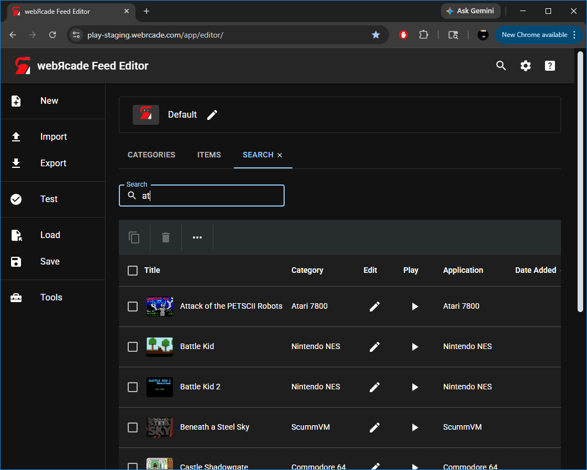

# Feed Search Tab

The "Feed Search Tab" provides the ability to search for items (games, etc.) across all categories of the active feed.

The search tab is opened by clicking the search (magnifying glass) icon in the top-right of the editor. Clicking the `×` on the tab will close it.

{: class="center zoomD"}

## Search Field

The search field filters the results table as you type, matching against item titles across all categories.

## Search Results Table

The search results table displays items whose titles match the current search term.

### Table Toolbar

| __Action__ | __Icon__ | __Description__ |
| --- | --- | --- |
| Copy | {: class="action"} | Copies the selected items to the clipboard. |
| Delete | {: class="action"} | Deletes the currently selected items. |
| More | {: class="action"} | Displays the [More Menu](#more-menu). |

### Table Columns

| __Column__ |  | __Description__ |
| --- | --- | --- |
| Title | | The title of the item. |
| Category | | The category the item belongs to. |
| Edit | {: class="action"} | Opens the [Item Editor](../dialogs/item-dialog.md) for the item. |
| Play | {: class="action"} | Launches the item (game, etc.). |
| Application | | The [Application](../../apps/index.md) (emulator, etc.) associated with the item. |
| Date Added | | The date the item was added to the feed. |

## More Menu

| __Menu Item__ | __Icon__ | __Description__ |
| --- | --- | --- |
| Analyze | {: class="action"} | Analyzes the selected items to determine and update their application type, properties, title, and artwork. See the [Items Tab](itemstab.md#more-menu) for full details on the analyze operation. |
