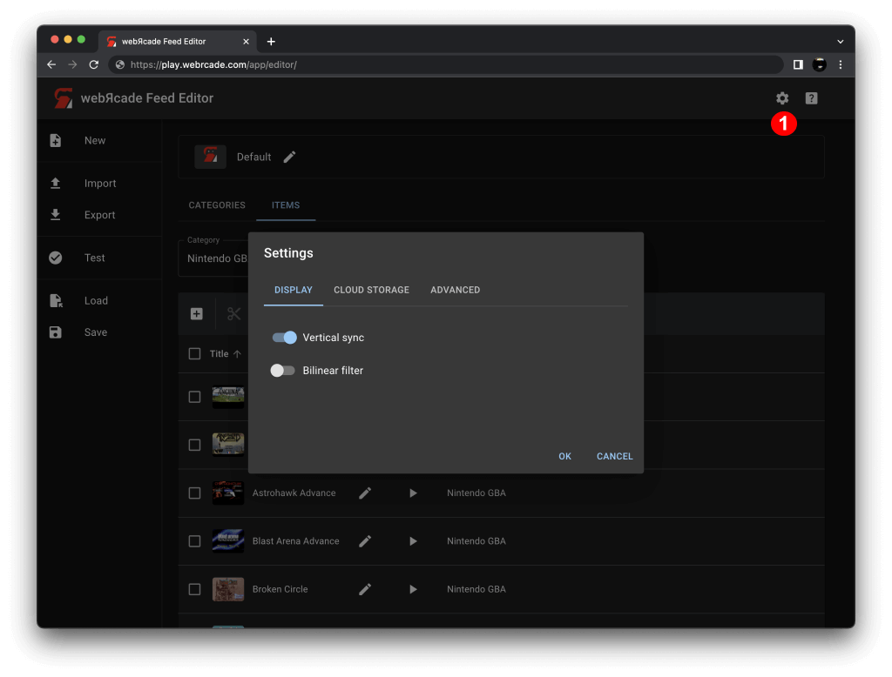
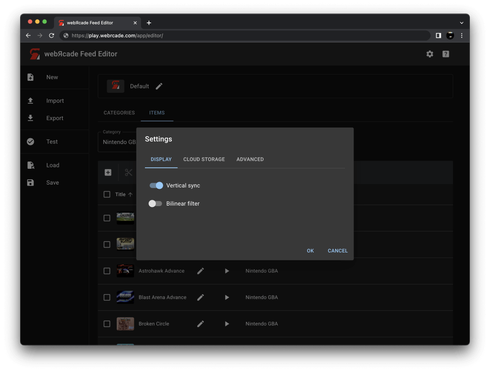
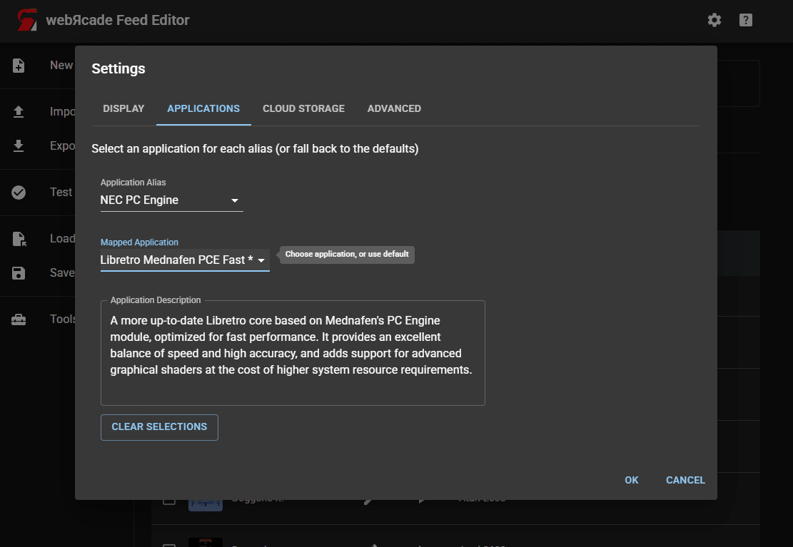
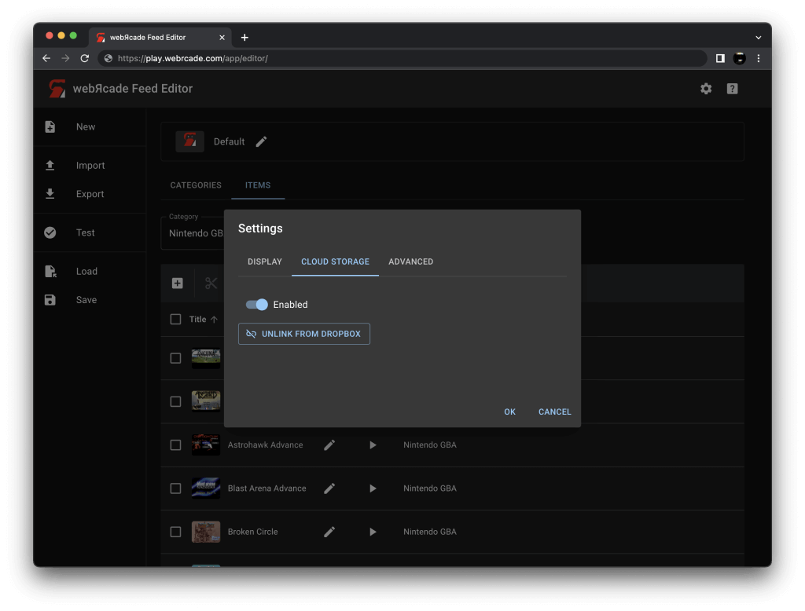
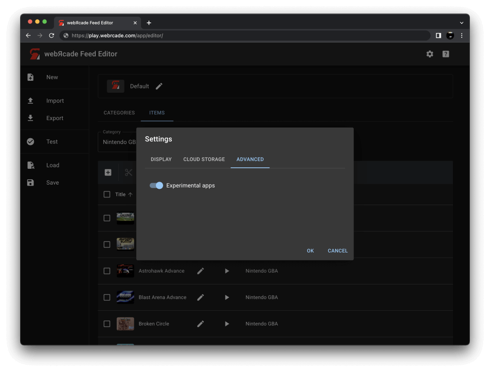

# Settings Dialog

The "Settings Dialog" supports viewing and/or modifying the configuration of various webЯcade settings.

{: style="padding:5px;" class="center zoomD"}

Pressing the "Settings" icon *(#1 in screenshot above)* will display the "Settings Dialog".

The various categories of settings are organized into distinct tabs, as detailed below.

### Display Settings Tab

The "Display Settings" tab is used to view and/or modify settings related to how items (games, etc.) should be displayed (or rendered).

{: style="padding:5px;" class="center zoomD"}

| __Field__ | __Description__ |
| --- | --- |
| Screen size | The screen size to use when playing a game.  Options include: <ul><li>`Native` : The application's native resolution</li><li>`16:9` : Widescreen resolution</li><li>`Fill` : Fill the entire contents of the screen</li></ul> |
| Vertical sync | Enables vertical sync (VSync) when playing games. Vertical sync attempts to synchronize the frame rate of the game with the display (screen) which eliminates artifacts such as screen tearing.  This setting can be disabled if performance-related issues are experienced.  |
| Bilinear filter | Performs bilinear interpolation on the output display. Enabling bilinear filtering produces display output where pixels are not as sharp and pronounced. |

### Applications Tab

The "Applications" tab is used to select the specific application (emulator implementation) to use for each application alias (e.g., `nes`, `snes`, `saturn`). This allows for overriding the default application that is used when a feed item specifies an alias type.

{: style="padding:5px;" class="center zoomD"}

!!! note
    Application mappings are resolved in the following order:

    1. **Item-specific setting** — If a specific application (emulator) has been set for the item, it is used.
    2. **User default setting** — If no item-specific mapping exists, the user’s default mapping from the [Settings Dialog](../workspace/settings.md#applications-tab) is used (if configured).
    3. **Feed setting** — If no user mapping is set, the mapping defined in the feed is used.
    4. **Global default** — If none of the above are set, the alias falls back to its global default application.

| __Field__ | __Description__ |
| --- | --- |
| Application Alias | The alias to configure. Use the dropdown to select from the available aliases (e.g., `NEC PC Engine`, `NES`, `SNES`, etc.). |
| Mapped Application | The application (emulator implementation) to use for the selected alias. Use the dropdown to select from the available options. |
| Clear Selections | Pressing the `Clear Selections` button resets all alias mappings back to `(use default)`. |

### Cloud Storage Tab

The "Cloud Storage" tab is used to view and/or modify settings related to webЯcade's use of cloud storage.

For more information, refer to the [Cloud Storage](../../storage/index.md) section of this documentation.

{: style="padding:5px;" class="center zoomD"}

| __Field__ | __Description__ |
| --- | --- |
| Enabled | Toggles whether cloud storage (via Dropbox) is enabled or not. |
| Dropbox (link/unlink button) | This button is used to either *link* or *unlink* a Dropbox account with webЯcade depending on its current status.  It is important to note that this *linking* operation must be repeated for each unique browser and/or device being used with webЯcade. |

### Advanced Settings Tab

The "Advanced" tab is used to view and/or modify settings that typically remain at their default values.

{: style="padding:5px;" class="center zoomD"}

| __Field__ | __Description__ |
| --- | --- |
| Experimental apps | Enables whether *experimental* applications are displayed in the webЯcade *[player](../../userguide/index.md)* or *[feed editor](../../editor/index.md)*.  Applications are typically designated as *experimental* based on high resource requirements or due to instability and defects. |