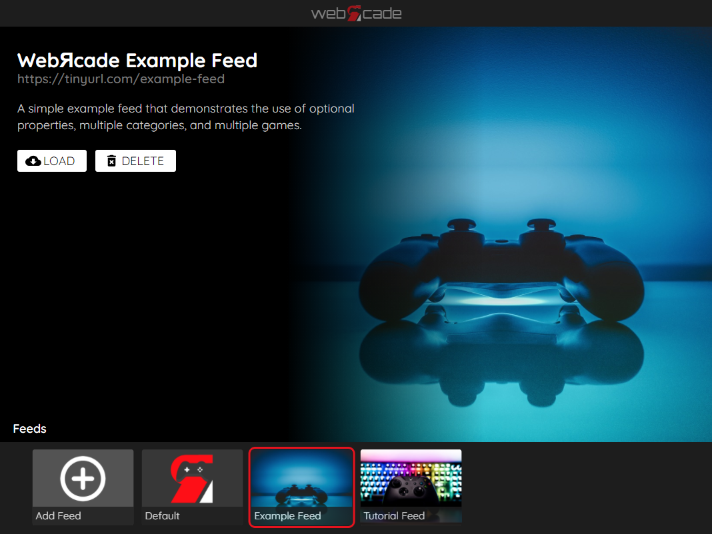

# Feed Format

This page details the [JSON](https://en.wikipedia.org/wiki/JSON) (JavaScript Object Notation) format of a webЯcade feed along with a fully-formed [concrete example](#complete-example).

!!! note
    The dimensions of thumbnail images referenced in the feed must be `400x300` or they will not be displayed. This restriction may be removed in the future.

## Root Object

The root object of a webЯcade feed includes high-level information about the feed, including a title, an optional description, and optional images. The root object also includes a list of categories contained in the feed.

### Properties

The table below contains the properties available for the root object. 

| __Property__ | __Type__ | __Required__ | __Details__ |
|----------|------|----------|---------|
| title | String | Yes | A title for the feed. |
| longTitle | String | No | A long title for the feed (will be used in locations with additional room for display). |
| categories | Array of [Category](#category-object) objects | Yes | An array containing the categories associated with the feed (see [Category](#category-object) object).<br><br>The order that the categories appear in the array is identical to the order they will be presented in the front-end (they are not sorted).<br><br>A feed must contain at least one category. |
| description | String | No | A description of the feed. |
| thumbnail | URL | No | The location (URL) of a thumbnail image for the feed.<br><br>The dimensions of the image must be `400x300`. |
| background | URL | No | The location (URL) of a background image for the feed. |

### Example

The following is an example of a simple webЯcade feed with the root object properties highlighted.

``` json hl_lines="1-7 25-28"
{
  "title": "Example Feed",
  "longTitle": "WebЯcade Example Feed",
  "description": "A simple example feed that demonstrates the use of optional properties, multiple categories, and multiple games.",
  "thumbnail": "https://dl.dropboxusercontent.com/s/m3hq5u16fyino8j/feed-thumb.jpg",
  "background": "https://dl.dropboxusercontent.com/s/lu5vojk2mtjnskc/feed-background.jpg",
  "categories": [
    {
      "title": "Shooters",
      "longTitle": "Shooter Games",
      "description": "A \"shoot 'em up\", also known as a \"shmup\" or \"STG\" (the common Japanese abbreviation for \"shooting games\"), is a game in which the protagonist combats a large number of enemies by shooting at them while dodging their fire.",
      "thumbnail": "https://dl.dropboxusercontent.com/s/73byx1yf6wqds44/category-shooter-thumb.jpg",
      "background": "https://dl.dropboxusercontent.com/s/na82kovznldp2fc/category-shooter-background.jpg",    
      "items": [
        {
          "title": "Astro Force",
          "type": "sms",
          "description": "Astro Force is a nod to classic Shoot ’em ups from back in the day. Heavily inspired by Thunder force, RSG, Aleste, Gaiares, MSX Nemesis, and R-Type. Astro Force features 6 stages, 30+ enemy types, and 11 bosses.",
          "thumbnail": "https://dl.dropboxusercontent.com/s/x80509rumltq3z3/astroforce-thumb.png",
          "background": "https://dl.dropboxusercontent.com/s/odshjp4bxyzq4k9/astroforce-background.png",
          "props": {
            "rom": "https://dl.dropboxusercontent.com/s/ggc87mfds9bax9p/astroforce.sms"
          }
        }
      ]
    }
  ]
}
```

The following image depicts the highlighted root object properties from the feed above displayed in the webЯcade front-end (Feeds view). The title, long title, description, thumbnail, and background images of the root object are shown below.

{: style="padding:5px 15px;" class="center"}

## Category Object

Category objects of a webЯcade feed provide a means of classifying items (games, etc.) into user-defined groups
(by game type, console type, etc.). Category objects include a title, associated images, and the items (games, etc.) that are included in the category.

For a feed to be considered valid it must contain at least one category object.

### Properties

The table below contains the properties available for categoy objects. 

| __Property__ | __Type__ | __Required__ | __Details__ |
|----------|------|----------|---------|
| title | String | Yes | A title for the category. |
| longTitle | String | No | A long title for the category (will be used in locations with additional room for display). |
| items | Array of [Item](#item-object) objects | Yes | An array containing the items associated with the category (see [Item](#item-object) object).<br><br>The items will be sorted alphanumerically prior to being displayed in the front-end. |
| description | String | No | A description of the category. |
| thumbnail | URL | No | The location (URL) of a thumbnail image for the category.<br><br>The dimensions of the image must be `400x300`. |
| background | URL | No | The location (URL) of a background image for the category. |

### Example

The following is an example of a simple webЯcade feed that includes a single category object whose properties are highlighted.

``` json hl_lines="8-14 25-26"
{
  "title": "Example Feed",
  "longTitle": "WebЯcade Example Feed",
  "description": "A simple example feed that demonstrates the use of optional properties, multiple categories, and multiple games.",
  "thumbnail": "https://dl.dropboxusercontent.com/s/m3hq5u16fyino8j/feed-thumb.jpg",
  "background": "https://dl.dropboxusercontent.com/s/lu5vojk2mtjnskc/feed-background.jpg",
  "categories": [
    {
      "title": "Shooters",
      "longTitle": "Shooter Games",
      "description": "A \"shoot 'em up\", also known as a \"shmup\" or \"STG\" (the common Japanese abbreviation for \"shooting games\"), is a game in which the protagonist combats a large number of enemies by shooting at them while dodging their fire.",
      "thumbnail": "https://dl.dropboxusercontent.com/s/73byx1yf6wqds44/category-shooter-thumb.jpg",
      "background": "https://dl.dropboxusercontent.com/s/na82kovznldp2fc/category-shooter-background.jpg",    
      "items": [
        {
          "title": "Astro Force",
          "type": "sms",
          "description": "Astro Force is a nod to classic Shoot ’em ups from back in the day. Heavily inspired by Thunder force, RSG, Aleste, Gaiares, MSX Nemesis, and R-Type. Astro Force features 6 stages, 30+ enemy types, and 11 bosses.",
          "thumbnail": "https://dl.dropboxusercontent.com/s/x80509rumltq3z3/astroforce-thumb.png",
          "background": "https://dl.dropboxusercontent.com/s/odshjp4bxyzq4k9/astroforce-background.png",
          "props": {
            "rom": "https://dl.dropboxusercontent.com/s/ggc87mfds9bax9p/astroforce.sms"
          }
        }
      ]
    }
  ]
}
```

The category that is selected in the webЯcade front-end (Categories view) below corresponds to the highlighted category object properties from the feed above. The title, long title, description, thumbnail, and background images of the category are displayed.

{: style="padding:5px 15px;" class="center"}

## Item Object

Item objects within a webЯcade feed correspond to items (games, etc.) that can be launched (played, etc.). Each item object must contain an application "`type`" property value (the specific emulator or game engine, etc. to launch). The [Applications](../apps/index.md) page contains a listing of all of the available applications. The detailed page for each application contains a *"Feed"* section that includes the application-specific `type` value. In addition to the application type, item objects may include a title, description, and associated images.

### Properties

The table below contains the properties available for item objects. 

| __Property__ | __Type__ | __Required__ | __Details__ |
|----------|------|----------|---------|
| title | String | Yes | A title for the item. |
| longTitle | String | No | A long title for the item (will be used in locations with additional room for display). |
| type | String | Yes | The `type` of the item.<br><br>Refer to the [Applications](../apps/index.md) page for a list of available applications.<br><br>Each detailed application page contains a *"Feed"* section that includes the application-specific `type` value (see the [NES Application Type](../apps/emulators/nes/index.md#type) as an example). |
| props | Type-specific object | Yes | The type-specific properties associated with the item.<br><br>Refer to the [Applications](../apps/index.md) section for the list of available applications.<br><br>Each detailed application page contains a *"Feed"* section that includes the list of available application-specific properties (see the [NES Application Properties](../apps/emulators/nes/index.md#properties) as an example). |
| description | String | No | A description of the item. |
| thumbnail | URL | No |  The location (URL) of a thumbnail image for the item.<br><br>The dimensions of the image must be `400x300`. |
| background | URL | No | The location (URL) of a background image for the item. |

### Example

The following is an example of a simple webЯcade feed that includes a single item object whose properties are highlighted.

The item below corresponds to the excellent Sega Genesis homebrew game Omega Blast by developer Nendo. The item has a `type` of `genesis` which corresponds to the [Sega Genesis Application](../apps/emulators/genesis/index.md). The `props` associated with the item include a `rom` value that refers to a Dropbox location hosting the Omega Blast rom file (see [Genesis Application Properties](../apps/emulators/genesis/index.md#properties)). 

``` json hl_lines="15-24"
{
  "title": "Example Feed",
  "longTitle": "WebЯcade Example Feed",
  "description": "A simple example feed that demonstrates the use of optional properties, multiple categories, and multiple games.",
  "thumbnail": "https://dl.dropboxusercontent.com/s/m3hq5u16fyino8j/feed-thumb.jpg",
  "background": "https://dl.dropboxusercontent.com/s/lu5vojk2mtjnskc/feed-background.jpg",
  "categories": [
    {
      "title": "Shooters",
      "longTitle": "Shooter Games",
      "description": "A \"shoot 'em up\", also known as a \"shmup\" or \"STG\" (the common Japanese abbreviation for \"shooting games\"), is a game in which the protagonist combats a large number of enemies by shooting at them while dodging their fire.",
      "thumbnail": "https://dl.dropboxusercontent.com/s/73byx1yf6wqds44/category-shooter-thumb.jpg",
      "background": "https://dl.dropboxusercontent.com/s/na82kovznldp2fc/category-shooter-background.jpg",    
      "items": [
        {
          "title": "Omega Blast",
          "type": "genesis",
          "description": "Omega Blast was created by homebrew developer Nendo. It is a bullet hell shooter in which you have 2 minutes to blast everything you possibly can to achieve the highest score.",          
          "thumbnail": "https://dl.dropboxusercontent.com/s/urgaeg3a8bhsizw/omegablast-thumb.png",
          "background": "https://dl.dropboxusercontent.com/s/zz9vk938ab0a1pb/omegablast-background.png",
          "props": {
            "rom": "https://dl.dropboxusercontent.com/s/i6x579gv1unalh6/omegablast.bin"
          }
        }
      ]
    }
  ]
}
```

The item that is selected in the webЯcade front-end (Items view) below corresponds to the highlighted item object properties from the feed above. The title, type (Sega Genesis), description, thumbnail, and background images of the item are displayed.

{: style="padding:5px 15px;" class="center"}

## Complete Example

The following is a complete example of a webЯcade feed that consists of two categories (Shooters and Puzzlers), wherein each category containing three items (games).

``` json 
{
  "title": "Example Feed",
  "longTitle": "WebЯcade Example Feed",
  "description": "A simple example feed that demonstrates the use of optional properties, multiple categories, and multiple games.",
  "thumbnail": "https://dl.dropboxusercontent.com/s/m3hq5u16fyino8j/feed-thumb.jpg",
  "background": "https://dl.dropboxusercontent.com/s/lu5vojk2mtjnskc/feed-background.jpg",
  "categories": [
    {
      "title": "Shooters",
      "longTitle": "Shooter Games",
      "description": "A \"shoot 'em up\", also known as a \"shmup\" or \"STG\" (the common Japanese abbreviation for \"shooting games\"), is a game in which the protagonist combats a large number of enemies by shooting at them while dodging their fire.",
      "thumbnail": "https://dl.dropboxusercontent.com/s/73byx1yf6wqds44/category-shooter-thumb.jpg",
      "background": "https://dl.dropboxusercontent.com/s/na82kovznldp2fc/category-shooter-background.jpg",    
      "items": [
        {
          "title": "Astro Force",
          "type": "sms",
          "description": "Astro Force is a nod to classic Shoot ’em ups from back in the day. Heavily inspired by Thunder force, RSG, Aleste, Gaiares, MSX Nemesis, and R-Type. Astro Force features 6 stages, 30+ enemy types, and 11 bosses.",
          "thumbnail": "https://dl.dropboxusercontent.com/s/x80509rumltq3z3/astroforce-thumb.png",
          "background": "https://dl.dropboxusercontent.com/s/odshjp4bxyzq4k9/astroforce-background.png",
          "props": {
            "rom": "https://dl.dropboxusercontent.com/s/ggc87mfds9bax9p/astroforce.sms"
          }
        },
        {
          "title": "Blade Buster",
          "type": "nes",
          "description": "Blade Buster is a score attack shmup that comes with two game modes; two and five minutes, each ending with an epic boss battle.",
          "thumbnail": "https://dl.dropboxusercontent.com/s/02tm50h466pz323/bladebuster-thumb.png",
          "background": "https://dl.dropboxusercontent.com/s/l6412jrndk51fe2/bladebuster-background.png",
          "props": {
            "rom": "https://dl.dropboxusercontent.com/s/ye4f2tqtujvo1ny/bladebuster.nes"
          }
        },
        {
          "title": "Omega Blast",
          "type": "genesis",
          "description": "Omega Blast was created by homebrew developer Nendo. It is a bullet hell shooter in which you have 2 minutes to blast everything you possibly can to achieve the highest score.",          
          "thumbnail": "https://dl.dropboxusercontent.com/s/urgaeg3a8bhsizw/omegablast-thumb.png",
          "background": "https://dl.dropboxusercontent.com/s/zz9vk938ab0a1pb/omegablast-background.png",
          "props": {
            "rom": "https://dl.dropboxusercontent.com/s/i6x579gv1unalh6/omegablast.bin"
          }
        }
      ]
    },
    {
      "title": "Puzzlers",
      "longTitle": "Puzzle Games",
      "description": "Puzzle video games make up a broad genre of video games that emphasize puzzle-solving. The types of puzzles can test many problem-solving skills including logic, pattern recognition, sequence solving, spatial recognition, and word completion.",
      "thumbnail": "https://dl.dropboxusercontent.com/s/owvwqbjagm4sbtl/category-puzzler-thumb.jpg",
      "background": "https://dl.dropboxusercontent.com/s/d3hpjyjgiw7rm99/category-puzzler-background.jpg",    
      "items": [
        {
          "title": "Alter Ego",
          "type": "nes",
          "description": "You control a hero who has a phantom twin, his alter ego. When the hero moves, his alter ego moves in a mirrored fashion. In some levels the movements are mirrored horizontally, in others vertically. You can switch between the hero and his alter ego a limited number of times per level.",
          "thumbnail": "https://dl.dropboxusercontent.com/s/pnepppdkdpvyclx/alterego-thumb.png",
          "background": "https://dl.dropboxusercontent.com/s/sw6uzmvxuun3skb/alterego-background.png",
          "props": {
            "rom": "https://dl.dropboxusercontent.com/s/v61vhu3nhzc0jt9/alterego.nes"
          }
        }, 
        {
          "title": "Skipp and Friends",
          "type": "snes",
          "description": "The object of the game is to move all three characters to the exit in each level. Each player has 2 limited special abilities that you may use to help advance through the level. The in-game status bar displays the name of each ability and how many times it can be used during that level.",          
          "thumbnail": "https://dl.dropboxusercontent.com/s/a4rbnyxve4z4n1z/skippandfriends-thumb.png",
          "background": "https://dl.dropboxusercontent.com/s/fh709iyajzgiroi/skippandfriends-background.png",
          "props": {
            "rom": "https://dl.dropboxusercontent.com/s/t3ch4yg4s8nrf4t/skippandfriends.smc"
          }
        },
        {
          "title": "Slide Boy",
          "longTitle": "Slide Boy in Mazeland",
          "type": "7800",
          "description": "Slide your way out of dangerous mazes, avoid the obstacles, activate some switches and exit each room before the time run out.",
          "thumbnail": "https://dl.dropboxusercontent.com/s/7nadbapzpu046ze/slideboy-thumb.png",
          "background": "https://dl.dropboxusercontent.com/s/06n1pmy9rxf69ay/slideboy-background.png",
          "props": {
            "rom": "https://dl.dropboxusercontent.com/s/rngpvg45je9x80r/slideboy.a78"
          }
        }
      ]
    }
  ]
}
```

This example can be tested by adding a feed with the following URL within the webЯcade front-end:

`https://tinyurl.com/example-feed`
