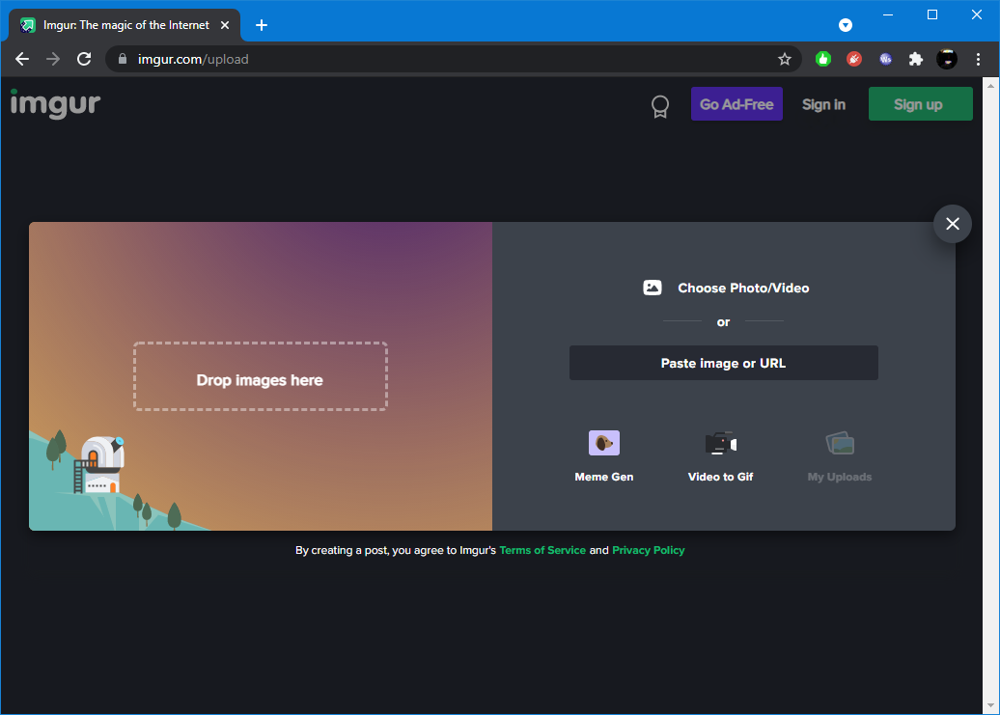
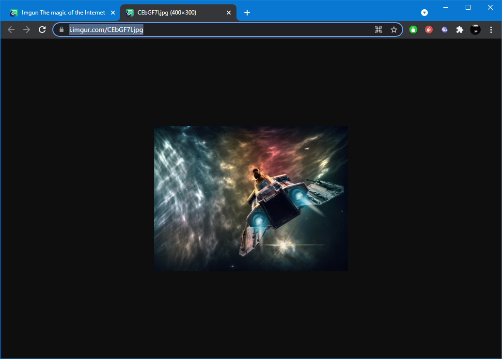

# Imgur

[Imgur](https://imgur.com/) can be used to host images (backgrounds, thumbnails, etc.) that are referenced in a WebЯcade feed. 

To host an image in [Imgur](https://imgur.com/), perform the following steps (registering with [Imgur](https://imgur.com/) is optional):

* Click the "`New Post`" button in the upper-left corner of the page (see screenshot below).

{: style="padding:5px 15px;" class="center zoomD"}

* Drag or select the image to upload (see screenshot below).

{: style="padding:5px 15px;" class="center zoomD"}

* Right-click on the newly uploaded image and select "`Open image in new tab`" from the context menu (see screenshot below).

{: style="padding:5px 15px;" class="center zoomD"}

* Select and copy the image URL from the browser's navigation bar (see screenshot below).

{: style="padding:5px 15px;" class="center zoomD"}

## Example

The following is an example of a simple webЯcade feed that contains the thumbnail image that was uploaded to [Imgur](https://imgur.com/) in the steps detailed above.

There is also a tab named, *"Shortened URLs*", wherein both the thumbnail and ROM URLs have been shortened (see [TinyURL page](./tinyurl.md#shortened-urls)). Shortening of [Imgur](https://imgur.com/) URLs is recommended as it reduces the size of the overall feed and mitigates false-positive blocking by simple URL filters.

=== "Full URLs"
    ``` json hl_lines="6"
    {
      "title": "Imgur Example Feed",
      "categories": [
        {
          "title": "Shooters",
          "thumbnail": "https://i.imgur.com/CEbGF7l.jpg",
          "items": [
            {
              "title": "Astro Force",
              "type": "sms",
              "props": {
                "rom": "https://dl.dropboxusercontent.com/s/ggc87mfds9bax9p/astroforce.sms"
              }
            }
          ]
        }
      ]
    }    
    ```
=== "Shortened URLs"    
    ``` json hl_lines="6"
    {
      "title": "Imgur Example Feed",
      "categories": [
        {
          "title": "Shooters",
          "thumbnail": "https://tinyurl.com/yft4z7m8",
          "items": [
            {
              "title": "Astro Force",
              "type": "sms",
              "props": {
                "rom": "https://tinyurl.com/cvdbtdth"
              }
            }
          ]
        }
      ]
    }    
    ```
