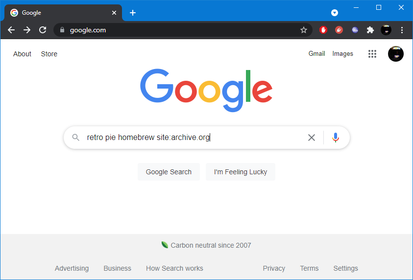

# Internet Archive

Content (ROMs, game files, artwork, etc.) stored in the [Internet Archive](https://archive.org) can be utilized by webЯcade feeds. 

The following steps detail the process of adding an NES homebrew game (ROM file) hosted in the [Internet Archive](https://archive.org) to a webЯcade feed:

* The first step is to search for content within the [Internet Archive](https://archive.org). Although, the [Internet Archive](https://archive.org) does provide its own search mechanism, Google typically provides faster and more accurate search results.<br><br>To limit the Google search to the Internet Archive, add "`site:archive.org`" after your search critera (see screenshot below).<br><br>In the example shown below, the full search text is as follows:<br>`retro pie homebrew site:archive.org`

{: style="padding:5px 15px;" class="center"}

* Click on one of the search results to navigate to the corresponding Internet Archive page (see screenshot below).

{: style="padding:5px 15px;" class="center"}

* If the Internet Archive page contains downloadable files, a content box titled, "`DOWNLOAD OPTIONS`" should appear on the right side of the page (the page may need to be scrolled to make the content box visible).<br><br>Click the "`SHOW ALL`" link in the context box to view all of the downloadable files (see screenshot below).
  
{: style="padding:5px 15px;" class="center"}

* Click on the "`View Contents`" link to the right of the ISO file to view its contents (see screenshot below).<br><br>It is *extermely important* to descend to the lowest possible level within an archive. There are a number of homebrew collections within the Internet Archive that package multiple-ROM variants in a single zip file. Using a link to the zip file (versus a specific ROM file) will result in
much larger downloads with a non-deterministic ROM file being executed.

!!! note
    The Internet Archive supports descending into various archive file formats (.iso, .zip., etc.). However,
    It is important to note that although descending into archives may be supported, there exists a 
    bug for certain formats (.7z, etc.) that results in contained content being downloaded as zero bytes (which is unusable). An easy way to validate that a file will be downloaded correctly is to open the link to the file in a new tab.
    If the downloaded content file size is greater than zero, it is being downloaded correctly. 

{: style="padding:5px 15px;" class="center"}

* Select a file within the ISO and copy its link address (See screenshot below).<br><br>In this particular case, the link being copied is for the excellent NES homebrew game, "Super Uwol!" by the Mojon Twins.<br><br>It is also worth noting that in this particular case, the Internet Archive did not provide an opportunity to descend into the .zip file (a "`View Contents`" link was not provided, which would have been preferrable).

{: style="padding:5px 15px;" class="center"}

* At this point, the copied URL which refers to the Super Uwol! ROM file can be added to a webЯcade feed (see [Example](#example) below).

## Example

The following is an example of a simple webЯcade feed that contains the archive.org URL to the NES version of Super Uwol! obtained via the steps outlined above. See the [Feed Format page](../format.md) for detailed information regarding the structure of webЯcade feeds.

There is also a tab named, *"Shortened URLs*", wherein the Super Uwol! URL has been shortened (see [TinyURL page](./tinyurl.md#shortened-urls)). Shortening of [archive.org](https://archive.org) URLs is recommended as it reduces the size of the overall feed and mitigates false-positive blocking by simple URL filters.

=== "Full URL"
    ``` json hl_lines="11"
    {
      "title": "Archive.org Example Feed",
      "categories": [
        {
          "title": "Games",
          "items": [
            {
              "title": "Super Uwol!",
              "type": "nes",
              "props": {
                "rom": "https://archive.org/download/retro-pie-homebrew-collection/RetroPie%20Homebrew%20Collection.iso/NES%2Fsuper-uwol-full.zip"
              }
            }
          ]
        }
      ]
    }    
    ```
=== "Shortened URL"    
    ``` json hl_lines="11"
    {
      "title": "Archive.org Example Feed",
      "categories": [
        {
          "title": "Games",
          "items": [
            {
              "title": "Super Uwol!",
              "type": "nes",
              "props": {
                "rom": "https://tinyurl.com/4d72vnrc"
              }
            }
          ]
        }
      ]
    }    
    ```

The example from above can be tested by adding a feed with the following URL within the webЯcade front-end:

`https://tinyurl.com/inet-archive-example`