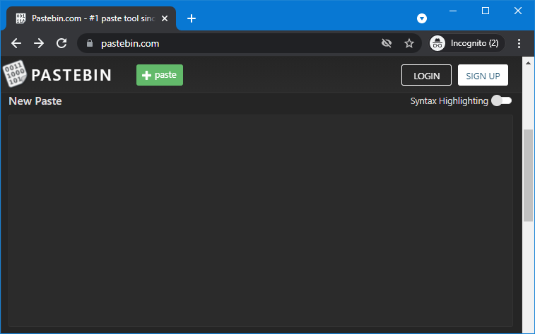
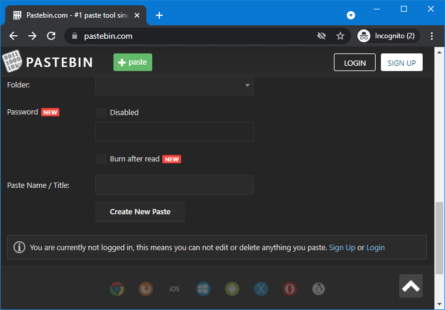
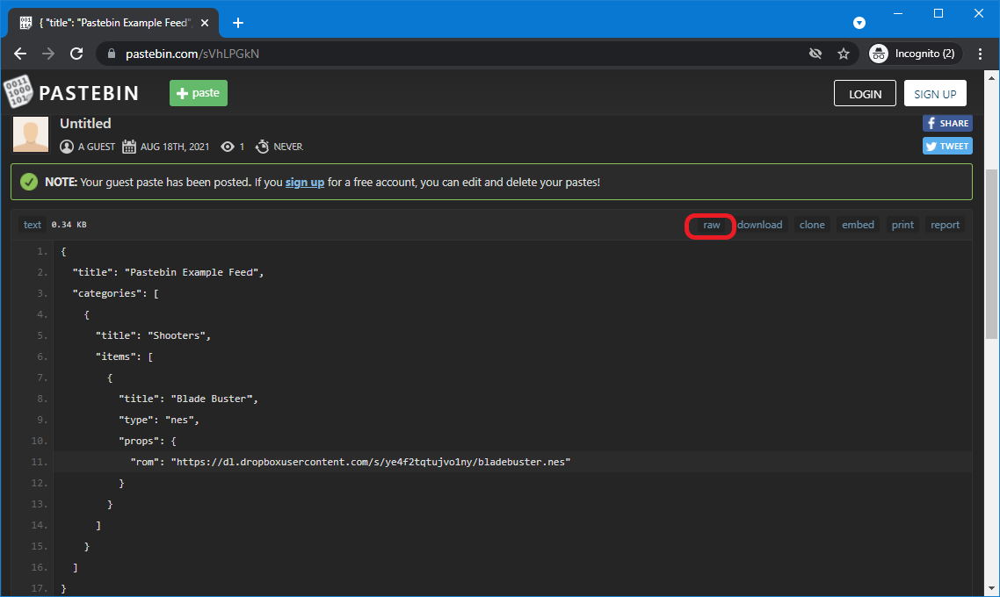

# Pastebin

[Pastebin](https://pastebin.com/) can be used to host WebЯcade feeds (see [Feed Format](../format.md)). 

!!! note
    Although creating and logging into a [Pastebin](https://pastebin.com/) account is not required, it is
    *highly recommended*. Without an account, it is not possible to make changes to existing pastes (feeds).
    This means that updating a feed would require the creation of a new paste, which would
    result in a new feed URL.

To host a feed in [Pastebin](https://pastebin.com/), perform the following steps:

* Navigate to [pastebin.com](https://pastebin.com/) and scroll (if necessary) to the text area that is titled, "`New Paste`" (see screenshot below).

{: style="padding:5px 15px;" class="center"}

* Paste the WebЯcade feed content  (see [Feed Format](../format.md)) into the "`New Paste`" text area (see screenshot below).

{: style="padding:5px 15px;" class="center"}

* Scroll down (if necessary) until the "`Create New Paste`" button is shown. Click the "`Create New Paste`" button to create the new paste containing the WebЯcade feed (see screenshot below).

{: style="padding:5px 15px;" class="center"}

* After the paste has been created, click the "`RAW`" button (red highlight in screenshot below) to view the raw content feed.

{: style="padding:5px 15px;" class="center"}

* The WebЯcade feed URL will be shown in the browser's navigation bar (see screenshot below).

{: style="padding:5px 15px;" class="center"}

The example from above can be tested by adding a feed with the following URL within the webЯcade front-end:

`https://pastebin.com/raw/sVhLPGkN`

It is highly recommended that a link shortener such as [TinyURL](https://www.tinyurl.com) be utilized to alias the Pastebin URL to a more memorable URL (see [TinyURL page](./tinyurl.md#aliased-urls)). The following TinyURL-based URL will redirect to the above Pastebin URL. 

`https://tinyurl.com/pastebin-feed`