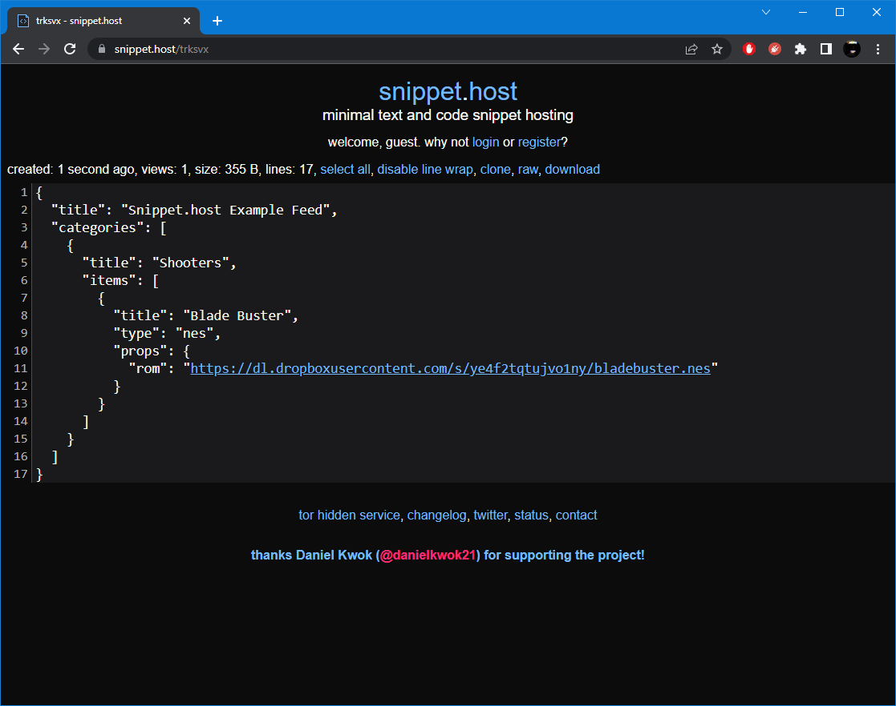
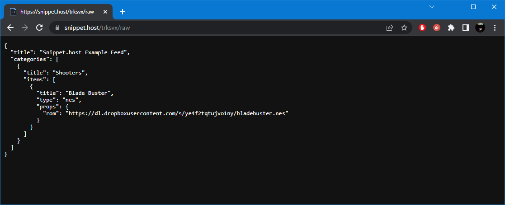

# Snippet.host

[Snippet.host](https://snippet.host/) can be used to host webЯcade feed documents (see [Feed Format](../format.md)).

In many ways, using [Snippet.host](https://snippet.host/) is superior to Pastebin. It is less restrictive in terms of document sizes and content validation procedures. Further, it does not require verification of accounts that are created.

!!! note
    Although creating and logging into a [Snippet.host](https://snippet.host/) account is not required, it is
    *highly recommended*. Without an account, it is not possible to make changes to existing snippets (feeds).
    This means that updating a feed would require the creation of a new snippet, which would
    result in a new feed URL.  
    Further, [Snippet.host](https://snippet.host/) does not require verification of accounts that are created.

To host a feed in [Snippet.host](https://snippet.host/), perform the following steps:

* Navigate to [Snippet.host](https://snippet.host/) (see screenshot below).

{: style="padding:5px 15px;" class="center zoomD"}

* Paste the webЯcade feed content  (see [Feed Format](../format.md)) into the "`snippet content`" text area (see screenshot below).

{: style="padding:5px 15px;" class="center zoomD"}

* Click the "`create snippet`" button to create the new snippet containing the webЯcade feed (see screenshot above).

{: style="padding:5px 15px;" class="center zoomD"}

* After the snippet has been created, click the "`raw`" link (located directly above the feed) to view the raw content feed (see screenshot above).

{: style="padding:5px 15px;" class="center zoomD"}

* The webЯcade feed URL will be shown in the browser's navigation bar (see screenshot above).

The example from above can be tested by adding a feed with the following URL within the [webЯcade player](../../userguide/index.md):

`https://snippet.host/trksvx/raw`

It is highly recommended that a link shortener such as [TinyURL](https://www.tinyurl.com) be utilized to alias the Snippet URL to a more memorable URL (see [TinyURL page](./tinyurl.md#aliased-urls)). The following TinyURL-based URL will redirect to the above Snippet URL.

`https://tinyurl.com/snippet-feed`