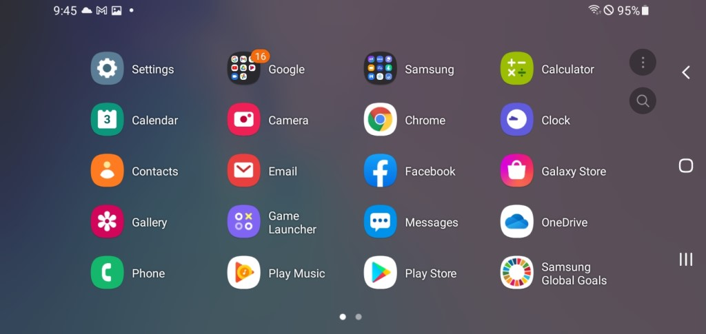
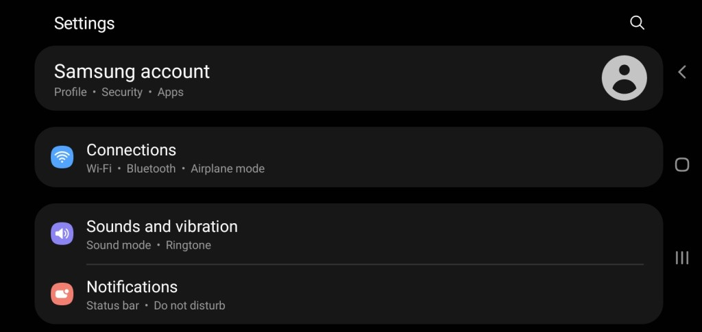
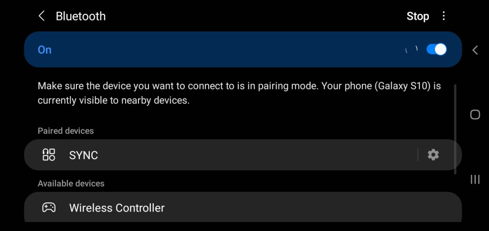
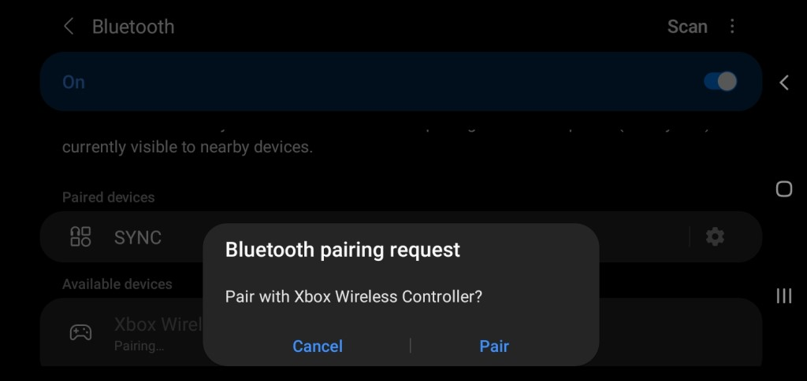

# Android Gamepads

## Overview

This page contains details regarding the various controllers that have been tested for compatibility with webЯcade on Android. The table below provides a high-level overview of each controller and whether it is compatible with Bluetooth and/or USB connections.

Clicking on the name of a *Gamepad* in the table will navigate to a section containing additional details about the particular controller, including how to pair it via Bluetooth (if applicable).

| __Gamepad__ | __Connectivity__ | Comments |
| --- | --- | --- |
| [8BitDo Lite](#8bitdo-lite) | Bluetooth and USB | |
| [8BitDo Zero 2](#8bitdo-zero-2) | Bluetooth and USB |  |
| [PlayStation DualShock 4](#playstation-dualshock-4) | Bluetooth and USB  | |
| [Xbox 360 Controller](#xbox-360-controller) | USB | |
| [Xbox Wireless Controller](#xbox-wireless-controller) | Bluetooth and USB  |  |

## Bluetooth Pairing
 
This section details how to connect a Bluetooth controller to the Android operating system. These steps are independent of any particular controller. Refer to the controller-specific sections (below) for steps that are unique to each controller. 

!!! note
    The steps and associated screenshots below are based on a Samsung Galaxy S10. While the actual steps
    and screens may differ on other Android devices, the process should be similar.

To connect a Bluetooth controller to Android, perform the following steps:

* Tap the :material-cog: `Settings` icon to open Android settings (upper left icon in screen below).

{: style="padding:5px 15px;" class="center zoomD"}

* Select the :material-wifi: `Connections` option (see screen below).

{: style="padding:5px 15px;" class="center zoomD"}

* Ensure the `Bluetooth` option is enabled (see screen below).
* Tap on the `Bluetooth` text (see screen below).

{: style="padding:5px 15px;" class="center zoomD"}

* The Android device should start searching for Bluetooth devices (see screen below).
    * If the device is not searching, tap on the `"Scan"` text in the upper right corner (Currently is shown as `"Stop"` in the screen below as a scan is already occurring).

{: style="padding:5px 15px;" class="center zoomD"}

* Refer to the controller-specific sections (below) for steps that are unique to each controller.

## Controllers

The following sections provide details regarding controllers that have been tested for compatibility with webЯcade on Android. 

### 8bitDo Lite

This section contains information related to the [8BitDo Lite Controller](https://www.8bitdo.com/lite/) by 8BitDo.

{: style="padding:15px; max-width:300px" class="center"}

#### Bluetooth Pairing

To connect the controller to Android via Bluetooth perform the following steps:

* Perform the steps described in the Android [Bluetooth Pairing](#bluetooth-pairing) section.
* To enter pairing mode on the controller:
    * Move the controller's `Mode` switch (middle top of controller) to `S` (leftmost location).
    * Press the `Home` button to turn the controller on (near bottom right of controller).
    * Press the controller's `Pair` button for 2 seconds to enter pairing mode (Small button on back edge near the `R2` button).
* The controller should appear in the `Available devices` section of the Bluetooth settings as show in the screen below. 
* The device should have a name similar to, `"Pro Controller"`.
* Click on the device name to establish a connection from the controller to the Android device.

{: style="padding:5px 15px;" class="center zoomD"}

* A prompt similar to the one shown in the following screen should appear.

{: style="padding:5px 15px;" class="center zoomD"}

* Tap the `Pair` text to complete the pairing process.

### 8bitDo Zero 2

This section contains information related to the [8BitDo Zero 2 Controller](https://www.8bitdo.com/zero2/) by 8BitDo.

{: style="padding:15px; max-width:300px" class="center"}

#### Bluetooth Pairing

To connect the controller to Android via Bluetooth perform the following steps:

* Perform the steps described in the Android [Bluetooth Pairing](#bluetooth-pairing) section.
* To enter pairing mode on the controller:
    * While pressing and holding the `B` button press and hold the `Start` button to turn on the controller.
    * Press and hold the `Select` button for 3 seconds to enter pairing mode (the LED should rapidly blink).
* The controller should appear in the `Available devices` section of the Bluetooth settings as show in the  screen below. 
* The device should have a name similar to, `"8BitDo Zero 2 gamepad"`.
* Click on the device name to establish a connection from the controller to the Android device.

{: style="padding:5px 15px;" class="center zoomD"}

* A prompt similar to the one shown in the following screen should appear.

{: style="padding:5px 15px;" class="center zoomD"}

* Tap the `Pair` text to complete the pairing process.

#### Alternate Controls

The Zero 2 does not have the necessary inputs to support the alternative control options. Therefore, the Zero 2 is limited to the following inputs for `Start`, `Select`, and `Show Pause Screen` actions. 

| __Name__ | 
__Gamepad__
 | __Comments__ |
| --- | --- | --- |
| Start                        | `Start` button | |
| Select                       | `Select` button |  | |
| Show Pause Screen        | `X` button and `Select` button | Hold down the `X` button and then press the `Select` button simultaneously. |

### PlayStation DualShock 4

This section contains information related to the [PlayStation DualShock 4 Controller](https://en.wikipedia.org/wiki/DualShock#DualShock_4) by Sony.

{: style="padding:15px; max-width:300px" class="center"}

#### Bluetooth Pairing

To connect the controller to Android via Bluetooth perform the following steps:

* Perform the steps described in the Android [Bluetooth Pairing](#bluetooth-pairing) section.
* To enter pairing mode on the controller:
    * While pressing and holding the `Share` button (upper left on controller) press and hold the `PS` button (bottom center) until the light bar on the back flashes.
* The controller should appear in the `Available devices` section of the Bluetooth settings as show in the screen below. 
* The device should have a name similar to, `"Wireless Controller"`.
* Click on the device name to establish a connection from the controller to the Android device.

{: style="padding:5px 15px;" class="center zoomD"}

* A prompt similar to the one shown in the following screen should appear.

{: style="padding:5px 15px;" class="center zoomD"}

* Tap the `Pair` text to complete the pairing process.

### Xbox 360 Controller

This section contains information related to the [Xbox 360 Controller](https://en.wikipedia.org/wiki/Xbox_360_controller) by Microsoft.

{: style="padding:15px 25px; max-width:300px" class="center"}

Simply connect the Xbox 360 controller to the Android device via the USB cable. 

### Xbox Wireless Controller

This section contains information related to the [Xbox Wireless Controller](https://en.wikipedia.org/wiki/Xbox_Wireless_Controller) by Microsoft.

{: style="padding:15x 5px; max-width:300px" class="center"}

#### Bluetooth Pairing

To connect the controller to Android via Bluetooth perform the following steps:

* Perform the steps described in the Android [Bluetooth Pairing](#bluetooth-pairing) section.
* To enter pairing mode on the controller:
    * Turn on the controller by pressing the `Xbox` button (Xbox logo near the center top of the controller).
    * Press the controller’s `Pair` button for 3 seconds and release (small button on back near the `Left Bumper` button).
* The controller should appear in the `Available devices` section of the Bluetooth settings as show in the screen below. 
* The device should have a name similar to, `"Xbox Wireless Controller"`.
* Click on the device name to establish a connection from the controller to the Android device.

{: style="padding:5px 15px;" class="center zoomD"}

* A prompt similar to the one shown in the following screen should appear.

{: style="padding:5px 15px;" class="center zoomD"}

* Tap the `Pair` text to complete the pairing process.
