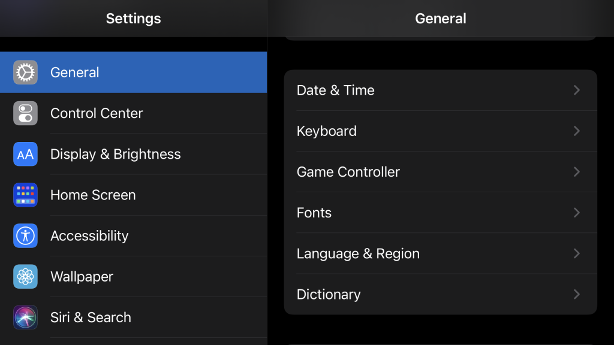
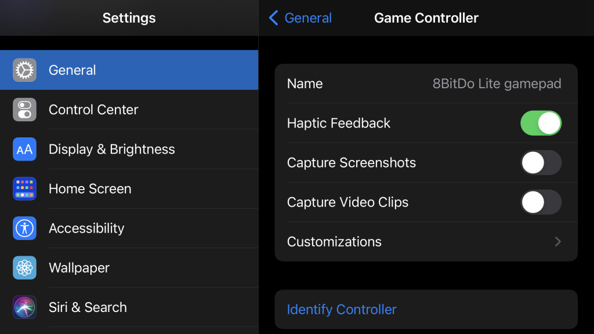
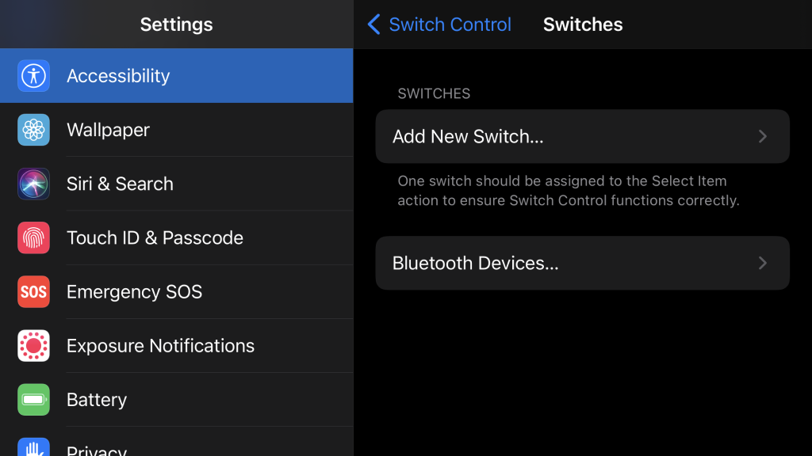
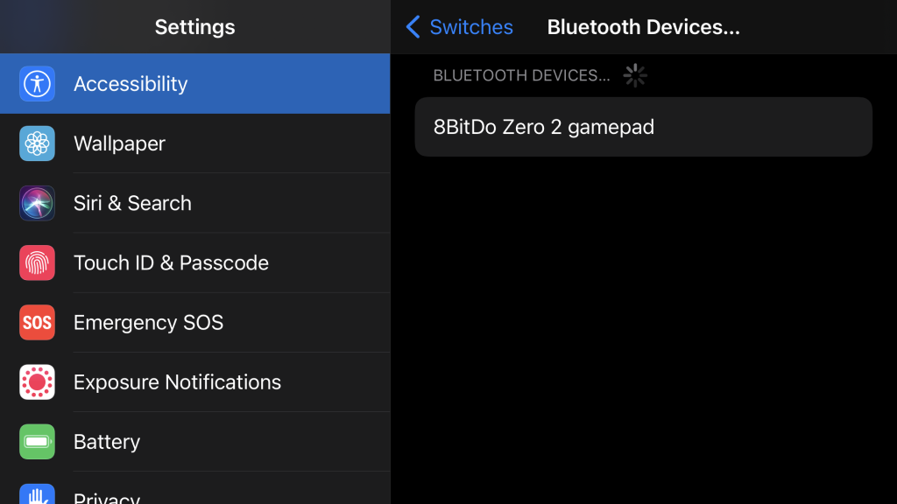
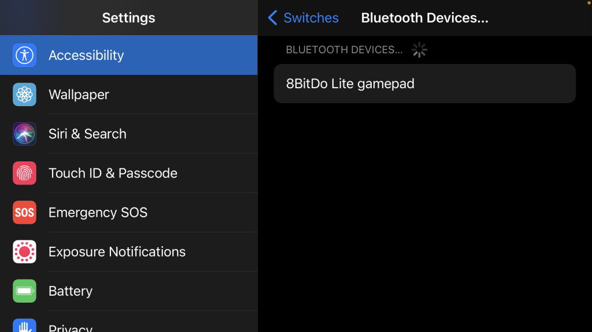
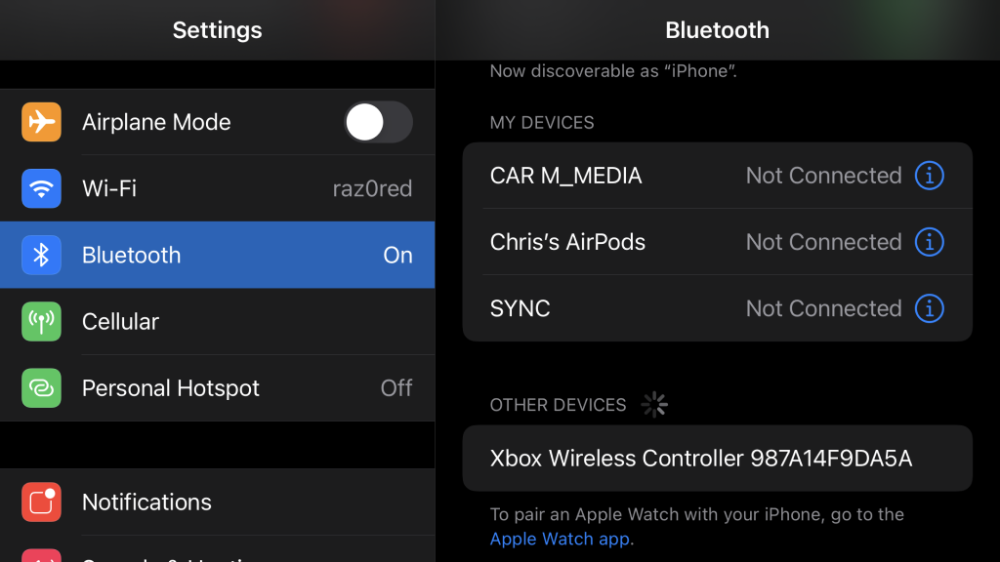

# iOS Gamepads

## Overview

This page contains details regarding the various controllers that have been tested for compatibility with webЯcade on iOS-compatible devices (iPad, iPod Touch, and iPhone). The table below provides a high-level overview of each controller including whether it is compatible with the Safari or Chrome browsers.

Clicking on the name of a *Gamepad* in the table will navigate to a section containing additional details about the particular controller, including how to pair it via Bluetooth.

| __Gamepad__ | __Connectivity__ | __Safari__  | __Chrome__ | Comments |
| --- | --- | :----: | :----: | --- |
| [8BitDo Lite](#8bitdo-lite) | Bluetooth |  :white_check_mark: | :white_check_mark:  | Pair via [Accessibility Settings](#pair-via-accessibility-settings). |
| [8BitDo Zero 2](#8bitdo-zero-2) | Bluetooth |  :white_check_mark: | :white_check_mark:  | Pair via [Accessibility Settings](#pair-via-accessibility-settings). |
| [PlayStation DualShock 4](#playstation-dualshock-4) | Bluetooth |  :white_check_mark: | :white_check_mark:  |   |
| [Xbox Wireless Controller](#xbox-wireless-controller) | Bluetooth |:white_check_mark: | :white_check_mark: |  |

## Screen Recording

The iOS operating system supports the ability to initiate screen recording by double pressing on the PlayStation DualShock 4 `"Share" button` (or equivalent button on other controllers).

When this button sequence is pressed, a dialog similar to the following will be displayed.

{: style="padding:5px 15px;" class="center"}

In addition to the annoyance of the dialog being displayed, other functions that are mapped to this button (select, etc.) are inconsistent in their behavior. 

There are two methods to avoid having this dialog appear.

* [Disable](#disable) the screen capture button sequences for the controller.  
* Use [Alternate Controls](#alternate-controls) mappings for the select button, etc.

### Disable 

To disable the screen capture button sequence for controllers, perform the following:

* Go to `Settings` > `General` > `Game Controller` on the device (as shown in the screenshot below).

{: style="padding:5px 15px;" class="center"}

* For each controller listed, disable the following options (see screenshot below):
    * `Capture Screenshots`
    * `Capture Video Clips`

{: style="padding:5px 15px;" class="center"}

It is important to note that these options must be disabled *for each* controller that is connected to the device (these are per-controller settings).

### Alternate Controls

The following alternative button sequences be used to avoid using the PlayStation DualShock 4 `"Share" button` (or equivalent button on other controllers) which causes the screen recording dialog being displayed.

| __Name__ | 
__Gamepad__
 | __Comments__ |
| --- | --- | --- |
| Start             | {: class="control"} &nbsp;and&nbsp; {: class="control"} | Hold down the __Right Trigger__ and click (press down) on the __Right Thumbstick__. |
| Select            | {: class="control"} &nbsp;and&nbsp; {: class="control"} | Hold down the __Right Trigger__ and click (press down) on the __Left Thumbstick__. |
| Show Pause Screen        | {: class="control"} &nbsp;and&nbsp; {: class="control"} | Hold down the __Left Trigger__ and click (press down) on the __Left Thumbstick__. |
| Show Pause Screen (Alternate)        | {: class="control"} &nbsp;and&nbsp; {: class="control"} | Hold down the __Left Trigger__ and click (press down) on the __Right Thumbstick__. |

## Bluetooth Pairing
 
The iOS operating system provides two distinct methods for pairing Bluetooth controllers with an iOS device. The method to use depends on the type of Bluetooth controller which can lead to some confusion. 

This section details the two methods that iOS supports for pairing Bluetooth controllers. Refer to the controller-specific sections (below) for steps that are unique to each controller, including which of these two methods should be utilized for a given controller. 

### Pair via Bluetooth Settings

The following steps detail how to pair compatible controllers via the `Bluetooth` option in `Settings` on iOS devices. 

* Go to `Settings` > `Bluetooth` on the device (as shown in the screenshot below).
* Enter pairing mode on the controller to pair (see controller-specific section for details).
* The controller should appear in the `OTHER DEVICES` list (see screenshot below).
* Tap on the controller in the list and follow on-screen instructions to complete the pairing process.

{: style="padding:5px 15px;" class="center"}

### Pair via Accessibility Settings

The following steps outline the process to add compatible controllers via the `Accessibility` option in `Settings` on iOS devices.

* Go to `Settings` > `Accessibility` on the device (as shown in the screenshot below).
* Tap the `Switch Control` option (see screenshot below).

{: style="padding:5px 15px;" class="center"}

* Tap the `Switches` option (see screenshot below).

{: style="padding:5px 15px;" class="center"}

* Tap the `Bluetooth devices...` option (see screenshot below).

{: style="padding:5px 15px;" class="center"}

* Enter pairing mode on the controller to pair (see controller-specific section for details).
* The controller should appear in the `BLUETOOTH DEVICES...` list (see screenshot below).
* Tap on the controller in the list and follow on-screen instructions to complete the pairing process.

{: style="padding:5px 15px;" class="center"}

## Controllers

The following sections provide details regarding controllers that have been tested for compatibility with webЯcade on iOS-compatible devices. 

### 8bitDo Lite

This section contains information related to the [8BitDo Lite Controller](https://www.8bitdo.com/lite/) by 8BitDo.

{: style="padding:15px; max-width:300px" class="center"}

#### Bluetooth Pairing

To connect the controller to an iOS device perform the following steps:

* Follow the basic steps outlined in the [Pair via Accessibility Settings](#pair-via-accessibility-settings) section above.
* To enter pairing mode on the controller:
    * Move the controller's `Mode` switch (middle top of controller) to `X` (rightmost location).
    * Press the `Home` button to turn the controller on (near bottom right of controller).
    * Press the controller's `Pair` button for 2 seconds to enter pairing mode (Small button on back edge near the `R2` button).
* The controller should appear in the `BLUETOOTH DEVICES...` list (see screenshot below).
* The controller should have a name similar to, `"8BitDo Lite gamepad"`.
* Tap on the controller in the list and follow on-screen instructions to complete the pairing process.

{: style="padding:5px 15px;" class="center"}

### 8bitDo Zero 2

This section contains information related to the [8BitDo Zero 2 Controller](https://www.8bitdo.com/zero2/) by 8BitDo.

{: style="padding:15px; max-width:300px" class="center"}

#### Bluetooth Pairing

To connect the controller to an iOS device perform the following steps:

* Follow the basic steps outlined in the [Pair via Accessibility Settings](#pair-via-accessibility-settings) section above.
* To enter pairing mode on the controller:
    * While pressing and holding the `A` button press and hold the `Start` button to turn on the controller.
    * Press and hold the `Select` button for 3 seconds to enter pairing mode (the LED should rapidly blink).
* The controller should appear in the `BLUETOOTH DEVICES...` list (see screenshot below).
* The controller should have a name similar to, `"8BitDo Zero 2 gamepad"`.
* Tap on the controller in the list and follow on-screen instructions to complete the pairing process.

{: style="padding:5px 15px;" class="center"}

#### Alternate Controls

The Zero 2 does not have the necessary inputs to support the alternative control options. Therefore, the Zero 2 is limited to the following inputs for `Start`, `Select`, and `Show Pause Screen` actions. 

| __Name__ | 
__Gamepad__
 | __Comments__ |
| --- | --- | --- |
| Start                        | `Start` button | |
| Select                       | `Select` button |  | |
| Show Pause Screen        | `Y` button and `Select` button | Hold down the `Y` button and then press the `Select` button simultaneously. |

### PlayStation DualShock 4

This section contains information related to the [PlayStation DualShock 4 Controller](https://en.wikipedia.org/wiki/DualShock#DualShock_4) by Sony.

{: style="padding:15px; max-width:300px" class="center"}

#### Bluetooth Pairing

To connect the controller to an iOS device perform the following steps:

* Follow the basic steps outlined in the [Pair via Bluetooth Settings](#pair-via-bluetooth-settings) section above.
* To enter pairing mode on the controller:
    * While pressing and holding the `Share` button (upper left on controller) press and hold the `PS` button (bottom center) until the light bar on the back flashes.
* The controller should appear in the `OTHER DEVICES` list (see screenshot below). 
* The device should have a name similar to, `"DUALSHOCK 4 Wireless Controller"`.
* Tap on the controller in the list and follow on-screen instructions to complete the pairing process.

{: style="padding:5px 15px;" class="center"}

### Xbox Wireless Controller

This section contains information related to the [Xbox Wireless Controller](https://en.wikipedia.org/wiki/Xbox_Wireless_Controller) by Microsoft.

{: style="padding:15x 5px; max-width:300px" class="center"}

#### Bluetooth Pairing

To connect the controller to an iOS device perform the following steps:

* Follow the basic steps outlined in the [Pair via Bluetooth Settings](#pair-via-bluetooth-settings) section above.
* To enter pairing mode on the controller:
    * Turn on the controller by pressing the `Xbox` button (Xbox logo near the center top of the controller).
    * Press the controller’s `Pair` button for 3 seconds and release (small button on back near the `Left Bumper` button).
* The controller should appear in the `OTHER DEVICES` list (see screenshot below). 
* The device should have a name similar to, `"Xbox Wireless Controller"`.
* Tap on the controller in the list and follow on-screen instructions to complete the pairing process.

{: style="padding:5px 15px;" class="center"}

