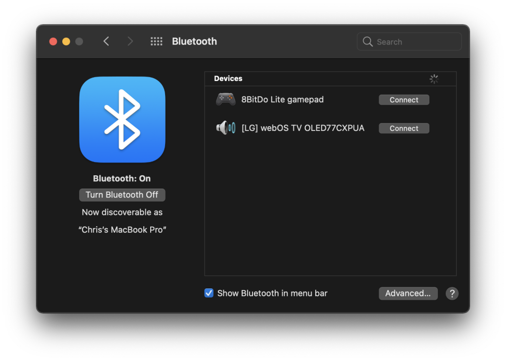
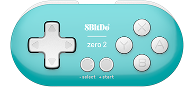
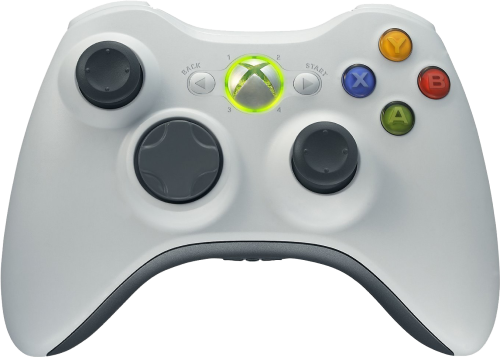

# macOS Gamepads

## Overview

This page contains details regarding the various controllers that have been tested for compatibility with webЯcade on a Mac. The table below provides a high-level overview of each controller including whether it is compatible with the Chrome or Safari browsers.

Clicking on the name of a *Gamepad* in the table will navigate to a section containing additional details about the particular controller, including how to pair it via Bluetooth (if applicable).

| __Gamepad__ | __Connectivity__ | __Chrome__ | __Safari__ | Comments |
| --- | --- | :----: | :----: | --- |
| [8BitDo Lite](#8bitdo-lite) | Bluetooth |  :white_check_mark: | :white_check_mark:  | Does not work correctly with USB. |
| [8BitDo Zero 2](#8bitdo-zero-2) | Bluetooth |  :white_check_mark: | :white_check_mark:  | Does not support alternate controls (lacks thumbsticks).  Does not work correctly with USB. |
| [PlayStation DualShock 4](#playstation-dualshock-4) | Bluetooth and USB |  :white_check_mark: | :white_check_mark:  |   |
| [Xbox 360 Controller](#xbox-360-controller) | USB |:white_check_mark: | :red_square: | Safari does not detect the controller. |
| [Xbox Wireless Controller](#xbox-wireless-controller) | Bluetooth and USB |:white_check_mark: | :red_square: | Does not work correctly in Safari. Appears as two different controllers simultaneously. |

## Screen Recording (Use alternate controls)

macOS supports the ability to initiate screen recording by double pressing on the PlayStation DualShock 4 `"Share" button` (or equivalent button on other controllers).

When this button sequence is pressed, the following dialog will be displayed.

{: style="padding:15px;"}

In addition to the annoyance of the dialog being displayed, other functions that are mapped to this button (select, etc.) are inconsistent in their behavior. Therefore, when using a Mac it is recommended that the following alternative buttons be used as they have been proven to work consistently. 

| __Name__ | 
__Gamepad__
 | __Comments__ |
| --- | --- | --- |
| Start             | {: class="control"} &nbsp;and&nbsp; {: class="control"} | Hold down the __Right Trigger__ and click (press down) on the __Right Thumbstick__. |
| Select            | {: class="control"} &nbsp;and&nbsp; {: class="control"} | Hold down the __Right Trigger__ and click (press down) on the __Left Thumbstick__. |
| Show Menu        | {: class="control"} &nbsp;and&nbsp; {: class="control"} | Hold down the __Left Trigger__ and click (press down) on the __Left Thumbstick__. |
| Show Menu (Alternate)        | {: class="control"} &nbsp;and&nbsp; {: class="control"} | Hold down the __Left Trigger__ and click (press down) on the __Right Thumbstick__. |

## Controllers

The following sections proivde details regarding controllers that have been tested for compatibility with webЯcade on a Mac. 

### 8bitDo Lite

This section contains information related to the [8BitDo Lite Controller](https://www.8bitdo.com/lite/) by 8BitDo.

{: style="padding:15px; max-width:300px" class="center"}

#### Bluetooth Pairing

To connect the controller to a macOS system via Bluetooth perform the following steps:

* On your Mac, choose the `Apple` menu :material-apple: > `System Preferences...`, then click `Bluetooth`.
* Move the controller's `Mode` switch (middle top of controller) to `X` (rightmost location).
* Press the `Home` button to turn the controller on (near bottom right of controller).
* Press the controller's `Pair` button for 2 seconds to enter pairing mode (Small button on back edge near the `R2` button).
* The controller should appear under `Devices` in the `Bluetooth` dialog as show in the image below. 
* The device should have a name similar to, `"8BitDo Lite gamepad"`.
* Press the `Connect` button to the right of the device name to establish a connection from the controller to the Mac.

### 8bitDo Zero 2

This section contains information related to the [8BitDo Zero 2 Controller](https://www.8bitdo.com/zero2/) by 8BitDo.

{: style="padding:15px; max-width:300px" class="center"}

#### Bluetooth Pairing

To connect the controller to a macOS system via Bluetooth perform the following steps:

* On your Mac, choose the `Apple` menu :material-apple: > `System Preferences...`, then click `Bluetooth`.
* While pressing and holding the `A` button press and hold the `Start` button to turn on the controller.
* Press and hold the `Select` button for 3 seconds to enter pairing mode (the LED should rapidly blink).
* The controller should appear under `Devices` in the `Bluetooth` dialog as show in the image below. 
* The device should have a name similar to, `"DUALSHOCK 4 Wireless Controller"`.
* Press the `Connect` button to the right of the device name to establish a connection from the controller to the Mac.

#### Alternate Controls

The Zero 2 does not have the necessary inputs to support the alternative controls detailed in the [Screen Recording](#screen-recording-use-alternate-controls) section above. Therefore, it is possible to combine the use of the Zero 2 with the keyboard controls listed below.

| __Name__ | __Keys__ | __Comments__ |
|--------------------------|---------------------------------------------| |
| Start | {: class="control"} | |                  
| Select | {: class="control"} | The __Right Shift Key__.|                  
| Show Menu | {: class="control"} | |                  

### PlayStation DualShock 4

This section contains information related to the [PlayStation DualShock 4 Controller](https://en.wikipedia.org/wiki/DualShock#DualShock_4) by Sony.

{: style="padding:15px; max-width:300px" class="center"}

#### Bluetooth Pairing

To connect the controller to a macOS system via Bluetooth perform the following steps:

* On your Mac, choose the `Apple` menu :material-apple: > `System Preferences...`, then click `Bluetooth`.
* While pressing and holding the `Share` button (upper left on controller) press and hold the `PS` button (bottom center) until the light bar on the back flashes.
* The controller should appear under `Devices` in the `Bluetooth` dialog as show in the image below. 
* The device should have a name similar to, `"DUALSHOCK 4 Wireless Controller"`.
* Press the `Connect` button to the right of the device name to establish a connection from the controller to the Mac.

### Xbox 360 Controller

This section contains information related to the [Xbox 360 Controller](https://en.wikipedia.org/wiki/Xbox_360_controller) by Microsoft.

{: style="padding:15px 25px; max-width:300px" class="center"}

Simply connect the Xbox 360 controller to the Mac via the USB cable. 

### Xbox Wireless Controller

This section contains information related to the [Xbox Wireless Controller](https://en.wikipedia.org/wiki/Xbox_Wireless_Controller) by Microsoft.

{: style="padding:15x 5px; max-width:300px" class="center"}

#### Bluetooth Pairing

To connect the controller to a macOS system via Bluetooth perform the following steps:

* On your Mac, choose the `Apple` menu :material-apple: > `System Preferences...`, then click `Bluetooth`.
* Turn on the controller by pressing the `Xbox` button (Xbox logo near the center top of the controller).
* Press the controller’s `Pair` button for 3 seconds and release (small button on back near the `Left Bumper` button).
* The controller should appear under `Devices` in the `Bluetooth` dialog as show in the image below. 
* The device should have a name similar to, `"Xbox Wireless Controller"`.
* Press the `Connect` button to the right of the device name to establish a connection from the controller to the Mac.

