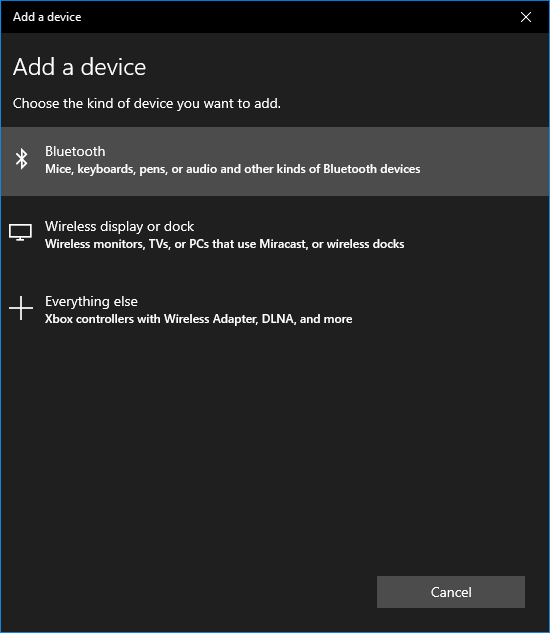
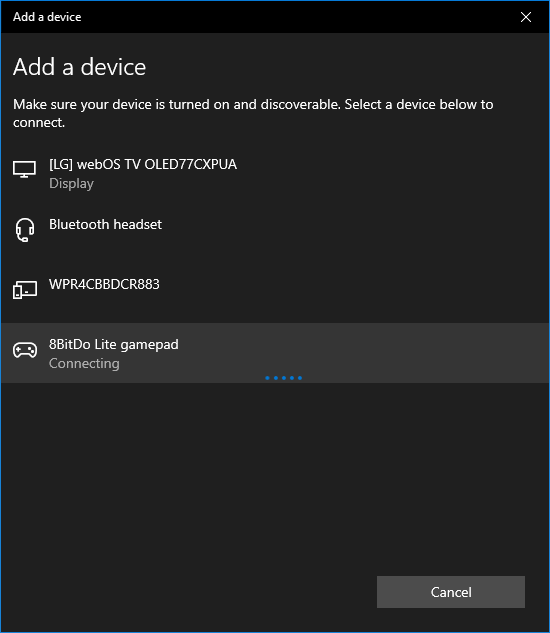
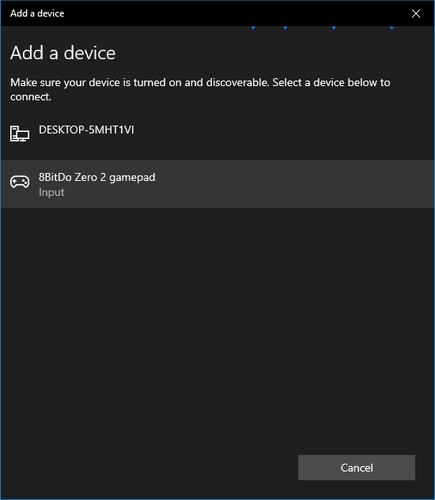
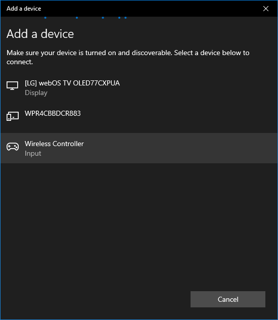
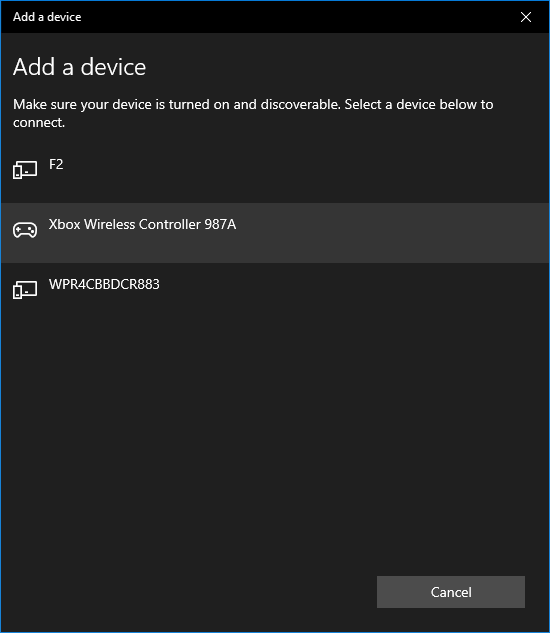

# Windows Gamepads

## Overview

This page contains details regarding the various controllers that have been tested for compatibility with webЯcade on Windows. The table below provides a high-level overview of each controller including whether it is compatible with the Chrome or Firefox browsers.

Clicking on the name of a *Gamepad* in the table will navigate to a section containing additional details about the particular controller, including how to pair it via Bluetooth (if applicable).

| __Gamepad__ | __Connectivity__ | __Chrome__ | __Firefox__ | Comments |
| --- | --- | :----: | :----: | --- |
| [8BitDo Lite](#8bitdo-lite) | Bluetooth and USB |  :white_check_mark: | :white_check_mark: | |
| [8BitDo Zero 2](#8bitdo-zero-2) | Bluetooth |  :white_check_mark: | :red_square: | Does not work correctly with USB (buttons are not mapped to "standard" mapping). |
| [PlayStation DualShock 4](#playstation-dualshock-4) | Bluetooth and USB |  :white_check_mark: | :white_check_mark:  |   |
| [Xbox 360 Controller](#xbox-360-controller) | USB |:white_check_mark: | :white_check_mark: |  |
| [Xbox Wireless Controller](#xbox-wireless-controller) | Bluetooth and USB |:white_check_mark: | :white_check_mark:  |  |

## Bluetooth Pairing
 
This section details how to connect a Bluetooth controller to the Windows operating system. These steps are independent of any particular controller. Refer to the controller-specific sections (below) for steps that are unique to each controller. 

To connect a Bluetooth controller to Windows, perform the following steps:

* On the PC, press the Start button :fontawesome-brands-windows:, then choose Settings > Devices > Bluetooth & other devices (see dialog below).

{: style="padding:5px 15px;" class="center"}

* Turn on Bluetooth (see dialog above)
* Select Add Bluetooth or other device (see dialog above)

{: style="padding:5px 15px;" class="center"}

* Select Bluetooth (see dialog above) 
* The PC will begin searching for controllers.
* Refer to the controller-specific sections (below) for steps that are unique to each controller.

## Controllers

The following sections provide details regarding controllers that have been tested for compatibility with webЯcade on Windows. 

### 8bitDo Lite

This section contains information related to the [8BitDo Lite Controller](https://www.8bitdo.com/lite/) by 8BitDo.

{: style="padding:15px; max-width:300px" class="center"}

#### Bluetooth Pairing

To connect the controller to Windows via Bluetooth perform the following steps:

* Perform the steps described in the Windows [Bluetooth Pairing](#bluetooth-pairing) section.
* To enter pairing mode on the controller:
    * Move the controller's `Mode` switch (middle top of controller) to `X` (rightmost location).
    * Press the `Home` button to turn the controller on (near bottom right of controller).
    * Press the controller's `Pair` button for 2 seconds to enter pairing mode (Small button on back edge near the `R2` button).
* The controller should appear in the `Add a device` dialog as show in the image below. 
* The device should have a name similar to, `"8BitDo Lite gamepad"`.
* Click on the device name to establish a connection from the controller to the Windows PC.

{: style="padding:5px 15px;" class="center"}

### 8bitDo Zero 2

This section contains information related to the [8BitDo Zero 2 Controller](https://www.8bitdo.com/zero2/) by 8BitDo.

{: style="padding:15px; max-width:300px" class="center"}

#### Bluetooth Pairing

To connect the controller to Window via Bluetooth perform the following steps:

* Perform the steps described in the Windows [Bluetooth Pairing](#bluetooth-pairing) section.
* To enter pairing mode on the controller:
    * While pressing and holding the `A` button press and hold the `Start` button to turn on the controller.
    * Press and hold the `Select` button for 3 seconds to enter pairing mode (the LED should rapidly blink).
    * The controller should appear in the `Add a device` dialog as show in the image below. 
* The device should have a name similar to, `"8BitDo Zero 2 gamepad"`.
* Click on the device name to establish a connection from the controller to the Windows PC.

{: style="padding:5px 15px;" class="center"}

#### Alternate Controls

The Zero 2 does not have the necessary inputs to support the alternative control options. Therefore, the Zero 2 is limited to the following inputs for `Start`, `Select`, and `Show Menu` actions. 

| __Name__ | 
__Gamepad__
 | __Comments__ |
| --- | --- | --- |
| Start                        | `Start` button | |
| Select                       | `Select` button |  | |
| Show Menu        | `Y` button and `Select` button | Hold down the `Y` button and then press the `Select` button simultaneously. |

### PlayStation DualShock 4

This section contains information related to the [PlayStation DualShock 4 Controller](https://en.wikipedia.org/wiki/DualShock#DualShock_4) by Sony.

{: style="padding:15px; max-width:300px" class="center"}

#### Bluetooth Pairing

To connect the controller to Windows via Bluetooth perform the following steps:

* Perform the steps described in the Windows [Bluetooth Pairing](#bluetooth-pairing) section.
* To enter pairing mode on the controller:
    * While pressing and holding the `Share` button (upper left on controller) press and hold the `PS` button (bottom center) until the light bar on the back flashes.
* The controller should appear in the `Add a device` dialog as show in the image below. 
* The device should have a name similar to, `"Wireless Controller"`.
* Click on the device name to establish a connection from the controller to the Windows PC.

{: style="padding:5px 15px;" class="center"}

### Xbox 360 Controller

This section contains information related to the [Xbox 360 Controller](https://en.wikipedia.org/wiki/Xbox_360_controller) by Microsoft.

{: style="padding:15px 25px; max-width:300px" class="center"}

Simply connect the Xbox 360 controller to the Windows PC via the USB cable. 

### Xbox Wireless Controller

This section contains information related to the [Xbox Wireless Controller](https://en.wikipedia.org/wiki/Xbox_Wireless_Controller) by Microsoft.

{: style="padding:15x 5px; max-width:300px" class="center"}

#### Bluetooth Pairing

To connect the controller to Windows via Bluetooth perform the following steps:

* Perform the steps described in the Windows [Bluetooth Pairing](#bluetooth-pairing) section.
* To enter pairing mode on the controller:
    * Turn on the controller by pressing the `Xbox` button (Xbox logo near the center top of the controller).
    * Press the controller’s `Pair` button for 3 seconds and release (small button on back near the `Left Bumper` button).
* The controller should appear in the `Add a device` dialog as show in the image below. 
* The device should have a name similar to, `"Xbox Wireless Controller"`.
* Click on the device name to establish a connection from the controller to the Windows PC.

{: style="padding:5px 15px;" class="center"}

