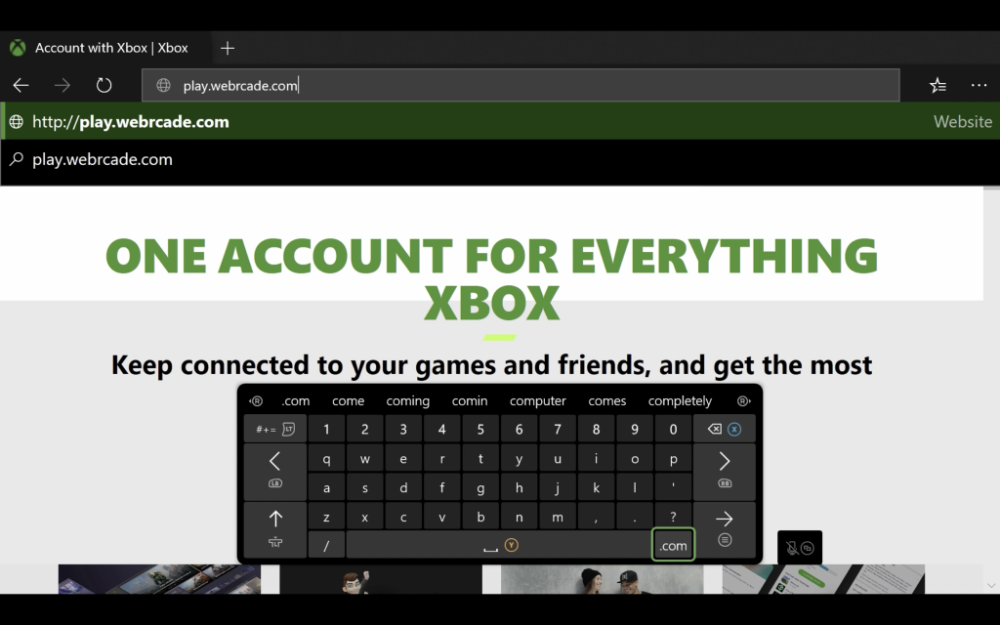
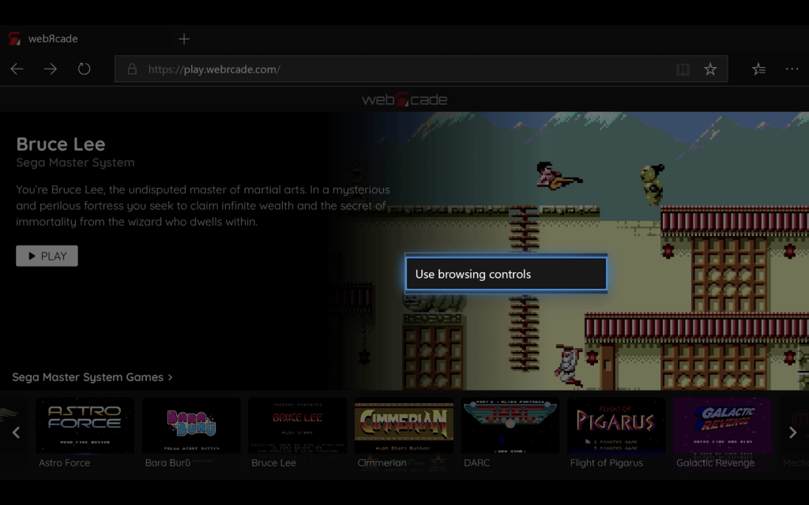
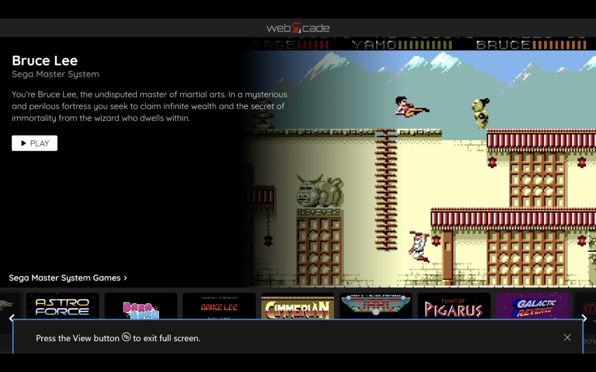

# Xbox Series X|S

## Overview

This page provides information on how to obtain the optimal experience when using webЯcade with the Xbox Series X|S game consoles. It is important to note that while webЯcade is functional on previous generations of Xbox One consoles, there will most likely be significant performance issues.

!!! note
    Support for webЯcade on Xbox Series X|S is based on the Xbox Edge browser 
    that utilizes EdgeHTML as its engine. The Xbox Edge browser will be switching to Blink as its
    browser engine (part of Chromium) in the near future (currently in preview). It is not clear 
    what the impact of the switch to Blink will be on webЯcade. It is entirely possible that
    webЯcade will not longer be compatible with the updated Xbox Edge browser.

## Browser Support

The recommended browser for use with webЯcade on the Xbox is Microsoft Edge. There are other browsers available on the Xbox, but they all appear to use the identical Edge core.

## Launching webЯcade

To launch webЯcade, perform the following steps:

* Press the :fontawesome-brands-xbox: `Xbox` button on the controller to open the guide on the left side of the screen.
* Select the `"My games and apps"` option.
* Select the `"See all"` option.
* A screen similar to the one shown below should be displayed.

{: style="padding:5px 15px;" class="center"}

* Select the `"Apps"` category on the left.
* Select the `"Microsoft Edge"` application.

{: style="padding:5px 15px;" class="center"}

* The `"Microsoft Edge"` browser should be launched and appear similar to the screen above.
* Use the left analog stick to navigate to the address bar (see screen above).
* Once the address is highlighted, press the `A` button.

{: style="padding:5px 15px;" class="center"}

* At this point the text entry screen should be displayed (see screen above).
* Enter the following address: `"play.webrcade.com"`

{: style="padding:5px 15px;" class="center"}

* At this point, the webЯcade front-end should be displayed (see screen above).
* The `"Game controls"` input mode should be selected by default, allowing for navigating the front-end via the controller. If this is not the case, refer to the ["Game and Browsing Controls"](#game-and-browsing-controls) section below.

## Alternate controls

The Microsoft Edge application reserves the use of the :material-microsoft-xbox-controller-menu: `Menu` and  :material-microsoft-xbox-controller-view: `View` buttons for the `context menu` and `full screen mode` operations respectively. Therefore, the following alternative inputs must be used to trigger the `Start`, `Select`, and `Show Menu` actions.

| __Name__ | 
__Gamepad__
 | __Comments__ |
| --- | --- | --- |
| Start            | {: class="control"} &nbsp;and&nbsp; {: class="control"} | Hold down the __Right Trigger__ and click (press down) on the __Right Thumbstick__. |
| Select           | {: class="control"} &nbsp;and&nbsp; {: class="control"} | Hold down the __Right Trigger__ and click (press down) on the __Left Thumbstick__. |
| Show Menu         | {: class="control"} &nbsp;and&nbsp; {: class="control"} | Hold down the __Left Trigger__ and click (press down) on the __Left Thumbstick__. |
| Show Menu (Alternate)        | {: class="control"} &nbsp;and&nbsp; {: class="control"} | Hold down the __Left Trigger__ and click (press down) on the __Right Thumbstick__. |

## Game and Browsing Controls

Pressing the :material-microsoft-xbox-controller-menu: `Menu` button on the controller will display a context menu. This menu can be used to switch between `Game` and `Browsing` control modes. `Game` mode is used when navigating the webЯcade front-end or playing games. The `Browsing` mode can be used to access the navigation bar at the top (address, settings, etc.).

If the :material-microsoft-xbox-controller-menu: `Menu` button is pressed when in `Game` mode, a context menu similar to the one shown in the screen below will be displayed. Selecting the `"Use browsing controls"` option will switch to `Browsing` mode.

{: style="padding:5px 15px;" class="center"}

If the :material-microsoft-xbox-controller-menu: `Menu` button is pressed when in `Browsing` mode, a context menu similar to the one shown in the screen below will be displayed. Selecting the `"Use game controls"` option will switch to `Game` mode.

{: style="padding:5px 15px;" class="center"}

## Full Screen Mode

The :material-microsoft-xbox-controller-view: `View` button can be used to toggle between "Full Screen" and "Standard" (with top navigation bar) display modes.

The screen below is an example of the Microsoft Edge application in full-screen mode.

{: style="padding:5px 15px;" class="center"}

Pressing the :material-microsoft-xbox-controller-view: `View` button when in full-screen mode returns to standard mode.

## Troubleshooting

Unfortunatley, there may be times when webЯcade may cease to work correctly within the Microsoft Edge application. The following sections describe various mechanisms that can be used in an attempt to address such issues.

### Display Guide

Sometimes simply opening and closing the Guide menu (press the :fontawesome-brands-xbox: `Xbox` button on the controller) can resolve issues. This typically resolves issues such as the :material-microsoft-xbox-controller-view: `View` and :material-microsoft-xbox-controller-menu: `Menu` buttons not responding when being pressed.

{: style="padding:5px 15px;" class="center"}

### Refresh Page

Another option is to refresh the webЯcade page. To refresh the page, perform the following steps:

* Switch to `Browsing` mode (See ["Game and Browsing Controls"](#game-and-browsing-controls) section).
* Use the left analog stick to move the cursor over the :material-refresh:  `Refresh` icon in the navigation bar.
* Press the `A` button to perform the refrsh.
* After the page has loaded, press `down` on the `D-pad`. This should automatically switch to `Game` mode and allow for navigation of the webЯcade front-end via the controller. 

### Close and Relaunch Edge

Another option is to close the Microsoft Edge application and relaunch it. To relaunch the application, perform the following steps:

* Press the  :fontawesome-brands-xbox:  `Xbox` button on the controller to open the guide on the left side of the screen.
* Navigate and highlight the `Microsoft Edge` application.
* Press the :material-microsoft-xbox-controller-menu: `Menu` button to display the context menu.
* Select the `Quit` option.
* Select the `Microsoft Edge` application and press the `A` button to launch it.

